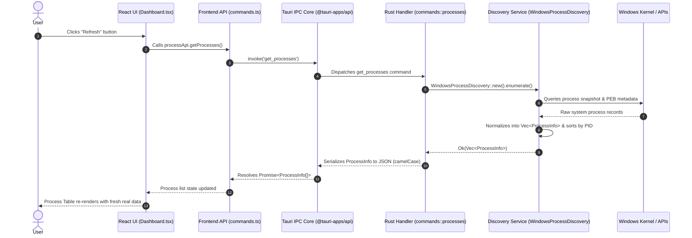
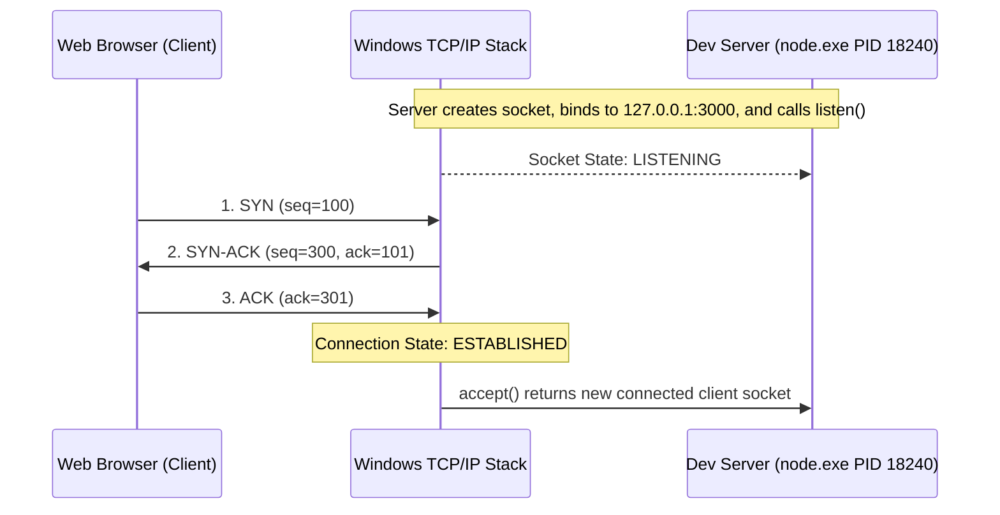

# DevHub Engineering Learning Guide

```
Project:           DevHub — Local Development Control Center
Current Milestone: Milestone 2 (Windows Port Discovery)
Document Purpose:  Comprehensive Engineering Learning and Code-Reading Guide for CS Students & HLD/LLD Interview Preparation
Document Version:  2.0.0
```

---

## Table of Contents
1. [How to Read This Project](#1-how-to-read-this-project)
2. [Computer Science Fundamentals](#2-computer-science-fundamentals)
   - [2.1 Operating System Processes](#21-operating-system-processes)
   - [2.2 Threads vs. Processes](#22-threads-vs-processes)
   - [2.3 OS Process Model and Lifecycle](#23-os-process-model-and-lifecycle)
   - [2.4 File Systems, Paths, and Working Directories](#24-file-systems-paths-and-working-directories)
3. [Windows Systems Programming Concepts](#3-windows-systems-programming-concepts)
   - [3.1 Windows Process Enumeration Mechanisms](#31-windows-process-enumeration-mechanisms)
   - [3.2 Windows Process Handles and Security Descriptors](#32-windows-process-handles-and-security-descriptors)
   - [3.3 Process Environment Block (PEB) and Command Line Extraction](#33-process-environment-block-peb-and-command-line-extraction)
   - [3.4 Why Native APIs Are Superior to Shell Parsing](#34-why-native-apis-are-superior-to-shell-parsing)
4. [Desktop Application Architecture](#4-desktop-application-architecture)
   - [4.1 Tauri 2 Architecture vs. Electron vs. Native](#41-tauri-2-architecture-vs-electron-vs-native)
   - [4.2 Security Boundaries: Core Process vs. WebView Process](#42-security-boundaries-core-process-vs-webview-process)
5. [Inter-Process Communication (IPC)](#5-inter-process-communication-ipc)
   - [5.1 IPC Theory & Desktop Message Passing](#51-ipc-theory--desktop-message-passing)
   - [5.2 Tauri Command Invocation Flow](#52-tauri-command-invocation-flow)
6. [Serialization & Data Marshalling](#6-serialization--data-marshalling)
   - [6.1 The Need for Serialization](#61-the-need-for-serialization)
   - [6.2 Serde Mechanics: `snake_case` to `camelCase` Mapping](#62-serde-mechanics-snake_case-to-camelcase-mapping)
7. [Type Systems & Cross-Language Contracts](#7-type-systems--cross-language-contracts)
   - [7.1 Rust Static Typing vs. TypeScript Static Typing](#71-rust-static-typing-vs-typescript-static-typing)
   - [7.2 Contract Synchronization & Type Mismatches](#72-contract-synchronization--type-mismatches)
8. [Software Architecture & Design Principles](#8-software-architecture--design-principles)
   - [8.1 Layered Architecture Pattern](#81-layered-architecture-pattern)
   - [8.2 SOLID Principles Applied in DevHub](#82-solid-principles-applied-in-devhub)
9. [High-Level Design (HLD)](#9-high-level-design-hld)
   - [9.1 System Boundaries & Component Topology](#91-system-boundaries--component-topology)
   - [9.2 Architectural Strategy for Future Milestones (WSL & Profiles)](#92-architectural-strategy-for-future-milestones-wsl--profiles)
10. [Low-Level Design (LLD)](#10-low-level-design-lld)
    - [10.1 Domain Models](#101-domain-models)
    - [10.2 Service Pattern and Trait Abstractions](#102-service-pattern-and-trait-abstractions)
    - [10.3 Thin Tauri Command Handlers](#103-thin-tauri-command-handlers)
11. [Error Handling & Resilience](#11-error-handling--resilience)
    - [11.1 Expected vs. Unexpected Errors](#111-expected-vs-unexpected-errors)
    - [11.2 Graceful Degradation for Protected System Processes](#112-graceful-degradation-for-protected-system-processes)
12. [Concurrency & Asynchronous Execution](#12-concurrency--asynchronous-execution)
    - [12.1 Non-Blocking UI Rules for Desktop Apps](#121-non-blocking-ui-rules-for-desktop-apps)
    - [12.2 Sync vs. Async Command Scalability](#122-sync-vs-async-command-scalability)
13. [Frontend Architecture & UI State Management](#13-frontend-architecture--ui-state-management)
    - [13.1 React 19 State, Derived State, and Memoization](#131-react-19-state-derived-state-and-memoization)
    - [13.2 State Machine: Loading, Error, Empty, and Success States](#132-state-machine-loading-error-empty-and-success-states)
14. [Database & Persistence Architecture Preview (Milestone 4+)](#14-database--persistence-architecture-preview-milestone-4)
    - [14.1 Ephemeral vs. Persistent State](#141-ephemeral-vs-persistent-state)
    - [14.2 SQLite Integration Preview](#142-sqlite-integration-preview)
15. [Testing Strategy & Quality Assurance](#15-testing-strategy--quality-assurance)
    - [15.1 Testing Pyramid for Desktop Systems](#151-testing-pyramid-for-desktop-systems)
    - [15.2 Unit, Integration, and Contract Testing](#152-unit-integration-and-contract-testing)
16. [Practical Debugging Methodology](#16-practical-debugging-methodology)
17. [Comprehensive Code-Reading Guide](#17-comprehensive-code-reading-guide)
18. [End-to-End Code Traces](#18-end-to-end-code-traces)
19. [How DevHub Maps to HLD/LLD Interview Concepts](#19-how-devhub-maps-to-hldlld-interview-concepts)
20. [Engineering Glossary](#20-engineering-glossary)
21. [Milestone 2: Networking Fundamentals & Architecture](#21-milestone-2-networking-fundamentals--architecture)
    - [21.1 IP Addresses, IPv4, IPv6, and Loopback vs. Wildcard](#211-ip-addresses-ipv4-ipv6-and-loopback-vs-wildcard)
    - [21.2 Ports, Sockets, and Endpoints](#212-ports-sockets-and-endpoints)
    - [21.3 TCP Protocol, Three-Way Handshake, and Connection States](#213-tcp-protocol-three-way-handshake-and-connection-states)
    - [21.4 Socket Lifecycle: Creation, Binding, Listening, and Connection Acceptance](#214-socket-lifecycle-creation-binding-listening-and-connection-acceptance)
    - [21.5 Why DevHub Focuses on `LISTENING` Sockets](#215-why-devhub-focuses-on-listening-sockets)
22. [Milestone 2: Windows Networking Subsystem & IP Helper API](#22-milestone-2-windows-networking-subsystem--ip-helper-api)
    - [22.1 Win32 IP Helper API (`iphlpapi.dll`) & `GetExtendedTcpTable`](#221-win32-ip-helper-api-iphlpapidll--getextendedtcptable)
    - [22.2 Byte Ordering: Network Byte Order (Big-Endian) vs. Host Byte Order (Little-Endian)](#222-byte-ordering-network-byte-order-big-endian-vs-host-byte-order-little-endian)
    - [22.3 Dynamic Buffer Allocation & Reentrancy Safety](#223-dynamic-buffer-allocation--reentrancy-safety)
    - [22.4 Native API Performance vs. `netstat` Shell Parsing](#224-native-api-performance-vs-netstat-shell-parsing)
23. [Milestone 2: Data Modeling, Algorithmic Thinking & Port → PID Join](#23-milestone-2-data-modeling-algorithmic-thinking--port--pid-join)
    - [23.1 The Port → PID Mapping Problem](#231-the-port--pid-mapping-problem)
    - [23.2 One-to-Many and Many-to-One Relationships](#232-one-to-many-and-many-to-one-relationships)
    - [23.3 $O(P + S)$ Map Join vs. $O(P \times S)$ Nested Scan](#233-op--s-map-join-vs-op--s-nested-scan)
    - [23.4 Operating System Snapshots, Race Conditions, and PID Reuse](#234-operating-system-snapshots-race-conditions-and-pid-reuse)
    - [23.5 Handling Missing Processes and Disappeared Endpoints](#235-handling-missing-processes-and-disappeared-endpoints)
24. [Milestone 2: Rust Data Structures & Type System](#24-milestone-2-rust-data-structures--type-system)
    - [24.1 Choice of Data Structures: `Vec`, `HashMap`, `Option`, `Result`](#241-choice-of-data-structures-vec-hashmap-option-result)
    - [24.2 `PortInfo` Domain Model and Cross-Language Contract](#242-portinfo-domain-model-and-cross-language-contract)
25. [Milestone 2: Updated High-Level & Low-Level Design](#25-milestone-2-updated-high-level--low-level-design)
    - [25.1 Updated HLD Architecture Diagram](#251-updated-hld-architecture-diagram)
    - [25.2 Why `ProcessDiscovery` and `PortDiscovery` Are Separated](#252-why-processdiscovery-and-portdiscovery-are-separated)
    - [25.3 Low-Level Service Contracts and Thin Command Controllers](#253-low-level-service-contracts-and-thin-command-controllers)
26. [Milestone 2: End-to-End Port Discovery Code Trace](#26-milestone-2-end-to-end-port-discovery-code-trace)
27. [Milestone 2: Deep HLD/LLD Interview Questions & Answers](#27-milestone-2-deep-hldlld-interview-questions--answers)

---

## 1. How to Read This Project

To understand DevHub, you must look at it as a multi-tier systems application partitioned across a security and process boundary:

```mermaid
graph TD
    subgraph Presentation Layer (Chromium/WebView2)
        UI[React 19 Components] --> Hooks[React Custom Hooks & State]
        Hooks --> API[Typed Frontend API Layer: commands.ts]
    end

    subgraph IPC Boundary
        API -->|JSON-RPC / WebKit IPC| TauriCore[Tauri 2 IPC Dispatcher]
    end

    subgraph Native Application Layer (Rust)
        TauriCore --> CommandHandlers[Tauri Commands: commands/processes.rs & commands/ports.rs]
        CommandHandlers --> ServiceLayer[Service Layer: discovery/process.rs & discovery/port.rs]
        ServiceLayer --> DomainModels[Domain Models: models/process.rs & models/port.rs]
    end

    subgraph OS Integration Layer
        ServiceLayer --> WindowsAPIs[Windows Native APIs / sysinfo / iphlpapi.dll]
        WindowsAPIs --> OSKernel[Windows Kernel, Process Subsystem & TCP/IP Stack]
    end
```

### Why This Separation Exists
1. **Security Isolation**: Web renderers (React running in a WebView) are inherently untrusted compared to kernel-level code. Giving JavaScript direct raw memory access or arbitrary OS process execution would be a critical security flaw.
2. **Platform Abstraction**: The React UI doesn't know (and shouldn't know) whether process discovery was performed via Windows `Toolhelp32Snapshot`, Linux `/proc`, or WSL `wsl.exe`. The Rust layer normalizes disparate OS representations into a single domain model.
3. **Maintainability & Testability**: Business logic and system inspection reside in pure Rust modules with traits (`ProcessDiscovery`, `PortDiscovery`), allowing unit testing without running a WebView or mocking browser environments.

---

## 2. Computer Science Fundamentals

### 2.1 Operating System Processes
An **executable** (`.exe` on Windows, ELF on Linux) is a compiled file on disk containing machine instructions, data sections, and headers (PE/COFF format on Windows).

A **process** is an active, executing instance of that program loaded into memory by the OS kernel.

```
+-------------------------------------------------------------+
|                      Process Address Space                  |
|  +-------------------------------------------------------+  |
|  | Code / Text Segment (Read-Only Machine Instructions)   |  |
|  +-------------------------------------------------------+  |
|  | Data / BSS Segment (Initialized & Uninitialized Globals) |
|  +-------------------------------------------------------+  |
|  | Heap (Dynamically Allocated Memory: malloc / Box / Arc)|  |
|  |                      v  (Grows Downward)              |  |
|  |                      ^  (Grows Upward)                |  |
|  | Stack (Call Frames, Local Variables, Return Addresses) |  |
|  +-------------------------------------------------------+  |
+-------------------------------------------------------------+
```

Key Attributes of a Process:
- **PID (Process Identifier)**: A unique integer assigned by the OS kernel when the process is created. PIDs are transient; once a process exits, its PID is reclaimed and may be reused for a completely new process.
- **PPID (Parent Process Identifier)**: The PID of the process that spawned this process. In Windows, this establishes a hierarchical process tree (e.g. `explorer.exe` &rarr; `wt.exe` (Windows Terminal) &rarr; `pwsh.exe` &rarr; `node.exe`).
- **Virtual Address Space**: Each user-mode process receives an isolated, private virtual address space (typically 128 TB on 64-bit Windows). Process A cannot read or write to Process B's memory without explicit OS debugging privileges (`VirtualAllocEx`, `ReadProcessMemory`).

### 2.2 Threads vs. Processes
- **Process**: The unit of **resource allocation** (owns address space, file handles, security token, network sockets).
- **Thread**: The unit of **execution scheduling** (owns an instruction pointer, registers, stack, and scheduling priority).
- A process contains one or more threads running concurrently in the same address space.

```
Process (Address Space, Sockets, Environment, CWD)
   ├── Thread 1 (UI Thread / Event Loop)
   ├── Thread 2 (Background Discovery Worker)
   └── Thread 3 (I/O Listener)
```

**Why DevHub Focuses on Processes Rather Than Threads:**
Development servers (`node.exe`, `python.exe`, `uvicorn`, `vite`) are managed as distinct processes. Port binding, terminal control, and lifecycle termination (`SIGTERM` / `TerminateProcess`) operate on the process boundary. Thread inspection will only be introduced if fine-grained worker pooling analysis becomes necessary.

### 2.3 OS Process Model and Lifecycle
On Windows:
1. **Creation**: A parent calls `CreateProcessW()`. The kernel allocates an `EPROCESS` executive block, creates the initial thread with an `ETHREAD` block, maps the executable into virtual memory, sets up the Process Environment Block (PEB), and returns a handle.
2. **Execution**: The OS scheduler allocates CPU quantum slices to threads within the process.
3. **Termination**: When the last thread exits or `TerminateProcess()` is called, the process enters the terminated state. Kernel structures remain until all open handles to the process are closed.

### 2.4 File Systems, Paths, and Working Directories
- **Executable Path (`exe`)**: The absolute location on disk where the binary resides (e.g., `C:\Program Files\nodejs\node.exe`).
- **Current Working Directory (`cwd`)**: A per-process context property pointing to the directory from which relative file paths are resolved.
- **Command Line (`cmdLine`)**: The exact string arguments passed to the process at launch (e.g., `node "D:\projects\my-app\node_modules\vite\bin\vite.js" --port 3000`).

**Why `cwd` Is Critical for DevHub:**
If five developers run `node.exe`, all five have the exact same executable path. Only the `cwd` and `commandLine` reveal which project repository (e.g. `D:\company\frontend-dashboard`) owns the server!

---

## 3. Windows Systems Programming Concepts

### 3.1 Windows Process Enumeration Mechanisms
On Windows, there are three primary ways to inspect processes:

| Mechanism | Description | Pros | Cons |
| :--- | :--- | :--- | :--- |
| **`CreateToolhelp32Snapshot`** | Standard Win32 snapshot API (`PROCESSENTRY32W`) | Fast, built-in, captures PID, PPID, name | Does not give command-line or CWD directly |
| **`EnumProcesses` (PSAPI)** | Array of all active PIDs (`psapi.dll`) | Simple | Requires secondary `OpenProcess` calls for all details |
| **Native Kernel Query / PEB (`NtQueryInformationProcess`)** | Queries internal process structures | Captures full command line, CWD, environment | Requires handle with query rights; internal structures subject to change |

DevHub leverages the **`sysinfo`** Rust crate, which combines `CreateToolhelp32Snapshot`, `QueryFullProcessImageNameW`, and internal `NtQueryInformationProcess` queries with complete memory safety, proper handle cleanup, and 32/64-bit architecture compatibility.

### 3.2 Windows Process Handles and Security Descriptors
To query a process, Windows requires opening a **Process Handle** via `OpenProcess()` with specific access flags:
- `PROCESS_QUERY_INFORMATION` (0x0400) — Full access to query exit code, priority, token, and PEB.
- `PROCESS_QUERY_LIMITED_INFORMATION` (0x1000) — Allows querying basic metadata (executable path, PID) even across security boundaries.

If a process is running as `SYSTEM` (PID 4, `csrss.exe`, `lsass.exe`) or under an elevated administrator account, standard user applications receive an `ERROR_ACCESS_DENIED` (Win32 Error 5) when requesting `PROCESS_QUERY_INFORMATION`.

### 3.3 Process Environment Block (PEB) and Command Line Extraction
The command line and working directory are stored inside the target process's **RTL_USER_PROCESS_PARAMETERS** structure, referenced by its **PEB** (Process Environment Block). Reading this requires:
1. `NtQueryInformationProcess` to obtain `PBI.PebBaseAddress`.
2. `ReadProcessMemory` across process boundaries to read `RtlUserProcessParameters`.
3. Extracting the `UNICODE_STRING` for `CommandLine` and `CurrentDirectory`.

If access is denied, `sysinfo` safely yields `None` rather than crashing.

### 3.4 Why Native APIs Are Superior to Shell Parsing
*Fragile Approach:*
```powershell
Get-CimInstance Win32_Process | Select-Object ProcessId, Name, CommandLine
```
Why calling PowerShell from code is poor architecture:
1. **Massive Overhead**: Spawning `powershell.exe` consumes 50–100MB of RAM and takes 300–800ms per call.
2. **Brittle String Parsing**: Output formatting changes across PowerShell 5.1 (Windows PowerShell), PowerShell 7 (Core), culture/locale formatting, and truncation settings.
3. **Native Rust Performance**: Calling native Win32 APIs via Rust completes process discovery for 300+ processes in **under 15 milliseconds** with zero process-spawn overhead.

---

## 4. Desktop Application Architecture

### 4.1 Tauri 2 Architecture vs. Electron vs. Native

```
+-------------------------------------------------------------------------+
|                              TAURI 2                                    |
|  Frontend: Web standard (React/HTML/JS) rendered in OS WebView2         |
|  Backend: Native compiled binary in Rust                                |
|  IPC: Zero-copy/Fast WebKit IPC layer with strict capability isolation  |
|  Memory: ~40-60 MB | Binary size: ~5-10 MB                              |
+-------------------------------------------------------------------------+
|                              ELECTRON                                   |
|  Frontend: Chromium Browser bundled inside executable                   |
|  Backend: Node.js runtime bundled inside executable                     |
|  Memory: ~150-300 MB | Binary size: ~120-200 MB                         |
+-------------------------------------------------------------------------+
```

DevHub uses **Tauri 2** because it pairs the rapid UI development of React with the bare-metal performance, memory safety, and native systems APIs of Rust, without the multi-hundred-megabyte overhead of bundling a dedicated browser and Node runtime.

### 4.2 Security Boundaries: Core Process vs. WebView Process
Tauri separates the application into two distinct processes:
1. **WebView Process (Frontend)**: Runs the React UI inside the OS WebView2 engine (Edge/Chromium on Windows). It has no direct access to the filesystem, network sockets, or OS kernel.
2. **Core Process (Rust Host)**: The native executable. It listens for verified IPC messages from the WebView, executes system commands, and responds with typed data.

---

## 5. Inter-Process Communication (IPC)

### 5.1 IPC Theory & Desktop Message Passing
IPC is the mechanism by which distinct processes exchange data. In Tauri, IPC between the WebView and Rust utilizes native platform messaging:
- On Windows: `window.chrome.webview.postMessage`
- Messages are serialized as JSON-RPC payloads containing command name, request ID, and arguments.

### 5.2 Tauri Command Invocation Flow



---

## 6. Serialization & Data Marshalling

### 6.1 The Need for Serialization
Rust stores data in native struct layout (binary memory alignment according to `repr(Rust)` or `repr(C)`). JavaScript operates on dynamic V8/JavaScriptCore heap objects. 

To bridge them across the IPC boundary, data must be **marshalled** (serialized into structured JSON text/binary) and **unmarshalled** (deserialized into JavaScript objects).

### 6.2 Serde Mechanics: `snake_case` to `camelCase` Mapping
In Rust, the idiomatic naming convention is `snake_case`. In JavaScript/TypeScript, it is `camelCase`.

DevHub solves this seamlessly using Serde container attributes in `src-tauri/src/models/process.rs` and `src-tauri/src/models/port.rs`:

```rust
#[derive(Debug, Clone, Serialize, Deserialize, PartialEq, Eq)]
#[serde(rename_all = "camelCase")]
pub struct ProcessInfo {
    pub pid: u32,
    pub parent_pid: Option<u32>,        // Serializes as "parentPid"
    pub name: String,                    // Serializes as "name"
    pub executable_path: Option<String>, // Serializes as "executablePath"
    pub command_line: Option<String>,    // Serializes as "commandLine"
    pub working_directory: Option<String>, // Serializes as "workingDirectory"
    pub status: ProcessStatus,           // Serializes as "status" ("running" / "accessrestricted")
}
```

---

## 7. Type Systems & Cross-Language Contracts

### 7.1 Rust Static Typing vs. TypeScript Static Typing
Both Rust and TypeScript enforce strong static typing, but at different phases:
- **Rust**: Static types are enforced at **compile time** with zero runtime overhead, verifying memory safety and preventing null pointer exceptions.
- **TypeScript**: Static types are checked at **transpile time** (`tsc`), outputting vanilla JavaScript for runtime execution.

### 7.2 Contract Synchronization & Type Mismatches
If a Rust field is named `parent_pid` and serialized without `rename_all = "camelCase"`, but TypeScript expects `parentPid`, TypeScript will receive `undefined` at runtime with no compile warning.

DevHub enforces cross-language contract consistency:
1. Rust unit tests (`test_process_info_serialization_camel_case`, `test_port_info_serialization_camel_case`) verify the exact JSON key outputs.
2. The TypeScript interface strictly matches the serialized contract:
```typescript
export interface ProcessInfo {
  pid: number;
  parentPid?: number | null;
  name: string;
  executablePath?: string | null;
  commandLine?: string | null;
  workingDirectory?: string | null;
  status: ProcessStatus;
}
```

---

## 8. Software Architecture & Design Principles

### 8.1 Layered Architecture Pattern
DevHub strictly enforces a four-tier architecture:

```
[ Tier 1: Presentation Layer ]  --> React 19 UI, Tailwind CSS, Lucide icons
              │
[ Tier 2: IPC Contract Layer ]   --> Tauri commands, Serde serialization
              │
[ Tier 3: Domain / Service ]     --> ProcessDiscovery & PortDiscovery traits, normalized models
              │
[ Tier 4: OS Integration Layer ] --> Windows API bindings / sysinfo crate / iphlpapi.dll
```

### 8.2 SOLID Principles Applied in DevHub
- **Single Responsibility Principle (SRP)**:
  - `commands::processes::get_processes`: Only handles IPC parameter routing and error wrapping for processes.
  - `commands::ports::get_listening_ports`: Only handles IPC parameter routing and error wrapping for ports.
  - `WindowsProcessDiscovery`: Only handles interacting with the OS to discover processes.
  - `WindowsPortDiscovery`: Only handles interacting with the OS to discover TCP listening ports.
  - `ProcessTable` & `PortTable`: Only handle presenting and sorting their respective tabular views.
- **Open/Closed Principle (OCP)**:
  - The `ProcessDiscovery` and `PortDiscovery` traits are open for extension (e.g. adding `WslProcessDiscovery` or `LinuxPortDiscovery` in future milestones) without modifying the command handler logic.
- **Dependency Inversion Principle (DIP)**:
  - High-level command handlers depend on domain abstractions (`ProcessInfo`, `PortInfo`), not on low-level Win32 API handles or socket descriptors.

---

## 9. High-Level Design (HLD)

### 9.1 System Boundaries & Component Topology

```
+------------------------------------------------------------------------------------+
|                                    DEVHUB HLD                                      |
|                                                                                    |
|  +-------------------+       Tauri IPC       +----------------------------------+  |
|  |  React Frontend   | ────────────────────> |       Rust Backend Core          |  |
|  |                   | <──────────────────── |                                  |  |
|  +-------------------+      JSON Contract    +----------------------------------+  |
|           │                                                    │                   |
|           │ View Layer                                         │ Service Layer     |
|           ▼                                                    ▼                   |
|  +-------------------+                       +----------------------------------+  |
|  |  Dashboard / UI   |                       |   ProcessDiscovery (Windows)     |  |
|  |  - Search & Filter|                       |   PortDiscovery (Windows IP Hlp) |  |
|  |  - Sorting        |                       |   - [Future] WSL Discovery (M6)  |  |
|  |  - Details Modal  |                       |   - [Future] SQLite DB (M4)      |  |
|  |  - O(P+S) Join    |                       +----------------------------------+  |
|  +-------------------+                                         │                   |
|                                                                ▼ OS Subsystem      |
|                                              +----------------------------------+  |
|                                              |  Windows Kernel & TCP/IP Stack   |  |
|                                              |  (sysinfo + iphlpapi.dll)        |  |
|                                              +----------------------------------+  |
+------------------------------------------------------------------------------------+
```

### 9.2 Architectural Strategy for Future Milestones (WSL & Profiles)
- In **Milestone 2 (Port Discovery)**, the backend introduces `PortDiscovery` querying Win32 IP Helper tables and joins them with `ProcessInfo` by matching PIDs.
- In **Milestone 3 (Process Identity)**, parent-child process tree traversal and runtime detection (Node, Python, Vite, etc.) will enrich `ProcessInfo`.
- In **Milestone 6 (WSL Integration)**, `WslProcessDiscovery` and `WslPortDiscovery` will query WSL distributions, mapping Linux PIDs and Linux sockets into the same unified models.

---

## 10. Low-Level Design (LLD)

### 10.1 Domain Models
- Located in `src-tauri/src/models/process.rs`: `ProcessStatus`, `ProcessInfo`.
- Located in `src-tauri/src/models/port.rs`: `PortInfo`.

### 10.2 Service Pattern and Trait Abstractions
Located in `src-tauri/src/discovery/process.rs` and `src-tauri/src/discovery/port.rs`:
```rust
pub trait ProcessDiscovery: Send + Sync {
    fn enumerate(&self) -> Result<Vec<ProcessInfo>, String>;
}

pub trait PortDiscovery: Send + Sync {
    fn enumerate(&self) -> Result<Vec<PortInfo>, String>;
}
```
Using traits decouples discovery algorithms from their consumers, allowing deterministic mock implementations in integration test suites.

### 10.3 Thin Tauri Command Handlers
Located in `src-tauri/src/commands/processes.rs` and `src-tauri/src/commands/ports.rs`:
Command functions contain no business logic or Win32 calls. They instantiate discovery services, execute `enumerate()`, map errors into structured responses, and return the result.

---

## 11. Error Handling & Resilience

### 11.1 Expected vs. Unexpected Errors
- **Expected Conditions**: System processes (PID 4, `System`, security services) deny access to user-space inspection. This is normal OS security behavior represented with `Option::None` and `ProcessStatus::AccessRestricted`.
- **Unexpected Failures**: If OS APIs fail to allocate a snapshot buffer, the service returns `Err(String)`, which surfaces as a user-friendly error banner with a "Retry" button on the UI.

### 11.2 Graceful Degradation for Protected System Processes
Instead of panicking or throwing unhandled errors, DevHub sanitizes missing fields:
```rust
let executable_path = process
    .exe()
    .map(|p| p.to_string_lossy().into_owned())
    .filter(|s| !s.is_empty());
```

---

## 12. Concurrency & Asynchronous Execution

### 12.1 Non-Blocking UI Rules for Desktop Apps
Desktop UI frameworks run an event loop on the main thread. If a command blocks the main thread for 100ms+, the UI drops frames, freezes scrolling, and appears sluggish.
- React dispatches requests asynchronously via `Promise` (`async/await`).
- Tauri's IPC queue processes requests without locking the UI rendering pipeline.

### 12.2 Sync vs. Async Command Scalability
`sysinfo` and Win32 `GetExtendedTcpTable` query the Windows kernel in under 15ms total. As such, synchronous Rust command handlers are lightweight, deterministic, and avoid unnecessary async runtime overhead. In future milestones with cross-environment discovery (Windows + multiple WSL distributions), Rust thread pools or async tasks will be leveraged.

---

## 13. Frontend Architecture & UI State Management

### 13.1 React 19 State, Derived State, and Memoization
The frontend maintains minimal, clean state:
- `ports`: Raw listening ports list fetched from Rust.
- `processes`: Raw process list fetched from Rust.
- `searchQuery`: Text entered by the user.
- `portSortField` & `portSortDirection`: Active sorting parameters for ports.

**Derived State with `useMemo`:**
The $O(P + S)$ join and client-side filtering are computed dynamically using `useMemo`:
```typescript
const processMap = useMemo(() => {
  const map = new Map<number, ProcessInfo>();
  for (const proc of processes) {
    map.set(proc.pid, proc);
  }
  return map;
}, [processes]);

const joinedEndpoints = useMemo<JoinedPortProcess[]>(() => {
  return ports.map(port => ({
    port,
    process: processMap.get(port.pid) ?? null,
  }));
}, [ports, processMap]);
```

### 13.2 State Machine: Loading, Error, Empty, and Success States
The UI explicitly handles all four fundamental states:
1. **Loading State**: Displays an animated spinner with "Discovering Windows ports and processes...".
2. **Error State**: Displays a styled error banner with the reason and a "Retry" action.
3. **Empty State**: Displays "No matching listening ports found" when filters yield 0 results.
4. **Success State**: Displays metrics summary cards, search toolbar, tabs, and interactive `PortTable` / `ProcessTable`.

---

## 14. Database & Persistence Architecture Preview (Milestone 4+)

### 14.1 Ephemeral vs. Persistent State
- **Ephemeral State**: Discovered processes, listening ports, CPU, and memory metrics. These represent dynamic OS state that changes every second and must never be cached as permanent truth.
- **Persistent State**: User-defined Server Profiles, Project groupings, and application settings.

### 14.2 SQLite Integration Preview
In Milestone 4+, an embedded SQLite database (`rusqlite`) will store saved configurations (e.g. "Company Frontend" starting `npm run dev` in `D:\projects\frontend`), enabling one-click launch and monitoring.

---

## 15. Testing Strategy & Quality Assurance

### 15.1 Testing Pyramid for Desktop Systems

```
              / \
             /   \      Manual End-to-End Testing (Live multi-server verification: Node, Python)
            /     \
           /-------\    Integration Testing (Rust WindowsPortDiscovery & WindowsProcessDiscovery)
          /         \
         /-----------\  Unit Testing (Serde contracts, network byte order, Hashmap join logic)
```

### 15.2 Unit, Integration, and Contract Testing
1. **Model Unit Tests (`models/port.rs`, `models/process.rs`)**:
   - Verify `camelCase` serialization keys (`port`, `pid`, `protocol`, `address`, `state`).
   - Verify IPv4, IPv6 (`[::1]`), and wildcard (`0.0.0.0`, `[::]`) formatting.
   - Verify multiple ports mapped to a single PID.
2. **System Integration Tests (`discovery/port.rs`, `windows/networking.rs`)**:
   - Verify `GetExtendedTcpTable` enumerates real listening sockets on Windows.
   - Verify network byte order conversion (`u16::from_be`).
   - Verify deterministic sorting and deduplication.
3. **Frontend Contract Checks**:
   - `tsc && vite build` verifies complete type alignment between React components and TypeScript definitions.

---

## 16. Practical Debugging Methodology

When diagnosing an issue in DevHub, follow this four-tier diagnostic ladder:

```
Tier 1: UI Display Issue?
  └─ Open WebView DevTools (F12 or right-click Inspect) -> Check Console & React state.

Tier 2: IPC Communication Issue?
  └─ Check Network / Console for Tauri IPC invoke rejection errors.

Tier 3: Rust Logic Issue?
  └─ Run `cargo test -- --nocapture` to inspect Rust discovery service output.

Tier 4: Windows Permissions / System Issue?
  └─ Open PowerShell and check `netstat -ano -p tcp | findstr <PORT>` to verify OS ownership.
```

---

## 17. Comprehensive Code-Reading Guide

### Milestone 0, 1 & 2 File Inventory

#### Backend Files (`src-tauri`)

| File | Purpose | Key Concept | Callers | Callees |
| :--- | :--- | :--- | :--- | :--- |
| [`src-tauri/src/models/process.rs`](file:///d:/ak/project/devhub/DevHub/src-tauri/src/models/process.rs) | Defines `ProcessInfo` and `ProcessStatus` domain structs | Domain Modeling, Serde Contract | `discovery::process`, `commands::processes` | `serde` crate |
| [`src-tauri/src/models/port.rs`](file:///d:/ak/project/devhub/DevHub/src-tauri/src/models/port.rs) | Defines `PortInfo` domain struct for listening TCP endpoints | Domain Modeling, Endpoint Normalization | `discovery::port`, `commands::ports`, `windows::networking` | `serde` crate |
| [`src-tauri/src/windows/networking.rs`](file:///d:/ak/project/devhub/DevHub/src-tauri/src/windows/networking.rs) | Native Win32 `GetExtendedTcpTable` FFI bindings for IPv4 & IPv6 | Win32 IP Helper API, Network Byte Order | `discovery::port` | `iphlpapi.dll` |
| [`src-tauri/src/discovery/process.rs`](file:///d:/ak/project/devhub/DevHub/src-tauri/src/discovery/process.rs) | Queries Windows system process table and normalizes metadata | Service Pattern, Windows System APIs | `commands::processes` | `sysinfo` crate |
| [`src-tauri/src/discovery/port.rs`](file:///d:/ak/project/devhub/DevHub/src-tauri/src/discovery/port.rs) | Queries Windows listening TCP ports, sorts & deduplicates | Service Pattern, Deterministic Ordering | `commands::ports` | `windows::networking` |
| [`src-tauri/src/commands/processes.rs`](file:///d:/ak/project/devhub/DevHub/src-tauri/src/commands/processes.rs) | Thin IPC command handler routing `get_processes` calls | Thin Controller / Separation of Concerns | Tauri IPC Dispatcher | `WindowsProcessDiscovery` |
| [`src-tauri/src/commands/ports.rs`](file:///d:/ak/project/devhub/DevHub/src-tauri/src/commands/ports.rs) | Thin IPC command handler routing `get_listening_ports` calls | Thin Controller / Separation of Concerns | Tauri IPC Dispatcher | `WindowsPortDiscovery` |
| [`src-tauri/src/commands/system.rs`](file:///d:/ak/project/devhub/DevHub/src-tauri/src/commands/system.rs) | Provides basic application and platform metadata | System Health Check | Tauri IPC Dispatcher | `std::env` |
| [`src-tauri/src/lib.rs`](file:///d:/ak/project/devhub/DevHub/src-tauri/src/lib.rs) | Tauri application builder and command handler registry | Application Composition Root | `main.rs` | Tauri runtime |
| [`src-tauri/src/main.rs`](file:///d:/ak/project/devhub/DevHub/src-tauri/src/main.rs) | Desktop binary entry point | Binary Entry Point | OS Process Launcher | `devhub_lib::run()` |

#### Frontend Files (`src`)

| File | Purpose | Key Concept | Callers | Callees |
| :--- | :--- | :--- | :--- | :--- |
| [`src/types/process.ts`](file:///d:/ak/project/devhub/DevHub/src/types/process.ts) | TypeScript interfaces for `ProcessInfo` and `ProcessStatus` | Client-Side Type Safety | `commands.ts`, `Dashboard.tsx`, `ProcessTable.tsx` | - |
| [`src/types/port.ts`](file:///d:/ak/project/devhub/DevHub/src/types/port.ts) | TypeScript interfaces for `PortInfo` and `JoinedPortProcess` | Client-Side Type Safety | `commands.ts`, `Dashboard.tsx`, `PortTable.tsx` | - |
| [`src/lib/commands.ts`](file:///d:/ak/project/devhub/DevHub/src/lib/commands.ts) | Centralized API abstraction over Tauri `invoke()` calls | API Gateway / Facade Pattern | `Dashboard.tsx` | `@tauri-apps/api/core` |
| [`src/components/ports/PortTable.tsx`](file:///d:/ak/project/devhub/DevHub/src/components/ports/PortTable.tsx) | Renders sortable tabular list of listening endpoints & processes | Presentation Component, Client-side Sorting | `Dashboard.tsx` | - |
| [`src/components/ports/PortDetailsModal.tsx`](file:///d:/ak/project/devhub/DevHub/src/components/ports/PortDetailsModal.tsx) | Modal dialog for inspecting TCP socket and owning process | Modal Dialog, Clipboard API | `Dashboard.tsx` | - |
| [`src/components/processes/ProcessTable.tsx`](file:///d:/ak/project/devhub/DevHub/src/components/processes/ProcessTable.tsx) | Renders sortable tabular list of discovered processes | Presentation Component, Client-side Sorting | `Dashboard.tsx` | - |
| [`src/components/processes/ProcessDetailsModal.tsx`](file:///d:/ak/project/devhub/DevHub/src/components/processes/ProcessDetailsModal.tsx) | Modal dialog for inspecting process metadata | Modal Dialog, Clipboard API | `Dashboard.tsx` | - |
| [`src/pages/Dashboard.tsx`](file:///d:/ak/project/devhub/DevHub/src/pages/Dashboard.tsx) | Main dashboard view orchestrating search, metrics, and $O(P+S)$ join | State Orchestration, Hash Map Join | `App.tsx` | `portApi`, `processApi`, tables |

---

## 18. End-to-End Code Traces

### Trace: User Clicks "Refresh" in DevHub (Milestone 2)

1. **User Action**: User clicks "Refresh" on the Dashboard.
2. **Event Trigger** (`Dashboard.tsx`):
   ```typescript
   onClick={() => refreshAll(true)}
   ```
3. **Frontend API Dispatch** (`lib/commands.ts`):
   ```typescript
   const [fetchedPorts, fetchedProcesses] = await Promise.all([
     portApi.getListeningPorts(),
     processApi.getProcesses(),
   ]);
   ```
4. **IPC Bridge** (`@tauri-apps/api/core`):
   - Tauri posts `invoke('get_listening_ports')` and `invoke('get_processes')` across the WebView2 IPC boundary.
5. **Rust Dispatcher** (`lib.rs` &rarr; `commands/ports.rs`):
   - Tauri matches `"get_listening_ports"` &rarr; `commands::ports::get_listening_ports()`.
6. **Port Discovery Execution** (`discovery/port.rs` & `windows/networking.rs`):
   - `WindowsPortDiscovery::enumerate()` calls `windows::get_windows_listening_tcp_ports()`.
   - `GetExtendedTcpTable` is called for IPv4 (`AF_INET`, `TCP_TABLE_OWNER_PID_ALL`).
   - `GetExtendedTcpTable` is called for IPv6 (`AF_INET6`, `TCP_TABLE_OWNER_PID_ALL`).
   - Filter rows for `MIB_TCP_STATE_LISTEN`.
   - Convert network byte-order ports (`u16::from_be(row.dw_local_port as u16)`).
   - Convert raw IP bytes into normalized strings (`127.0.0.1`, `[::1]`, `0.0.0.0`, `[::]`).
   - Sockets are sorted deterministically and deduplicated.
7. **Serialization & Transfer**:
   - Serde serializes `Vec<PortInfo>` into JSON with `camelCase` keys.
   - IPC Promise resolves with `PortInfo[]`.
8. **Client-Side $O(P + S)$ Join** (`Dashboard.tsx`):
   - Builds `Map<number, ProcessInfo>` in $O(P)$ time.
   - Joins `ports.map(port => ({ port, process: map.get(port.pid) ?? null }))` in $O(S)$ time.
9. **UI Render**:
   - Derived `sortedEndpoints` recomputed via `useMemo`.
   - React 19 reconciles the Virtual DOM and updates `PortTable`.

---

## 19. How DevHub Maps to HLD/LLD Interview Concepts

| Interview Question / Topic | How DevHub Answers It |
| :--- | :--- |
| **Why use a Service Layer instead of putting logic in the Controller/Command?** | Keeps the Tauri command thin, allows the discovery logic to be unit tested independently, and permits swapping discovery strategies (e.g. Linux/WSL/Mock) without modifying IPC handlers. |
| **How do you isolate OS-specific logic in a cross-platform application?** | By defining high-level Rust traits (`ProcessDiscovery`, `PortDiscovery`) and normalizing OS-specific quirks into unified domain models (`ProcessInfo`, `PortInfo`). |
| **How would this system scale to 10,000+ processes without freezing the UI?** | (1) Move discovery execution to a background worker thread (`tokio::task::spawn_blocking`). (2) Implement windowed virtualized list rendering in React (`react-window` or `@tanstack/react-virtual`). |
| **How do you handle schema evolution across multiple programming languages?** | Use strict serialization contracts (`#[serde(rename_all = "camelCase")]`), unit test serialization outputs in the backend, and maintain matching TypeScript type definitions. |
| **How would you migrate from polling to push-based updates?** | Use OS process event watchers (`WMI Win32_ProcessStartTrace` on Windows, Linux `eBPF`/`netlink` connectors, or Windows ETW network events) and stream change events over Tauri event emitters (`app.emit()`). |

---

## 20. Engineering Glossary

- **Process**: An active instance of a computer program loaded into memory with an allocated address space, security token, and system resources.
- **PID (Process ID)**: An integer assigned by the OS kernel uniquely identifying an active process.
- **PPID (Parent Process ID)**: The PID of the process that spawned the current process.
- **Thread**: The smallest sequence of programmed instructions that can be managed independently by an OS scheduler.
- **Process Tree**: The hierarchical graph of parent-child relationships linking all running processes back to root system initializers.
- **IPC (Inter-Process Communication)**: Mechanisms allowing distinct processes to share data and synchronize actions.
- **Tauri**: A desktop application framework that combines web frontends with native compiled Rust backends.
- **Rust**: A systems programming language that guarantees memory safety and thread safety at compile time without a garbage collector.
- **React 19**: A declarative, component-based JavaScript library for building user interfaces.
- **TypeScript**: A strongly typed superset of JavaScript that adds compile-time type checking.
- **Vite**: A next-generation frontend build tool and development server using native ES modules.
- **Windows API (Win32)**: The core set of application programming interfaces provided by Microsoft Windows operating systems.
- **Executable Path**: The absolute filesystem location of the binary on disk.
- **Current Working Directory (CWD)**: The filesystem path that serves as the base for relative path resolutions inside a process.
- **Command Line**: The complete string of arguments passed to a program when it is executed.
- **Serialization / Marshalling**: The process of translating in-memory data structures into a format (such as JSON) suitable for transmission across process or network boundaries.
- **Process Handle**: A Windows kernel object token that grants an application permission to query or manipulate a process.
- **Access Control List (ACL)**: A list of access control entries that specify permissions granted to users and system processes for a securable object.
- **Domain Model**: An object model that encapsulates both data and behavior representing business or system entities.
- **High-Level Design (HLD)**: Architecture design detailing system boundaries, services, interactions, and data flow topologies.
- **Low-Level Design (LLD)**: Detailed design specifying classes, interfaces, method signatures, data structures, and algorithmic flows.
- **Unit Test**: An automated test verifying the correctness of an isolated software component.
- **Integration Test**: An automated test verifying that multiple modules or OS integrations operate correctly together.

---

## 21. Milestone 2: Networking Fundamentals & Architecture

### 21.1 IP Addresses, IPv4, IPv6, and Loopback vs. Wildcard
In computer networking, communication occurs across network interfaces identified by **IP Addresses**:

- **IPv4 (Internet Protocol version 4)**: A 32-bit numerical address expressed as 4 octets separated by dots (e.g. `127.0.0.1`, `192.168.1.100`).
- **IPv6 (Internet Protocol version 6)**: A 128-bit address expressed as 8 groups of 4 hexadecimal digits separated by colons (e.g. `::1`, `fe80::1ff:fe23:4567:890a`). In URLs and socket strings, IPv6 addresses are enclosed in brackets to avoid ambiguity with port numbers (e.g. `[::1]:3000`).

#### Loopback Addresses (`127.0.0.1` and `[::1]`)
- `127.0.0.1` (IPv4) and `::1` (IPv6) represent the **loopback interface**.
- Sockets bound to the loopback interface are accessible **only from the local machine**. No network packets leave the network card, preventing external devices on the local LAN or Internet from accessing the server.
- Standard default for development servers (e.g. Vite, Next.js, Webpack dev server) when privacy and security are desired.

#### Wildcard / Any Addresses (`0.0.0.0` and `[::]`)
- `0.0.0.0` (IPv4) and `::` (IPv6) represent **INADDR_ANY** (all local network interfaces).
- Binding a server to `0.0.0.0:3000` instructs the operating system to accept incoming connections on port 3000 from **any** network interface: loopback (`127.0.0.1`), local LAN IP (`192.168.1.50`), and public interfaces.
- Commonly used when testing mobile apps or other computers on the same Wi-Fi network against a local development server (e.g. `vite --host 0.0.0.0`).

```
+-------------------------------------------------------------------------------+
|                      Network Address Scope Comparison                         |
+-------------------+----------------------+------------------------------------+
| Address           | Interface Scope      | Reachability                       |
+-------------------+----------------------+------------------------------------+
| 127.0.0.1         | IPv4 Loopback        | Localhost only (same machine)      |
| [::1]             | IPv6 Loopback        | Localhost only (same machine)      |
| 0.0.0.0           | IPv4 All Interfaces  | Localhost + LAN + WAN interfaces   |
| [::]              | IPv6 All Interfaces  | Localhost + LAN + WAN interfaces   |
| 192.168.1.33      | Specific LAN NIC     | Sockets targeted at that interface |
+-------------------+----------------------+------------------------------------+
```

### 21.2 Ports, Sockets, and Endpoints
A fundamental rule of computer systems: **A port is not a process**.

- **Port**: A 16-bit unsigned integer ($0$ to $65,535$) used by transport-layer protocols (TCP/UDP) to multiplex network communication among multiple distinct applications running on a single host.
- **Socket**: An OS kernel abstraction representing an open communication endpoint. In Windows, a socket is represented by a `SOCKET` handle (`UINT_PTR`).
- **Socket Address / Endpoint**: The combination of an IP Address and a Port Number (e.g., `127.0.0.1:3000` or `[::1]:5173`).
- **Relationship**:
  ```
  Process (e.g. PID 18240, node.exe)
     └── Sockets (Kernel File Descriptors / Handles)
           └── Listening Socket (Bound to Endpoint: 127.0.0.1:3000)
  ```

### 21.3 TCP Protocol, Three-Way Handshake, and Connection States
**TCP (Transmission Control Protocol)** is a connection-oriented, reliable, byte-stream protocol that provides guaranteed in-order delivery and flow control.

#### TCP Connection Establishment: The 3-Way Handshake
1. **SYN**: Client sends `SYN (seq=x)` to server endpoint.
2. **SYN-ACK**: Server in `LISTENING` state acknowledges with `SYN-ACK (seq=y, ack=x+1)`.
3. **ACK**: Client responds with `ACK (ack=y+1)`. Connection enters `ESTABLISHED` state.



### 21.4 Socket Lifecycle: Creation, Binding, Listening, and Connection Acceptance
1. **Creation (`socket()`)**: Process requests a socket descriptor for `AF_INET` / `AF_INET6` and `SOCK_STREAM`.
2. **Binding (`bind()`)**: Associates the socket with a specific local IP address and port number (e.g. `127.0.0.1:3000`). If another process already holds an exclusive bind on that endpoint, the OS returns `WSAEADDRINUSE` (Win32 Error 10048).
3. **Listening (`listen()`)**: Transitions the socket into the passive `LISTENING` state and establishes a connection backlog queue.
4. **Accepting (`accept()`)**: Blocks/polls until an incoming connection arrives, then creates a **new socket** for data transfer while the original listening socket remains in `LISTENING` to accept further connections.
5. **Closing (`closesocket()`)**: Closes the socket and releases the port back to the OS.

### 21.5 Why DevHub Focuses on `LISTENING` Sockets
When inspecting a developer's machine:
- A developer machine may have **thousands** of active TCP sockets in `ESTABLISHED`, `TIME_WAIT`, `CLOSE_WAIT`, or `SYN_SENT` states (browser tabs connecting to GitHub, Discord websocket connections, database pools).
- These outbound client sockets are **ephemeral connections**, not development servers.
- **DevHub specifically filters for `LISTENING` sockets** because a listening socket defines a **server** ready to accept inbound traffic.

---

## 22. Milestone 2: Windows Networking Subsystem & IP Helper API

### 22.1 Win32 IP Helper API (`iphlpapi.dll`) & `GetExtendedTcpTable`
On Windows, the standard and most performant mechanism for querying the TCP connection and listener table with process attribution is `GetExtendedTcpTable` from `iphlpapi.dll` (IP Helper API).

```c
DWORD GetExtendedTcpTable(
  [out]           PVOID           pTcpTable,
  [in, out]       PDWORD          pdwSize,
  [in]            BOOL            bOrder,
  [in]            ULONG           ulAf,
  [in]            TCP_TABLE_CLASS TableClass,
  [in]            ULONG           Reserved
);
```

Parameters used in DevHub (`src-tauri/src/windows/networking.rs`):
- `ulAf`: `AF_INET` (2) for IPv4 sockets; `AF_INET6` (23) for IPv6 sockets.
- `TableClass`: `TCP_TABLE_OWNER_PID_ALL` (5) to retrieve the complete socket table with owning Process IDs (`dwOwningPid`).
- `bOrder`: `0` (sorting handled deterministically in Rust).

### 22.2 Byte Ordering: Network Byte Order (Big-Endian) vs. Host Byte Order (Little-Endian)
Network protocols (TCP/IP) transmit integers in **Network Byte Order** (Big-Endian, most significant byte first).
x86_64 Windows hardware operates in **Host Byte Order** (Little-Endian, least significant byte first).

In Windows `MIB_TCPROW_OWNER_PID`, `dwLocalPort` is a `u32` containing the 16-bit port in network byte order in its lower 16 bits.
If port 3000 (hex `0x0BB8`) is stored in network order:
- High byte: `0x0B` (11)
- Low byte: `0xB8` (184)
- On little-endian x86_64, reading the 16 bits directly yields `0xB80B` (decimal 47115) instead of 3000!

DevHub converts this safely using Rust's standard byte conversion:
```rust
let port = u16::from_be(row.dw_local_port as u16);
```

### 22.3 Dynamic Buffer Allocation & Reentrancy Safety
Between the time DevHub queries the required buffer size and allocates the memory vector, new sockets may be opened by other processes on the machine.
To prevent buffer overflow or truncation errors, DevHub implements a dynamic retry loop:
```rust
let mut retries = 0;
loop {
    buffer = vec![0u8; size as usize];
    let ret = unsafe {
        GetExtendedTcpTable(
            buffer.as_mut_ptr() as *mut std::ffi::c_void,
            &mut size,
            0,
            AF_INET,
            TCP_TABLE_OWNER_PID_ALL,
            0,
        )
    };

    if ret == NO_ERROR {
        break;
    } else if ret == ERROR_INSUFFICIENT_BUFFER && retries < 3 {
        retries += 1;
        continue;
    } else {
        return Err(format!("GetExtendedTcpTable returned error: {}", ret));
    }
}
```

### 22.4 Native API Performance vs. `netstat` Shell Parsing
Why DevHub uses `GetExtendedTcpTable` rather than parsing `netstat -ano`:
1. **Zero Process Spawning**: Spawning `cmd.exe` or `netstat.exe` incurs 30–100ms of process creation latency. Direct FFI execution completes in **under 0.5 milliseconds**.
2. **Type Safety & Binary Precision**: FFI reads binary structs directly from memory without risk of regex failures, localized string variations (e.g. localized strings for `LISTENING`), or column width truncations.

---

## 23. Milestone 2: Data Modeling, Algorithmic Thinking & Port → PID Join

### 23.1 The Port → PID Mapping Problem
DevHub retrieves two independent datasets from the operating system:
- **Dataset A (Processes)**: `Vec<ProcessInfo>` (contains PID, Name, Command Line, CWD, Executable Path).
- **Dataset B (Listening Ports)**: `Vec<PortInfo>` (contains Port, Address, Protocol, State, Owning PID).

The system must combine these two datasets to display a unified server view:
$$\text{Port Endpoint} \xrightarrow{\text{PID}} \text{Owning Process}$$

### 23.2 One-to-Many and Many-to-One Relationships
- **One Process $\to$ Multiple Ports**: A single process (e.g. `node.exe` PID 18240) can open multiple listening sockets (e.g. HTTP on port 3000, WebSocket on port 3001, Metrics on port 9090).
  ```
  Process (PID 18240: node.exe)
     ├── Port 3000 (127.0.0.1)
     └── Port 3001 (127.0.0.1)
  ```
- **Multiple Processes $\to$ Distinct Ports**: Different PIDs own separate ports:
  ```
  Port 3000 (127.0.0.1) ──> PID 18240 (node.exe)
  Port 8000 (0.0.0.0)   ──> PID 22096 (python.exe)
  ```

### 23.3 $O(P + S)$ Map Join vs. $O(P \times S)$ Nested Scan
Let $P$ be the number of processes ($\approx 300$) and $S$ be the number of listening sockets ($\approx 50$).

#### Brute-Force Nested Loop: $O(P \times S)$
```typescript
// Nested loop: 300 * 50 = 15,000 comparisons on every render
const joined = ports.map(port => ({
  port,
  process: processes.find(p => p.pid === port.pid) ?? null,
}));
```

#### Hash Map Join: $O(P + S)$ (DevHub Implementation)
```typescript
// Step 1: Build PID map in O(P) time (300 operations)
const processMap = new Map<number, ProcessInfo>();
for (const proc of processes) {
  processMap.set(proc.pid, proc);
}

// Step 2: Join in O(S) time (50 operations with O(1) average lookup)
const joined = ports.map(port => ({
  port,
  process: processMap.get(port.pid) ?? null,
}));
// Total operations: 350 vs 15,000 (42x faster)
```

### 23.4 Operating System Snapshots, Race Conditions, and PID Reuse
- **Discovery Snapshot**: A discovery call returns a snapshot of OS state at a single point in time. The OS is non-atomic and continuously executing.
- **Race Condition**: A process might terminate between the `PortDiscovery` call and the `ProcessDiscovery` call.
- **PID Reuse**: When a process exits, Windows can reassign its PID to a completely different application.
- **Engineering Principle**: Never treat PID or Port as a permanent identifier. Every discovery result is an ephemeral snapshot.

### 23.5 Handling Missing Processes and Disappeared Endpoints
If a process terminates immediately after its listening socket is enumerated, `processMap.get(port.pid)` safely returns `undefined`.
DevHub handles this gracefully:
- Renders the port endpoint with PID.
- Displays `Unavailable (PID <pid>)` with an explanation banner in the details modal.
- Never panics, crashes, or fabricates nonexistent process data.

---

## 24. Milestone 2: Rust Data Structures & Type System

### 24.1 Choice of Data Structures: `Vec`, `HashMap`, `Option`, `Result`
- **`Vec<PortInfo>`**: Returned by discovery services because discovery enumerates an ordered collection of socket endpoints.
- **`HashMap<u32, ProcessInfo>`**: Used in join operations because PID lookup requires $O(1)$ average-time indexing.
- **`Option<T>`**: Used for nullable fields (`parentPid`, `commandLine`, `workingDirectory`) where access might be restricted by Windows security.
- **`Result<T, String>`**: Used across all discovery boundaries to propagate OS errors safely without panicking.

### 24.2 `PortInfo` Domain Model and Cross-Language Contract
`src-tauri/src/models/port.rs`:
```rust
#[derive(Debug, Clone, Serialize, Deserialize, PartialEq, Eq, Hash)]
#[serde(rename_all = "camelCase")]
pub struct PortInfo {
    pub port: u16,
    pub pid: u32,
    pub protocol: String,
    pub address: String,
    pub state: String,
}
```

TypeScript contract in `src/types/port.ts`:
```typescript
export interface PortInfo {
  port: number;
  pid: number;
  protocol: string;
  address: string;
  state: string;
}
```

---

## 25. Milestone 2: Updated High-Level & Low-Level Design

### 25.1 Updated HLD Architecture Diagram

```
+-----------------------------------------------------------------------------------------+
|                                    DEVHUB HLD (M2)                                      |
|                                                                                         |
|  +--------------------+        Tauri IPC         +-----------------------------------+  |
|  |  React 19 Frontend | ───────────────────────> |       Rust Backend Core           |  |
|  |  - Dashboard View  | <─────────────────────── |                                   |  |
|  |  - PortTable       |       JSON Contract      +-----------------------------------+  |
|  |  - ProcessTable    |                                            │                    |
|  |  - O(P+S) Join     |                                            │ Thin Commands      |
|  +--------------------+                                            ▼                    |
|                                                  +-----------------------------------+  |
|                                                  |   commands::ports::get_ports      |  |
|                                                  |   commands::processes::get_procs  |  |
|                                                  +-----------------------------------+  |
|                                                                    │                    |
|                                                                    ▼ Service Traits     |
|                                                  +-----------------------------------+  |
|                                                  |   Discovery Layer                 |  |
|                                                  |   ├── PortDiscovery               |  |
|                                                  |   └── ProcessDiscovery            |  |
|                                                  +-----------------------------------+  |
|                                                                    │                    |
|                                                                    ▼ Native Win32 Layer |
|                                                  +-----------------------------------+  |
|                                                  |   windows::networking             |  |
|                                                  |   (iphlpapi.dll / GetExtTcpTable) |  |
|                                                  |   sysinfo (Toolhelp / PEB)        |  |
|                                                  +-----------------------------------+  |
+-----------------------------------------------------------------------------------------+
```

### 25.2 Why `ProcessDiscovery` and `PortDiscovery` Are Separated
1. **Single Responsibility**: Process discovery inspects process trees and PEBs. Port discovery inspects kernel TCP connection tables.
2. **Independent Testability**: Each service can be unit tested, mocked, or benchmarked without dependencies on the other.
3. **Pluggable Multi-Environment Extensibility**: In Milestone 6, `WslPortDiscovery` (using Linux `/proc/net/tcp` or `ss`) will plug into the `PortDiscovery` trait seamlessly without modifying process inspection logic.

### 25.3 Low-Level Service Contracts and Thin Command Controllers
```rust
// commands/ports.rs - Thin Controller Pattern
#[tauri::command]
pub fn get_listening_ports() -> Result<Vec<PortInfo>, String> {
    let discovery = WindowsPortDiscovery::new();
    discovery
        .enumerate()
        .map_err(|err| format!("Failed to discover Windows listening ports: {}", err))
}
```

---

## 26. Milestone 2: End-to-End Port Discovery Code Trace

```
1. User clicks "Refresh" or Auto-Refresh timer fires (Dashboard.tsx)
   │
2. Frontend calls portApi.getListeningPorts() (commands.ts)
   │
3. Tauri IPC dispatches invoke('get_listening_ports')
   │
4. Rust command handler commands::ports::get_listening_ports() invoked
   │
5. WindowsPortDiscovery::enumerate() called (discovery/port.rs)
   │
6. windows::networking::get_windows_listening_tcp_ports() executed
   │
7. Dynamic buffer allocated -> Win32 GetExtendedTcpTable called for IPv4 & IPv6
   │
8. Binary MIB_TCPROW_OWNER_PID rows parsed:
   - Filter dw_state == MIB_TCP_STATE_LISTEN (2)
   - Convert u16::from_be(row.dw_local_port as u16)
   - Format IPv4 (127.0.0.1, 0.0.0.0) and IPv6 ([::1], [::])
   │
9. Normalized into Vec<PortInfo>, sorted deterministically & deduplicated
   │
10. Serde serializes to JSON with camelCase attributes
    │
11. IPC returns Promise<PortInfo[]> to React
    │
12. React runs O(P+S) Hash Map Join between PortInfo[] and ProcessInfo[]
    │
13. Table renders sorted listening endpoints with owning PID, name, command & CWD
```

---

## 27. Milestone 2: Deep HLD/LLD Interview Questions & Answers

### Q1: Why separate `ProcessDiscovery` and `PortDiscovery` into two distinct modules instead of discovering everything in a single function?
**Answer**:
1. **Separation of Concerns**: Operating systems isolate process management (kernel process tables, handles, PEB) from network socket management (TCP/IP stack, socket tables). Mirroring this in the software architecture keeps modules cohesive and focused.
2. **Independent Lifecycle & Cadence**: In future milestones, port changes (e.g., a dev server opening a port) may be monitored with high frequency, while heavyweight process tree inspections can occur at lower frequency.
3. **Cross-Platform Scalability**: For WSL (Milestone 6), Linux network ports might be queried via `/proc/net/tcp` or `ss` while processes are queried via `wsl.exe ps`. Decoupling discovery allows mixing and matching discovery providers.

### Q2: Why not store `port` directly inside `ProcessInfo`?
**Answer**:
A process is an entity in the process namespace; a port is an entity in the transport-layer network namespace. 
Critically, **one process can own zero, one, or multiple listening ports** (e.g. Vite on 3000, WebSockets on 3001, Metrics on 9090). Storing a single `port` property on `ProcessInfo` creates an invalid $1:1$ assumption, breaks normalization, and complicates querying endpoints that have no discoverable process metadata.

### Q3: Why should PID not be treated as a permanent server identity?
**Answer**:
PIDs are ephemeral integers allocated dynamically by the OS kernel. When a process exits, its PID is returned to the OS pool and may be reused minutes or seconds later by an unrelated application. If DevHub saved a "Server Profile" using only a PID, starting DevHub tomorrow would mistakenly bind to whatever random application inherited that PID. Permanent server profiles (Milestone 7) must identify servers by repository path (`cwd`), launch command, and expected port.

### Q4: Why use a Hash Map for joining `PortInfo` and `ProcessInfo`?
**Answer**:
Joining $S$ sockets with $P$ processes using a nested loop (`Array.find`) takes $O(P \times S)$ time. With 300 processes and 50 listening sockets, that requires 15,000 comparisons per frame. By indexing processes into a `Map<number, ProcessInfo>` in $O(P)$ time and querying each socket in $O(1)$ time, total time complexity drops to $O(P + S)$ (350 operations), an order-of-magnitude performance improvement that ensures 60 FPS UI rendering.

### Q5: What happens if a process exits during discovery?
**Answer**:
Because OS snapshots are non-atomic, a socket may be enumerated whose owning process exits before process enumeration runs. DevHub's join algorithm handles this gracefully: `processMap.get(port.pid)` returns `None` / `undefined`, and the UI displays the socket with PID and status `Unavailable` rather than crashing or throwing unhandled errors.

### Q6: Why do we filter for `LISTENING` sockets and ignore `ESTABLISHED` sockets?
**Answer**:
`ESTABLISHED` sockets represent active point-to-point connections (e.g. browser fetching data from an API, background telemetry, database client connections). A `LISTENING` socket represents an open server waiting for new incoming connections. DevHub's product purpose is **local development server discovery**, which corresponds strictly to `LISTENING` endpoints.

### Q7: What does binding to `0.0.0.0` mean compared to `127.0.0.1`?
**Answer**:
- `127.0.0.1` binds exclusively to the local loopback interface; the server is reachable only from `localhost` on the same physical machine.
- `0.0.0.0` (`INADDR_ANY`) binds to all network interfaces on the host; the server is reachable via `localhost`, via LAN IP (`192.168.x.x`), and via external interfaces.

### Q8: Why must network byte order be converted for port numbers on Windows?
**Answer**:
TCP/IP specifies Big-Endian byte order for headers and port fields. x86_64 processors use Little-Endian byte order. In Win32 `MIB_TCPROW_OWNER_PID`, `dwLocalPort` contains the port in Big-Endian format in the lower 16 bits. Without `u16::from_be()`, port 3000 (`0x0BB8`) would be read as 47115 (`0xB80B`).

### Q9: Why should React not call Windows APIs directly?
**Answer**:
1. **Security**: Chromium WebViews operate in an untrusted sandbox with no direct access to OS memory or native system DLLs (`iphlpapi.dll`).
2. **Separation of Concerns**: The frontend is responsible for presentation and user interaction; the native Rust backend is responsible for OS integration, resource safety, and data normalization.

### Q10: How would real-time monitoring change this architecture in future versions?
**Answer**:
Instead of manual or interval-based polling (`setInterval`), the backend could establish a persistent OS event listener (using Windows ETW / WMI network trace events or Linux `netlink` socket monitors) and stream incremental `port_opened` / `port_closed` events over Tauri's event emitter (`app.emit("port_event", payload)`).

---
