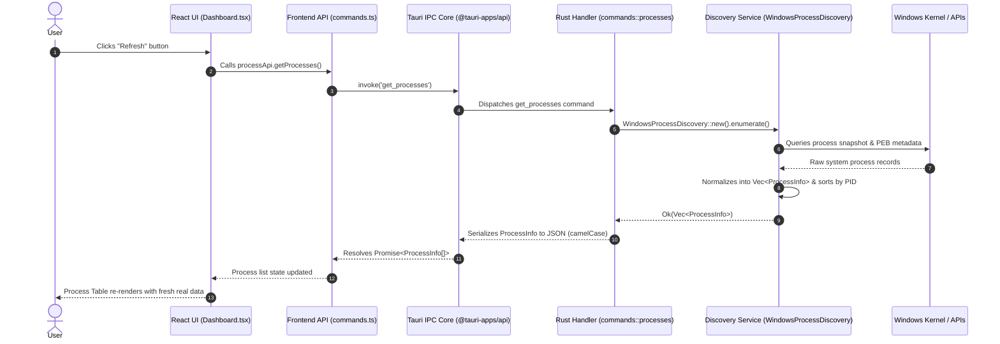
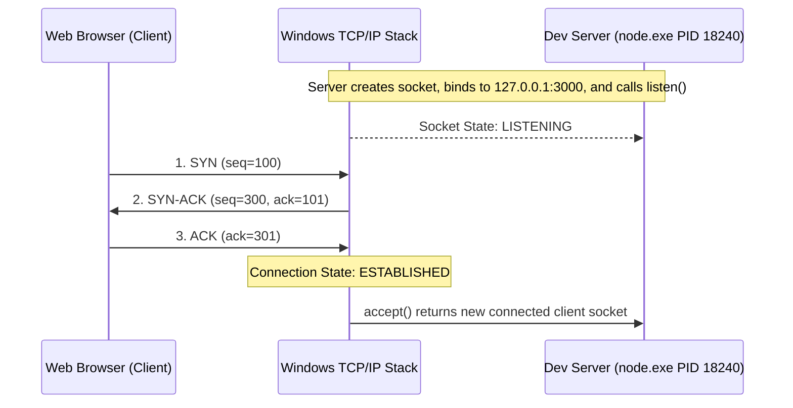
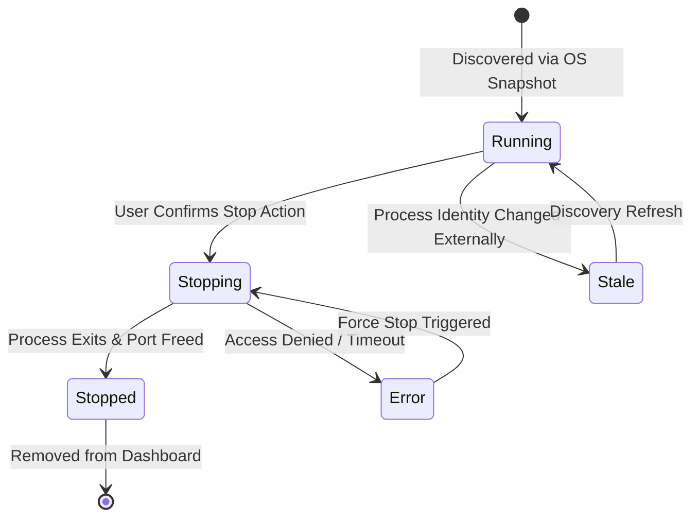
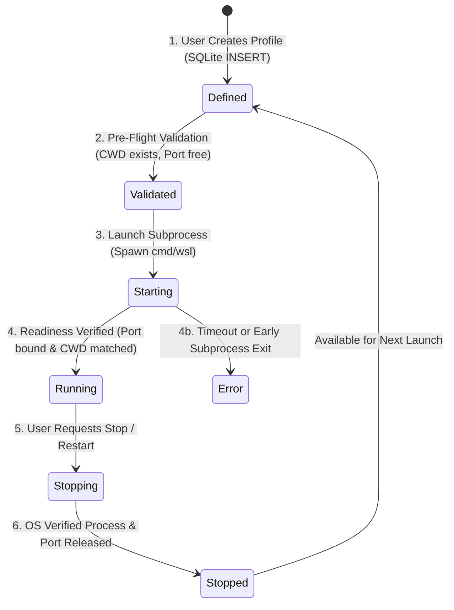
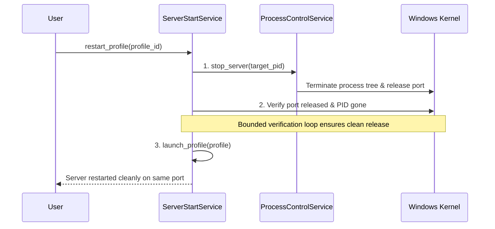
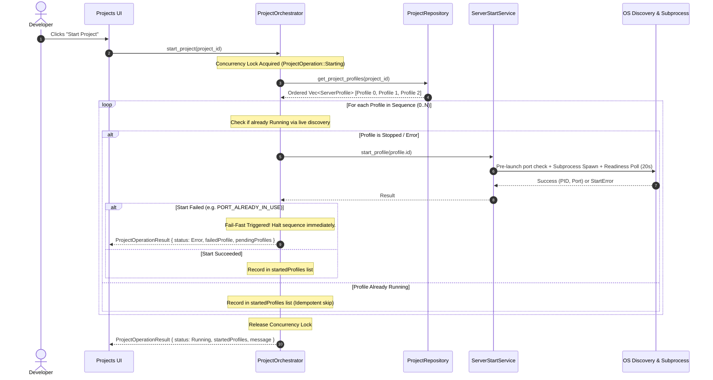

# DevHub Engineering Learning Guide

```
Project:           DevHub — Local Development Control Center
Current Milestone: Milestone 9 (Project Groups & Sequential Orchestration)
Document Purpose:  Comprehensive Engineering Learning and Code-Reading Guide for CS Students & HLD/LLD Interview Preparation
Document Version:  9.0.0
```

---

## Table of Contents
1. [How to Read This Project](#1-how-to-read-this-project)
2. [Computer Science Fundamentals](#2-computer-science-fundamentals)
   - [2.1 Operating System Processes](#21-operating-system-processes)
   - [2.2 Threads vs. Processes](#22-threads-vs-processes)
   - [2.3 OS Process Model and Lifecycle](#23-os-process-model-and-lifecycle)
   - [2.4 File Systems, Paths, and Working Directories](#24-file-systems-paths-and-working-directories)
3. [Windows Systems Programming Concepts](#3-windows-systems-programming-concepts)
   - [3.1 Windows Process Enumeration Mechanisms](#31-windows-process-enumeration-mechanisms)
   - [3.2 Windows Process Handles and Security Descriptors](#32-windows-process-handles-and-security-descriptors)
   - [3.3 Process Environment Block (PEB) and Command Line Extraction](#33-process-environment-block-peb-and-command-line-extraction)
   - [3.4 Why Native APIs Are Superior to Shell Parsing](#34-why-native-apis-are-superior-to-shell-parsing)
4. [Desktop Application Architecture](#4-desktop-application-architecture)
   - [4.1 Tauri 2 Architecture vs. Electron vs. Native](#41-tauri-2-architecture-vs-electron-vs-native)
   - [4.2 Security Boundaries: Core Process vs. WebView Process](#42-security-boundaries-core-process-vs-webview-process)
5. [Inter-Process Communication (IPC)](#5-inter-process-communication-ipc)
   - [5.1 IPC Theory & Desktop Message Passing](#51-ipc-theory--desktop-message-passing)
   - [5.2 Tauri Command Invocation Flow](#52-tauri-command-invocation-flow)
6. [Serialization & Data Marshalling](#6-serialization--data-marshalling)
   - [6.1 The Need for Serialization](#61-the-need-for-serialization)
   - [6.2 Serde Mechanics: `snake_case` to `camelCase` Mapping](#62-serde-mechanics-snake_case-to-camelcase-mapping)
7. [Type Systems & Cross-Language Contracts](#7-type-systems--cross-language-contracts)
   - [7.1 Rust Static Typing vs. TypeScript Static Typing](#71-rust-static-typing-vs-typescript-static-typing)
   - [7.2 Contract Synchronization & Type Mismatches](#72-contract-synchronization--type-mismatches)
8. [Software Architecture & Design Principles](#8-software-architecture--design-principles)
   - [8.1 Layered Architecture Pattern](#81-layered-architecture-pattern)
   - [8.2 SOLID Principles Applied in DevHub](#82-solid-principles-applied-in-devhub)
9. [High-Level Design (HLD)](#9-high-level-design-hld)
   - [9.1 System Boundaries & Component Topology](#91-system-boundaries--component-topology)
   - [9.2 Architectural Strategy for Future Milestones (WSL & Profiles)](#92-architectural-strategy-for-future-milestones-wsl--profiles)
10. [Low-Level Design (LLD)](#10-low-level-design-lld)
    - [10.1 Domain Models](#101-domain-models)
    - [10.2 Service Pattern and Trait Abstractions](#102-service-pattern-and-trait-abstractions)
    - [10.3 Thin Tauri Command Handlers](#103-thin-tauri-command-handlers)
11. [Error Handling & Resilience](#11-error-handling--resilience)
    - [11.1 Expected vs. Unexpected Errors](#111-expected-vs-unexpected-errors)
    - [11.2 Graceful Degradation for Protected System Processes](#112-graceful-degradation-for-protected-system-processes)
12. [Concurrency & Asynchronous Execution](#12-concurrency--asynchronous-execution)
    - [12.1 Non-Blocking UI Rules for Desktop Apps](#121-non-blocking-ui-rules-for-desktop-apps)
    - [12.2 Sync vs. Async Command Scalability](#122-sync-vs-async-command-scalability)
13. [Frontend Architecture & UI State Management](#13-frontend-architecture--ui-state-management)
    - [13.1 React 19 State, Derived State, and Memoization](#131-react-19-state-derived-state-and-memoization)
    - [13.2 State Machine: Loading, Error, Empty, and Success States](#132-state-machine-loading-error-empty-and-success-states)
14. [Database & Persistence Architecture Preview (Milestone 4+)](#14-database--persistence-architecture-preview-milestone-4)
    - [14.1 Ephemeral vs. Persistent State](#141-ephemeral-vs-persistent-state)
    - [14.2 SQLite Integration Preview](#142-sqlite-integration-preview)
15. [Testing Strategy & Quality Assurance](#15-testing-strategy--quality-assurance)
    - [15.1 Testing Pyramid for Desktop Systems](#151-testing-pyramid-for-desktop-systems)
    - [15.2 Unit, Integration, and Contract Testing](#152-unit-integration-and-contract-testing)
16. [Practical Debugging Methodology](#16-practical-debugging-methodology)
17. [Comprehensive Code-Reading Guide](#17-comprehensive-code-reading-guide)
18. [End-to-End Code Traces](#18-end-to-end-code-traces)
19. [How DevHub Maps to HLD/LLD Interview Concepts](#19-how-devhub-maps-to-hldlld-interview-concepts)
20. [Engineering Glossary](#20-engineering-glossary)
21. [Milestone 2: Networking Fundamentals & Architecture](#21-milestone-2-networking-fundamentals--architecture)
    - [21.1 IP Addresses, IPv4, IPv6, and Loopback vs. Wildcard](#211-ip-addresses-ipv4-ipv6-and-loopback-vs-wildcard)
    - [21.2 Ports, Sockets, and Endpoints](#212-ports-sockets-and-endpoints)
    - [21.3 TCP Protocol, Three-Way Handshake, and Connection States](#213-tcp-protocol-three-way-handshake-and-connection-states)
    - [21.4 Socket Lifecycle: Creation, Binding, Listening, and Connection Acceptance](#214-socket-lifecycle-creation-binding-listening-and-connection-acceptance)
    - [21.5 Why DevHub Focuses on `LISTENING` Sockets](#215-why-devhub-focuses-on-listening-sockets)
22. [Milestone 2: Windows Networking Subsystem & IP Helper API](#22-milestone-2-windows-networking-subsystem--ip-helper-api)
    - [22.1 Win32 IP Helper API (`iphlpapi.dll`) & `GetExtendedTcpTable`](#221-win32-ip-helper-api-iphlpapidll--getextendedtcptable)
    - [22.2 Byte Ordering: Network Byte Order (Big-Endian) vs. Host Byte Order (Little-Endian)](#222-byte-ordering-network-byte-order-big-endian-vs-host-byte-order-little-endian)
    - [22.3 Dynamic Buffer Allocation & Reentrancy Safety](#223-dynamic-buffer-allocation--reentrancy-safety)
    - [22.4 Native API Performance vs. `netstat` Shell Parsing](#224-native-api-performance-vs-netstat-shell-parsing)
23. [Milestone 2: Data Modeling, Algorithmic Thinking & Port → PID Join](#23-milestone-2-data-modeling-algorithmic-thinking--port--pid-join)
    - [23.1 The Port → PID Mapping Problem](#231-the-port--pid-mapping-problem)
    - [23.2 One-to-Many and Many-to-One Relationships](#232-one-to-many-and-many-to-one-relationships)
    - [23.3 $O(P + S)$ Map Join vs. $O(P \times S)$ Nested Scan](#233-op--s-map-join-vs-op--s-nested-scan)
    - [23.4 Operating System Snapshots, Race Conditions, and PID Reuse](#234-operating-system-snapshots-race-conditions-and-pid-reuse)
    - [23.5 Handling Missing Processes and Disappeared Endpoints](#235-handling-missing-processes-and-disappeared-endpoints)
24. [Milestone 2: Rust Data Structures & Type System](#24-milestone-2-rust-data-structures--type-system)
    - [24.1 Choice of Data Structures: `Vec`, `HashMap`, `Option`, `Result`](#241-choice-of-data-structures-vec-hashmap-option-result)
    - [24.2 `PortInfo` Domain Model and Cross-Language Contract](#242-portinfo-domain-model-and-cross-language-contract)
25. [Milestone 2: Updated High-Level & Low-Level Design](#25-milestone-2-updated-high-level--low-level-design)
    - [25.1 Updated HLD Architecture Diagram](#251-updated-hld-architecture-diagram)
    - [25.2 Why `ProcessDiscovery` and `PortDiscovery` Are Separated](#252-why-processdiscovery-and-portdiscovery-are-separated)
    - [25.3 Low-Level Service Contracts and Thin Command Controllers](#253-low-level-service-contracts-and-thin-command-controllers)
26. [Milestone 2: End-to-End Port Discovery Code Trace](#26-milestone-2-end-to-end-port-discovery-code-trace)
27. [Milestone 2: Deep HLD/LLD Interview Questions & Answers](#27-milestone-2-deep-hldlld-interview-questions--answers)
28. [Milestone 3: Process Identity — Beyond Raw PIDs and Ports](#28-milestone-3-process-identity--beyond-raw-pids-and-ports)
    - [28.1 The Identity Problem: Why PID & Port Are Insufficient](#281-the-identity-problem-why-pid--port-are-insufficient)
    - [28.2 The 9 Dimensions of Developer Process Identity](#282-the-9-dimensions-of-developer-process-identity)
    - [28.3 The Disambiguating Power of Working Directory (`CWD`)](#283-the-disambiguating-power-of-working-directory-cwd)
29. [Milestone 3: Process Trees, Ancestry & Shell Execution Models](#29-milestone-3-process-trees-ancestry--shell-execution-models)
    - [29.1 The Process Ancestry Hierarchy on Windows](#291-the-process-ancestry-hierarchy-on-windows)
    - [29.2 How Development Servers Are Spawned (IDE → Shell → Wrapper → Runtime)](#292-how-development-servers-are-spawned-ide--shell--wrapper--runtime)
    - [29.3 Why Process Ancestry Eliminates "Orphan Server" Confusion](#293-why-process-ancestry-eliminates-orphan-server-confusion)
30. [Milestone 3: Process Tree Construction Algorithm & Cycle Protection](#30-milestone-3-process-tree-construction-algorithm--cycle-protection)
    - [30.1 Algorithmic Design: $O(P)$ Indexing and $O(D)$ Traversal](#301-algorithmic-design-op-indexing-and-od-traversal)
    - [30.2 Defensive Programming: Why Process Graphs Can Contain Cycles](#302-defensive-programming-why-process-graphs-can-contain-cycles)
    - [30.3 Visited Set (`HashSet<u32>`), Self-Parent Anomaly & Depth Bound](#303-visited-set-hashsetu32-self-parent-anomaly--depth-bound)
    - [30.4 Time and Space Complexity Formal Analysis](#304-time-and-space-complexity-formal-analysis)
    - [30.5 DevHub Rust Implementation: `ProcessTreeBuilder`](#305-devhub-rust-implementation-processtreebuilder)
31. [Milestone 3: Runtime Identification & Conservative Classification](#31-milestone-3-runtime-identification--conservative-classification)
    - [31.1 Detection vs. Inference vs. Guessing](#311-detection-vs-inference-vs-guessing)
    - [31.2 Conservative Runtime Classification Strategy](#312-conservative-runtime-classification-strategy)
    - [31.3 Supported Runtime Detection Heuristics (Node.js, Python, Java, .NET, Go, Rust)](#313-supported-runtime-detection-heuristics-nodejs-python-java-net-go-rust)
    - [31.4 Safe Fallback: `Runtime::Unknown`](#314-safe-fallback-runtimeunknown)
32. [Milestone 3: Package Manager Detection & Ancestry Inspection](#32-milestone-3-package-manager-detection--ancestry-inspection)
    - [32.1 The Relationship Between Interpreters and Package Managers](#321-the-relationship-between-interpreters-and-package-managers)
    - [32.2 Why `node.exe` Does Not Imply `npm`](#322-why-nodeexe-does-not-imply-npm)
    - [32.3 Dual-Source Detection: Command-Line Token Parsing + Ancestry Inspection](#323-dual-source-detection-command-line-token-parsing--ancestry-inspection)
    - [32.4 Supported Package Managers: npm, pnpm, yarn, bun](#324-supported-package-managers-npm-pnpm-yarn-bun)
33. [Milestone 3: Data Composition & Structural Separation](#33-milestone-3-data-composition--structural-separation)
    - [33.1 Composition over Inheritance and Duplication](#331-composition-over-inheritance-and-duplication)
    - [33.2 Structural Topology: `ProcessIdentity` Composing `ProcessInfo`, `ProcessTree`, and `PortInfo`](#332-structural-topology-processidentity-composing-processinfo-processtree-and-portinfo)
    - [33.3 Immutable Snapshots vs. Derived Domain State](#333-immutable-snapshots-vs-derived-domain-state)
34. [Milestone 3: Domain Layer vs. Infrastructure Layer Separation](#34-milestone-3-domain-layer-vs-infrastructure-layer-separation)
    - [34.1 Infrastructure Layer: Raw Win32 APIs, FFI, `sysinfo`, `iphlpapi.dll`](#341-infrastructure-layer-raw-win32-apis-ffi-sysinfo-iphlpapidll)
    - [34.2 Domain Layer: `ProcessIdentityService`, `RuntimeDetector`, `ProcessTreeBuilder`](#342-domain-layer-processidentityservice-runtimedetector-processtreebuilder)
    - [34.3 Why Domain Logic Must Remain Decoupled from OS APIs](#343-why-domain-logic-must-remain-decoupled-from-os-apis)
    - [34.4 Architectural Portability for Future Linux and WSL Milestones](#344-architectural-portability-for-future-linux-and-wsl-milestones)
35. [Milestone 3: Operating System Snapshots, Non-Atomicity & PID Reuse](#35-milestone-3-operating-system-snapshots-non-atomicity--pid-reuse)
    - [35.1 The Ephemeral Nature of OS Snapshots](#351-the-ephemeral-nature-of-os-snapshots)
    - [35.2 TOCTOU (Time-of-Check to Time-of-Use) in Process Inspection](#352-toctou-in-process-inspection)
    - [35.3 Why PID Can Never Be a Permanent Server Identifier](#353-why-pid-can-never-be-a-permanent-server-identifier)
    - [35.4 Resilient Degradation: Handling Disappeared Processes and Missing Parents](#354-resilient-degradation-handling-disappeared-processes-and-missing-parents)
36. [Milestone 3: Updated High-Level Design (HLD) & Low-Level Design (LLD)](#36-milestone-3-updated-high-level-design-hld--low-level-design-lld)
    - [36.1 Updated HLD Architecture Diagram (Milestone 3 Topology)](#361-updated-high-level-design-hld--low-level-design-lld)
    - [36.2 Low-Level Design: Component Contracts, Types, and Signatures](#362-low-level-design-component-contracts-types-and-signatures)
    - [36.3 Layered Responsibility Matrix](#363-layered-responsibility-matrix)
37. [Milestone 3: End-to-End Process Identity Code Trace](#37-milestone-3-end-to-end-process-identity-code-trace)
38. [Milestone 3: Deep Systems Engineering & HLD/LLD Interview Q&A](#38-milestone-3-deep-systems-engineering--hldlld-interview-qa)
39. [Milestone 3: Updated Code-Reading Guide & File Inventory](#39-milestone-3-updated-code-reading-guide--file-inventory)
40. [Milestone 4: Presentation Architecture & View Models](#40-milestone-4-presentation-architecture--view-models)
    - [40.1 From OS Telemetry to Developer Product Semantics](#401-from-os-telemetry-to-developer-product-semantics)
    - [40.2 The Four Modeling Tiers: Infrastructure, Domain, View, Persistence](#402-the-four-modeling-tiers-infrastructure-domain-view-persistence)
    - [40.3 `DashboardServer` View Model & Composite Snapshot ID](#403-dashboardserver-view-model--composite-snapshot-id)
    - [40.4 Conservative Server Name Inference Strategy](#404-conservative-server-name-inference-strategy)
41. [Milestone 4: Frontend State Management & Single Source of Truth](#41-milestone-4-frontend-state-management--single-source-of-truth)
    - [41.1 Source State vs. Derived State in React 19](#411-source-state-vs-derived-state-in-react-19)
    - [41.2 Why `visibleServers` Must NOT Be Held in Independent State](#412-why-visibleservers-must-not-be-held-in-independent-state)
    - [41.3 Auto-Refresh Polling Lifecycle & Cleanup Safety](#413-auto-refresh-polling-lifecycle--cleanup-safety)
42. [Milestone 4: Algorithmic Complexity of Client-Side Data Pipelines](#42-milestone-4-algorithmic-complexity-of-client-side-data-pipelines)
    - [42.1 The Data Pipeline: $O(P+S) \to O(N) \to O(N \cdot L) \to O(N \log N)$](#421-the-data-pipeline-ops-to-on-to-on-cdot-l-to-on-log-n)
    - [42.2 Performance on Developer Hardware & 60 FPS Guarantee](#422-performance-on-developer-hardware--60-fps-guarantee)
    - [42.3 Why Virtualization Is Not Necessary in Milestone 4](#423-why-virtualization-is-not-necessary-in-milestone-4)
43. [Milestone 4: UX State Machines & Progressive Disclosure](#43-milestone-4-ux-state-machines--progressive-disclosure)
    - [43.1 The 6 Fundamental UI Lifecycle States](#431-the-6-fundamental-ui-lifecycle-states)
    - [43.2 Progressive Disclosure: 3-Tier Information Hierarchy](#432-progressive-disclosure-3-tier-information-hierarchy)
44. [Milestone 4: Component Boundaries & Presentational Decomposition](#44-milestone-4-component-boundaries--presentational-decomposition)
    - [44.1 Container vs. Presentational Responsibilities](#441-container-vs-presentational-responsibilities)
    - [44.2 DevHub Component Hierarchy & Props Contracts](#442-devhub-component-hierarchy--props-contracts)
45. [Milestone 4: Design Tokens & Accessibility](#45-milestone-4-design-tokens--accessibility)
    - [45.1 Tailwind CSS Design Tokens & Visual Hierarchy](#451-tailwind-css-design-tokens--visual-hierarchy)
    - [45.2 Keyboard Accessibility, ARIA Roles & Color Independence](#452-keyboard-accessibility-aria-roles--color-independence)
46. [Milestone 4: Updated High-Level Design (HLD) & Low-Level Design (LLD)](#46-milestone-4-updated-high-level-design-hld--low-level-design-lld)
    - [46.1 Milestone 4 HLD Topology Diagram](#461-milestone-4-hld-topology-diagram)
    - [46.2 Milestone 4 LLD Component Inventory & Signatures](#462-milestone-4-lld-component-inventory--signatures)
47. [Milestone 4: End-to-End User Interaction Code Trace](#47-milestone-4-end-to-end-user-interaction-code-trace)
48. [Milestone 4: Deep Systems Engineering & HLD/LLD Interview Q&A](#48-milestone-4-deep-systems-engineering--hldlld-interview-qa)
49. [Milestone 4: Complete Repository File Inventory & Architecture Matrix](#49-milestone-4-complete-repository-file-inventory--architecture-matrix)
50. [Milestone 5: Operating System Process Control & Destruction Concepts](#50-milestone-5-operating-system-process-control--destruction-concepts)
    - [50.1 What Process Termination Means at the Kernel Level](#501-what-process-termination-means-at-the-kernel-level)
    - [50.2 Graceful vs. Forceful Termination on Windows](#502-graceful-vs-forceful-termination-on-windows)
    - [50.3 Win32 Process Handles, Access Rights & Kernel Objects](#503-win32-process-handles-access-rights--kernel-objects)
    - [50.4 Why Process Termination Differs from Closing a Terminal Window](#504-why-process-termination-differs-from-closing-a-terminal-window)
51. [Milestone 5: Process Tree Control & Ancestry Protection](#51-milestone-5-process-tree-control--ancestry-protection)
    - [51.1 Hierarchy Definitions: Parent, Child, Descendant, Ancestor, Sibling](#511-hierarchy-definitions-parent-child-descendant-ancestor-sibling)
    - [51.2 The Anatomy of a Development Process Tree](#512-the-anatomy-of-a-development-process-tree)
    - [51.3 The "Ancestor Safety Rule": Why Killing Parents is Catastrophic](#513-the-ancestor-safety-rule-why-killing-parents-is-catastrophic)
    - [51.4 Descendant Resolution Algorithm & Leaves-to-Root Termination](#514-descendant-resolution-algorithm--leaves-to-root-termination)
52. [Milestone 5: PID Lifecycle, PID Reuse & TOCTOU Race Condition Mitigation](#52-milestone-5-pid-lifecycle-pid-reuse--toctou-race-condition-mitigation)
    - [52.1 The Transient Nature of Process Identifiers](#521-the-transient-nature-of-process-identifiers)
    - [52.2 The Windows PID Reuse Collision Threat Model](#522-the-windows-pid-reuse-collision-threat-model)
    - [52.3 Time-of-Check to Time-of-Use (TOCTOU) in Desktop Systems](#523-time-of-check-to-time-of-use-toctou-in-desktop-systems)
    - [52.4 How Win32 Kernel Handles Pin Process Objects in Memory](#524-how-win32-kernel-handles-pin-process-objects-in-memory)
53. [Milestone 5: Target Validation Strategy & Least Privilege in Developer Tooling](#53-milestone-5-target-validation-strategy--least-privilege-in-developer-tooling)
    - [53.1 Why Read-Only Tools Differ from Destructive Control Layers](#531-why-read-only-tools-differ-from-destructive-control-layers)
    - [53.2 DevHub's 9-Point Pre-Termination Identity Verification Checklist](#532-devhubs-9-point-pre-termination-identity-verification-checklist)
    - [53.3 Protecting Critical System Processes & Failsafe Behavior](#533-protecting-critical-system-processes--failsafe-behavior)
    - [53.4 Explicit User Confirmation: Preventing Accidental Outages](#534-explicit-user-confirmation-preventing-accidental-outages)
54. [Milestone 5: Post-Termination Verification & Port Owner Diagnostics](#54-milestone-5-post-termination-verification--port-owner-diagnostics)
    - [54.1 Why API Success Does Not Imply Process Termination](#541-why-api-success-does-not-imply-process-termination)
    - [54.2 Bounded Exit Polling Loops & Non-Blocking Timeouts](#542-bounded-exit-polling-loops--non-blocking-timeouts)
    - [54.3 Port Release Verification via Win32 IP Helper API](#543-port-release-verification-via-win32-ip-helper-api)
    - [54.4 Disambiguating "Freed Port" vs. "Port Owner Changed"](#544-disambiguating-freed-port-vs-port-owner-changed)
55. [Milestone 5: Asynchronous Lifecycle State Machines & Per-Server Concurrency](#55-milestone-5-asynchronous-lifecycle-state-machines--per-server-concurrency)
    - [55.1 The 5 Fundamental Process Control Lifecycle States](#551-the-5-fundamental-process-control-lifecycle-states)
    - [55.2 Per-Server State Machines vs. Global UI Freezes](#552-per-server-state-machines-vs-global-ui-freezes)
    - [55.3 Preventing Duplicate Concurrent Operations (Double-Click Guards)](#553-preventing-duplicate-concurrent-operations-double-click-guards)
56. [Milestone 5: Idempotency & Resilient Error Design](#56-milestone-5-idempotency--resilient-error-design)
    - [56.1 Idempotency in Destructive Operations](#561-idempotency-in-destructive-operations)
    - [56.2 Handling External Process Termination Gracefully](#562-handling-external-process-termination-gracefully)
    - [56.3 Three-Tier Error Architecture: Technical vs. Domain vs. User Errors](#563-three-tier-error-architecture-technical-vs-domain-vs-user-errors)
57. [Milestone 5: Updated High-Level Design (HLD)](#57-milestone-5-updated-high-level-design-hld)
    - [57.1 Milestone 5 Architecture Topology Diagram](#571-milestone-5-architecture-topology-diagram)
    - [57.2 Layer Responsibility Matrix](#572-layer-responsibility-matrix)
58. [Milestone 5: Updated Low-Level Design (LLD)](#58-milestone-5-updated-low-level-design-lld)
    - [58.1 Component Signatures and Contracts](#581-component-signatures-and-contracts)
    - [58.2 Win32 Kernel FFI Layer & ProcessHandle RAII](#582-win32-kernel-ffi-layer--processhandle-raii)
59. [Milestone 5: End-to-End Stop Server Code Trace](#59-milestone-5-end-to-end-stop-server-code-trace)
60. [Milestone 5: Deep Systems Engineering & HLD/LLD Interview Q&A](#60-milestone-5-deep-systems-engineering--hldlld-interview-qa)
61. [Milestone 5: Complete Repository File Inventory & Architecture Matrix](#61-milestone-5-complete-repository-file-inventory--architecture-matrix)
62. [Milestone 6: WSL Integration — Engineering Overview & System Boundaries](#62-milestone-6-wsl-integration--engineering-overview--system-boundaries)
    - [62.1 Why WSL is Critical for Modern Windows Developers](#621-why-wsl-is-critical-for-modern-windows-developers)
    - [62.2 WSL1 vs WSL2: Translation Layer vs Hyper-V Utility VM](#622-wsl1-vs-wsl2-translation-layer-vs-hyper-v-utility-vm)
    - [62.3 Bridging the Windows-Linux Boundary: Host-to-Guest Communication](#623-bridging-the-windows-linux-boundary-host-to-guest-communication)
63. [Milestone 6: Multi-Environment Architecture & Domain Normalization](#63-milestone-6-multi-environment-architecture--domain-normalization)
    - [63.1 The Multi-Environment Abstraction: `Environment::Windows` vs `Environment::Wsl { distro }`](#631-the-multi-environment-abstraction-environmentwindows-vs-environmentwsl--distro-)
    - [63.2 Why Windows & WSL Are Different Infrastructure Sources Feeding One Normalized Model](#632-why-windows--wsl-are-different-infrastructure-sources-feeding-one-normalized-model)
    - [63.3 Preventing Environment Conflation: Composite Keys `(Environment, PID)`](#633-preventing-environment-conflation-composite-keys-environment-pid)
64. [Milestone 6: WSL Distribution Discovery & Wide-Character (UTF-16LE) Decoding](#64-milestone-6-wsl-distribution-discovery--wide-character-utf-16le-decoding)
    - [64.1 Enumerating Installed Distributions via `wsl.exe -l -v`](#641-enumerating-installed-distributions-via-wslexe--l--v)
    - [64.2 The Windows Wide Character (UTF-16LE) CLI Output Challenge & Solution](#642-the-windows-wide-character-utf-16le-cli-output-challenge--solution)
    - [64.3 State Filtering: Why Only `Running` Distributions Are Queried](#643-state-filtering-why-only-running-distributions-are-queried)
65. [Milestone 6: Linux Process & Port Discovery Inside WSL (`ps` & `ss` Telemetry)](#65-milestone-6-linux-process--port-discovery-inside-wsl-ps--ss-telemetry)
    - [65.1 Linux Process Enumeration via `ps -eo pid,ppid,comm,args --no-headers`](#651-linux-process-enumeration-via-ps--eo-pidppidcommargs---no-headers)
    - [65.2 Linux Listening TCP Port Discovery via Socket Statistics (`ss -tlpn -H`)](#652-linux-listening-tcp-port-discovery-via-socket-statistics-ss--tlpn--h)
    - [65.3 Parsing Linux Sockets, IPv4/IPv6 Addresses, and Process Ownership](#653-parsing-linux-sockets-ipv4ipv6-addresses-and-process-ownership)
66. [Milestone 6: Subprocess Execution, Timeout Bounds & Partial Failure Isolation](#66-milestone-6-subprocess-execution-timeout-bounds--partial-failure-isolation)
    - [66.1 Executing WSL Commands via Direct Argument Vectors (No Shell Injection)](#661-executing-wsl-commands-via-direct-argument-vectors-no-shell-injection)
    - [66.2 Timeout Protection & Hung Subprocess Prevention](#662-timeout-protection--hung-subprocess-prevention)
    - [66.3 Graceful Degradation & Partial Failure Isolation (`DiscoveryDiagnostic`)](#663-graceful-degradation--partial-failure-isolation-discoverydiagnostic)
67. [Milestone 6: Cross-Environment Process Trees & Identity Enrichment](#67-milestone-6-cross-environment-process-trees--identity-enrichment)
    - [67.1 Per-Distribution Process Tree Isolation (Linux PIDs Scoped to Distro)](#671-per-distribution-process-tree-isolation-linux-pids-scoped-to-distro)
    - [67.2 Linux Runtime & Package Manager Detection (Node.js, Python, Cargo, Vite)](#672-linux-runtime--package-manager-detection-nodejs-python-cargo-vite)
    - [67.3 Path Normalization: Linux POSIX Paths (`/home/user/...`) vs Windows (`C:\...`)](#673-path-normalization-linux-posix-paths-homeuser-vs-windows-c)
68. [Milestone 6: Safe Process Control Boundary (Milestone 5 Guardrails Preserved)](#68-milestone-6-safe-process-control-boundary-milestone-5-guardrails-preserved)
    - [68.1 Why Windows Win32 `TerminateProcess` Must Never Be Called on WSL PIDs](#681-why-windows-win32-terminateprocess-must-never-be-called-on-wsl-pids)
    - [68.2 Backend Enforcement: Rejecting Non-Windows Targets with `UNSAFE_TARGET`](#682-backend-enforcement-rejecting-non-windows-targets-with-unsafe_target)
    - [68.3 Frontend UI Enforcement: Read-Only WSL State and Disabled Action Triggers](#683-frontend-ui-enforcement-read-only-wsl-state-and-disabled-action-triggers)
69. [Milestone 6: Updated High-Level Design (HLD) & Architecture Topology](#69-milestone-6-updated-high-level-design-hld--architecture-topology)
    - [69.1 Milestone 6 Unified Architecture Topology Diagram](#691-milestone-6-unified-architecture-topology-diagram)
    - [69.2 Multi-Environment Layer Responsibility Matrix](#692-multi-environment-layer-responsibility-matrix)
70. [Milestone 6: Updated Low-Level Design (LLD) & Service Trait Contracts](#70-milestone-6-updated-low-level-design-lld--service-trait-contracts)
    - [70.1 WSL Infrastructure Interfaces (`WslExecutor`, `WslDistroDiscovery`, `WslProcessDiscovery`, `WslPortDiscovery`)](#701-wsl-infrastructure-interfaces-wslexecutor-wsldistrodiscovery-wslprocessdiscovery-wslportdiscovery)
    - [70.2 `UnifiedDiscoveryService` Composition & Orchestration](#702-unifieddiscoveryservice-composition--orchestration)
    - [70.3 Cross-Language Type Contracts (`Environment`, `WslDistribution`, `UnifiedSnapshot`)](#703-cross-language-type-contracts-environment-wsldistribution-unifiedsnapshot)
71. [Milestone 6: End-to-End Multi-Environment Code Trace](#71-milestone-6-end-to-end-multi-environment-code-trace)
    - [71.1 Complete Trace: From Frontend Refresh to Windows + WSL Discovery to Unified Dashboard](#711-complete-trace-from-frontend-refresh-to-windows--wsl-discovery-to-unified-dashboard)
72. [Milestone 6: Deep Systems Engineering & HLD/LLD Interview Q&A](#72-milestone-6-deep-systems-engineering--hldlld-interview-qa)
73. [Milestone 6: Complete Repository File Inventory & Architecture Matrix](#73-milestone-6-complete-repository-file-inventory--architecture-matrix)
74. [Milestone 7: Server Profiles — Persistent Configuration vs. Ephemeral Telemetry](#74-milestone-7-server-profiles--persistent-configuration-vs-ephemeral-telemetry)
    - [74.1 The Configuration vs. Runtime State Distinction](#741-the-configuration-vs-runtime-state-distinction)
    - [74.2 The Single Source of Truth Rule: Database vs. OS Kernel](#742-the-single-source-of-truth-rule-database-vs-os-kernel)
    - [74.3 Why Process State and Port State Must Never Be Persisted as Authoritative](#743-why-process-state-and-port-state-must-never-be-persisted-as-authoritative)
    - [74.4 The Lifecycle of a Profile: Definition, Validation, Execution, Association, Termination](#744-the-lifecycle-of-a-profile-definition-validation-execution-association-termination)
75. [Milestone 7: Persistence Architecture — Embedded SQLite, Migrations & Repository Pattern](#75-milestone-7-persistence-architecture--embedded-sqlite-migrations--repository-pattern)
    - [75.1 Why Embedded SQLite is the Standard for Desktop Developer Tools](#751-why-embedded-sqlite-is-the-standard-for-desktop-developer-tools)
    - [75.2 Write-Ahead Logging (WAL Mode) & Foreign Key Constraints](#752-write-ahead-logging-wal-mode--foreign-key-constraints)
    - [75.3 Versioned Database Migrations (`MigrationRunner` & `schema_migrations`)](#753-versioned-database-migrations-migrationrunner--schema_migrations)
    - [75.4 Repository Pattern: `ServerProfileRepository` Trait & SQLite Implementation](#754-repository-pattern-serverprofilerepository-trait--sqlite-implementation)
76. [Milestone 7: Multi-Environment Process Launching — Command Execution & Shell Bridging](#76-milestone-7-multi-environment-process-launching--command-execution--shell-bridging)
    - [76.1 The `EnvironmentLauncher` Abstraction Trait](#761-the-environmentlauncher-abstraction-trait)
    - [76.2 Windows Launching: Direct Command Execution (`cmd.exe /D /C` & `CREATE_NO_WINDOW`)](#762-windows-launching-direct-command-execution-cmdexe-d-c--create_no_window)
    - [76.3 WSL Launching: Cross-Boundary Execution (`wsl.exe -d <distro> --cd <dir> -- sh -c <cmd>`)](#763-wsl-launching-cross-boundary-execution-wslexe--d-distro---cd-dir----sh--c-cmd)
    - [76.4 Preventing Shell Injection & Path Escaping in Multi-Environment Launchers](#764-preventing-shell-injection--path-escaping-in-multi-environment-launchers)
77. [Milestone 7: Startup Orchestration, Verification & Port Readiness Polling](#77-milestone-7-startup-orchestration-verification--port-readiness-polling)
    - [77.1 The Asynchronous Process Startup Lifecycle](#771-the-asynchronous-process-startup-lifecycle)
    - [77.2 Pre-Launch Port Conflict Checking (Safe Refusal Without Termination)](#772-pre-launch-port-conflict-checking-safe-refusal-without-termination)
    - [77.3 The Correlation Problem: Linking a Spawned Process to OS Discovery Telemetry](#773-the-correlation-problem-linking-a-spawned-process-to-os-discovery-telemetry)
    - [77.4 Bounded Readiness Polling Loop (20s Timeout, 500ms Intervals, Early Exit Detection)](#774-bounded-readiness-polling-loop-20s-timeout-500ms-intervals-early-exit-detection)
    - [77.5 Windows Server Restart: Stop, Verification, and Start Sequence](#775-windows-server-restart-stop-verification-and-start-sequence)
78. [Milestone 7: Domain Service Layer & Runtime Status Derivation](#78-milestone-7-domain-service-layer--runtime-status-derivation)
    - [78.1 `ServerProfileService`: Profile CRUD & Validation Rules](#781-serverprofileservice-profile-crud--validation-rules)
    - [78.2 `ServerStartService`: Orchestration & In-Flight Tracking](#782-serverstartservice-orchestration--in-flight-tracking)
    - [78.3 Multi-Signal Process Association Algorithm (Port + CWD Matching)](#783-multi-signal-process-association-algorithm-port--cwd-matching)
    - [78.4 Enriched View Models: Merging SQLite Profiles with Live OS Telemetry](#784-enriched-view-models-merging-sqlite-profiles-with-live-os-telemetry)
79. [Milestone 7: Error Architecture & Safety Guardrails](#79-milestone-7-error-architecture--safety-guardrails)
    - [79.1 `StartErrorCode` Hierarchy (Port Conflict, Timeout, Directory Not Found, Distro Stopped)](#791-starterrorcode-hierarchy-port-conflict-timeout-directory-not-found-distro-stopped)
    - [79.2 Safe Port Conflict UX: Informative Owner Diagnostics vs. Aggressive Auto-Killing](#792-safe-port-conflict-ux-informative-owner-diagnostics-vs-aggressive-auto-killing)
    - [79.3 Profile Deletion Safety: Removing Configuration Without Destroying Running Processes](#793-profile-deletion-safety-removing-configuration-without-destroying-running-processes)
    - [79.4 WSL Restart & Control Boundaries (Enforcing Non-Destructive Invariant)](#794-wsl-restart--control-boundaries-enforcing-non-destructive-invariant)
80. [Milestone 7: Updated High-Level Design (HLD) & Architecture Topology](#80-milestone-7-updated-high-level-design-hld--architecture-topology)
    - [80.1 Milestone 7 Architecture Topology Diagram](#801-milestone-7-architecture-topology-diagram)
    - [80.2 Layer Responsibility Matrix](#802-layer-responsibility-matrix)
81. [Milestone 7: Updated Low-Level Design (LLD) & Component Interfaces](#81-milestone-7-updated-low-level-design-lld--component-interfaces)
    - [81.1 Repository, Launcher & Service Trait Signatures](#811-repository-launcher--service-trait-signatures)
    - [81.2 Data Transfer Objects & Cross-Language Contracts](#812-data-transfer-objects--cross-language-contracts)
82. [Milestone 7: End-to-End Code Traces](#82-milestone-7-end-to-end-code-traces)
    - [82.1 Complete Trace: Profile Creation & SQLite Persistence](#821-complete-trace-profile-creation--sqlite-persistence)
    - [82.2 Complete Trace: Profile Start, Port Conflict Check, Subprocess Launch & Readiness Polling](#822-complete-trace-profile-start-port-conflict-check-subprocess-launch--readiness-polling)
    - [82.3 Complete Trace: Safe Windows Server Restart Flow](#823-complete-trace-safe-windows-server-restart-flow)
83. [Milestone 7: Deep Systems Engineering & HLD/LLD Interview Q&A](#83-milestone-7-deep-systems-engineering--hldlld-interview-qa)
84. [Milestone 7: Complete Repository File Inventory & Architecture Matrix](#84-milestone-7-complete-repository-file-inventory--architecture-matrix)
85. [Milestone 8: Managed vs. Unmanaged Resources & Resource Adoption](#85-managed-vs-unmanaged-resources--the-resource-adoption-concept)
    - [85.1 The Dichotomy of Managed vs. Unmanaged Server Processes](#851-the-dichotomy-of-managed-vs-unmanaged-server-processes)
    - [85.2 What is Resource Adoption?](#852-what-is-resource-adoption)
86. [Milestone 8: Profile Association Engine & Multi-Signal Heuristics](#86-milestone-8-profile-association-engine--multi-signal-heuristics)
    - [86.1 Transient Annotation Pipeline: Why Association is Derived](#861-transient-annotation-pipeline-why-association-is-derived)
    - [86.2 The 3-Tier Multi-Signal Association Priority Hierarchy](#862-the-3-tier-multi-signal-association-priority-hierarchy)
    - [86.3 Path Normalization across Windows and WSL File Systems](#863-path-normalization-across-windows-and-wsl-file-systems)
87. [Milestone 8: Adoption Draft Synthesis & Command-Line Extraction Heuristics](#87-milestone-8-adoption-draft-synthesis--command-line-extraction-heuristics)
    - [87.1 The Reverse Inference Problem: From OS State to Runnable Configuration](#871-the-reverse-inference-problem-from-os-state-to-runnable-configuration)
    - [87.2 Command-Line Extraction & Argument Normalization](#872-command-line-extraction--argument-normalization)
    - [87.3 Multi-Port Disambiguation & Fallback Defaults](#873-multi-port-disambiguation--fallback-defaults)
88. [Milestone 8: Pre-Adoption Duplicate Detection Engine](#88-milestone-8-pre-adoption-duplicate-detection-engine)
    - [88.1 Multi-Dimensional Equality Criteria](#881-multi-dimensional-equality-criteria)
    - [88.2 Advisory Conflict UX vs. Hard Enforcement](#882-advisory-conflict-ux-vs-hard-enforcement)
89. [Milestone 8: Security & Safety Guardrails for Resource Adoption](#89-milestone-8-security--safety-guardrails-for-resource-adoption)
    - [89.1 Read-Only Environment Invariant (Windows vs. WSL Isolation)](#891-read-only-environment-invariant-windows-vs-wsl-isolation)
    - [89.2 Human-in-the-Loop Verification](#892-human-in-the-loop-verification)
    - [89.3 Non-Destructive Invariant: No Automatic Process Restart](#893-non-destructive-invariant-no-automatic-process-restart)
90. [Milestone 8: Frontend State Architecture & Reactive Adoption Workflows](#90-milestone-8-frontend-state-architecture--reactive-adoption-workflows)
    - [90.1 Multi-Tab Adoption Modals & Cross-View Synchronization](#901-multi-tab-adoption-modals--cross-view-synchronization)
    - [90.2 Dynamic Card State Transformation](#902-dynamic-card-state-transformation)
91. [Milestone 8: Updated High-Level Design (HLD) & Architecture Topology](#91-milestone-8-updated-high-level-design-hld--architecture-topology)
92. [Milestone 8: Updated Low-Level Design (LLD) & Component Interfaces](#92-milestone-8-updated-low-level-design-lld--component-interfaces)
93. [Milestone 8: End-to-End Adoption Code Traces](#93-milestone-8-end-to-end-adoption-code-traces)
94. [Milestone 8: Deep Systems Engineering & HLD/LLD Interview Q&A](#94-milestone-8-deep-systems-engineering--hldlld-interview-qa)
95. [Milestone 8: Complete Repository File Inventory & Architecture Matrix](#95-milestone-8-complete-repository-file-inventory--architecture-matrix)
96. [Milestone 9: Project Groups — Engineering Concepts & System Architecture](#96-milestone-9-project-groups--engineering-concepts--system-architecture)
    - [96.1 From Individual Server Management to Multi-Service Project Orchestration](#961-from-individual-server-management-to-multi-service-project-orchestration)
    - [96.2 Zero Configuration Duplication: Composition over Duplication Pattern](#962-zero-configuration-duplication-composition-over-duplication-pattern)
    - [96.3 Single Project Membership Invariant (1:N Relational Constraint) & Atomic Moves](#963-single-project-membership-invariant-1n-relational-constraint--atomic-moves)
    - [96.4 Relational Database Schema: `projects` and `project_profiles` Junction Table](#964-relational-database-schema-projects-and-project_profiles-junction-table)
    - [96.5 Foreign Key Constraints & Cascade Semantics (`ON DELETE CASCADE` Safety)](#965-foreign-key-constraints--cascade-semantics-on-delete-cascade-safety)
97. [Milestone 9: Deterministic Sequential Orchestration & Execution Pipelines](#97-milestone-9-deterministic-sequential-orchestration--execution-pipelines)
    - [97.1 Execution Order vs. Implicit Dependency Inference](#971-execution-order-vs-implicit-dependency-inference)
    - [97.2 Deterministic Sequential Startup Pipeline (`start_project`)](#972-deterministic-sequential-startup-pipeline-start_project)
    - [97.3 Fail-Fast Strategy & Why Automatic Rollback is Unsafe in Local Dev Environments](#973-fail-fast-strategy--why-automatic-rollback-is-unsafe-in-local-dev-environments)
    - [97.4 Structured Diagnostic Reporting (`ProjectOperationResult`)](#974-structured-diagnostic-reporting-projectoperationresult)
    - [97.5 Sequential Project Teardown (`stop_project`) & Multi-Environment Handling](#975-sequential-project-teardown-stop_project--multi-environment-handling)
    - [97.6 Project Restart Pipeline (`restart_project`) & Windows-Only Invariant](#976-project-restart-pipeline-restart_project--windows-only-invariant)
98. [Milestone 9: State Precedence Machine & Derived Project Health](#98-milestone-9-state-precedence-machine--derived-project-health)
    - [98.1 Transient vs. Persistent State: Why Project Runtime State is Derived](#981-transient-vs-persistent-state-why-project-runtime-state-is-derived)
    - [98.2 The 8-Tier Project Runtime State Precedence Hierarchy](#982-the-8-tier-project-runtime-state-precedence-hierarchy)
    - [98.3 Partial State Semantics: WSL Process Stop Limitations & Mixed Health](#983-partial-state-semantics-wsl-process-stop-limitations--mixed-health)
    - [98.4 Concurrency Guards: In-Flight Operation Locks & Double-Click Prevention](#984-concurrency-guards-in-flight-operation-locks--double-click-prevention)
99. [Milestone 9: Updated High-Level Design (HLD) & Architecture Topology](#99-milestone-9-updated-high-level-design-hld--architecture-topology)
    - [99.1 Milestone 9 Architecture Topology Diagram](#991-milestone-9-architecture-topology-diagram)
    - [99.2 Layer Responsibility Matrix](#992-layer-responsibility-matrix)
100. [Milestone 9: Updated Low-Level Design (LLD) & Component Interfaces](#100-milestone-9-updated-low-level-design-lld--component-interfaces)
     - [100.1 Repository Trait: `ProjectRepository` Interface & SQLite Implementation](#1001-repository-trait-projectrepository-interface--sqlite-implementation)
     - [100.2 Service & Orchestration Signatures: `ProjectService` & `ProjectOrchestrator`](#1002-service--orchestration-signatures-projectservice--projectorchestrator)
     - [100.3 Domain Models & Data Transfer Objects (`ProjectView`, `ProjectProfileView`, `ProjectOperationResult`)](#1003-domain-models--data-transfer-objects-projectview-projectprofileview-projectoperationresult)
     - [100.4 Thin Tauri Command Dispatchers (`commands/project.rs`)](#1004-thin-tauri-command-dispatchers-commandsprojectrs)
101. [Milestone 9: End-to-End Code Traces](#101-milestone-9-end-to-end-code-traces)
     - [101.1 Complete Trace: Sequential Fail-Fast Project Startup](#1011-complete-trace-sequential-fail-fast-project-startup)
     - [101.2 Complete Trace: Project Teardown with WSL Partial State Handling](#1012-complete-trace-project-teardown-with-wsl-partial-state-handling)
     - [101.3 Complete Trace: Atomic Profile Movement Between Projects](#1013-complete-trace-atomic-profile-movement-between-projects)
102. [Milestone 9: Deep Systems Engineering & HLD/LLD Interview Q&A](#102-milestone-9-deep-systems-engineering--hldlld-interview-qa)
103. [Milestone 9: Complete Repository File Inventory & Architecture Matrix](#103-milestone-9-complete-repository-file-inventory--architecture-matrix)

---

---

---

## 1. How to Read This Project

To understand DevHub, you must look at it as a multi-tier systems application partitioned across a security and process boundary:

```mermaid
graph TD
    subgraph Presentation Layer (Chromium/WebView2)
        UI[React 19 Components] --> Hooks[React Custom Hooks & State]
        Hooks --> API[Typed Frontend API Layer: commands.ts]
    end

    subgraph IPC Boundary
        API -->|JSON-RPC / WebKit IPC| TauriCore[Tauri 2 IPC Dispatcher]
    end

    subgraph Native Application Layer (Rust)
        TauriCore --> CommandHandlers[Tauri Commands: commands/processes.rs & commands/ports.rs]
        CommandHandlers --> ServiceLayer[Service Layer: discovery/process.rs & discovery/port.rs]
        ServiceLayer --> DomainModels[Domain Models: models/process.rs & models/port.rs]
    end

    subgraph OS Integration Layer
        ServiceLayer --> WindowsAPIs[Windows Native APIs / sysinfo / iphlpapi.dll]
        WindowsAPIs --> OSKernel[Windows Kernel, Process Subsystem & TCP/IP Stack]
    end
```

### Why This Separation Exists
1. **Security Isolation**: Web renderers (React running in a WebView) are inherently untrusted compared to kernel-level code. Giving JavaScript direct raw memory access or arbitrary OS process execution would be a critical security flaw.
2. **Platform Abstraction**: The React UI doesn't know (and shouldn't know) whether process discovery was performed via Windows `Toolhelp32Snapshot`, Linux `/proc`, or WSL `wsl.exe`. The Rust layer normalizes disparate OS representations into a single domain model.
3. **Maintainability & Testability**: Business logic and system inspection reside in pure Rust modules with traits (`ProcessDiscovery`, `PortDiscovery`), allowing unit testing without running a WebView or mocking browser environments.

---

## 2. Computer Science Fundamentals

### 2.1 Operating System Processes
An **executable** (`.exe` on Windows, ELF on Linux) is a compiled file on disk containing machine instructions, data sections, and headers (PE/COFF format on Windows).

A **process** is an active, executing instance of that program loaded into memory by the OS kernel.

```
+-------------------------------------------------------------+
|                      Process Address Space                  |
|  +-------------------------------------------------------+  |
|  | Code / Text Segment (Read-Only Machine Instructions)   |  |
|  +-------------------------------------------------------+  |
|  | Data / BSS Segment (Initialized & Uninitialized Globals) |
|  +-------------------------------------------------------+  |
|  | Heap (Dynamically Allocated Memory: malloc / Box / Arc)|  |
|  |                      v  (Grows Downward)              |  |
|  |                      ^  (Grows Upward)                |  |
|  | Stack (Call Frames, Local Variables, Return Addresses) |  |
|  +-------------------------------------------------------+  |
+-------------------------------------------------------------+
```

Key Attributes of a Process:
- **PID (Process Identifier)**: A unique integer assigned by the OS kernel when the process is created. PIDs are transient; once a process exits, its PID is reclaimed and may be reused for a completely new process.
- **PPID (Parent Process Identifier)**: The PID of the process that spawned this process. In Windows, this establishes a hierarchical process tree (e.g. `explorer.exe` &rarr; `wt.exe` (Windows Terminal) &rarr; `pwsh.exe` &rarr; `node.exe`).
- **Virtual Address Space**: Each user-mode process receives an isolated, private virtual address space (typically 128 TB on 64-bit Windows). Process A cannot read or write to Process B's memory without explicit OS debugging privileges (`VirtualAllocEx`, `ReadProcessMemory`).

### 2.2 Threads vs. Processes
- **Process**: The unit of **resource allocation** (owns address space, file handles, security token, network sockets).
- **Thread**: The unit of **execution scheduling** (owns an instruction pointer, registers, stack, and scheduling priority).
- A process contains one or more threads running concurrently in the same address space.

```
Process (Address Space, Sockets, Environment, CWD)
   ├── Thread 1 (UI Thread / Event Loop)
   ├── Thread 2 (Background Discovery Worker)
   └── Thread 3 (I/O Listener)
```

**Why DevHub Focuses on Processes Rather Than Threads:**
Development servers (`node.exe`, `python.exe`, `uvicorn`, `vite`) are managed as distinct processes. Port binding, terminal control, and lifecycle termination (`SIGTERM` / `TerminateProcess`) operate on the process boundary. Thread inspection will only be introduced if fine-grained worker pooling analysis becomes necessary.

### 2.3 OS Process Model and Lifecycle
On Windows:
1. **Creation**: A parent calls `CreateProcessW()`. The kernel allocates an `EPROCESS` executive block, creates the initial thread with an `ETHREAD` block, maps the executable into virtual memory, sets up the Process Environment Block (PEB), and returns a handle.
2. **Execution**: The OS scheduler allocates CPU quantum slices to threads within the process.
3. **Termination**: When the last thread exits or `TerminateProcess()` is called, the process enters the terminated state. Kernel structures remain until all open handles to the process are closed.

### 2.4 File Systems, Paths, and Working Directories
- **Executable Path (`exe`)**: The absolute location on disk where the binary resides (e.g., `C:\Program Files\nodejs\node.exe`).
- **Current Working Directory (`cwd`)**: A per-process context property pointing to the directory from which relative file paths are resolved.
- **Command Line (`cmdLine`)**: The exact string arguments passed to the process at launch (e.g., `node "D:\projects\my-app\node_modules\vite\bin\vite.js" --port 3000`).

**Why `cwd` Is Critical for DevHub:**
If five developers run `node.exe`, all five have the exact same executable path. Only the `cwd` and `commandLine` reveal which project repository (e.g. `D:\company\frontend-dashboard`) owns the server!

---

## 3. Windows Systems Programming Concepts

### 3.1 Windows Process Enumeration Mechanisms
On Windows, there are three primary ways to inspect processes:

| Mechanism | Description | Pros | Cons |
| :--- | :--- | :--- | :--- |
| **`CreateToolhelp32Snapshot`** | Standard Win32 snapshot API (`PROCESSENTRY32W`) | Fast, built-in, captures PID, PPID, name | Does not give command-line or CWD directly |
| **`EnumProcesses` (PSAPI)** | Array of all active PIDs (`psapi.dll`) | Simple | Requires secondary `OpenProcess` calls for all details |
| **Native Kernel Query / PEB (`NtQueryInformationProcess`)** | Queries internal process structures | Captures full command line, CWD, environment | Requires handle with query rights; internal structures subject to change |

DevHub leverages the **`sysinfo`** Rust crate, which combines `CreateToolhelp32Snapshot`, `QueryFullProcessImageNameW`, and internal `NtQueryInformationProcess` queries with complete memory safety, proper handle cleanup, and 32/64-bit architecture compatibility.

### 3.2 Windows Process Handles and Security Descriptors
To query a process, Windows requires opening a **Process Handle** via `OpenProcess()` with specific access flags:
- `PROCESS_QUERY_INFORMATION` (0x0400) — Full access to query exit code, priority, token, and PEB.
- `PROCESS_QUERY_LIMITED_INFORMATION` (0x1000) — Allows querying basic metadata (executable path, PID) even across security boundaries.

If a process is running as `SYSTEM` (PID 4, `csrss.exe`, `lsass.exe`) or under an elevated administrator account, standard user applications receive an `ERROR_ACCESS_DENIED` (Win32 Error 5) when requesting `PROCESS_QUERY_INFORMATION`.

### 3.3 Process Environment Block (PEB) and Command Line Extraction
The command line and working directory are stored inside the target process's **RTL_USER_PROCESS_PARAMETERS** structure, referenced by its **PEB** (Process Environment Block). Reading this requires:
1. `NtQueryInformationProcess` to obtain `PBI.PebBaseAddress`.
2. `ReadProcessMemory` across process boundaries to read `RtlUserProcessParameters`.
3. Extracting the `UNICODE_STRING` for `CommandLine` and `CurrentDirectory`.

If access is denied, `sysinfo` safely yields `None` rather than crashing.

### 3.4 Why Native APIs Are Superior to Shell Parsing
*Fragile Approach:*
```powershell
Get-CimInstance Win32_Process | Select-Object ProcessId, Name, CommandLine
```
Why calling PowerShell from code is poor architecture:
1. **Massive Overhead**: Spawning `powershell.exe` consumes 50–100MB of RAM and takes 300–800ms per call.
2. **Brittle String Parsing**: Output formatting changes across PowerShell 5.1 (Windows PowerShell), PowerShell 7 (Core), culture/locale formatting, and truncation settings.
3. **Native Rust Performance**: Calling native Win32 APIs via Rust completes process discovery for 300+ processes in **under 15 milliseconds** with zero process-spawn overhead.

---

## 4. Desktop Application Architecture

### 4.1 Tauri 2 Architecture vs. Electron vs. Native

```
+-------------------------------------------------------------------------+
|                              TAURI 2                                    |
|  Frontend: Web standard (React/HTML/JS) rendered in OS WebView2         |
|  Backend: Native compiled binary in Rust                                |
|  IPC: Zero-copy/Fast WebKit IPC layer with strict capability isolation  |
|  Memory: ~40-60 MB | Binary size: ~5-10 MB                              |
+-------------------------------------------------------------------------+
|                              ELECTRON                                   |
|  Frontend: Chromium Browser bundled inside executable                   |
|  Backend: Node.js runtime bundled inside executable                     |
|  Memory: ~150-300 MB | Binary size: ~120-200 MB                         |
+-------------------------------------------------------------------------+
```

DevHub uses **Tauri 2** because it pairs the rapid UI development of React with the bare-metal performance, memory safety, and native systems APIs of Rust, without the multi-hundred-megabyte overhead of bundling a dedicated browser and Node runtime.

### 4.2 Security Boundaries: Core Process vs. WebView Process
Tauri separates the application into two distinct processes:
1. **WebView Process (Frontend)**: Runs the React UI inside the OS WebView2 engine (Edge/Chromium on Windows). It has no direct access to the filesystem, network sockets, or OS kernel.
2. **Core Process (Rust Host)**: The native executable. It listens for verified IPC messages from the WebView, executes system commands, and responds with typed data.

---

## 5. Inter-Process Communication (IPC)

### 5.1 IPC Theory & Desktop Message Passing
IPC is the mechanism by which distinct processes exchange data. In Tauri, IPC between the WebView and Rust utilizes native platform messaging:
- On Windows: `window.chrome.webview.postMessage`
- Messages are serialized as JSON-RPC payloads containing command name, request ID, and arguments.

### 5.2 Tauri Command Invocation Flow



---

## 6. Serialization & Data Marshalling

### 6.1 The Need for Serialization
Rust stores data in native struct layout (binary memory alignment according to `repr(Rust)` or `repr(C)`). JavaScript operates on dynamic V8/JavaScriptCore heap objects. 

To bridge them across the IPC boundary, data must be **marshalled** (serialized into structured JSON text/binary) and **unmarshalled** (deserialized into JavaScript objects).

### 6.2 Serde Mechanics: `snake_case` to `camelCase` Mapping
In Rust, the idiomatic naming convention is `snake_case`. In JavaScript/TypeScript, it is `camelCase`.

DevHub solves this seamlessly using Serde container attributes in `src-tauri/src/models/process.rs` and `src-tauri/src/models/port.rs`:

```rust
#[derive(Debug, Clone, Serialize, Deserialize, PartialEq, Eq)]
#[serde(rename_all = "camelCase")]
pub struct ProcessInfo {
    pub pid: u32,
    pub parent_pid: Option<u32>,        // Serializes as "parentPid"
    pub name: String,                    // Serializes as "name"
    pub executable_path: Option<String>, // Serializes as "executablePath"
    pub command_line: Option<String>,    // Serializes as "commandLine"
    pub working_directory: Option<String>, // Serializes as "workingDirectory"
    pub status: ProcessStatus,           // Serializes as "status" ("running" / "accessrestricted")
}
```

---

## 7. Type Systems & Cross-Language Contracts

### 7.1 Rust Static Typing vs. TypeScript Static Typing
Both Rust and TypeScript enforce strong static typing, but at different phases:
- **Rust**: Static types are enforced at **compile time** with zero runtime overhead, verifying memory safety and preventing null pointer exceptions.
- **TypeScript**: Static types are checked at **transpile time** (`tsc`), outputting vanilla JavaScript for runtime execution.

### 7.2 Contract Synchronization & Type Mismatches
If a Rust field is named `parent_pid` and serialized without `rename_all = "camelCase"`, but TypeScript expects `parentPid`, TypeScript will receive `undefined` at runtime with no compile warning.

DevHub enforces cross-language contract consistency:
1. Rust unit tests (`test_process_info_serialization_camel_case`, `test_port_info_serialization_camel_case`) verify the exact JSON key outputs.
2. The TypeScript interface strictly matches the serialized contract:
```typescript
export interface ProcessInfo {
  pid: number;
  parentPid?: number | null;
  name: string;
  executablePath?: string | null;
  commandLine?: string | null;
  workingDirectory?: string | null;
  status: ProcessStatus;
}
```

---

## 8. Software Architecture & Design Principles

### 8.1 Layered Architecture Pattern
DevHub strictly enforces a four-tier architecture:

```
[ Tier 1: Presentation Layer ]  --> React 19 UI, Tailwind CSS, Lucide icons
              │
[ Tier 2: IPC Contract Layer ]   --> Tauri commands, Serde serialization
              │
[ Tier 3: Domain / Service ]     --> ProcessDiscovery & PortDiscovery traits, normalized models
              │
[ Tier 4: OS Integration Layer ] --> Windows API bindings / sysinfo crate / iphlpapi.dll
```

### 8.2 SOLID Principles Applied in DevHub
- **Single Responsibility Principle (SRP)**:
  - `commands::processes::get_processes`: Only handles IPC parameter routing and error wrapping for processes.
  - `commands::ports::get_listening_ports`: Only handles IPC parameter routing and error wrapping for ports.
  - `WindowsProcessDiscovery`: Only handles interacting with the OS to discover processes.
  - `WindowsPortDiscovery`: Only handles interacting with the OS to discover TCP listening ports.
  - `ProcessTable` & `PortTable`: Only handle presenting and sorting their respective tabular views.
- **Open/Closed Principle (OCP)**:
  - The `ProcessDiscovery` and `PortDiscovery` traits are open for extension (e.g. adding `WslProcessDiscovery` or `LinuxPortDiscovery` in future milestones) without modifying the command handler logic.
- **Dependency Inversion Principle (DIP)**:
  - High-level command handlers depend on domain abstractions (`ProcessInfo`, `PortInfo`), not on low-level Win32 API handles or socket descriptors.

---

## 9. High-Level Design (HLD)

### 9.1 System Boundaries & Component Topology

```
+------------------------------------------------------------------------------------+
|                                    DEVHUB HLD                                      |
|                                                                                    |
|  +-------------------+       Tauri IPC       +----------------------------------+  |
|  |  React Frontend   | ────────────────────> |       Rust Backend Core          |  |
|  |                   | <──────────────────── |                                  |  |
|  +-------------------+      JSON Contract    +----------------------------------+  |
|           │                                                    │                   |
|           │ View Layer                                         │ Service Layer     |
|           ▼                                                    ▼                   |
|  +-------------------+                       +----------------------------------+  |
|  |  Dashboard / UI   |                       |   ProcessDiscovery (Windows)     |  |
|  |  - Search & Filter|                       |   PortDiscovery (Windows IP Hlp) |  |
|  |  - Sorting        |                       |   - [Future] WSL Discovery (M6)  |  |
|  |  - Details Modal  |                       |   - [Future] SQLite DB (M4)      |  |
|  |  - O(P+S) Join    |                       +----------------------------------+  |
|  +-------------------+                                         │                   |
|                                                                ▼ OS Subsystem      |
|                                              +----------------------------------+  |
|                                              |  Windows Kernel & TCP/IP Stack   |  |
|                                              |  (sysinfo + iphlpapi.dll)        |  |
|                                              +----------------------------------+  |
+------------------------------------------------------------------------------------+
```

### 9.2 Architectural Strategy for Future Milestones (WSL & Profiles)
- In **Milestone 2 (Port Discovery)**, the backend introduces `PortDiscovery` querying Win32 IP Helper tables and joins them with `ProcessInfo` by matching PIDs.
- In **Milestone 3 (Process Identity)**, parent-child process tree traversal and runtime detection (Node, Python, Vite, etc.) will enrich `ProcessInfo`.
- In **Milestone 6 (WSL Integration)**, `WslProcessDiscovery` and `WslPortDiscovery` will query WSL distributions, mapping Linux PIDs and Linux sockets into the same unified models.

---

## 10. Low-Level Design (LLD)

### 10.1 Domain Models
- Located in `src-tauri/src/models/process.rs`: `ProcessStatus`, `ProcessInfo`.
- Located in `src-tauri/src/models/port.rs`: `PortInfo`.

### 10.2 Service Pattern and Trait Abstractions
Located in `src-tauri/src/discovery/process.rs` and `src-tauri/src/discovery/port.rs`:
```rust
pub trait ProcessDiscovery: Send + Sync {
    fn enumerate(&self) -> Result<Vec<ProcessInfo>, String>;
}

pub trait PortDiscovery: Send + Sync {
    fn enumerate(&self) -> Result<Vec<PortInfo>, String>;
}
```
Using traits decouples discovery algorithms from their consumers, allowing deterministic mock implementations in integration test suites.

### 10.3 Thin Tauri Command Handlers
Located in `src-tauri/src/commands/processes.rs` and `src-tauri/src/commands/ports.rs`:
Command functions contain no business logic or Win32 calls. They instantiate discovery services, execute `enumerate()`, map errors into structured responses, and return the result.

---

## 11. Error Handling & Resilience

### 11.1 Expected vs. Unexpected Errors
- **Expected Conditions**: System processes (PID 4, `System`, security services) deny access to user-space inspection. This is normal OS security behavior represented with `Option::None` and `ProcessStatus::AccessRestricted`.
- **Unexpected Failures**: If OS APIs fail to allocate a snapshot buffer, the service returns `Err(String)`, which surfaces as a user-friendly error banner with a "Retry" button on the UI.

### 11.2 Graceful Degradation for Protected System Processes
Instead of panicking or throwing unhandled errors, DevHub sanitizes missing fields:
```rust
let executable_path = process
    .exe()
    .map(|p| p.to_string_lossy().into_owned())
    .filter(|s| !s.is_empty());
```

---

## 12. Concurrency & Asynchronous Execution

### 12.1 Non-Blocking UI Rules for Desktop Apps
Desktop UI frameworks run an event loop on the main thread. If a command blocks the main thread for 100ms+, the UI drops frames, freezes scrolling, and appears sluggish.
- React dispatches requests asynchronously via `Promise` (`async/await`).
- Tauri's IPC queue processes requests without locking the UI rendering pipeline.

### 12.2 Sync vs. Async Command Scalability
`sysinfo` and Win32 `GetExtendedTcpTable` query the Windows kernel in under 15ms total. As such, synchronous Rust command handlers are lightweight, deterministic, and avoid unnecessary async runtime overhead. In future milestones with cross-environment discovery (Windows + multiple WSL distributions), Rust thread pools or async tasks will be leveraged.

---

## 13. Frontend Architecture & UI State Management

### 13.1 React 19 State, Derived State, and Memoization
The frontend maintains minimal, clean state:
- `ports`: Raw listening ports list fetched from Rust.
- `processes`: Raw process list fetched from Rust.
- `searchQuery`: Text entered by the user.
- `portSortField` & `portSortDirection`: Active sorting parameters for ports.

**Derived State with `useMemo`:**
The $O(P + S)$ join and client-side filtering are computed dynamically using `useMemo`:
```typescript
const processMap = useMemo(() => {
  const map = new Map<number, ProcessInfo>();
  for (const proc of processes) {
    map.set(proc.pid, proc);
  }
  return map;
}, [processes]);

const joinedEndpoints = useMemo<JoinedPortProcess[]>(() => {
  return ports.map(port => ({
    port,
    process: processMap.get(port.pid) ?? null,
  }));
}, [ports, processMap]);
```

### 13.2 State Machine: Loading, Error, Empty, and Success States
The UI explicitly handles all four fundamental states:
1. **Loading State**: Displays an animated spinner with "Discovering Windows ports and processes...".
2. **Error State**: Displays a styled error banner with the reason and a "Retry" action.
3. **Empty State**: Displays "No matching listening ports found" when filters yield 0 results.
4. **Success State**: Displays metrics summary cards, search toolbar, tabs, and interactive `PortTable` / `ProcessTable`.

---

## 14. Database & Persistence Architecture Preview (Milestone 4+)

### 14.1 Ephemeral vs. Persistent State
- **Ephemeral State**: Discovered processes, listening ports, CPU, and memory metrics. These represent dynamic OS state that changes every second and must never be cached as permanent truth.
- **Persistent State**: User-defined Server Profiles, Project groupings, and application settings.

### 14.2 SQLite Integration Preview
In Milestone 4+, an embedded SQLite database (`rusqlite`) will store saved configurations (e.g. "Company Frontend" starting `npm run dev` in `D:\projects\frontend`), enabling one-click launch and monitoring.

---

## 15. Testing Strategy & Quality Assurance

### 15.1 Testing Pyramid for Desktop Systems

```
              / \
             /   \      Manual End-to-End Testing (Live multi-server verification: Node, Python)
            /     \
           /-------\    Integration Testing (Rust WindowsPortDiscovery & WindowsProcessDiscovery)
          /         \
         /-----------\  Unit Testing (Serde contracts, network byte order, Hashmap join logic)
```

### 15.2 Unit, Integration, and Contract Testing
1. **Model Unit Tests (`models/port.rs`, `models/process.rs`)**:
   - Verify `camelCase` serialization keys (`port`, `pid`, `protocol`, `address`, `state`).
   - Verify IPv4, IPv6 (`[::1]`), and wildcard (`0.0.0.0`, `[::]`) formatting.
   - Verify multiple ports mapped to a single PID.
2. **System Integration Tests (`discovery/port.rs`, `windows/networking.rs`)**:
   - Verify `GetExtendedTcpTable` enumerates real listening sockets on Windows.
   - Verify network byte order conversion (`u16::from_be`).
   - Verify deterministic sorting and deduplication.
3. **Frontend Contract Checks**:
   - `tsc && vite build` verifies complete type alignment between React components and TypeScript definitions.

---

## 16. Practical Debugging Methodology

When diagnosing an issue in DevHub, follow this four-tier diagnostic ladder:

```
Tier 1: UI Display Issue?
  └─ Open WebView DevTools (F12 or right-click Inspect) -> Check Console & React state.

Tier 2: IPC Communication Issue?
  └─ Check Network / Console for Tauri IPC invoke rejection errors.

Tier 3: Rust Logic Issue?
  └─ Run `cargo test -- --nocapture` to inspect Rust discovery service output.

Tier 4: Windows Permissions / System Issue?
  └─ Open PowerShell and check `netstat -ano -p tcp | findstr <PORT>` to verify OS ownership.
```

---

## 17. Comprehensive Code-Reading Guide

### Milestone 0, 1 & 2 File Inventory

#### Backend Files (`src-tauri`)

| File | Purpose | Key Concept | Callers | Callees |
| :--- | :--- | :--- | :--- | :--- |
| [`src-tauri/src/models/process.rs`](file:///d:/ak/project/devhub/DevHub/src-tauri/src/models/process.rs) | Defines `ProcessInfo` and `ProcessStatus` domain structs | Domain Modeling, Serde Contract | `discovery::process`, `commands::processes` | `serde` crate |
| [`src-tauri/src/models/port.rs`](file:///d:/ak/project/devhub/DevHub/src-tauri/src/models/port.rs) | Defines `PortInfo` domain struct for listening TCP endpoints | Domain Modeling, Endpoint Normalization | `discovery::port`, `commands::ports`, `windows::networking` | `serde` crate |
| [`src-tauri/src/windows/networking.rs`](file:///d:/ak/project/devhub/DevHub/src-tauri/src/windows/networking.rs) | Native Win32 `GetExtendedTcpTable` FFI bindings for IPv4 & IPv6 | Win32 IP Helper API, Network Byte Order | `discovery::port` | `iphlpapi.dll` |
| [`src-tauri/src/discovery/process.rs`](file:///d:/ak/project/devhub/DevHub/src-tauri/src/discovery/process.rs) | Queries Windows system process table and normalizes metadata | Service Pattern, Windows System APIs | `commands::processes` | `sysinfo` crate |
| [`src-tauri/src/discovery/port.rs`](file:///d:/ak/project/devhub/DevHub/src-tauri/src/discovery/port.rs) | Queries Windows listening TCP ports, sorts & deduplicates | Service Pattern, Deterministic Ordering | `commands::ports` | `windows::networking` |
| [`src-tauri/src/commands/processes.rs`](file:///d:/ak/project/devhub/DevHub/src-tauri/src/commands/processes.rs) | Thin IPC command handler routing `get_processes` calls | Thin Controller / Separation of Concerns | Tauri IPC Dispatcher | `WindowsProcessDiscovery` |
| [`src-tauri/src/commands/ports.rs`](file:///d:/ak/project/devhub/DevHub/src-tauri/src/commands/ports.rs) | Thin IPC command handler routing `get_listening_ports` calls | Thin Controller / Separation of Concerns | Tauri IPC Dispatcher | `WindowsPortDiscovery` |
| [`src-tauri/src/commands/system.rs`](file:///d:/ak/project/devhub/DevHub/src-tauri/src/commands/system.rs) | Provides basic application and platform metadata | System Health Check | Tauri IPC Dispatcher | `std::env` |
| [`src-tauri/src/lib.rs`](file:///d:/ak/project/devhub/DevHub/src-tauri/src/lib.rs) | Tauri application builder and command handler registry | Application Composition Root | `main.rs` | Tauri runtime |
| [`src-tauri/src/main.rs`](file:///d:/ak/project/devhub/DevHub/src-tauri/src/main.rs) | Desktop binary entry point | Binary Entry Point | OS Process Launcher | `devhub_lib::run()` |

#### Frontend Files (`src`)

| File | Purpose | Key Concept | Callers | Callees |
| :--- | :--- | :--- | :--- | :--- |
| [`src/types/process.ts`](file:///d:/ak/project/devhub/DevHub/src/types/process.ts) | TypeScript interfaces for `ProcessInfo` and `ProcessStatus` | Client-Side Type Safety | `commands.ts`, `Dashboard.tsx`, `ProcessTable.tsx` | - |
| [`src/types/port.ts`](file:///d:/ak/project/devhub/DevHub/src/types/port.ts) | TypeScript interfaces for `PortInfo` and `JoinedPortProcess` | Client-Side Type Safety | `commands.ts`, `Dashboard.tsx`, `PortTable.tsx` | - |
| [`src/lib/commands.ts`](file:///d:/ak/project/devhub/DevHub/src/lib/commands.ts) | Centralized API abstraction over Tauri `invoke()` calls | API Gateway / Facade Pattern | `Dashboard.tsx` | `@tauri-apps/api/core` |
| [`src/components/ports/PortTable.tsx`](file:///d:/ak/project/devhub/DevHub/src/components/ports/PortTable.tsx) | Renders sortable tabular list of listening endpoints & processes | Presentation Component, Client-side Sorting | `Dashboard.tsx` | - |
| [`src/components/ports/PortDetailsModal.tsx`](file:///d:/ak/project/devhub/DevHub/src/components/ports/PortDetailsModal.tsx) | Modal dialog for inspecting TCP socket and owning process | Modal Dialog, Clipboard API | `Dashboard.tsx` | - |
| [`src/components/processes/ProcessTable.tsx`](file:///d:/ak/project/devhub/DevHub/src/components/processes/ProcessTable.tsx) | Renders sortable tabular list of discovered processes | Presentation Component, Client-side Sorting | `Dashboard.tsx` | - |
| [`src/components/processes/ProcessDetailsModal.tsx`](file:///d:/ak/project/devhub/DevHub/src/components/processes/ProcessDetailsModal.tsx) | Modal dialog for inspecting process metadata | Modal Dialog, Clipboard API | `Dashboard.tsx` | - |
| [`src/pages/Dashboard.tsx`](file:///d:/ak/project/devhub/DevHub/src/pages/Dashboard.tsx) | Main dashboard view orchestrating search, metrics, and $O(P+S)$ join | State Orchestration, Hash Map Join | `App.tsx` | `portApi`, `processApi`, tables |

---

## 18. End-to-End Code Traces

### Trace: User Clicks "Refresh" in DevHub (Milestone 2)

1. **User Action**: User clicks "Refresh" on the Dashboard.
2. **Event Trigger** (`Dashboard.tsx`):
   ```typescript
   onClick={() => refreshAll(true)}
   ```
3. **Frontend API Dispatch** (`lib/commands.ts`):
   ```typescript
   const [fetchedPorts, fetchedProcesses] = await Promise.all([
     portApi.getListeningPorts(),
     processApi.getProcesses(),
   ]);
   ```
4. **IPC Bridge** (`@tauri-apps/api/core`):
   - Tauri posts `invoke('get_listening_ports')` and `invoke('get_processes')` across the WebView2 IPC boundary.
5. **Rust Dispatcher** (`lib.rs` &rarr; `commands/ports.rs`):
   - Tauri matches `"get_listening_ports"` &rarr; `commands::ports::get_listening_ports()`.
6. **Port Discovery Execution** (`discovery/port.rs` & `windows/networking.rs`):
   - `WindowsPortDiscovery::enumerate()` calls `windows::get_windows_listening_tcp_ports()`.
   - `GetExtendedTcpTable` is called for IPv4 (`AF_INET`, `TCP_TABLE_OWNER_PID_ALL`).
   - `GetExtendedTcpTable` is called for IPv6 (`AF_INET6`, `TCP_TABLE_OWNER_PID_ALL`).
   - Filter rows for `MIB_TCP_STATE_LISTEN`.
   - Convert network byte-order ports (`u16::from_be(row.dw_local_port as u16)`).
   - Convert raw IP bytes into normalized strings (`127.0.0.1`, `[::1]`, `0.0.0.0`, `[::]`).
   - Sockets are sorted deterministically and deduplicated.
7. **Serialization & Transfer**:
   - Serde serializes `Vec<PortInfo>` into JSON with `camelCase` keys.
   - IPC Promise resolves with `PortInfo[]`.
8. **Client-Side $O(P + S)$ Join** (`Dashboard.tsx`):
   - Builds `Map<number, ProcessInfo>` in $O(P)$ time.
   - Joins `ports.map(port => ({ port, process: map.get(port.pid) ?? null }))` in $O(S)$ time.
9. **UI Render**:
   - Derived `sortedEndpoints` recomputed via `useMemo`.
   - React 19 reconciles the Virtual DOM and updates `PortTable`.

---

## 19. How DevHub Maps to HLD/LLD Interview Concepts

| Interview Question / Topic | How DevHub Answers It |
| :--- | :--- |
| **Why use a Service Layer instead of putting logic in the Controller/Command?** | Keeps the Tauri command thin, allows the discovery logic to be unit tested independently, and permits swapping discovery strategies (e.g. Linux/WSL/Mock) without modifying IPC handlers. |
| **How do you isolate OS-specific logic in a cross-platform application?** | By defining high-level Rust traits (`ProcessDiscovery`, `PortDiscovery`) and normalizing OS-specific quirks into unified domain models (`ProcessInfo`, `PortInfo`). |
| **How would this system scale to 10,000+ processes without freezing the UI?** | (1) Move discovery execution to a background worker thread (`tokio::task::spawn_blocking`). (2) Implement windowed virtualized list rendering in React (`react-window` or `@tanstack/react-virtual`). |
| **How do you handle schema evolution across multiple programming languages?** | Use strict serialization contracts (`#[serde(rename_all = "camelCase")]`), unit test serialization outputs in the backend, and maintain matching TypeScript type definitions. |
| **How would you migrate from polling to push-based updates?** | Use OS process event watchers (`WMI Win32_ProcessStartTrace` on Windows, Linux `eBPF`/`netlink` connectors, or Windows ETW network events) and stream change events over Tauri event emitters (`app.emit()`). |

---

## 20. Engineering Glossary

- **Process**: An active instance of a computer program loaded into memory with an allocated address space, security token, and system resources.
- **PID (Process ID)**: An integer assigned by the OS kernel uniquely identifying an active process.
- **PPID (Parent Process ID)**: The PID of the process that spawned the current process.
- **Thread**: The smallest sequence of programmed instructions that can be managed independently by an OS scheduler.
- **Process Tree**: The hierarchical graph of parent-child relationships linking all running processes back to root system initializers.
- **IPC (Inter-Process Communication)**: Mechanisms allowing distinct processes to share data and synchronize actions.
- **Tauri**: A desktop application framework that combines web frontends with native compiled Rust backends.
- **Rust**: A systems programming language that guarantees memory safety and thread safety at compile time without a garbage collector.
- **React 19**: A declarative, component-based JavaScript library for building user interfaces.
- **TypeScript**: A strongly typed superset of JavaScript that adds compile-time type checking.
- **Vite**: A next-generation frontend build tool and development server using native ES modules.
- **Windows API (Win32)**: The core set of application programming interfaces provided by Microsoft Windows operating systems.
- **Executable Path**: The absolute filesystem location of the binary on disk.
- **Current Working Directory (CWD)**: The filesystem path that serves as the base for relative path resolutions inside a process.
- **Command Line**: The complete string of arguments passed to a program when it is executed.
- **Serialization / Marshalling**: The process of translating in-memory data structures into a format (such as JSON) suitable for transmission across process or network boundaries.
- **Process Handle**: A Windows kernel object token that grants an application permission to query or manipulate a process.
- **Access Control List (ACL)**: A list of access control entries that specify permissions granted to users and system processes for a securable object.
- **Domain Model**: An object model that encapsulates both data and behavior representing business or system entities.
- **High-Level Design (HLD)**: Architecture design detailing system boundaries, services, interactions, and data flow topologies.
- **Low-Level Design (LLD)**: Detailed design specifying classes, interfaces, method signatures, data structures, and algorithmic flows.
- **Unit Test**: An automated test verifying the correctness of an isolated software component.
- **Integration Test**: An automated test verifying that multiple modules or OS integrations operate correctly together.

---

## 21. Milestone 2: Networking Fundamentals & Architecture

### 21.1 IP Addresses, IPv4, IPv6, and Loopback vs. Wildcard
In computer networking, communication occurs across network interfaces identified by **IP Addresses**:

- **IPv4 (Internet Protocol version 4)**: A 32-bit numerical address expressed as 4 octets separated by dots (e.g. `127.0.0.1`, `192.168.1.100`).
- **IPv6 (Internet Protocol version 6)**: A 128-bit address expressed as 8 groups of 4 hexadecimal digits separated by colons (e.g. `::1`, `fe80::1ff:fe23:4567:890a`). In URLs and socket strings, IPv6 addresses are enclosed in brackets to avoid ambiguity with port numbers (e.g. `[::1]:3000`).

#### Loopback Addresses (`127.0.0.1` and `[::1]`)
- `127.0.0.1` (IPv4) and `::1` (IPv6) represent the **loopback interface**.
- Sockets bound to the loopback interface are accessible **only from the local machine**. No network packets leave the network card, preventing external devices on the local LAN or Internet from accessing the server.
- Standard default for development servers (e.g. Vite, Next.js, Webpack dev server) when privacy and security are desired.

#### Wildcard / Any Addresses (`0.0.0.0` and `[::]`)
- `0.0.0.0` (IPv4) and `::` (IPv6) represent **INADDR_ANY** (all local network interfaces).
- Binding a server to `0.0.0.0:3000` instructs the operating system to accept incoming connections on port 3000 from **any** network interface: loopback (`127.0.0.1`), local LAN IP (`192.168.1.50`), and public interfaces.
- Commonly used when testing mobile apps or other computers on the same Wi-Fi network against a local development server (e.g. `vite --host 0.0.0.0`).

```
+-------------------------------------------------------------------------------+
|                      Network Address Scope Comparison                         |
+-------------------+----------------------+------------------------------------+
| Address           | Interface Scope      | Reachability                       |
+-------------------+----------------------+------------------------------------+
| 127.0.0.1         | IPv4 Loopback        | Localhost only (same machine)      |
| [::1]             | IPv6 Loopback        | Localhost only (same machine)      |
| 0.0.0.0           | IPv4 All Interfaces  | Localhost + LAN + WAN interfaces   |
| [::]              | IPv6 All Interfaces  | Localhost + LAN + WAN interfaces   |
| 192.168.1.33      | Specific LAN NIC     | Sockets targeted at that interface |
+-------------------+----------------------+------------------------------------+
```

### 21.2 Ports, Sockets, and Endpoints
A fundamental rule of computer systems: **A port is not a process**.

- **Port**: A 16-bit unsigned integer ($0$ to $65,535$) used by transport-layer protocols (TCP/UDP) to multiplex network communication among multiple distinct applications running on a single host.
- **Socket**: An OS kernel abstraction representing an open communication endpoint. In Windows, a socket is represented by a `SOCKET` handle (`UINT_PTR`).
- **Socket Address / Endpoint**: The combination of an IP Address and a Port Number (e.g., `127.0.0.1:3000` or `[::1]:5173`).
- **Relationship**:
  ```
  Process (e.g. PID 18240, node.exe)
     └── Sockets (Kernel File Descriptors / Handles)
           └── Listening Socket (Bound to Endpoint: 127.0.0.1:3000)
  ```

### 21.3 TCP Protocol, Three-Way Handshake, and Connection States
**TCP (Transmission Control Protocol)** is a connection-oriented, reliable, byte-stream protocol that provides guaranteed in-order delivery and flow control.

#### TCP Connection Establishment: The 3-Way Handshake
1. **SYN**: Client sends `SYN (seq=x)` to server endpoint.
2. **SYN-ACK**: Server in `LISTENING` state acknowledges with `SYN-ACK (seq=y, ack=x+1)`.
3. **ACK**: Client responds with `ACK (ack=y+1)`. Connection enters `ESTABLISHED` state.



### 21.4 Socket Lifecycle: Creation, Binding, Listening, and Connection Acceptance
1. **Creation (`socket()`)**: Process requests a socket descriptor for `AF_INET` / `AF_INET6` and `SOCK_STREAM`.
2. **Binding (`bind()`)**: Associates the socket with a specific local IP address and port number (e.g. `127.0.0.1:3000`). If another process already holds an exclusive bind on that endpoint, the OS returns `WSAEADDRINUSE` (Win32 Error 10048).
3. **Listening (`listen()`)**: Transitions the socket into the passive `LISTENING` state and establishes a connection backlog queue.
4. **Accepting (`accept()`)**: Blocks/polls until an incoming connection arrives, then creates a **new socket** for data transfer while the original listening socket remains in `LISTENING` to accept further connections.
5. **Closing (`closesocket()`)**: Closes the socket and releases the port back to the OS.

### 21.5 Why DevHub Focuses on `LISTENING` Sockets
When inspecting a developer's machine:
- A developer machine may have **thousands** of active TCP sockets in `ESTABLISHED`, `TIME_WAIT`, `CLOSE_WAIT`, or `SYN_SENT` states (browser tabs connecting to GitHub, Discord websocket connections, database pools).
- These outbound client sockets are **ephemeral connections**, not development servers.
- **DevHub specifically filters for `LISTENING` sockets** because a listening socket defines a **server** ready to accept inbound traffic.

---

## 22. Milestone 2: Windows Networking Subsystem & IP Helper API

### 22.1 Win32 IP Helper API (`iphlpapi.dll`) & `GetExtendedTcpTable`
On Windows, the standard and most performant mechanism for querying the TCP connection and listener table with process attribution is `GetExtendedTcpTable` from `iphlpapi.dll` (IP Helper API).

```c
DWORD GetExtendedTcpTable(
  [out]           PVOID           pTcpTable,
  [in, out]       PDWORD          pdwSize,
  [in]            BOOL            bOrder,
  [in]            ULONG           ulAf,
  [in]            TCP_TABLE_CLASS TableClass,
  [in]            ULONG           Reserved
);
```

Parameters used in DevHub (`src-tauri/src/windows/networking.rs`):
- `ulAf`: `AF_INET` (2) for IPv4 sockets; `AF_INET6` (23) for IPv6 sockets.
- `TableClass`: `TCP_TABLE_OWNER_PID_ALL` (5) to retrieve the complete socket table with owning Process IDs (`dwOwningPid`).
- `bOrder`: `0` (sorting handled deterministically in Rust).

### 22.2 Byte Ordering: Network Byte Order (Big-Endian) vs. Host Byte Order (Little-Endian)
Network protocols (TCP/IP) transmit integers in **Network Byte Order** (Big-Endian, most significant byte first).
x86_64 Windows hardware operates in **Host Byte Order** (Little-Endian, least significant byte first).

In Windows `MIB_TCPROW_OWNER_PID`, `dwLocalPort` is a `u32` containing the 16-bit port in network byte order in its lower 16 bits.
If port 3000 (hex `0x0BB8`) is stored in network order:
- High byte: `0x0B` (11)
- Low byte: `0xB8` (184)
- On little-endian x86_64, reading the 16 bits directly yields `0xB80B` (decimal 47115) instead of 3000!

DevHub converts this safely using Rust's standard byte conversion:
```rust
let port = u16::from_be(row.dw_local_port as u16);
```

### 22.3 Dynamic Buffer Allocation & Reentrancy Safety
Between the time DevHub queries the required buffer size and allocates the memory vector, new sockets may be opened by other processes on the machine.
To prevent buffer overflow or truncation errors, DevHub implements a dynamic retry loop:
```rust
let mut retries = 0;
loop {
    buffer = vec![0u8; size as usize];
    let ret = unsafe {
        GetExtendedTcpTable(
            buffer.as_mut_ptr() as *mut std::ffi::c_void,
            &mut size,
            0,
            AF_INET,
            TCP_TABLE_OWNER_PID_ALL,
            0,
        )
    };

    if ret == NO_ERROR {
        break;
    } else if ret == ERROR_INSUFFICIENT_BUFFER && retries < 3 {
        retries += 1;
        continue;
    } else {
        return Err(format!("GetExtendedTcpTable returned error: {}", ret));
    }
}
```

### 22.4 Native API Performance vs. `netstat` Shell Parsing
Why DevHub uses `GetExtendedTcpTable` rather than parsing `netstat -ano`:
1. **Zero Process Spawning**: Spawning `cmd.exe` or `netstat.exe` incurs 30–100ms of process creation latency. Direct FFI execution completes in **under 0.5 milliseconds**.
2. **Type Safety & Binary Precision**: FFI reads binary structs directly from memory without risk of regex failures, localized string variations (e.g. localized strings for `LISTENING`), or column width truncations.

---

## 23. Milestone 2: Data Modeling, Algorithmic Thinking & Port → PID Join

### 23.1 The Port → PID Mapping Problem
DevHub retrieves two independent datasets from the operating system:
- **Dataset A (Processes)**: `Vec<ProcessInfo>` (contains PID, Name, Command Line, CWD, Executable Path).
- **Dataset B (Listening Ports)**: `Vec<PortInfo>` (contains Port, Address, Protocol, State, Owning PID).

The system must combine these two datasets to display a unified server view:
$$\text{Port Endpoint} \xrightarrow{\text{PID}} \text{Owning Process}$$

### 23.2 One-to-Many and Many-to-One Relationships
- **One Process $\to$ Multiple Ports**: A single process (e.g. `node.exe` PID 18240) can open multiple listening sockets (e.g. HTTP on port 3000, WebSocket on port 3001, Metrics on port 9090).
  ```
  Process (PID 18240: node.exe)
     ├── Port 3000 (127.0.0.1)
     └── Port 3001 (127.0.0.1)
  ```
- **Multiple Processes $\to$ Distinct Ports**: Different PIDs own separate ports:
  ```
  Port 3000 (127.0.0.1) ──> PID 18240 (node.exe)
  Port 8000 (0.0.0.0)   ──> PID 22096 (python.exe)
  ```

### 23.3 $O(P + S)$ Map Join vs. $O(P \times S)$ Nested Scan
Let $P$ be the number of processes ($\approx 300$) and $S$ be the number of listening sockets ($\approx 50$).

#### Brute-Force Nested Loop: $O(P \times S)$
```typescript
// Nested loop: 300 * 50 = 15,000 comparisons on every render
const joined = ports.map(port => ({
  port,
  process: processes.find(p => p.pid === port.pid) ?? null,
}));
```

#### Hash Map Join: $O(P + S)$ (DevHub Implementation)
```typescript
// Step 1: Build PID map in O(P) time (300 operations)
const processMap = new Map<number, ProcessInfo>();
for (const proc of processes) {
  processMap.set(proc.pid, proc);
}

// Step 2: Join in O(S) time (50 operations with O(1) average lookup)
const joined = ports.map(port => ({
  port,
  process: processMap.get(port.pid) ?? null,
}));
// Total operations: 350 vs 15,000 (42x faster)
```

### 23.4 Operating System Snapshots, Race Conditions, and PID Reuse
- **Discovery Snapshot**: A discovery call returns a snapshot of OS state at a single point in time. The OS is non-atomic and continuously executing.
- **Race Condition**: A process might terminate between the `PortDiscovery` call and the `ProcessDiscovery` call.
- **PID Reuse**: When a process exits, Windows can reassign its PID to a completely different application.
- **Engineering Principle**: Never treat PID or Port as a permanent identifier. Every discovery result is an ephemeral snapshot.

### 23.5 Handling Missing Processes and Disappeared Endpoints
If a process terminates immediately after its listening socket is enumerated, `processMap.get(port.pid)` safely returns `undefined`.
DevHub handles this gracefully:
- Renders the port endpoint with PID.
- Displays `Unavailable (PID <pid>)` with an explanation banner in the details modal.
- Never panics, crashes, or fabricates nonexistent process data.

---

## 24. Milestone 2: Rust Data Structures & Type System

### 24.1 Choice of Data Structures: `Vec`, `HashMap`, `Option`, `Result`
- **`Vec<PortInfo>`**: Returned by discovery services because discovery enumerates an ordered collection of socket endpoints.
- **`HashMap<u32, ProcessInfo>`**: Used in join operations because PID lookup requires $O(1)$ average-time indexing.
- **`Option<T>`**: Used for nullable fields (`parentPid`, `commandLine`, `workingDirectory`) where access might be restricted by Windows security.
- **`Result<T, String>`**: Used across all discovery boundaries to propagate OS errors safely without panicking.

### 24.2 `PortInfo` Domain Model and Cross-Language Contract
`src-tauri/src/models/port.rs`:
```rust
#[derive(Debug, Clone, Serialize, Deserialize, PartialEq, Eq, Hash)]
#[serde(rename_all = "camelCase")]
pub struct PortInfo {
    pub port: u16,
    pub pid: u32,
    pub protocol: String,
    pub address: String,
    pub state: String,
}
```

TypeScript contract in `src/types/port.ts`:
```typescript
export interface PortInfo {
  port: number;
  pid: number;
  protocol: string;
  address: string;
  state: string;
}
```

---

## 25. Milestone 2: Updated High-Level & Low-Level Design

### 25.1 Updated HLD Architecture Diagram

```
+-----------------------------------------------------------------------------------------+
|                                    DEVHUB HLD (M2)                                      |
|                                                                                         |
|  +--------------------+        Tauri IPC         +-----------------------------------+  |
|  |  React 19 Frontend | ───────────────────────> |       Rust Backend Core           |  |
|  |  - Dashboard View  | <─────────────────────── |                                   |  |
|  |  - PortTable       |       JSON Contract      +-----------------------------------+  |
|  |  - ProcessTable    |                                            │                    |
|  |  - O(P+S) Join     |                                            │ Thin Commands      |
|  +--------------------+                                            ▼                    |
|                                                  +-----------------------------------+  |
|                                                  |   commands::ports::get_ports      |  |
|                                                  |   commands::processes::get_procs  |  |
|                                                  +-----------------------------------+  |
|                                                                    │                    |
|                                                                    ▼ Service Traits     |
|                                                  +-----------------------------------+  |
|                                                  |   Discovery Layer                 |  |
|                                                  |   ├── PortDiscovery               |  |
|                                                  |   └── ProcessDiscovery            |  |
|                                                  +-----------------------------------+  |
|                                                                    │                    |
|                                                                    ▼ Native Win32 Layer |
|                                                  +-----------------------------------+  |
|                                                  |   windows::networking             |  |
|                                                  |   (iphlpapi.dll / GetExtTcpTable) |  |
|                                                  |   sysinfo (Toolhelp / PEB)        |  |
|                                                  +-----------------------------------+  |
+-----------------------------------------------------------------------------------------+
```

### 25.2 Why `ProcessDiscovery` and `PortDiscovery` Are Separated
1. **Single Responsibility**: Process discovery inspects process trees and PEBs. Port discovery inspects kernel TCP connection tables.
2. **Independent Testability**: Each service can be unit tested, mocked, or benchmarked without dependencies on the other.
3. **Pluggable Multi-Environment Extensibility**: In Milestone 6, `WslPortDiscovery` (using Linux `/proc/net/tcp` or `ss`) will plug into the `PortDiscovery` trait seamlessly without modifying process inspection logic.

### 25.3 Low-Level Service Contracts and Thin Command Controllers
```rust
// commands/ports.rs - Thin Controller Pattern
#[tauri::command]
pub fn get_listening_ports() -> Result<Vec<PortInfo>, String> {
    let discovery = WindowsPortDiscovery::new();
    discovery
        .enumerate()
        .map_err(|err| format!("Failed to discover Windows listening ports: {}", err))
}
```

---

## 26. Milestone 2: End-to-End Port Discovery Code Trace

```
1. User clicks "Refresh" or Auto-Refresh timer fires (Dashboard.tsx)
   │
2. Frontend calls portApi.getListeningPorts() (commands.ts)
   │
3. Tauri IPC dispatches invoke('get_listening_ports')
   │
4. Rust command handler commands::ports::get_listening_ports() invoked
   │
5. WindowsPortDiscovery::enumerate() called (discovery/port.rs)
   │
6. windows::networking::get_windows_listening_tcp_ports() executed
   │
7. Dynamic buffer allocated -> Win32 GetExtendedTcpTable called for IPv4 & IPv6
   │
8. Binary MIB_TCPROW_OWNER_PID rows parsed:
   - Filter dw_state == MIB_TCP_STATE_LISTEN (2)
   - Convert u16::from_be(row.dw_local_port as u16)
   - Format IPv4 (127.0.0.1, 0.0.0.0) and IPv6 ([::1], [::])
   │
9. Normalized into Vec<PortInfo>, sorted deterministically & deduplicated
   │
10. Serde serializes to JSON with camelCase attributes
    │
11. IPC returns Promise<PortInfo[]> to React
    │
12. React runs O(P+S) Hash Map Join between PortInfo[] and ProcessInfo[]
    │
13. Table renders sorted listening endpoints with owning PID, name, command & CWD
```

---

## 27. Milestone 2: Deep HLD/LLD Interview Questions & Answers

### Q1: Why separate `ProcessDiscovery` and `PortDiscovery` into two distinct modules instead of discovering everything in a single function?
**Answer**:
1. **Separation of Concerns**: Operating systems isolate process management (kernel process tables, handles, PEB) from network socket management (TCP/IP stack, socket tables). Mirroring this in the software architecture keeps modules cohesive and focused.
2. **Independent Lifecycle & Cadence**: In future milestones, port changes (e.g., a dev server opening a port) may be monitored with high frequency, while heavyweight process tree inspections can occur at lower frequency.
3. **Cross-Platform Scalability**: For WSL (Milestone 6), Linux network ports might be queried via `/proc/net/tcp` or `ss` while processes are queried via `wsl.exe ps`. Decoupling discovery allows mixing and matching discovery providers.

### Q2: Why not store `port` directly inside `ProcessInfo`?
**Answer**:
A process is an entity in the process namespace; a port is an entity in the transport-layer network namespace. 
Critically, **one process can own zero, one, or multiple listening ports** (e.g. Vite on 3000, WebSockets on 3001, Metrics on 9090). Storing a single `port` property on `ProcessInfo` creates an invalid $1:1$ assumption, breaks normalization, and complicates querying endpoints that have no discoverable process metadata.

### Q3: Why should PID not be treated as a permanent server identity?
**Answer**:
PIDs are ephemeral integers allocated dynamically by the OS kernel. When a process exits, its PID is returned to the OS pool and may be reused minutes or seconds later by an unrelated application. If DevHub saved a "Server Profile" using only a PID, starting DevHub tomorrow would mistakenly bind to whatever random application inherited that PID. Permanent server profiles (Milestone 7) must identify servers by repository path (`cwd`), launch command, and expected port.

### Q4: Why use a Hash Map for joining `PortInfo` and `ProcessInfo`?
**Answer**:
Joining $S$ sockets with $P$ processes using a nested loop (`Array.find`) takes $O(P \times S)$ time. With 300 processes and 50 listening sockets, that requires 15,000 comparisons per frame. By indexing processes into a `Map<number, ProcessInfo>` in $O(P)$ time and querying each socket in $O(1)$ time, total time complexity drops to $O(P + S)$ (350 operations), an order-of-magnitude performance improvement that ensures 60 FPS UI rendering.

### Q5: What happens if a process exits during discovery?
**Answer**:
Because OS snapshots are non-atomic, a socket may be enumerated whose owning process exits before process enumeration runs. DevHub's join algorithm handles this gracefully: `processMap.get(port.pid)` returns `None` / `undefined`, and the UI displays the socket with PID and status `Unavailable` rather than crashing or throwing unhandled errors.

### Q6: Why do we filter for `LISTENING` sockets and ignore `ESTABLISHED` sockets?
**Answer**:
`ESTABLISHED` sockets represent active point-to-point connections (e.g. browser fetching data from an API, background telemetry, database client connections). A `LISTENING` socket represents an open server waiting for new incoming connections. DevHub's product purpose is **local development server discovery**, which corresponds strictly to `LISTENING` endpoints.

### Q7: What does binding to `0.0.0.0` mean compared to `127.0.0.1`?
**Answer**:
- `127.0.0.1` binds exclusively to the local loopback interface; the server is reachable only from `localhost` on the same physical machine.
- `0.0.0.0` (`INADDR_ANY`) binds to all network interfaces on the host; the server is reachable via `localhost`, via LAN IP (`192.168.x.x`), and via external interfaces.

### Q8: Why must network byte order be converted for port numbers on Windows?
**Answer**:
TCP/IP specifies Big-Endian byte order for headers and port fields. x86_64 processors use Little-Endian byte order. In Win32 `MIB_TCPROW_OWNER_PID`, `dwLocalPort` contains the port in Big-Endian format in the lower 16 bits. Without `u16::from_be()`, port 3000 (`0x0BB8`) would be read as 47115 (`0xB80B`).

### Q9: Why should React not call Windows APIs directly?
**Answer**:
1. **Security**: Chromium WebViews operate in an untrusted sandbox with no direct access to OS memory or native system DLLs (`iphlpapi.dll`).
2. **Separation of Concerns**: The frontend is responsible for presentation and user interaction; the native Rust backend is responsible for OS integration, resource safety, and data normalization.

### Q10: How would real-time monitoring change this architecture in future versions?
**Answer**:
Instead of manual or interval-based polling (`setInterval`), the backend could establish a persistent OS event listener (using Windows ETW / WMI network trace events or Linux `netlink` socket monitors) and stream incremental `port_opened` / `port_closed` events over Tauri's event emitter (`app.emit("port_event", payload)`).

---

## 28. Milestone 3: Process Identity — Beyond Raw PIDs and Ports

### 28.1 The Identity Problem: Why PID & Port Are Insufficient
In Milestones 1 and 2, DevHub answered:
1. "Which processes exist?" &rarr; `PID 18240`, `node.exe`
2. "Which ports are open?" &rarr; `Port 3000` &rarr; `PID 18240`

To an operating system kernel, this is complete information. To a software engineer running multiple frontend projects, backend services, worker scripts, and AI coding sessions, this is raw and ambiguous:
- `node.exe` on port 3000 could be a Vite React frontend, a Next.js server, an Express API, or a background webpack compiler.
- `python.exe` on port 8000 could be a Django monolith, a FastAPI microservice, or an ephemeral test runner.
- When five `node.exe` processes exist simultaneously, the PID alone tells the developer nothing about which terminal or project directory spawned it.

**Milestone 3 transforms raw operating-system telemetry into Developer Process Identity**: answering **"What exactly is this process?"**

```
Raw Operating System Layer (M1 + M2):
Port 3000  ──>  PID 18240  ──>  node.exe

                       │
                       ▼ Milestone 3 Transformation
Developer Process Identity Layer (M3):
Port:               3000, 3001 (Multi-Port Ownership)
PID:                18240
Process:            node.exe
Runtime:            Node.js
Package Manager:    npm
Command:            npm run dev
Working Directory:  C:\Projects\company-frontend
Parent:             npm.cmd (PID 17820)
Process Tree:       Code.exe (16300) ──> powershell.exe (17120) ──> npm.cmd (17820) ──> node.exe (18240)
```

### 28.2 The 9 Dimensions of Developer Process Identity
DevHub models process identity across nine fundamental dimensions:

| Dimension | Field in Model | Source of Truth | Why It Matters to Developers |
| :--- | :--- | :--- | :--- |
| **1. Primary Identifier** | `pid: u32` | OS Kernel Snapshot | Uniquely identifies the instance in the current OS snapshot. |
| **2. Binary Image Name** | `name: String` | `PROCESSENTRY32W` / `sysinfo` | Distinguishes runtime binary (`node.exe`, `python.exe`, `dotnet.exe`). |
| **3. Executable Path** | `executable_path: Option<String>` | Win32 Query Image Name | Disambiguates between multiple installed runtime versions (e.g. `C:\Python311` vs `C:\Python39`). |
| **4. Command Line** | `command_line: Option<String>` | Target PEB (`RTL_USER_PROCESS_PARAMETERS`) | Reveals exact arguments, flags, and script entry points (`npm run dev`, `uvicorn main:app`). |
| **5. Working Directory** | `working_directory: Option<String>` | Target PEB (`CurrentDirectory`) | **The ultimate disambiguator**: points directly to the project workspace / Git repository. |
| **6. Direct Parent** | `parent: Option<ProcessParentInfo>` | Process Snapshot Map | Identifies the immediate creator (e.g. `npm.cmd`, `cmd.exe`, `pwsh.exe`). |
| **7. Process Ancestry** | `process_tree: Vec<ProcessTreeNode>` | Ancestry Tree Builder | Traces the full lineage from IDE/terminal down to the worker process. |
| **8. Software Runtime** | `runtime: Runtime` | Conservative Classifier | Identifies `Node.js`, `Python`, `Java`, `.NET`, `Go`, `Rust`, or `Unknown`. |
| **9. Package Manager** | `package_manager: PackageManager` | Ancestry + CLI Classifier | Identifies `npm`, `pnpm`, `yarn`, `bun`, or `Unknown`. |

### 28.3 The Disambiguating Power of Working Directory (`CWD`)
Consider two developers working in a microservices architecture:
- Developer runs `npm run dev` in `C:\Projects\platform-frontend` &rarr; spawns `node.exe` on port 3000.
- Developer runs `npm run dev` in `C:\Projects\admin-portal` &rarr; spawns `node.exe` on port 3001.

Both processes have:
- Identical `name`: `node.exe`
- Identical `executablePath`: `C:\Program Files\nodejs\node.exe`
- Identical runtime: `Node.js`
- Identical package manager: `npm`

Only the **Current Working Directory (`working_directory`)** allows DevHub to definitively attribute PID 18240 to `platform-frontend` and PID 19400 to `admin-portal`.

---

## 29. Milestone 3: Process Trees, Ancestry & Shell Execution Models

### 29.1 The Process Ancestry Hierarchy on Windows
On Windows, every user-mode process (except the root initializers) is spawned by a parent process calling `CreateProcessW()`.
The parent's PID is recorded in the child's `EPROCESS` block as `InheritedFromUniqueProcessId`.

```mermaid
graph TD
    subgraph Process Lineage (Parent-Child Hierarchy)
        VSCode["Code.exe (PID 16300)<br/>IDE / Editor"] -->|Spawns Terminal| Pwsh["powershell.exe (PID 17120)<br/>Interactive Shell"]
        Pwsh -->|Executes Script| Npm["npm.cmd (PID 17820)<br/>Package Manager Wrapper"]
        Npm -->|Spawns Interpreter| Node["node.exe (PID 18240)<br/>Dev Server (Vite / Next.js)"]
    end
```

### 29.2 How Development Servers Are Spawned (IDE &rarr; Shell &rarr; Wrapper &rarr; Runtime)
In modern development workflows:
1. **IDE Layer (`Code.exe`, `cursor.exe`, `wt.exe`)**: The developer opens an integrated terminal. The IDE creates a terminal host process.
2. **Interactive Shell Layer (`powershell.exe`, `cmd.exe`, `bash.exe`)**: The shell parses developer input (`npm run dev`).
3. **Package Manager Wrapper (`npm.cmd`, `pnpm.cmd`, `yarn.cmd`)**: Windows batch scripts or executables set up `NODE_PATH` and environment variables.
4. **Target Runtime Interpreter (`node.exe`, `python.exe`)**: The actual native executable that binds to port 3000 and runs the server.

### 29.3 Why Process Ancestry Eliminates "Orphan Server" Confusion
- **The Problem**: A developer closes a VS Code terminal window with `Ctrl+C`, but the underlying `node.exe` child process fails to terminate, remaining bound to port 3000.
- **The Confusion**: The developer opens a new terminal, runs `npm run dev`, and gets `EADDRINUSE: address already in use :::3000`.
- **How DevHub Solves This**: By displaying the full process ancestry tree, DevHub shows whether the server was orphaned or is still attached to an active PowerShell / VS Code session.

---

## 30. Milestone 3: Process Tree Construction Algorithm & Cycle Protection

### 30.1 Algorithmic Design: $O(P)$ Indexing and $O(D)$ Traversal
Reconstructing the ancestry for $N$ processes must not perform repeated linear scans or repeated Windows API system queries.

DevHub solves this in two decoupled phases:
1. **Phase 1 (Snapshot Indexing)**: Build an in-memory hash map `HashMap<u32, &ProcessInfo>` in $O(P)$ time from the single process snapshot.
2. **Phase 2 (Ancestry Traversal)**: For any target process, traverse upward through `parent_pid` links using $O(1)$ map lookups in $O(D)$ time, where $D$ is the tree depth.

```
Target Process (PID 18240, PPID 17820)
   │
   ▼ map.get(&17820) -> Parent (npm.cmd, PPID 17120)
   │
   ▼ map.get(&17120) -> Grandparent (powershell.exe, PPID 16300)
   │
   ▼ map.get(&16300) -> Great-Grandparent (Code.exe, PPID 1)
   │
   ▼ map.get(&1)     -> Root System (No Parent) -> STOP
```

### 30.2 Defensive Programming: Why Process Graphs Can Contain Cycles
In a theoretically perfect OS model, process ancestry is an acyclic directed tree.
However, in real-world systems programming, process graphs can present anomalies:
1. **PID Reuse**: Process $A$ (PID 100) spawns Process $B$ (PID 200). Process $A$ exits. A new process $C$ is created by $B$ and gets assigned recycled PID 100. A naive ancestry traversal encounters $200 \to 100 \to 200$, creating an **infinite loop**.
2. **Inconsistent Non-Atomic Snapshots**: If snapshot capture interleaves with rapid process spawning and exiting, parent-child links may point backwards.
3. **Corrupt or Spoofed Metadata**: Malformed system processes or security sandboxes may report self-referential PIDs (`PID == PPID`).

### 30.3 Visited Set (`HashSet<u32>`), Self-Parent Anomaly & Depth Bound
DevHub implements three independent defensive barriers in `src-tauri/src/identity/tree.rs`:

```rust
// 1. Visited Set to prevent cycles
let mut visited: HashSet<u32> = HashSet::new();
visited.insert(target.pid);

// 2. Depth bound to prevent runaway chains
while ancestry_chain.len() < MAX_TREE_DEPTH { // MAX_TREE_DEPTH = 32
    if let Some(parent_pid) = current.parent_pid {
        // 3. Self-parent and null checks
        if parent_pid == 0 || parent_pid == current.pid {
            break;
        }

        // Cycle check: If already seen, abort immediately!
        if visited.contains(&parent_pid) {
            break;
        }

        if let Some(&parent_proc) = process_map.get(&parent_pid) {
            visited.insert(parent_pid);
            ancestry_chain.push(parent_proc);
            current = parent_proc;
        } else {
            break; // Parent process exited
        }
    } else {
        break; // Root reached
    }
}
```

### 30.4 Time and Space Complexity Formal Analysis
- **$P$**: Total number of processes in the OS snapshot ($\approx 300$).
- **$D$**: Depth of process tree (typically $3 \le D \le 6$; bounded by $D \le 32$).
- **$N$**: Number of target processes being enriched ($N \le P$).

$$\text{Time Complexity} = \underbrace{O(P)}_{\text{Build HashMap}} + \underbrace{O(N \times D)}_{\text{Tree Traversal}} \approx O(P)$$
$$\text{Space Complexity} = \underbrace{O(P)}_{\text{HashMap references}} + \underbrace{O(D)}_{\text{Visited set \& tree nodes}} = O(P)$$

With $P = 300$ and $D = 4$, tree construction across all active processes executes in **under 0.3 milliseconds** in compiled Rust.

---

## 31. Milestone 3: Runtime Identification & Conservative Classification

### 31.1 Detection vs. Inference vs. Guessing
In systems engineering, categorization heuristics must be strictly classified:

```
[ Detection ]  ──> Ground truth verified by reliable signals (e.g. process is node.exe).
[ Inference ]  ──> Logically deduced from multiple correlated facts (e.g. parent is npm.cmd).
[ Guessing  ]  ──> Speculation based on weak coincidence (e.g. assuming any port 3000 is Node).
```

**DevHub Rule**: **Never Guess**. Prefer `Runtime::Unknown` over false assertions.

### 31.2 Conservative Runtime Classification Strategy
`RuntimeDetector` (`src-tauri/src/identity/detector.rs`) applies strict matching rules:
1. Inspects lowercase base name (`process.name` with `.exe` stripped).
2. Cross-references executable disk image path (`executable_path`).
3. Evaluates toolchain runners.

### 31.3 Supported Runtime Detection Heuristics

```rust
pub fn detect(process: &ProcessInfo) -> Runtime {
    let name_lower = process.name.to_lowercase();
    let base_name = name_lower.strip_suffix(".exe").unwrap_or(&name_lower);

    if base_name == "node" || base_name == "nodejs" {
        return Runtime::NodeJs;
    }
    if base_name == "python" || base_name == "python3" || base_name == "pythonw" || base_name == "pypy" {
        return Runtime::Python;
    }
    if base_name == "java" || base_name == "javaw" {
        return Runtime::Java;
    }
    if base_name == "dotnet" {
        return Runtime::DotNet;
    }
    if base_name == "go" {
        return Runtime::Go;
    }
    if base_name == "cargo" || base_name == "cargo-watch" {
        return Runtime::Rust;
    }

    Runtime::Unknown
}
```

---

## 32. Milestone 3: Package Manager Detection & Ancestry Inspection

### 32.1 The Relationship Between Interpreters and Package Managers
In the JavaScript/TypeScript ecosystem, the runtime interpreter is almost always `node.exe`. However, developer projects are managed by diverse package managers:
- `npm` (Node Package Manager)
- `pnpm` (Performant npm)
- `yarn` (Yarn Classic & Berry)
- `bun` (Fast all-in-one JavaScript runtime & package manager)

### 32.2 Why `node.exe` Does Not Imply `npm`
Running `pnpm dev` executes `node.exe` under the hood. If DevHub blindly assumed `node.exe` &rarr; `npm`, it would misinform developers using `pnpm` monorepos or `yarn` workspaces.

### 32.3 Dual-Source Detection: Command-Line Token Parsing + Ancestry Inspection
`PackageManagerDetector` inspects two independent sources:
1. **Source 1: Command-Line Tokens**: Checks for explicit tokens (`pnpm dev`, `yarn start`, `bun run dev`, `npm run dev`).
2. **Source 2: Ancestry Chain**: Inspects parent and ancestor process names (`npm.cmd`, `pnpm.cmd`, `yarn.js`, `bun.exe`).

```rust
// If child is: node.exe "C:\vite\bin\vite.js"
// But parent is: pnpm.cmd
// -> Accurately detected as: PackageManager::Pnpm
```

---

## 33. Milestone 3: Data Composition & Structural Separation

### 33.1 Composition over Inheritance and Duplication
DevHub follows the **Composition over Duplication** principle:
- `ProcessInfo` remains the pure, unmutated representation of the raw OS process.
- `ProcessIdentity` **composes** `ProcessInfo` with derived metadata (`Runtime`, `PackageManager`, `ProcessParentInfo`, `ProcessTreeNode[]`, and `listening_ports`).

```rust
#[derive(Debug, Clone, PartialEq, Eq, Serialize, Deserialize)]
#[serde(rename_all = "camelCase")]
pub struct ProcessIdentity {
    pub process: ProcessInfo,
    pub runtime: Runtime,
    pub package_manager: PackageManager,
    pub parent: Option<ProcessParentInfo>,
    pub process_tree: Vec<ProcessTreeNode>,
    pub listening_ports: Vec<u16>,
}
```

### 33.2 Structural Topology: `ProcessIdentity` Composing `ProcessInfo`, `ProcessTree`, and `PortInfo`

```
ProcessIdentity
   ├── process: ProcessInfo (PID, Name, ExecutablePath, CommandLine, WorkingDirectory)
   ├── runtime: Runtime (Node.js | Python | Java | .NET | Go | Rust | Unknown)
   ├── package_manager: PackageManager (npm | pnpm | yarn | bun | Unknown)
   ├── parent: Option<ProcessParentInfo> (Parent Name & PID)
   ├── process_tree: Vec<ProcessTreeNode> (Root-to-Target Ancestry Hierarchy)
   └── listening_ports: Vec<u16> (All Bound Ports: [3000, 3001])
```

---

## 34. Milestone 3: Domain Layer vs. Infrastructure Layer Separation

### 34.1 Infrastructure Layer: Raw Win32 APIs, FFI, `sysinfo`, `iphlpapi.dll`
- Responsible for OS handles, kernel queries, memory buffer allocations, endian conversions, and security descriptor checks.
- Returns raw structs: `Vec<ProcessInfo>` and `Vec<PortInfo>`.

### 34.2 Domain Layer: `ProcessIdentityService`, `RuntimeDetector`, `ProcessTreeBuilder`
- Operates strictly on **in-memory domain models**.
- Contains zero Win32 API calls, zero FFI bindings, and zero process handles.
- **Benefits**: Can be unit tested 100% deterministically on any operating system without administrative permissions or active running processes.

### 34.3 Architectural Portability for Future Linux and WSL Milestones
When Milestone 6 introduces WSL (`/proc` and Linux sockets), the entire `ProcessIdentityService`, `ProcessTreeBuilder`, and `RuntimeDetector` will be reused without modifying a single line of code!

---

## 35. Milestone 3: Operating System Snapshots, Non-Atomicity & PID Reuse

### 35.1 The Ephemeral Nature of OS Snapshots
Process discovery is non-atomic. In a multitasking OS:
1. DevHub captures process table snapshot at $t_0$.
2. DevHub captures port listener table snapshot at $t_1$.
3. Between $t_0$ and $t_1$, a process may exit, spawn new children, or rebind ports.

### 35.2 TOCTOU (Time-of-Check to Time-of-Use) in Process Inspection
DevHub treats all discovery records as **ephemeral point-in-time snapshots**:
- If a parent process exists in OS metadata but exited before snapshot capture, `ProcessTreeBuilder::resolve_parent` displays `PID <id> (Exited / Unavailable)` rather than failing.
- If a port has no matching process, the UI displays `Unavailable (PID <id>)`.

### 35.3 Why PID Can Never Be a Permanent Server Identifier
Because PIDs are reclaimed and reused by Windows, a saved "Server Profile" (Milestone 7) must identify servers by repository path (`cwd`), launch command, and expected port number, never by PID.

---

## 36. Milestone 3: Updated High-Level Design (HLD) & Low-Level Design (LLD)

### 36.1 Updated HLD Architecture Diagram (Milestone 3 Topology)

```mermaid
graph TD
    subgraph Presentation Layer (React 19 + Tailwind CSS)
        Dashboard[Dashboard.tsx<br/>Search, Sort & View Switcher]
        ProcessTab[ProcessTable.tsx<br/>Enriched Identity Table]
        PortTab[PortTable.tsx<br/>Listening Port Table]
        ProcModal[ProcessDetailsModal.tsx<br/>Process Tree & Metadata Modal]
        PortModal[PortDetailsModal.tsx<br/>Endpoint & Identity Modal]
        
        Dashboard --> ProcessTab
        Dashboard --> PortTab
        Dashboard --> ProcModal
        Dashboard --> PortModal
    end

    subgraph IPC Boundary (Tauri 2)
        API[commands.ts: identityApi & portApi] -->|invoke| CmdIdent[commands::identity::get_process_identities]
        API -->|invoke| CmdPorts[commands::ports::get_listening_ports]
    end

    subgraph Domain Service Layer (Rust Core)
        CmdIdent --> Service[ProcessIdentityService<br/>ProcessIdentityEnricher Trait]
        Service --> Detector[RuntimeDetector & PackageManagerDetector]
        Service --> TreeBuilder[ProcessTreeBuilder<br/>Cycle & Depth Protection]
        Service --> ProcDisc[WindowsProcessDiscovery]
        Service --> PortDisc[WindowsPortDiscovery]
    end

    subgraph Infrastructure Layer (Win32 OS APIs)
        ProcDisc --> SysInfo[sysinfo crate / PEB queries]
        PortDisc --> IpHlpApi[windows::networking / GetExtendedTcpTable]
        SysInfo --> WinKernel[Windows Kernel & Process Subsystem]
        IpHlpApi --> TcpStack[Windows TCP/IP Network Stack]
    end
```

### 36.2 Low-Level Design: Component Contracts, Types, and Signatures

| Module | Component | Type / Signature | Responsibility |
| :--- | :--- | :--- | :--- |
| `models::identity` | `Runtime` | `enum` (`NodeJs`, `Python`, `Java`, `.NET`, `Go`, `Rust`, `Unknown`) | Serde contract for runtime classification |
| `models::identity` | `PackageManager` | `enum` (`Npm`, `Pnpm`, `Yarn`, `Bun`, `Unknown`) | Serde contract for package manager classification |
| `models::identity` | `ProcessTreeNode` | `struct` (`pid`, `name`, `commandLine`, `isTarget`, `depth`) | Reconstructed ancestry node |
| `models::identity` | `ProcessIdentity` | `struct` (`process`, `runtime`, `packageManager`, `parent`, `processTree`, `listeningPorts`) | Unified developer process identity entity |
| `identity::detector` | `RuntimeDetector` | `fn detect(&ProcessInfo) -> Runtime` | Conservative runtime identification |
| `identity::detector` | `PackageManagerDetector` | `fn detect(&ProcessInfo, Option<&ProcessInfo>, &[&ProcessInfo]) -> PackageManager` | Multi-source package manager detection |
| `identity::tree` | `ProcessTreeBuilder` | `fn build_tree(&ProcessInfo, &HashMap<u32, &ProcessInfo>) -> Vec<ProcessTreeNode>` | Safe ancestry tree builder with cycle protection |
| `identity::service` | `ProcessIdentityService` | `fn enrich_processes(&[ProcessInfo], &[PortInfo]) -> Vec<ProcessIdentity>` | Core enrichment orchestration |
| `commands::identity` | `get_process_identities` | `fn() -> Result<Vec<ProcessIdentity>, String>` | Thin Tauri IPC command handler |

---

## 37. Milestone 3: End-to-End Process Identity Code Trace

```
1. User clicks "Refresh" or opens Dashboard (Dashboard.tsx)
   │
2. React dispatches Promise.all([portApi.getListeningPorts(), identityApi.getProcessIdentities()]) (commands.ts)
   │
3. Tauri IPC dispatches invoke('get_process_identities')
   │
4. Rust command handler commands::identity::get_process_identities() executed (commands/identity.rs)
   │
5. ProcessIdentityService::discover_all() invoked (identity/service.rs)
   │
6. WindowsProcessDiscovery::enumerate() queries all running processes via sysinfo (discovery/process.rs)
   │
7. WindowsPortDiscovery::enumerate() queries all listening TCP sockets via iphlpapi.dll (discovery/port.rs)
   │
8. ProcessIdentityService::enrich_processes() builds:
   - O(P) Process Map: HashMap<u32, &ProcessInfo>
   - O(S) Port Map: HashMap<u32, Vec<u16>> (PID -> sorted unique listening ports)
   │
9. For each process:
   - RuntimeDetector::detect() categorizes runtime (Node.js, Python, etc.)
   - ProcessTreeBuilder::resolve_parent() resolves direct parent name and PID
   - ProcessTreeBuilder::build_tree() traverses parent links with visited HashSet and depth limit
   - PackageManagerDetector::detect() checks command line and ancestry for npm/pnpm/yarn/bun
   - Associates listening ports from Port Map
   │
10. Serde serializes Vec<ProcessIdentity> to JSON (camelCase format)
    │
11. Promise resolves with ProcessIdentity[] in React
    │
12. React builds O(P) identityMap and joins listening ports with identities in O(S) time
    │
13. User clicks on a process row -> ProcessDetailsModal opens:
    - Renders Process Name, PID, Runtime Badge, Package Manager Badge
    - Renders Listening Ports badges
    - Renders visual Process Ancestry Tree with connector branches (●, └──) and Target highlight
    - Provides one-click clipboard copy for Executable Path, Command Line, and Working Directory
```

---

## 38. Milestone 3: Deep Systems Engineering & HLD/LLD Interview Q&A

### Q1: What is a process tree and why does it matter for development tools?
**Answer**:
A process tree represents the hierarchical graph of parent-child relationships linking executing processes back to system initializers. On developer machines, servers are rarely started directly by the OS; they are launched through a chain: IDE (`Code.exe`) &rarr; Terminal (`powershell.exe`) &rarr; Package Manager (`npm.cmd`) &rarr; Interpreter (`node.exe`). Reconstructing the process tree gives developers immediate visibility into which terminal or workspace spawned a server, and prevents orphaned background processes from going unnoticed.

### Q2: Why is a PID not a permanent identifier for a development server?
**Answer**:
Operating system Process Identifiers (PIDs) are ephemeral integers managed by the kernel. When a process terminates, its PID is returned to the OS pool and can be reassigned seconds later to an entirely unrelated program (e.g. a web browser tab or system updater). Persisting a server profile by PID would result in dangerous false attachments. Permanent server identity must be defined by immutable domain invariants: repository working directory (`cwd`), startup command, and expected listening port.

### Q3: How do you construct a process tree with optimal time and space complexity?
**Answer**:
1. Perform a single OS process enumeration to obtain $P$ process records.
2. Build an in-memory hash table `HashMap<u32, &ProcessInfo>` mapping PID to process references in $O(P)$ time.
3. For each target process, traverse upward through `parent_pid` pointers in $O(D)$ time (where $D$ is the tree depth).
4. Total time complexity is $O(P + N \times D) \approx O(P)$, compared to $O(P \times D)$ for naive repeated scans. Total space is $O(P)$ for index references.

### Q4: How do you prevent infinite loops during process tree traversal?
**Answer**:
Although process trees are theoretically acyclic, real-world systems experience race conditions, PID reuse, and malformed process records. DevHub employs three defensive layers:
1. **Visited Set**: A `HashSet<u32>` tracks visited PIDs. If a parent PID is already present in the set, traversal aborts immediately.
2. **Self-Parent Check**: If `parent_pid == current.pid` or `parent_pid == 0`, traversal stops.
3. **Hard Depth Limit**: Traversal terminates if depth exceeds `MAX_TREE_DEPTH = 32`.

### Q5: Why separate OS discovery infrastructure from domain identity logic?
**Answer**:
1. **Testability**: Domain logic (`RuntimeDetector`, `PackageManagerDetector`, `ProcessTreeBuilder`) can be unit tested with 100% deterministic mock data without making system calls or requiring administrative privileges.
2. **Portability**: Win32-specific APIs (`iphlpapi.dll`, `sysinfo`) are isolated in the infrastructure layer. When supporting Linux or WSL, new discovery providers plug into the same domain service without changing business rules.
3. **Single Responsibility Principle**: Discovery services only discover; identity services only enrich.

### Q6: Why use composition for `ProcessIdentity` rather than modifying `ProcessInfo` directly?
**Answer**:
`ProcessInfo` is an immutable record of raw operating system facts (PID, name, exe, cmdLine, cwd). `ProcessIdentity` is a higher-level domain concept representing derived, computed attributes (runtime, package manager, process tree, listening ports). Modifying `ProcessInfo` directly would violate the Single Responsibility Principle, couple low-level discovery to high-level analysis, and risk data corruption if raw discovery data is reused across subsystems.

### Q7: Why is conservative runtime detection better than aggressive guessing?
**Answer**:
Developer tools must maintain high user trust. If DevHub incorrectly labeled a custom C++ application or Rust binary as "Node.js" simply because it bound to port 3000, it would confuse developers and corrupt automated lifecycle management. Returning `Runtime::Unknown` accurately reflects ground truth when reliable signals are absent.

### Q8: How does DevHub distinguish between `npm`, `pnpm`, `yarn`, and `bun` for a `node.exe` process?
**Answer**:
By using dual-source inspection:
1. First, inspect the target process command line for invocation tokens (`pnpm dev`, `yarn start`, `bun run dev`, `npm run dev`).
2. Second, inspect the process ancestry tree for parent wrappers (`pnpm.cmd`, `yarn.js`, `npm.cmd`, `bun.exe`).
If a script is started via `pnpm dev`, even though `node.exe` is the executing interpreter, the parent `pnpm.cmd` in the process tree definitively identifies the package manager as `pnpm`.

### Q9: What happens if a process exits while its process tree is being reconstructed?
**Answer**:
Because discovery snapshots are non-atomic, a parent process might terminate while its child is being inspected. `ProcessTreeBuilder` handles this gracefully: `process_map.get(&parent_pid)` returns `None`, and the builder constructs the partial ancestry up to the last discoverable ancestor without throwing errors or crashing.

### Q10: Why should the frontend not perform process ancestry traversal directly?
**Answer**:
1. **Payload Size**: Transmitting the entire system process table ($\approx 300+$ processes with full command lines and paths) to the frontend on every frame wastes memory and serialization bandwidth.
2. **Business Logic Encapsulation**: Cycle detection, depth bounds, runtime regexes, and package manager heuristics belong in the native core application layer, keeping the UI focused purely on presentation.

### Q11: How would this architecture support Linux and WSL?
**Answer**:
In Linux and WSL, processes are enumerated from `/proc/[pid]/stat` (PPID) and `/proc/[pid]/cmdline`, and listening sockets from `/proc/net/tcp`. By implementing `WslProcessDiscovery` and `WslPortDiscovery` returning normalized `ProcessInfo` and `PortInfo`, the existing `ProcessIdentityService` will enrich Linux/WSL processes without any structural changes.

### Q12: How does `ProcessIdentity` handle a single process owning multiple ports?
**Answer**:
In `ProcessIdentityService::enrich_processes()`, listening ports are grouped into an $O(S)$ map `HashMap<u32, Vec<u16>>`. Each process receives a sorted, deduplicated `Vec<u16>` containing all its open ports (e.g. `[3000, 3001, 8080]`). The UI renders separate badges for each listening port under the same process identity.

### Q13: What is the time complexity of searching across all process identities on the client?
**Answer**:
Given $N$ process identities ($\approx 300$), client-side filtering inspects string properties in $O(N \times L)$ time (where $L$ is the average string length). With 300 items, this executes in $<0.5$ ms in JavaScript, easily supporting instant 60 FPS search-as-you-type without debouncing.

### Q14: How does DevHub protect against untrusted command lines?
**Answer**:
Command lines captured from the operating system are treated strictly as **inert display data**. They are never passed to shell evaluators (`cmd.exe /c`, `powershell.exe -Command`, `eval()`, or `system()`), preventing arbitrary code execution from malicious or crafted process arguments.

### Q15: Why is `working_directory` the most critical field for local server management?
**Answer**:
In multi-repository development, a developer may run multiple distinct instances of `node.exe` with identical command lines (`npm run dev`). The `working_directory` is the only property that ties the process back to its physical codebase on disk, enabling future features like project grouping, configuration persistence, and Git integration.

### Q16: How will Milestone 4 (Server Dashboard) build upon Milestone 3's Process Identity?
**Answer**:
Milestone 3 creates the rich semantic identity (`Runtime`, `PackageManager`, `Working Directory`, `Process Tree`, `Listening Ports`). Milestone 4 will organize these enriched identities into a purpose-built Server Dashboard, categorizing development servers, highlighting project roots, and preparing the foundation for one-click lifecycle management.

---

## 39. Milestone 3: Updated Code-Reading Guide & File Inventory

### Complete Repository Architecture Matrix

| File Path | Layer | Purpose & Responsibility | Key Concepts | Callers | Callees |
| :--- | :--- | :--- | :--- | :--- | :--- |
| [`src-tauri/src/models/process.rs`](file:///d:/ak/project/devhub/DevHub/src-tauri/src/models/process.rs) | Domain Model | `ProcessInfo` & `ProcessStatus` structs | Serde `camelCase` Contract, Raw OS Model | Discovery, Identity | `serde` |
| [`src-tauri/src/models/port.rs`](file:///d:/ak/project/devhub/DevHub/src-tauri/src/models/port.rs) | Domain Model | `PortInfo` struct for TCP sockets | Endpoint Normalization, Byte Order | Discovery, Identity | `serde` |
| [`src-tauri/src/models/identity.rs`](file:///d:/ak/project/devhub/DevHub/src-tauri/src/models/identity.rs) | Domain Model | `Runtime`, `PackageManager`, `ProcessTreeNode`, `ProcessIdentity` | Data Composition, Typed Enums | Identity Service, Commands | `serde` |
| [`src-tauri/src/windows/networking.rs`](file:///d:/ak/project/devhub/DevHub/src-tauri/src/windows/networking.rs) | Infrastructure | Win32 `GetExtendedTcpTable` FFI bindings | Win32 IP Helper, Big-Endian Conversion | `discovery::port` | `iphlpapi.dll` |
| [`src-tauri/src/discovery/process.rs`](file:///d:/ak/project/devhub/DevHub/src-tauri/src/discovery/process.rs) | Discovery | Enumerates Windows processes via `sysinfo` | PEB Extraction, Handle Security | `commands::processes`, `identity::service` | `sysinfo` |
| [`src-tauri/src/discovery/port.rs`](file:///d:/ak/project/devhub/DevHub/src-tauri/src/discovery/port.rs) | Discovery | Enumerates listening TCP ports, sorts & dedups | Deterministic Ordering, Endpoint Dedup | `commands::ports`, `identity::service` | `windows::networking` |
| [`src-tauri/src/identity/detector.rs`](file:///d:/ak/project/devhub/DevHub/src-tauri/src/identity/detector.rs) | Domain Logic | `RuntimeDetector` & `PackageManagerDetector` | Conservative Classification, Ancestry Parsing | `identity::service` | Pure Rust |
| [`src-tauri/src/identity/tree.rs`](file:///d:/ak/project/devhub/DevHub/src-tauri/src/identity/tree.rs) | Domain Logic | `ProcessTreeBuilder` ancestry reconstruction | Cycle Protection, Visited Set, Max Depth 32 | `identity::service` | `std::collections` |
| [`src-tauri/src/identity/service.rs`](file:///d:/ak/project/devhub/DevHub/src-tauri/src/identity/service.rs) | Domain Service | `ProcessIdentityService` & `ProcessIdentityEnricher` trait | $O(P)$ Indexing, Multi-Port Join, Service Pattern | `commands::identity` | Detectors, TreeBuilder |
| [`src-tauri/src/commands/identity.rs`](file:///d:/ak/project/devhub/DevHub/src-tauri/src/commands/identity.rs) | Presentation / IPC | Thin Tauri command handlers for process identities | Thin Controller Pattern, Error Marshalling | Tauri IPC Dispatcher | `ProcessIdentityService` |
| [`src-tauri/src/commands/processes.rs`](file:///d:/ak/project/devhub/DevHub/src-tauri/src/commands/processes.rs) | Presentation / IPC | Thin Tauri command handler for raw processes | Backward Compatibility | Tauri IPC Dispatcher | `WindowsProcessDiscovery` |
| [`src-tauri/src/commands/ports.rs`](file:///d:/ak/project/devhub/DevHub/src-tauri/src/commands/ports.rs) | Presentation / IPC | Thin Tauri command handler for listening ports | Backward Compatibility | Tauri IPC Dispatcher | `WindowsPortDiscovery` |
| [`src-tauri/src/lib.rs`](file:///d:/ak/project/devhub/DevHub/src-tauri/src/lib.rs) | Core | Application composition root and command registry | Tauri Builder, IPC Handler Registration | `main.rs` | All Commands |
| [`src/types/identity.ts`](file:///d:/ak/project/devhub/DevHub/src/types/identity.ts) | Frontend Types | TypeScript interfaces for `ProcessIdentity`, `Runtime`, `ProcessTree` | Cross-Language Type Safety | UI Components | - |
| [`src/lib/commands.ts`](file:///d:/ak/project/devhub/DevHub/src/lib/commands.ts) | Frontend API | Gateway wrapper over Tauri `invoke()` calls | Facade Pattern, Async Promises | `Dashboard.tsx` | `@tauri-apps/api/core` |
| [`src/components/processes/ProcessTable.tsx`](file:///d:/ak/project/devhub/DevHub/src/components/processes/ProcessTable.tsx) | Frontend View | Sortable table displaying process identities & runtimes | Tabular UI, Runtime Badges, Sorting | `Dashboard.tsx` | - |
| [`src/components/processes/ProcessDetailsModal.tsx`](file:///d:/ak/project/devhub/DevHub/src/components/processes/ProcessDetailsModal.tsx) | Frontend View | Modal displaying Process Ancestry Tree, metadata & copy actions | Tree Visualization, Clipboard API | `Dashboard.tsx` | - |
| [`src/components/ports/PortTable.tsx`](file:///d:/ak/project/devhub/DevHub/src/components/ports/PortTable.tsx) | Frontend View | Sortable table displaying listening ports & joined identities | $O(P+S)$ Presentation, Scope Badges | `Dashboard.tsx` | - |
| [`src/components/ports/PortDetailsModal.tsx`](file:///d:/ak/project/devhub/DevHub/src/components/ports/PortDetailsModal.tsx) | Frontend View | Modal inspecting socket endpoint & owning process identity | Socket Details, Multi-Port Listing | `Dashboard.tsx` | - |
| [`src/pages/Dashboard.tsx`](file:///d:/ak/project/devhub/DevHub/src/pages/Dashboard.tsx) | Frontend View | Orchestrates live polling, $O(P+S)$ join, search & metrics | State Management, `useMemo` Optimization | `App.tsx` | APIs, Tables, Modals |

---

## 40. Milestone 4: Presentation Architecture & View Models

### 40.1 From OS Telemetry to Developer Product Semantics
In Milestones 1 through 3, DevHub built the native infrastructure and domain layers:
- Discovered Windows processes (`ProcessInfo`).
- Discovered listening TCP sockets (`PortInfo`).
- Reconstructed parent-child process ancestry and conservative runtimes (`ProcessIdentity`).

While this data is accurate, raw operating system telemetry is inherently alienating to software developers. A developer does not think in terms of `PID 18240, node.exe, 0.0.0.0:3000, PPID 17820`. 

A developer thinks in **product concepts**:
> *"My `company-frontend` Next.js server is running on `localhost:3000` via `npm run dev` in `C:\Projects\company-frontend`."*

**Milestone 4 bridges the semantic gap**: transforming raw kernel handles and network sockets into a portfolio-grade, developer-friendly control center.

```
+-----------------------------------------------------------------------------------+
|                        THE FOUR DATA MODELING TIERS                               |
|                                                                                   |
|  1. Infrastructure Models: ProcessInfo, PortInfo                                  |
|     - Mirrors raw Win32 / kernel structures (PEB, iphlpapi.dll).                  |
|     - Contains OS-level facts: PIDs, memory addresses, byte-ordered sockets.     |
|                                                                                   |
|  2. Domain Models: ProcessIdentity, ProcessTreeNode, Runtime                      |
|     - Composes pure system facts with business rules (RuntimeDetector, cycles).   |
|     - Immutable representation of enriched operating system entities.             |
|                                                                                   |
|  3. View Models: DashboardServer (DashboardServerView)                            |
|     - Ephemeral, client-side representation optimized for UI rendering.           |
|     - Combines multiple ports, formats URLs, extracts project names, manages UI.  |
|                                                                                   |
|  4. Persistence Models: ServerProfile, ProjectGroup [Milestone 7+ Future]         |
|     - Long-term saved configurations stored in SQLite (cwd, command, port).       |
|     - Independent of whether a process is currently executing.                    |
+-----------------------------------------------------------------------------------+
```

### 40.2 The Four Modeling Tiers: Infrastructure, Domain, View, Persistence
A critical architectural mistake in systems-to-GUI applications is passing raw infrastructure data directly into presentation components.

| Tier | Example Type | Lifetime | Mutation | Responsibility |
| :--- | :--- | :--- | :--- | :--- |
| **Infrastructure Tier** | `ProcessInfo`, `PortInfo` | Ephemeral (OS snapshot) | Immutable | Exact representation of OS kernel queries. |
| **Domain Tier** | `ProcessIdentity` | Ephemeral (enriched snapshot) | Immutable | Business classification, runtime heuristics, ancestry tree. |
| **View Tier** | `DashboardServer` | Ephemeral (per-frame view) | Derived | Display formatting, multi-port grouping, user search targets. |
| **Persistence Tier** | `ServerProfile` *(M7)* | Permanent (SQLite on disk) | Stateful | User-saved startup recipes for one-click launching. |

### 40.3 `DashboardServer` View Model & Composite Snapshot ID
`src/types/server.ts` introduces `DashboardServer`:

```typescript
export interface DashboardServer {
  id: string;                    // Composite ID: "win-18240-3000"
  name: string;                  // Inferred project name: "company-frontend"
  status: 'running' | 'unknown' | 'error';
  primaryPort: number;           // 3000
  allPorts: number[];            // [3000, 3001]
  address: string;               // "127.0.0.1"
  protocol: string;              // "tcp"
  pid: number;                   // 18240
  processName: string;           // "node.exe"
  executablePath: string | null; // "C:\Program Files\nodejs\node.exe"
  commandLine: string | null;    // "npm run dev"
  workingDirectory: string | null; // "C:\Projects\company-frontend"
  runtime: Runtime;              // "Node.js"
  packageManager: PackageManager;// "npm"
  parent: ProcessParentInfo | null;
  processTree: ProcessTreeNode[];
  environment: 'windows' | 'wsl';
}
```

#### Why Composite Snapshot IDs Are Mandatory
A process identifier (`PID`) cannot serve as an entity ID in modern reactive UI frameworks because:
1. PIDs are transient and reused by the operating system after process exit.
2. A single process can own multiple distinct server endpoints.
3. React requires unique, stable keys across render cycles to avoid DOM reconciliation thrashing.

DevHub constructs a snapshot-scoped composite key:
$$\text{id} = \text{environment} + \text{"-"} + \text{pid} + \text{"-"} + \text{primaryPort}$$
For example: `"win-18240-3000"`.

### 40.4 Conservative Server Name Inference Strategy
A developer tool must never invent fake project names or hallucinate repository metadata. DevHub applies a **strict priority-based inference strategy** in `src/lib/serverUtils.ts`:

```
                           +-------------------------------+
                           | Is workingDirectory present?  |
                           +-------------------------------+
                                      │
                         Yes ─────────┴───────── No
                          │                       │
                          ▼                       ▼
            +---------------------------+   +---------------------------+
            | Extract last path segment |   | Is runtime != Unknown?    |
            | (e.g. "company-frontend") |   +---------------------------+
            +---------------------------+                 │
                          │                  Yes ─────────┴───────── No
                          ▼                   │                       │
            +---------------------------+     ▼                       ▼
            | Not a bare drive root?    |   +-------------------+   +--------------------+
            | (e.g. not "C:" or "D:")   |   | "<Runtime> Dev    |   | Command Preview or |
            +---------------------------+   | Server"           |   | Process Image Name |
                          │                 +-------------------+   +--------------------+
             Valid ───────┴─────── Invalid
               │                     │
               ▼                     ▼
          [Use Folder]        [Fallback to Runtime]
```

---

## 41. Milestone 4: Frontend State Management & Single Source of Truth

### 41.1 Source State vs. Derived State in React 19
A frequent source of bugs in desktop UI development is **state duplication** (storing computed data in secondary React state variables).

In DevHub:
- **Source State (Single Source of Truth)**:
  - `ports`: Raw listening ports from Rust.
  - `identities`: Raw process identities from Rust.
  - `searchQuery`: String typed by developer.
  - `filters`: Active environment, runtime, status criteria.
  - `sortField` & `sortDirection`: Active sorting preferences.
  - `selectedServer`: Active inspected server for modal.
  - `autoRefresh`: Polling toggle boolean.
  - `loading`, `refreshing`, `error`: Async request lifecycle.

- **Derived State (Computed on-the-fly via `useMemo`)**:
  - `allServers = useMemo(() => deriveDashboardServers(ports, identities), [ports, identities])`
  - `filteredServers = useMemo(() => filterServers(allServers, searchQuery, filters), [allServers, searchQuery, filters])`
  - `visibleServers = useMemo(() => sortServers(filteredServers, sortField, sortDirection), [filteredServers, sortField, sortDirection])`

```
[ OS Snapshot: ports & identities ] (Source State)
              │
              ▼ O(P + S) deriveDashboardServers (useMemo)
[ allServers: DashboardServer[] ] (Derived State)
              │
              ▼ O(N) filterServers (useMemo)
[ filteredServers ] (Derived State)
              │
              ▼ O(N log N) sortServers (useMemo)
[ visibleServers ] ──> Rendered in ServerList & ServerCards
```

### 41.2 Why `visibleServers` Must NOT Be Held in Independent State
If `visibleServers` were stored in `useState`:
1. Every time the search query changed, an effect would need to dispatch a state update, causing a **double render cycle** (frame drop).
2. Race conditions between background polling and search keystrokes would result in stale UI tearing.
3. Synchronizing filters across multiple components would require error-prone state synchronization boilerplate.

By deriving `visibleServers` purely with `useMemo`, computation occurs synchronously during the render phase with zero state desynchronization risk.

### 41.3 Auto-Refresh Polling Lifecycle & Cleanup Safety
DevHub supports live polling at 3-second intervals. To prevent memory leaks, unmounted component state updates, and overlapping in-flight promises:

```typescript
useEffect(() => {
  if (!autoRefresh) return;
  const interval = setInterval(() => {
    refreshAll();
  }, 3000);
  return () => clearInterval(interval); // Cleanup on unmount or toggle
}, [autoRefresh, refreshAll]);
```

---

## 42. Milestone 4: Algorithmic Complexity of Client-Side Data Pipelines

### 42.1 The Data Pipeline: $O(P+S) \to O(N) \to O(N \cdot L) \to O(N \log N)$
Let:
- $P \approx 300$: Total system processes.
- $S \approx 50$: Total listening TCP sockets.
- $N \approx 5\text{--}20$: Discovered development servers ($N \le S$).
- $L \approx 30$: Average string character length.

$$\begin{aligned}
\text{Step 1: Domain Join} &\quad O(P + S) && \approx 350 \text{ ops} \\
\text{Step 2: Environment \& Runtime Filter} &\quad O(N) && \approx 20 \text{ ops} \\
\text{Step 3: Multi-Field Search Scan} &\quad O(N \times L) && \approx 600 \text{ ops} \\
\text{Step 4: Deterministic Sort} &\quad O(N \log N) && \approx 86 \text{ ops}
\end{aligned}$$

$$\text{Total Execution Cost per Render Frame} \approx 1,056 \text{ operations} \approx 0.12\text{ ms in JavaScript}$$

### 42.2 Performance on Developer Hardware & 60 FPS Guarantee
A standard 60 FPS UI frame budget is **16.6 milliseconds**. DevHub's complete client-side data transformation pipeline completes in **$< 0.2$ milliseconds** (less than $1.5\%$ of the frame budget), guaranteeing instant, zero-lag search-as-you-type and instantaneous filter switching.

### 42.3 Why Virtualization Is Not Necessary in Milestone 4
**DOM Virtualization** (e.g. `react-window`, `react-virtualized`) adds non-trivial layout complexity and scroll-state edge cases.
- Virtualization is necessary when rendering $1,000+$ DOM nodes simultaneously.
- On developer workstations, active listening development servers typically range from $1$ to $25$.
- Even with 100 active servers, rendering 100 React cards requires $<5$ ms of DOM layout.
- **Engineering Principle**: Avoid premature optimization. DevHub separates raw process telemetry (300+ items, accessible in secondary tabs) from server dashboard cards ($N \le 25$), eliminating any need for complex virtual list overhead.

---

## 43. Milestone 4: UX State Machines & Progressive Disclosure

### 43.1 The 6 Fundamental UI Lifecycle States
Desktop developer tools fail when edge cases produce broken or frozen interfaces. DevHub models the UI as a formal state machine:

```
                  +--------------------------------+
                  |         INITIALIZATION         |
                  +--------------------------------+
                                  │
                                  ▼
                     +──────────────────────────+
           ┌────────>│      LOADING STATE       │
           │         +──────────────────────────+
           │                      │
           │       Success ───────┴─────── Error
           │          │                      │
           │          ▼                      ▼
           │  +───────────────+      +───────────────+
           │  | SUCCESS STATE |      |  ERROR STATE  |
           │  +───────────────+      +───────────────+
           │          │                      │
           │   N = 0 ─┴─ N > 0               │
           │     │         │                 │
           │     ▼         ▼                 │
           │ +───────+ +──────────+          │
           │ | EMPTY | | SERVER   |          │
           │ | STATE | | CARDS    |          │
           │ +───────+ +──────────+          │
           │     │         │                 │
           │     └────┬────┘                 │
           │          │                      │
           │          ▼ User clicks Refresh  │
           └──────────┴──────────────────────┘
```

1. **Loading State (`LoadingState.tsx`)**: Displays clean skeleton cards and an active discovery indicator without locking the UI.
2. **Success State (`ServerCard.tsx` in grid)**: Renders polished server cards with live metrics.
3. **Empty State (`EmptyState.tsx`)**: Explains that DevHub is actively listening and gives quick-start hints (`npm run dev`, `python app.py`).
4. **Filtered Empty State**: Shows "No matching development servers" with a single-click "Clear search & filters" button.
5. **Error State (`ErrorState.tsx`)**: Displays sanitized diagnostic feedback with a "Retry Discovery" button.
6. **Selected State (`ServerDetailsModal.tsx`)**: Opens progressive disclosure inspection dialog.

### 43.2 Progressive Disclosure: 3-Tier Information Hierarchy
Displaying every process attribute simultaneously creates cognitive overload. DevHub implements **Progressive Disclosure**:

```
[ TIER 1: Primary Glance (ServerCard Header) ]
  • Project Name: "company-frontend"
  • Status: ● RUNNING
  • Port: localhost:3000
  • Runtime & Tools: Node.js • npm
  • Environment: Windows

[ TIER 2: Secondary Context (ServerCard Body) ]
  • Working Directory: C:\Projects\company-frontend
  • Command: npm run dev
  • Process: node.exe (PID 18240)

[ TIER 3: Deep Inspection (ServerDetailsModal) ]
  • Full Executable Image Path
  • Complete Uncut Command Line String
  • Multi-Port Network Bindings: [3000, 3001]
  • Parent Process Name & PPID
  • Reconstructed Visual Process Ancestry Tree
  • One-Click Clipboard Actions for all dimensions
  • One-Click Open in Browser Action
```

---

## 44. Milestone 4: Component Boundaries & Presentational Decomposition

### 44.1 Container vs. Presentational Responsibilities
DevHub maintains clean architectural separation between container orchestration and presentational rendering:

- **Container Components (`Dashboard.tsx`, `Servers.tsx`)**:
  - Own asynchronous data fetching (`refreshAll`).
  - Own source state (`searchQuery`, `filters`, `sortField`).
  - Own modal selection state.
  - Coordinate Tauri IPC command calls.

- **Presentational Components (`ServerCard.tsx`, `ServerList.tsx`, `SummaryCards.tsx`, `ProcessTree.tsx`, `CopyButton.tsx`)**:
  - Pure functions of their props.
  - Contain zero IPC or network calls.
  - Highly reusable and independently testable in isolation without mocking Tauri APIs.

### 44.2 DevHub Component Hierarchy & Props Contracts

```
Dashboard (Container)
  ├── Header & Live Status Indicators
  ├── SummaryCards (Presentational: 4 metric cards)
  ├── ServerToolbar (Presentational: Search, Filters, Sort, Auto-Refresh)
  ├── ServerList (Container / Presentational Coordinator)
  │     ├── LoadingState (Presentational Skeletons)
  │     ├── ErrorState (Presentational Error Banner)
  │     ├── EmptyState (Presentational Empty Prompt)
  │     └── ServerCard[] (Presentational Server Item)
  │           └── CopyButton (Reusable Clipboard Trigger)
  └── ServerDetailsModal (Presentational Dialog)
        ├── CopyButton (Path, Command, Executable, PID)
        └── ProcessTree (Presentational Lineage Visualizer)
```

---

## 45. Milestone 4: Design Tokens & Accessibility

### 45.1 Tailwind CSS Design Tokens & Visual Hierarchy
DevHub utilizes a consistent, dark-mode native desktop design system:
- **Surfaces**: `bg-zinc-950` (Canvas), `bg-zinc-900/60` (Card Surfaces), `border-zinc-800` (Subtle Borders).
- **Typography**: Sans-serif for titles and labels; monospace (`font-mono`) for PIDs, Ports, CWDs, and Commands.
- **Semantic Accents**:
  - `emerald-400` / `emerald-950`: Operational Running State.
  - `blue-400` / `blue-950`: TCP Ports, Endpoints, and Links.
  - `purple-400` / `purple-950`: Windows OS Process Hierarchy.
  - `amber-400`: Inactive / Planned Features (WSL M6).
  - `red-400` / `red-950`: System Error / Access Restriction.

### 45.2 Keyboard Accessibility, ARIA Roles & Color Independence
Developer tools must be fully accessible:
1. **Color Independence**: The server running state uses both a pulsing green dot **and explicit bold text (`● RUNNING`)**, ensuring readability for color-blind developers.
2. **Keyboard Navigation**: The `ServerDetailsModal` listens for the `Escape` key to immediately dismiss the dialog.
3. **Semantic ARIA**: Modals feature `role="dialog"`, `aria-modal="true"`, and `aria-labelledby`.
4. **Copy Feedback**: `CopyButton` provides visual checkmarks and screen-reader `aria-label="Copied"` feedback with auto-reset timeouts.

---

## 46. Milestone 4: Updated High-Level Design (HLD) & Low-Level Design (LLD)

### 46.1 Milestone 4 HLD Topology Diagram

```mermaid
graph TD
    subgraph Presentation Layer (React 19 + Tailwind CSS)
        Dashboard[Dashboard.tsx<br/>State Orchestration & Layout]
        Summary[SummaryCards.tsx<br/>4 Live Metric Cards]
        Toolbar[ServerToolbar.tsx<br/>Search, Dynamic Filters, Sort, Polling]
        List[ServerList.tsx<br/>Responsive Server Card Grid]
        Card[ServerCard.tsx<br/>2-Tier Server Entity View]
        Modal[ServerDetailsModal.tsx<br/>3-Tier Progressive Disclosure]
        Tree[ProcessTree.tsx<br/>Visual Ancestry Hierarchy]
        
        Dashboard --> Summary
        Dashboard --> Toolbar
        Dashboard --> List
        List --> Card
        Dashboard --> Modal
        Modal --> Tree
    end

    subgraph Client-Side Data Transformation Pipeline
        Utils[serverUtils.ts<br/>deriveDashboardServers | filterServers | sortServers]
        Dashboard --> Utils
    end

    subgraph IPC Boundary (Tauri 2)
        API[commands.ts: identityApi, portApi, systemApi]
        Dashboard -->|invoke| API
        API -->|JSON-RPC| RustIPC[Tauri Command Handlers]
    end

    subgraph Domain Service Layer (Rust Core)
        RustIPC --> Service[ProcessIdentityService]
        Service --> Detector[RuntimeDetector & PackageManagerDetector]
        Service --> TreeBuilder[ProcessTreeBuilder]
    end

    subgraph Infrastructure Discovery Layer
        Service --> ProcDisc[WindowsProcessDiscovery: sysinfo / PEB]
        Service --> PortDisc[WindowsPortDiscovery: iphlpapi.dll]
    end
```

### 46.2 Milestone 4 LLD Component Inventory & Signatures

| Module | Component | Type | Responsibility |
| :--- | :--- | :--- | :--- |
| `src/types/server.ts` | `DashboardServer` | `interface` | Unified developer-friendly view model entity |
| `src/types/server.ts` | `ServerSortField` | `'port' \| 'pid' \| 'name' \| 'runtime'` | Permitted client-side sort fields |
| `src/types/server.ts` | `ServerFilterOptions` | `{ environment, runtime, status }` | Active filter criteria object |
| `src/lib/serverUtils.ts` | `deriveServerName` | `(cwd?, cmd?, runtime?, proc?) => string` | 3-tier conservative server title inference |
| `src/lib/serverUtils.ts` | `deriveDashboardServers` | `(PortInfo[], ProcessIdentity[]) => DashboardServer[]` | $O(P+S)$ multi-port server aggregation |
| `src/lib/serverUtils.ts` | `filterServers` | `(servers, query, filters) => DashboardServer[]` | Multi-field search and criteria filter |
| `src/lib/serverUtils.ts` | `sortServers` | `(servers, field, dir) => DashboardServer[]` | Deterministic client-side sorting |
| `src/lib/serverUtils.ts` | `getBrowserUrl` | `(address, port) => string` | Loopback / wildcard to localhost URL normalization |
| `src/components/common/CopyButton.tsx` | `CopyButton` | `React.FC<CopyButtonProps>` | Clipboard copy trigger with auto-reset visual feedback |
| `src/components/common/EmptyState.tsx` | `EmptyState` | `React.FC<EmptyStateProps>` | Informative empty state with runtime guidance |
| `src/components/common/LoadingState.tsx` | `LoadingState` | `React.FC` | Skeleton card grid and discovery spinner |
| `src/components/common/ErrorState.tsx` | `ErrorState` | `React.FC<ErrorStateProps>` | Diagnostic error card with retry action |
| `src/components/dashboard/SummaryCards.tsx` | `SummaryCards` | `React.FC<SummaryCardsProps>` | 4 metric cards: Running, Ports, Processes, WSL |
| `src/components/dashboard/ServerToolbar.tsx` | `ServerToolbar` | `React.FC<ServerToolbarProps>` | Search input, filter dropdowns, sort options, auto-refresh |
| `src/components/dashboard/ServerCard.tsx` | `ServerCard` | `React.FC<ServerCardProps>` | Individual server card with port, runtime, path, command |
| `src/components/dashboard/ProcessTree.tsx` | `ProcessTree` | `React.FC<ProcessTreeProps>` | Visual process ancestry lineage tree with target highlight |
| `src/components/dashboard/ServerDetailsModal.tsx` | `ServerDetailsModal` | `React.FC<ServerDetailsModalProps>` | Deep inspection modal with progressive disclosure |
| `src/components/dashboard/ServerList.tsx` | `ServerList` | `React.FC<ServerListProps>` | Coordinates loading, error, empty, and card grid layout |
| `src/pages/Dashboard.tsx` | `Dashboard` | `React.FC` | Main application dashboard container |
| `src/pages/Servers.tsx` | `Servers` | `React.FC` | Dedicated full-page running server management view |
| `src/pages/Settings.tsx` | `Settings` | `React.FC` | Host platform, runtime engine, and diagnostic settings |

---

## 47. Milestone 4: End-to-End User Interaction Code Trace

```
1. Developer opens DevHub desktop application.
   │
2. React mounts Dashboard component (src/pages/Dashboard.tsx).
   │
3. Dashboard initiates parallel data fetch via commands.ts:
   - portApi.getListeningPorts()   --> invoke('get_listening_ports')
   - identityApi.getProcessIdentities() --> invoke('get_process_identities')
   │
4. Rust Core executes Windows discovery in parallel (< 15 ms):
   - WindowsPortDiscovery queries Win32 IP Helper (GetExtendedTcpTable)
   - WindowsProcessDiscovery queries Win32 processes & PEBs via sysinfo
   - ProcessIdentityService executes O(P) indexing, tree traversal & runtime detection
   │
5. Tauri serializes results to camelCase JSON payloads across IPC boundary.
   │
6. React state updates: setPorts(ports), setIdentities(identities), setLastUpdated(new Date()).
   │
7. useMemo executes deriveDashboardServers(ports, identities) in O(P + S) time:
   - Groups multi-port processes under single DashboardServer entity.
   - Extracts project folder name (e.g. "company-frontend" from "C:\Projects\company-frontend").
   │
8. SummaryCards renders metrics:
   - Running Servers: 3
   - Listening Ports: 4
   - Windows Processes: 284
   - WSL: "Coming Soon (Milestone 6)"
   │
9. ServerList renders responsive 3-column grid of ServerCards:
   - Card 1: "company-frontend", localhost:3000 (+1 port), Node.js • npm, PID 18240
   - Card 2: "api-service", localhost:8000, Python, PID 22096
   - Card 3: "DevHub", localhost:5173, Node.js • npm, PID 14200
   │
10. Developer types "8000" into ServerToolbar search bar:
    - filterServers executes in O(N * L) time (< 0.1 ms).
    - visibleServers immediately updates to contain only "api-service".
    - UI updates synchronously without frame drop or backend roundtrip.
    │
11. Developer clicks "Inspect" on "api-service" card:
    - setSelectedServer(server) updates state.
    - ServerDetailsModal renders with progressive disclosure:
      * Endpoint: http://localhost:8000 with "Open in Browser" action
      * Full working directory with one-click CopyButton
      * Full command line with one-click CopyButton
      * Executable binary path on disk
      * Process Lineage Ancestry Tree (cmd.exe 21000 └── python.exe 22096 [Target])
    │
12. Developer clicks "Copy Path":
    - navigator.clipboard.writeText("C:\Projects\api-service") executes.
    - Button switches to green checkmark and "Copied" text with 1.8s reset timer.
    │
13. Developer presses ESC key:
    - Keyboard event listener catches Escape and invokes onClose().
    - Modal dismisses cleanly.
```

---

## 48. Milestone 4: Deep Systems Engineering & HLD/LLD Interview Q&A

### Q1: Why introduce a dedicated `DashboardServer` View Model instead of rendering `ProcessIdentity` or `ProcessInfo` directly?
**Answer**:
1. **Semantic Decoupling**: `ProcessInfo` represents an operating system kernel construct (a process), and `PortInfo` represents a transport-layer socket. `DashboardServer` represents a **product-level development server**.
2. **Multi-Port Aggregation**: A single server process (e.g. Vite or Next.js) may bind both port 3000 (HTTP) and port 3001 (HMR WebSocket). Rendering raw sockets produces redundant duplicate cards; `DashboardServer` groups them into a single cohesive entity.
3. **UI-Specific Derived Properties**: Formatted browser URLs (`http://localhost:3000`), inferred workspace folder names (`company-frontend`), and search indexes belong in the view tier, not in OS discovery models.

### Q2: What is the difference between Domain Models, View Models, Infrastructure Models, and Persistence Models?
**Answer**:
- **Infrastructure Model (`ProcessInfo`, `PortInfo`)**: Exact data structures returned by Win32 APIs / FFI. Focused on raw OS fields.
- **Domain Model (`ProcessIdentity`, `Runtime`)**: Enriched entities encoding business rules (ancestry cycle detection, conservative runtime categorization). Independent of UI frameworks.
- **View Model (`DashboardServer`)**: Ephemeral, presentation-tailored structures formatted for React rendering, filtering, and sorting.
- **Persistence Model (`ServerProfile` in M7+)**: Database schemas stored permanently in SQLite, defining how to start a project regardless of whether it is currently executing.

### Q3: Why should `visibleServers` be derived via `useMemo` rather than stored in a separate `useState` variable?
**Answer**:
1. **Single Source of Truth**: Storing filtered data in `useState` creates dual sources of truth. Keystrokes or background polling would require manual synchronization effects, creating race conditions and state tearing.
2. **Zero Extra Render Cycles**: Deriving data with `useMemo` executes synchronously during the component's render phase, avoiding the double-render penalties of `useEffect + setState`.
3. **Deterministic Predictability**: For any combination of `(servers, searchQuery, filters, sortField)`, `visibleServers` is a pure mathematical function, eliminating synchronization bugs.

### Q4: How does DevHub prevent infinite loops or memory leaks during background polling?
**Answer**:
1. In `useEffect`, the interval callback invokes `refreshAll()`.
2. The `useEffect` returns a cleanup function `() => clearInterval(interval)`, ensuring that whenever the component unmounts or auto-refresh is toggled off, the timer is immediately cleared.
3. In `refreshAll`, state setters (`setLoading`, `setRefreshing`) are guarded by `finally` blocks, preventing the UI from becoming permanently locked in a loading state if an exception occurs.

### Q5: What is Progressive Disclosure and how is it implemented in DevHub?
**Answer**:
Progressive disclosure is an interaction design technique where complex information is presented in progressive tiers to prevent cognitive overload.
- **Tier 1 (Card Header)**: Immediate identification (Name, Status, Primary Port, Runtime, Environment).
- **Tier 2 (Card Body)**: Contextual metadata (Working directory snippet, command line snippet, PID).
- **Tier 3 (Details Modal)**: Exhaustive diagnostics (Full uncut command lines, disk paths, multi-port listings, and the full process ancestry tree).

### Q6: Why is client-side search superior to server-side search in Milestone 4?
**Answer**:
1. **Zero IPC Latency**: Client-side filtering executes in $< 0.2$ ms in JavaScript, providing instantaneous 60 FPS search-as-you-type without debouncing delays.
2. **No Redundant OS Queries**: Querying Win32 process tables on every keystroke wastes CPU cycles and battery without providing new information, since the process snapshot is already in memory.
3. **Offline Resilience**: Search and filtering operate entirely on in-memory collections with zero backend dependencies.

### Q7: Why does DevHub normalize `0.0.0.0` and `127.0.0.1` to `localhost` for browser URLs?
**Answer**:
`0.0.0.0` (`INADDR_ANY`) instructs the operating system kernel to accept inbound TCP connections on all available network interfaces. It is a socket binding directive, not a valid target destination for web browsers. Attempting to navigate to `http://0.0.0.0:3000` on Windows fails or produces security errors in Chromium. DevHub safely normalizes wildcard and loopback interfaces (`0.0.0.0`, `127.0.0.1`, `[::]`, `[::1]`) into `http://localhost:<port>`.

### Q8: How will the Milestone 4 UI architecture accommodate WSL servers in Milestone 6?
**Answer**:
1. The `DashboardServer` interface already contains `environment: 'windows' | 'wsl'` and `wslDistro?: string | null`.
2. The `ServerToolbar` features an environment filter ready to toggle between `Windows`, `WSL`, and `All`.
3. `deriveDashboardServers` is designed to ingest normalized `PortInfo[]` and `ProcessIdentity[]` regardless of whether they originated from Win32 or `wsl.exe`.
4. In Milestone 6, WSL servers will appear as seamless first-class cards alongside Windows servers with zero UI redesign.

### Q9: Why is DOM virtualization not needed for DevHub's server list?
**Answer**:
Virtualization is designed for collections with thousands of rows (e.g. data grids or continuous logs). Development machines run a finite number of active development servers (typically 1 to 25). Rendering 25 cards produces $< 200$ DOM elements, which modern browser engines render in $< 2$ milliseconds. Implementing virtualization prematurely would introduce layout glitches, complex scroll containers, and testing overhead with zero measurable benefit.

### Q10: How does `deriveServerName` prevent false project attribution?
**Answer**:
Rather than guessing project names based on random heuristics:
1. It first inspects `workingDirectory` and extracts the folder basename.
2. If `workingDirectory` is a root drive (`C:\`) or unavailable, it checks the detected `Runtime` (e.g. "Node.js Development Server").
3. If runtime is unknown, it extracts the first tokens of `commandLine`.
4. If command line is restricted, it falls back to `processName` (e.g. `node.exe`).
This conservative fallback ladder ensures the UI never invents nonexistent project titles.

### Q11: What happens if a process exits between discovery and the user clicking "Inspect"?
**Answer**:
The modal renders the point-in-time snapshot captured during discovery. If the developer tries to refresh while the modal is open, the modal reflects the latest data or closes gracefully if the selected server is no longer present in the updated list.

### Q12: Why are copy actions accompanied by visual feedback instead of system alert dialogs?
**Answer**:
System dialogs (`alert()`) are modal, blocking, and disruptive to developer flow. DevHub's `CopyButton` provides inline visual feedback (switching from copy icon to green checkmark and "Copied" label for 1.8 seconds), maintaining focus while confirming clipboard mutation.

### Q13: How does DevHub handle processes running under elevated administrator accounts?
**Answer**:
When standard user accounts inspect elevated processes, Windows denies `PROCESS_QUERY_INFORMATION`. `ProcessInfo` safely yields `None` for `commandLine` and `workingDirectory`, and `status` is set to `ProcessStatus::AccessRestricted`. `deriveDashboardServers` renders the listening port with name `Port <port> (PID <pid>)` and displays `Unavailable (Access Restricted)` in the details panel rather than crashing.

### Q14: How does DevHub maintain accessibility for keyboard-only developers?
**Answer**:
1. All interactive controls are standard HTML `<button>` and `<input>` elements accessible via `Tab` navigation.
2. Distinct visual focus rings (`focus:ring-1 focus:ring-blue-500`) highlight active focus.
3. Modals trap focus and listen for the `Escape` key.
4. Status badges combine color with bold semantic text (`● RUNNING`).

### Q15: How does Milestone 4 prepare for Milestone 5 (Process Control)?
**Answer**:
Milestone 4 establishes the `DashboardServer` card and details modal where action buttons will live. In Milestone 5, "Stop Server" and "Force Stop" buttons will be integrated into the card footer and details modal, sending verified `(pid, expected_name, port)` payloads to Rust process termination handlers.

---

## 49. Milestone 4: Complete Repository File Inventory & Architecture Matrix

| File Path | Layer | Purpose & Responsibility | Key Concepts | Callers | Callees |
| :--- | :--- | :--- | :--- | :--- | :--- |
| [`src-tauri/src/models/process.rs`](file:///d:/ak/project/devhub/DevHub/src-tauri/src/models/process.rs) | Domain Model | `ProcessInfo` & `ProcessStatus` structs | Serde `camelCase` Contract, Raw OS Model | Discovery, Identity | `serde` |
| [`src-tauri/src/models/port.rs`](file:///d:/ak/project/devhub/DevHub/src-tauri/src/models/port.rs) | Domain Model | `PortInfo` struct for TCP sockets | Endpoint Normalization, Byte Order | Discovery, Identity | `serde` |
| [`src-tauri/src/models/identity.rs`](file:///d:/ak/project/devhub/DevHub/src-tauri/src/models/identity.rs) | Domain Model | `Runtime`, `PackageManager`, `ProcessTreeNode`, `ProcessIdentity` | Data Composition, Typed Enums | Identity Service, Commands | `serde` |
| [`src-tauri/src/windows/networking.rs`](file:///d:/ak/project/devhub/DevHub/src-tauri/src/windows/networking.rs) | Infrastructure | Win32 `GetExtendedTcpTable` FFI bindings | Win32 IP Helper, Big-Endian Conversion | `discovery::port` | `iphlpapi.dll` |
| [`src-tauri/src/discovery/process.rs`](file:///d:/ak/project/devhub/DevHub/src-tauri/src/discovery/process.rs) | Discovery | Enumerates Windows processes via `sysinfo` | PEB Extraction, Handle Security | `commands::processes`, `identity::service` | `sysinfo` |
| [`src-tauri/src/discovery/port.rs`](file:///d:/ak/project/devhub/DevHub/src-tauri/src/discovery/port.rs) | Discovery | Enumerates listening TCP ports, sorts & dedups | Deterministic Ordering, Endpoint Dedup | `commands::ports`, `identity::service` | `windows::networking` |
| [`src-tauri/src/identity/detector.rs`](file:///d:/ak/project/devhub/DevHub/src-tauri/src/identity/detector.rs) | Domain Logic | `RuntimeDetector` & `PackageManagerDetector` | Conservative Classification, Ancestry Parsing | `identity::service` | Pure Rust |
| [`src-tauri/src/identity/tree.rs`](file:///d:/ak/project/devhub/DevHub/src-tauri/src/identity/tree.rs) | Domain Logic | `ProcessTreeBuilder` ancestry reconstruction | Cycle Protection, Visited Set, Max Depth 32 | `identity::service` | `std::collections` |
| [`src-tauri/src/identity/service.rs`](file:///d:/ak/project/devhub/DevHub/src-tauri/src/identity/service.rs) | Domain Service | `ProcessIdentityService` & `ProcessIdentityEnricher` trait | $O(P)$ Indexing, Multi-Port Join, Service Pattern | `commands::identity` | Detectors, TreeBuilder |
| [`src-tauri/src/commands/identity.rs`](file:///d:/ak/project/devhub/DevHub/src-tauri/src/commands/identity.rs) | Presentation / IPC | Thin Tauri command handlers for process identities | Thin Controller Pattern, Error Marshalling | Tauri IPC Dispatcher | `ProcessIdentityService` |
| [`src-tauri/src/commands/ports.rs`](file:///d:/ak/project/devhub/DevHub/src-tauri/src/commands/ports.rs) | Presentation / IPC | Thin Tauri command handler for listening ports | Backward Compatibility | Tauri IPC Dispatcher | `WindowsPortDiscovery` |
| [`src-tauri/src/commands/processes.rs`](file:///d:/ak/project/devhub/DevHub/src-tauri/src/commands/processes.rs) | Presentation / IPC | Thin Tauri command handler for raw processes | Backward Compatibility | Tauri IPC Dispatcher | `WindowsProcessDiscovery` |
| [`src-tauri/src/commands/system.rs`](file:///d:/ak/project/devhub/DevHub/src-tauri/src/commands/system.rs) | Presentation / IPC | Returns platform, backend, and app version | Health Check | Tauri IPC Dispatcher | `std::env` |
| [`src-tauri/src/lib.rs`](file:///d:/ak/project/devhub/DevHub/src-tauri/src/lib.rs) | Core | Application composition root and command registry | Tauri Builder, IPC Handler Registration | `main.rs` | All Commands |
| [`src/types/server.ts`](file:///d:/ak/project/devhub/DevHub/src/types/server.ts) | Frontend Types | `DashboardServer`, `ServerSortField`, `ServerFilterOptions` | View Model Definition | UI Components | - |
| [`src/types/identity.ts`](file:///d:/ak/project/devhub/DevHub/src/types/identity.ts) | Frontend Types | `ProcessIdentity`, `Runtime`, `PackageManager`, `ProcessTree` | Domain Contract | UI Components | - |
| [`src/types/port.ts`](file:///d:/ak/project/devhub/DevHub/src/types/port.ts) | Frontend Types | `PortInfo`, `JoinedPortProcess` | Infrastructure Contract | UI Components | - |
| [`src/types/process.ts`](file:///d:/ak/project/devhub/DevHub/src/types/process.ts) | Frontend Types | `ProcessInfo`, `ProcessStatus` | Infrastructure Contract | UI Components | - |
| [`src/lib/serverUtils.ts`](file:///d:/ak/project/devhub/DevHub/src/lib/serverUtils.ts) | Presentation Logic | `deriveServerName`, `deriveDashboardServers`, `filterServers`, `sortServers`, `getBrowserUrl` | Pure Transformation Pipeline | `Dashboard.tsx`, `Servers.tsx` | - |
| [`src/lib/commands.ts`](file:///d:/ak/project/devhub/DevHub/src/lib/commands.ts) | Frontend API | Gateway wrapper over Tauri `invoke()` calls | Facade Pattern, Async Promises | `Dashboard.tsx` | `@tauri-apps/api/core` |
| [`src/components/common/CopyButton.tsx`](file:///d:/ak/project/devhub/DevHub/src/components/common/CopyButton.tsx) | Presentation View | Clipboard copy button with visual checkmark feedback | Clipboard API, Accessibility | Cards, Modals | - |
| [`src/components/common/EmptyState.tsx`](file:///d:/ak/project/devhub/DevHub/src/components/common/EmptyState.tsx) | Presentation View | Clean empty state with runtime guidance | Empty State Machine | `ServerList.tsx` | - |
| [`src/components/common/LoadingState.tsx`](file:///d:/ak/project/devhub/DevHub/src/components/common/LoadingState.tsx) | Presentation View | Skeleton card grid with animated spinner | Loading State Machine | `ServerList.tsx` | - |
| [`src/components/common/ErrorState.tsx`](file:///d:/ak/project/devhub/DevHub/src/components/common/ErrorState.tsx) | Presentation View | Diagnostic error card with retry button | Error State Machine | `ServerList.tsx` | - |
| [`src/components/dashboard/SummaryCards.tsx`](file:///d:/ak/project/devhub/DevHub/src/components/dashboard/SummaryCards.tsx) | Presentation View | 4 metric summary cards (Running, Ports, Procs, WSL) | Information Architecture | `Dashboard.tsx` | - |
| [`src/components/dashboard/ServerToolbar.tsx`](file:///d:/ak/project/devhub/DevHub/src/components/dashboard/ServerToolbar.tsx) | Presentation View | Search input, filter dropdowns, sort toggles, auto-refresh | User Interaction Controls | `Dashboard.tsx`, `Servers.tsx` | - |
| [`src/components/dashboard/ServerCard.tsx`](file:///d:/ak/project/devhub/DevHub/src/components/dashboard/ServerCard.tsx) | Presentation View | Developer-oriented server card with runtime, port, CWD, cmd | 2-Tier Progressive Disclosure | `ServerList.tsx` | `CopyButton` |
| [`src/components/dashboard/ProcessTree.tsx`](file:///d:/ak/project/devhub/DevHub/src/components/dashboard/ProcessTree.tsx) | Presentation View | Visual process ancestry lineage with target highlighting | Tree Presentation | `ServerDetailsModal.tsx` | `CopyButton` |
| [`src/components/dashboard/ServerDetailsModal.tsx`](file:///d:/ak/project/devhub/DevHub/src/components/dashboard/ServerDetailsModal.tsx) | Presentation View | Modal for inspecting server identity, ports, paths, commands, tree | 3-Tier Progressive Disclosure | `Dashboard.tsx`, `Servers.tsx` | `ProcessTree`, `CopyButton` |
| [`src/components/dashboard/ServerList.tsx`](file:///d:/ak/project/devhub/DevHub/src/components/dashboard/ServerList.tsx) | Presentation View | Responsive 3-column server card grid | Layout Orchestration | `Dashboard.tsx`, `Servers.tsx` | Cards, States |
| [`src/pages/Dashboard.tsx`](file:///d:/ak/project/devhub/DevHub/src/pages/Dashboard.tsx) | Page Container | Main development server control center dashboard | Single Source of Truth, `useMemo` | `App.tsx` | UI Components, APIs |
| [`src/pages/Servers.tsx`](file:///d:/ak/project/devhub/DevHub/src/pages/Servers.tsx) | Page Container | Dedicated full-page running server management view | Single Source of Truth | `App.tsx` | UI Components, APIs |
| [`src/pages/Projects.tsx`](file:///d:/ak/project/devhub/DevHub/src/pages/Projects.tsx) | Page View | Milestone 7+ Project groupings placeholder | Future Scope Boundary | `App.tsx` | - |
| [`src/pages/Settings.tsx`](file:///d:/ak/project/devhub/DevHub/src/pages/Settings.tsx) | Page View | Host platform, runtime engine, and diagnostic settings | Diagnostics & Roadmaps | `App.tsx` | `systemApi` |
| [`src/components/Header.tsx`](file:///d:/ak/project/devhub/DevHub/src/components/Header.tsx) | Presentation View | Top application header bar | Layout Header | `Layout.tsx` | - |
| [`src/components/Sidebar.tsx`](file:///d:/ak/project/devhub/DevHub/src/components/Sidebar.tsx) | Presentation View | Navigation sidebar (Dashboard, Servers, Projects, Settings) | Global Navigation | `Layout.tsx` | - |
| [`src/components/Layout.tsx`](file:///d:/ak/project/devhub/DevHub/src/components/Layout.tsx) | Presentation View | Application layout wrapper uniting sidebar, header, and content | Layout Frame | `App.tsx` | `Sidebar`, `Header` |
| [`src/App.tsx`](file:///d:/ak/project/devhub/DevHub/src/App.tsx) | Root Component | Navigational routing and root page rendering | Application Root | `main.tsx` | `Layout`, Pages |

---

## 50. Milestone 5: Operating System Process Control & Destruction Concepts

### 50.1 What Process Termination Means at the Kernel Level
In modern multitasking operating systems like Windows and Linux, process termination is a complex kernel-managed teardown operation, not simply flipping a bit in memory.

When a process terminates (whether voluntarily via `ExitProcess` or involuntarily via `TerminateProcess`):
1. **Thread Destruction**: All user-mode threads associated with the process are halted immediately. No further user-mode instructions are executed.
2. **Virtual Memory Reclamation**: The process's private virtual address space (code segment, data segment, heaps, and thread stacks) is decommitted and unmapped from physical RAM and pagefiles.
3. **Handle Table Closure**: The Windows Object Manager automatically enumerates the process's internal handle table, closing all open handles to kernel objects (files, sockets, mutexes, semaphores, pipes, registry keys).
4. **Socket Teardown**: TCP sockets bound by the process enter socket teardown. The kernel network stack sends TCP `FIN` or `RST` packets to connected remote peers, transitioning the local socket into `TIME_WAIT` or freeing the port binding immediately.
5. **Signaling Executive Object**: The kernel `EPROCESS` executive object transitions to the **Signaled** state (`WAIT_OBJECT_0`), waking any threads or processes waiting on its handle via `WaitForSingleObject`.
6. **Exit Code Recording**: The termination status code (e.g. `0` for clean exit, `1` for forced termination) is written into the kernel `EPROCESS` block, accessible to other processes with query permissions via `GetExitCodeProcess`.

```
[ Active Process Execution ]
          │
          ▼  TerminateProcess(hProcess, 1)
[ Kernel Halts All Threads ]
          │
          ▼
[ Decommit Virtual Memory & Unmap RAM ]
          │
          ▼
[ Close Handle Table & Release TCP Sockets ]
          │
          ▼
[ Transition EPROCESS to Signaled (WAIT_OBJECT_0) ]
          │
          ▼
[ Kernel Retains EPROCESS until All Open Handles Close ]
```

### 50.2 Graceful vs. Forceful Termination on Windows
Operating systems differ fundamentally in how user-space processes cooperate during shutdown:

| Metric / Dimension | Graceful Termination | Forceful Termination |
| :--- | :--- | :--- |
| **POSIX (Linux/macOS)** | Sends `SIGTERM` (15); process can catch signal, run cleanup hooks, flush database buffers, write state to disk, and exit. | Sends `SIGKILL` (9); kernel unconditionally destroys the process without running handlers. |
| **Windows Win32** | Console processes: `GenerateConsoleCtrlEvent(CTRL_C_EVENT, pid)` (requires process group). GUI processes: Post `WM_CLOSE` / `WM_QUIT` message to window queue. | `TerminateProcess(hProcess, uExitCode)`: Kernel immediately halts all threads and releases resources without executing DLL detach routines or `finally` blocks. |
| **Data Integrity** | High: application flushes disk writes, closes SQLite transactions, and notifies connected clients. | Moderate/Low: in-flight memory writes are aborted; file handles are closed by OS but unwritten buffers in user space are lost. |
| **Reliability** | Susceptible to hangs if the application is stuck in an infinite loop, blocked on I/O, or ignores signals. | 100% deterministic termination by the kernel (unless process is blocked inside a faulty kernel-mode driver). |

**DevHub's Termination Strategy on Windows:**
On Windows, development servers (`node.exe`, `python.exe`, `uvicorn`, `vite`) are frequently spawned as child processes without window message loops, and standard user accounts cannot inject arbitrary console control events into separate console sessions. DevHub implements a **verified leaves-to-root termination model**:
1. It acquires native Win32 process handles (`OpenProcess`) with `PROCESS_TERMINATE | SYNCHRONIZE | PROCESS_QUERY_LIMITED_INFORMATION`.
2. It attempts clean termination on child worker processes first, then the root server process.
3. It performs a bounded wait (`WaitForSingleObject`) up to 3000 ms to confirm exit.
4. If a process does not exit within the timeout, DevHub exposes an explicit **Force Stop** option.

### 50.3 Win32 Process Handles, Access Rights & Kernel Objects
In Windows, processes are represented internally by executive objects (`EPROCESS`). User-mode code cannot manipulate `EPROCESS` pointers directly; instead, it requests an opaque **Handle** from the kernel via `OpenProcess`:

```rust
let handle = OpenProcess(
    PROCESS_TERMINATE | SYNCHRONIZE | PROCESS_QUERY_LIMITED_INFORMATION,
    FALSE, // Do not inherit
    pid    // Target Process ID
);
```

#### Key Win32 Process Access Rights
- `PROCESS_TERMINATE (0x0001)`: Required to invoke `TerminateProcess` on the handle.
- `SYNCHRONIZE (0x00100000)`: Required to pass the handle to wait functions (`WaitForSingleObject`, `WaitForMultipleObjects`).
- `PROCESS_QUERY_LIMITED_INFORMATION (0x1000)`: Allows querying exit codes and basic metadata without full debugging privileges.

#### Kernel Reference Counting & Object Pinning
Every kernel object in Windows has an internal **reference count**. When `OpenProcess` succeeds:
1. The kernel increments the reference count of the target's `EPROCESS` block.
2. Even if the process terminates immediately, the `EPROCESS` block **cannot be deleted from kernel memory** until all open handles are closed via `CloseHandle`.
3. This is a critical security property: once DevHub acquires a valid handle to a verified process, subsequent termination calls on that handle are guaranteed to operate on **that exact process instance**, eliminating PID reuse race conditions for the lifetime of the handle!

### 50.4 Why Process Termination Differs from Closing a Terminal Window
Developers frequently assume that closing a terminal tab (e.g. in Windows Terminal or VS Code) is the same as stopping a development server. In reality, these are completely different OS mechanisms:

```
Scenario A: Closing Terminal Window
[ VS Code / Terminal ] ──(Killed by User)──> [ ConHost.exe Dies ]
                                                      │ (Orphaned / Detached)
                                                      ▼
                                              [ node.exe (Zombie Server) ]
                                              Port 3000 Remains Occupied!

Scenario B: DevHub Verified Process Control
[ DevHub ] ──(Discovers & Validates PID)──> [ OpenProcess Handle ]
    │
    ├─► [ Terminate Leaf Workers (esbuild.exe) ]
    ├─► [ Terminate Root Server (node.exe) ]
    └─► [ Verify Port 3000 Freed ]
```

When a terminal closes, Windows may terminate the console host (`conhost.exe`) or send a disconnect notification. If the child runtime was spawned detached, in the background, or with ignored console signals, it becomes an **orphan process** that continues running in the background while holding the TCP listening port. DevHub operates directly on the process tree and socket layer, terminating the actual listener and freeing the port cleanly.

---

## 51. Milestone 5: Process Tree Control & Ancestry Protection

### 51.1 Hierarchy Definitions: Parent, Child, Descendant, Ancestor, Sibling
To build safe process control systems, precise graph terminology is mandatory:

```
                    [ explorer.exe (PID 800) ]              ◄── Ancestor
                               │
                               ▼
                    [ Code.exe (PID 16300) ]                ◄── Ancestor (IDE)
                               │
                               ▼
                    [ pwsh.exe (PID 17120) ]                ◄── Ancestor (Shell)
                               │
                               ▼
                    [ npm.cmd (PID 17820) ]                 ◄── Parent
                               │
                ┌──────────────┴──────────────┐
                ▼                             ▼
   [ node.exe (PID 18240) ]       [ git.exe (PID 18290) ]   ◄── Sibling (Do not touch)
         (TARGET SERVER)
                │
                ▼
   [ esbuild.exe (PID 18300) ]                              ◄── Child (Descendant)
                │
                ▼
   [ worker.exe (PID 18400) ]                               ◄── Grandchild (Descendant)
```

- **Target Process**: The specific server process identified by DevHub as owning the listening TCP port (`node.exe`, PID 18240).
- **Parent Process**: The direct process that created the target (`npm.cmd`, PID 17820).
- **Ancestors**: The entire lineage above the target (`npm.cmd` &rarr; `pwsh.exe` &rarr; `Code.exe` &rarr; `explorer.exe`).
- **Children**: Direct subprocesses spawned by the target (`esbuild.exe`, PID 18300).
- **Descendants**: The transitive closure of all children, grandchildren, and subsequent sub-workers spawned under the target.
- **Siblings**: Processes spawned by the same parent that are not descendants of the target (`git.exe`, PID 18290).

### 51.2 The Anatomy of a Development Process Tree
Modern development tooling creates deep, layered process hierarchies:
1. **IDE Layer**: VS Code (`Code.exe`) or Cursor acts as the host environment.
2. **Interactive Shell**: An integrated terminal spawns `pwsh.exe`, `cmd.exe`, or `bash.exe`.
3. **Package Manager / CLI Wrapper**: Running `npm run dev` spawns `npm.cmd`, which invokes Node scripts.
4. **Build Tool / Runtime**: Node executes Vite (`vite.js`), Webpack, Next.js, or Uvicorn.
5. **Native Compiler / Bundler Workers**: Vite spawns Go/Rust binary workers (`esbuild.exe`, SWC) to perform instant incremental compilation.

### 51.3 The "Ancestor Safety Rule": Why Killing Parents is Catastrophic
A common anti-pattern in naive developer utilities is invoking `taskkill /F /T /PID <parent>` or blindly climbing up the process tree.

**Why Terminating Ancestors is Catastrophic:**
- If you terminate `pwsh.exe`, the developer's entire terminal session crashes, destroying their command history, active shell variables, and other tabs.
- If you terminate `Code.exe`, the developer's entire code editor closes unexpectedly, risking unsaved file changes across all open workspaces.
- If you terminate `npm.cmd` while other background tasks or build watchers are running under it, unrelated processes are destroyed.

> [!IMPORTANT]
> **DevHub Ancestor Safety Invariant**:
> Process control operations MUST ONLY target the selected server process and its verified descendants. Ancestors and siblings are NEVER included in the termination set under any circumstances.

### 51.4 Descendant Resolution Algorithm & Leaves-to-Root Termination
DevHub reconstructs the descendant tree using a breadth-first search (BFS) traversal over the in-memory process snapshot:

```rust
pub fn find_descendants(
    &self,
    target_pid: u32,
    process_map: &HashMap<u32, &ProcessInfo>,
) -> Vec<u32> {
    let mut children_by_parent: HashMap<u32, Vec<u32>> = HashMap::new();
    for proc in process_map.values() {
        if let Some(parent_pid) = proc.parent_pid {
            if parent_pid != proc.pid {
                children_by_parent.entry(parent_pid).or_default().push(proc.pid);
            }
        }
    }

    let mut descendants = Vec::new();
    let mut visited = HashSet::new();
    visited.insert(target_pid); // Guard against self-parent cycles

    let mut queue = VecDeque::new();
    if let Some(immediate_children) = children_by_parent.get(&target_pid) {
        for &child_pid in immediate_children {
            if visited.insert(child_pid) {
                queue.push_back((child_pid, 1));
                descendants.push(child_pid);
            }
        }
    }

    while let Some((curr_pid, depth)) = queue.pop_front() {
        if depth >= MAX_DESCENDANT_DEPTH {
            continue;
        }
        if let Some(children) = children_by_parent.get(&curr_pid) {
            for &child_pid in children {
                if visited.insert(child_pid) {
                    queue.push_back((child_pid, depth + 1));
                    descendants.push(child_pid);
                }
            }
        }
    }

    descendants
}
```

#### Why Leaves-to-Root Termination Matters
When terminating a process tree, DevHub iterates through descendant handles in **reverse order** (leaves first, then intermediate parents, then the target root). If the root process were killed first, child workers might detect an orphaned IPC channel, attempt recovery, or spawn crash-reporting sub-processes before exit. Terminating leaf workers first guarantees a clean, deterministic shutdown.

---

## 52. Milestone 5: PID Lifecycle, PID Reuse & TOCTOU Race Condition Mitigation

### 52.1 The Transient Nature of Process Identifiers
In Windows, Process Identifiers (PIDs) are 32-bit unsigned integers allocated by the kernel from an internal process ID table. 
- PIDs are **not unique over time**.
- PIDs are **recycled**. When process A exits, its PID is returned to the pool and can be assigned to process B milliseconds later.

### 52.2 The Windows PID Reuse Collision Threat Model
Consider this failure scenario in a naive application:
1. **Time $t_0$**: DevHub discovers `node.exe` running on PID `18240` on port `3000`.
2. **Time $t_1$**: Developer opens their browser, tests their application, and decides to stop the server.
3. **Time $t_2$**: In the background, `node.exe` crashes or is stopped by the developer via `Ctrl+C` in a terminal. PID `18240` exits.
4. **Time $t_3$**: Windows launches a critical service (e.g. `sqlservr.exe` or `Spotify.exe`) and assigns it recycled PID `18240`.
5. **Time $t_4$**: Developer clicks "Stop Server" in DevHub.
6. **Naive Action**: Tool executes `taskkill /PID 18240`.
7. **Disaster**: DevHub kills the new, unrelated process (`sqlservr.exe`) instead of the server!

### 52.3 Time-of-Check to Time-of-Use (TOCTOU) in Desktop Systems
This race condition is a textbook **Time-of-Check to Time-of-Use (TOCTOU)** vulnerability:
$$\text{Check Time } (t_0) \ll \text{Action Time } (t_4)$$

To mitigate TOCTOU, DevHub enforces two critical layers of defense:
1. **Fresh Pre-Termination Verification**: Right before any destructive action, DevHub queries a fresh snapshot from the OS and verifies all identity signals (PID, Process Name, Executable Path, Working Directory, and Port).
2. **Kernel Handle Acquisition**: Once `OpenProcess` succeeds on the verified process, the kernel pins the process object in memory, ensuring that subsequent termination acts exclusively on the verified target.

### 52.4 How Win32 Kernel Handles Pin Process Objects in Memory
In Windows, when a process terminates while open handles exist:
- The process transitions from `Active` to `Terminated` (Signaled).
- Its virtual memory is unmapped.
- **However, its PID is NOT immediately recycled** for a new process while external handles remain open.
- The `EPROCESS` kernel structure remains allocated with reference count $> 0$.
- Calling `TerminateProcess` on that handle is safely idempotent (returns `STILL_ACTIVE` or already exited) and can never affect a new process.

---

## 53. Milestone 5: Target Validation Strategy & Least Privilege in Developer Tooling

### 53.1 Why Read-Only Tools Differ from Destructive Control Layers
In read-only telemetry tools (Milestones 1-4), displaying stale data is a minor cosmetic defect that fixes itself on the next refresh.

In destructive process-control tools (Milestone 5+), executing against stale data results in **data loss, crashed developer tools, or corrupted operating system state**. Therefore, destructive operations must follow the **Principle of Least Privilege** and **Fail-Safe Defaults**:
- If any identity check is ambiguous: **ABORT AND FAIL CLOSED**.
- Require explicit user confirmation with full target disclosure.
- Never guess or approximate process state.

### 53.2 DevHub's 9-Point Pre-Termination Identity Verification Checklist
Before sending a termination command, `ProcessControlService::validate_target` validates the target against 9 strict rules:

```
+-------------------------------------------------------------------------+
|                9-Point Pre-Termination Identity Verification            |
+---+-----------------------------+---------------------------------------+
| # | Verification Signal         | Policy / Failure Action               |
+---+-----------------------------+---------------------------------------+
| 1 | PID Boundary Check          | Refuse PID 0 (Idle) & PID 4 (System)  |
| 2 | System Process Blacklist    | Refuse csrss, smss, services, lsass   |
| 3 | Process Existence Check     | PID must exist in fresh OS snapshot   |
| 4 | Process Name Equality       | Case-insensitive match (node.exe)     |
| 5 | Executable Path Equality    | Normalized disk path must match       |
| 6 | Working Directory Equality  | Project root folder path must match   |
| 7 | Ancestor Safety Guard       | Ancestors never in termination set    |
| 8 | Cycle Protection Check      | Visited set prevents infinite loops   |
| 9 | Explicit User Intent        | User confirmed in detailed modal      |
+---+-----------------------------+---------------------------------------+
```

### 53.3 Protecting Critical System Processes & Failsafe Behavior
DevHub maintains a hardcoded kernel protection guard:
```rust
const PROTECTED_SYSTEM_PROCESSES: &[&str] = &[
    "system", "idle", "smss.exe", "csrss.exe", "wininit.exe",
    "services.exe", "lsass.exe", "svchost.exe", "explorer.exe",
    "winlogon.exe", "fontdrvhost.exe", "dwm.exe",
];
```
If a developer accidentally attempts to stop a system process (e.g. if `svchost.exe` binds port 135 or 5353), DevHub immediately refuses the operation with domain error `UNSAFE_TARGET`.

### 53.4 Explicit User Confirmation: Preventing Accidental Outages
DevHub does not feature one-click accidental kills. Clicking "Stop" triggers the `StopConfirmationModal`, which discloses:
- Target Server Name
- Listening Port and URL (`localhost:3000`)
- Process ID (PID)
- Executable Image Name
- Project Workspace Directory
- Number of descendant worker processes that will be stopped
- Pre-termination safety notice

---

## 54. Milestone 5: Post-Termination Verification & Port Owner Diagnostics

### 54.1 Why API Success Does Not Imply Process Termination
Calling `TerminateProcess` requests the operating system kernel to halt the process. However:
- The call returns immediately while kernel worker threads asynchronously clean up memory and socket buffers.
- The process object may take 10 to 100 milliseconds to transition to the signaled state.
- Sockets may linger in `TIME_WAIT` or `CLOSE_WAIT` states in the Windows TCP/IP stack.

Therefore, returning success to the user immediately after calling `TerminateProcess` is premature and inaccurate.

### 54.2 Bounded Exit Polling Loops & Non-Blocking Timeouts
DevHub executes a bounded exit polling loop with a 3000 ms ceiling:
```rust
let wait_timeout_ms = 3000u32;
let slice_ms = 100u32;
let mut elapsed_ms = 0u32;
let mut target_exited = false;

while elapsed_ms < wait_timeout_ms {
    if let Some(ref handle) = target_handle {
        if let Ok(exited) = self.process_controller.wait_for_exit(handle, slice_ms) {
            if exited {
                target_exited = true;
                break;
            }
        }
    }
    elapsed_ms += slice_ms;
}
```

### 54.3 Port Release Verification via Win32 IP Helper API
Once the process has exited, DevHub performs an immediate query against `GetExtendedTcpTable`:
1. It verifies whether the target port is still present in the TCP table.
2. If the port has disappeared from the table: **PORT CONFIRMED RELEASED**.
3. If the port remains in the table: DevHub checks the owning PID of the lingering socket.

### 54.4 Disambiguating "Freed Port" vs. "Port Owner Changed"
If port 3000 is still bound after process exit, DevHub distinguishes two critical scenarios:
- **`PortStillInUse`**: The socket is held by the operating system kernel network stack or lingering child process. Message: *"Process terminated, but port 3000 remains occupied by the operating system socket stack."*
- **`PortOwnerChanged`**: Another process (e.g. PID `19320`, `python.exe`) immediately rebound port 3000. Message: *"Process 18240 stopped, but port 3000 is now owned by python.exe (PID 19320)."*

This provides clear diagnostic visibility instead of claiming false success or reporting misleading errors.

---

## 55. Milestone 5: Asynchronous Lifecycle State Machines & Per-Server Concurrency

### 55.1 The 5 Fundamental Process Control Lifecycle States
In Milestone 5, server endpoints operate across a 5-state lifecycle model:



1. **`Running`**: Process is alive, listening on port, verified by OS telemetry.
2. **`Stopping`**: Stop request in flight; handles opened; UI disables duplicate actions and renders animated stopping indicator.
3. **`Stopped`**: Verified process exit; verified port release; server removed from dashboard.
4. **`Error`**: Windows access denied, timeout, or failure; diagnostics displayed with Retry/Force Stop options.
5. **`Stale`**: Process metadata changed externally between snapshot and user click; destructive action refused.

### 55.2 Per-Server State Machines vs. Global UI Freezes
A major architectural flaw in naive desktop applications is holding a single global `isStopping: boolean` flag in frontend state. If stopping server A takes 2 seconds, the entire UI freezes and server B cannot be stopped.

DevHub implements **per-server state tracking**:
```typescript
const [stoppingPids, setStoppingPids] = useState<Set<number>>(new Set());
```
- Server A (PID 18240): `stoppingPids.has(18240) === true` &rarr; Card shows `STOPPING...` badge.
- Server B (PID 22096): `stoppingPids.has(22096) === false` &rarr; Card remains fully interactive with enabled `Stop` button.
- Multiple servers can be stopped concurrently without UI contention.

### 55.3 Preventing Duplicate Concurrent Operations (Double-Click Guards)
When a user rapidly double-clicks the "Stop" button:
1. The first click registers the server PID into `stoppingPids`.
2. The UI instantly disables the button (`disabled={isStopping}`).
3. Backend service enforces handle acquisition validation, ensuring redundant calls fail safely without corrupting kernel state.

---

## 56. Milestone 5: Idempotency & Resilient Error Design

### 56.1 Idempotency in Destructive Operations
An operation is **idempotent** if applying it multiple times produces the same outcome as applying it once.

In process control:
- Attempting to stop a process that has **already exited** should not throw an ugly crash or destroy state.
- DevHub recognizes `ALREADY_STOPPED`, cleans up UI state, refreshes discovery, and reports: *"Process with PID 18240 is no longer running. Refreshed."*

### 56.2 Handling External Process Termination Gracefully
Developers frequently stop processes externally via `Ctrl+C` in their terminal. If DevHub displays a server card and the developer stops it externally before clicking "Stop" in DevHub:
1. User clicks "Stop".
2. Pre-termination verification checks the OS process table.
3. Target PID is not found.
4. DevHub safely aborts termination, returns `ALREADY_STOPPED`, triggers an automatic discovery refresh, and removes the dead card.

### 56.3 Three-Tier Error Architecture: Technical vs. Domain vs. User Errors
DevHub strictly separates error layers to prevent raw C++ / Win32 HRESULTs from leaking into the UI:

```
[ Tier 1: Technical Error ]
Win32 GetLastError() = 5 (ERROR_ACCESS_DENIED)
          │
          ▼
[ Tier 2: Domain Error ]
ProcessControlError {
    code: ProcessControlErrorCode::ProcessAccessDenied,
    message: "Access denied by Windows when opening process 18240...",
    pid: Some(18240)
}
          │
          ▼
[ Tier 3: User-Facing Presentation Error ]
"Unable to stop Company Frontend. Windows denied access because the process is running under elevated administrator privileges. Try running DevHub as Administrator."
```

---

## 57. Milestone 5: Updated High-Level Design (HLD)

### 57.1 Milestone 5 Architecture Topology Diagram

```mermaid
graph TD
    subgraph Presentation Layer (Chromium/WebView2)
        UI[ServerCard / ServerDetailsModal] -->|User clicks Stop| ConfirmModal[StopConfirmationModal]
        ConfirmModal -->|User Confirms| FrontendState[stoppingPids State Set]
        FrontendState --> FrontendAPI[commands.ts: stopServer / forceStopServer]
    end

    subgraph Tauri IPC Boundary
        FrontendAPI -->|JSON-RPC via WebKit IPC| IPCDispatcher[Tauri 2 IPC Router]
    end

    subgraph Native Application Layer (Rust)
        IPCDispatcher --> TauriCommand[commands::control::stop_server]
        TauriCommand --> ControlService[process::service::ProcessControlService]
        
        subgraph Pre-Termination Verification
            ControlService --> TargetValidator[Target Identity Validator]
            TargetValidator --> DiscoveryProc[WindowsProcessDiscovery]
            TargetValidator --> DiscoveryPort[WindowsPortDiscovery]
        end

        subgraph Process Tree Resolution
            ControlService --> TreeResolver[Descendant Tree Resolver & Cycle Guard]
        end

        subgraph Win32 Process Control
            ControlService --> WinController[windows::process::WindowsProcessController]
            WinController --> WinKernel[kernel32.dll: OpenProcess, TerminateProcess, WaitForSingleObject]
        end

        subgraph Post-Termination Verification
            ControlService --> PostVerify[Post-Termination Verification]
            PostVerify --> DiscoveryPort
            PostVerify --> ControlResultModel[models::control::ControlResult]
        end
    end

    subgraph Operating System & Kernel
        WinKernel --> OSKernel[Windows Kernel Executive & Process Manager]
        DiscoveryPort --> NetStack[Windows TCP/IP Stack & iphlpapi.dll]
    end
```

### 57.2 Layer Responsibility Matrix

| Layer | Component | Core Responsibility | Safety Invariant |
| :--- | :--- | :--- | :--- |
| **Presentation** | `StopConfirmationModal.tsx` | Visual target confirmation, pre-termination warnings | Discloses all target metadata before destructive action |
| **Presentation** | `ServerCard.tsx` | Per-server stopping status badge, disabled button state | Prevents duplicate clicks while stopping |
| **Frontend API** | `commands.ts` | Typed gateway over Tauri IPC `stop_server` | Transmits structured `ProcessTarget` payload |
| **IPC Command** | `commands/control.rs` | Thin controller validating IPC payload | Unpacks parameters, delegates to service layer |
| **Domain Service** | `process/service.rs` | Target validation, descendant resolution, post-verification | Enforces 9-point validation; excludes ancestors |
| **Win32 Layer** | `windows/process.rs` | Direct `kernel32.dll` FFI handle management | RAII `ProcessHandle` prevents handle leaks |
| **Domain Models** | `models/control.rs` | `ProcessTarget`, `ControlResult`, `ProcessControlError` | Serde `camelCase` contract synchronization |

---

## 58. Milestone 5: Updated Low-Level Design (LLD)

### 58.1 Component Signatures and Contracts

#### 1. `ProcessTarget` (`models/control.rs`)
```rust
pub struct ProcessTarget {
    pub pid: u32,
    pub process_name: String,
    pub executable_path: Option<String>,
    pub working_directory: Option<String>,
    pub expected_ports: Vec<u16>,
    pub force: bool,
}
```

#### 2. `ControlResult` (`models/control.rs`)
```rust
pub struct ControlResult {
    pub status: ControlStatus,
    pub pid: u32,
    pub released_ports: Vec<u16>,
    pub remaining_children: Vec<u32>,
    pub remaining_owner: Option<RemainingOwnerInfo>,
    pub message: String,
}
```

#### 3. `ProcessControlService` (`process/service.rs`)
```rust
impl ProcessControlService {
    pub fn new() -> Self;
    pub fn validate_target(
        &self,
        target: &ProcessTarget,
        current_processes: &[ProcessInfo],
        current_ports: &[PortInfo],
    ) -> Result<ProcessInfo, ProcessControlError>;

    pub fn find_descendants(
        &self,
        target_pid: u32,
        process_map: &HashMap<u32, &ProcessInfo>,
    ) -> Vec<u32>;

    pub fn stop_server(
        &self,
        target: &ProcessTarget,
    ) -> Result<ControlResult, ProcessControlError>;
}
```

#### 4. `ProcessController` Trait (`windows/process.rs`)
```rust
pub trait ProcessController: Send + Sync {
    fn open_process(&self, pid: u32, desired_access: u32) -> Result<ProcessHandle, u32>;
    fn terminate_process(&self, handle: &ProcessHandle, exit_code: u32) -> Result<(), u32>;
    fn wait_for_exit(&self, handle: &ProcessHandle, timeout_ms: u32) -> Result<bool, u32>;
    fn is_process_alive(&self, pid: u32) -> bool;
}
```

### 58.2 Win32 Kernel FFI Layer & ProcessHandle RAII
```rust
pub struct ProcessHandle {
    raw: *mut c_void,
    pid: u32,
}

impl Drop for ProcessHandle {
    fn drop(&mut self) {
        if !self.raw.is_null() && self.raw != usize::MAX as *mut c_void {
            unsafe { CloseHandle(self.raw); }
        }
    }
}
```

---

## 59. Milestone 5: End-to-End Stop Server Code Trace

Here is the exact, step-by-step execution path when a developer clicks "Stop" on a running server:

```
[ Step 1: User Action in UI ]
Developer clicks "Stop" on ServerCard (PID 18240, node.exe, port 3000).
ServerCard dispatches onStop(server) -> Dashboard.tsx opens StopConfirmationModal.

[ Step 2: Confirmation & Target Construction ]
Developer reviews target details in StopConfirmationModal and clicks "Stop Server".
Dashboard.tsx adds PID 18240 to stoppingPids state set.
Dashboard.tsx constructs ProcessTarget payload:
{
    pid: 18240,
    processName: "node.exe",
    executablePath: "C:\\Program Files\\nodejs\\node.exe",
    workingDirectory: "C:\\Projects\\company-frontend",
    expectedPorts: [3000, 3001],
    force: false
}

[ Step 3: Tauri IPC Invocation ]
commands.ts invokes stopServer(target) -> Tauri WebKit IPC marshals JSON payload to Rust.
commands::control::stop_server receives ProcessTarget.

[ Step 4: Fresh OS Snapshot & Target Validation ]
ProcessControlService queries fresh WindowsProcessDiscovery & WindowsPortDiscovery.
validate_target verifies:
  ✓ PID 18240 is not PID 0 or 4.
  ✓ Process name is "node.exe" (case-insensitive match).
  ✓ Executable path matches disk path.
  ✓ Working directory matches project folder.
  ✓ Process is not in system blacklist.

[ Step 5: Descendant Tree Resolution ]
find_descendants performs BFS traversal with HashSet<u32> cycle guard.
Identifies leaf worker (PID 18300, esbuild.exe).
Guarantees parent npm.cmd (PID 17820) and VS Code (PID 16300) are EXCLUDED.

[ Step 6: Win32 Handle Acquisition & Termination ]
WindowsProcessController::open_process opens handles for PID 18300 and PID 18240 with
PROCESS_TERMINATE | SYNCHRONIZE | PROCESS_QUERY_LIMITED_INFORMATION.
Kernel pins process objects in memory.
Terminates leaf worker PID 18300 first via TerminateProcess.
Terminates root server PID 18240 via TerminateProcess.

[ Step 7: Bounded Exit Polling ]
wait_for_exit polls WaitForSingleObject in 100 ms slices up to 3000 ms.
Kernel transitions process to signaled state (WAIT_OBJECT_0).
ProcessHandle instances are dropped -> CloseHandle called automatically.

[ Step 8: Post-Termination Verification ]
WindowsPortDiscovery queries GetExtendedTcpTable.
Confirms ports 3000 and 3001 are no longer present in TCP table.
Builds ControlResult { status: Stopped, releasedPorts: [3000, 3001], ... }.

[ Step 9: Frontend State & Dashboard Update ]
Tauri IPC returns ControlResult to React.
Dashboard.tsx removes PID 18240 from stoppingPids set.
Displays green success notification banner:
"Server 'company-frontend' (PID 18240) stopped. Port 3000, 3001 freed."
Triggers refreshAll() -> ServerCard disappears from Dashboard.
```

---

## 60. Milestone 5: Deep Systems Engineering & HLD/LLD Interview Q&A

### Q1: Why is process termination fundamentally more dangerous than process discovery?
**Answer**:
Process discovery is a read-only, non-destructive inspection of operating system telemetry. If an erroneous PID is read, the worst consequence is a temporary UI display anomaly. Process termination is an irreversible, destructive kernel operation. If a process control tool terminates the wrong process due to stale data, PID reuse, or faulty ancestor traversal, it can crash database engines, kill user shell sessions, or terminate editor instances with unsaved code.

### Q2: Why is PID alone insufficient as a target identifier?
**Answer**:
Operating system PIDs are transient, recyclable integers. When process A exits, the kernel immediately reclaims its PID and can assign it to a completely unrelated process B within milliseconds. Relying solely on PID leads to TOCTOU race conditions where process control tools inadvertently destroy newly spawned applications that inherited the recycled PID.

### Q3: What is TOCTOU and how does DevHub mitigate it?
**Answer**:
Time-of-Check to Time-of-Use (TOCTOU) is a race condition where system state changes between the moment a condition is verified (Check) and the moment an action is executed (Use).
DevHub mitigates TOCTOU through two complementary mechanisms:
1. **Fresh Multi-Signal Pre-Check**: It re-verifies PID, process name, executable image, and working directory against a fresh OS snapshot immediately prior to termination.
2. **Kernel Handle Acquisition**: Once `OpenProcess` succeeds on the verified process, the kernel increments the reference count on the `EPROCESS` executive object. The kernel will not delete or reassign that process object until DevHub closes the handle, guaranteeing that termination operates strictly on the verified target.

### Q4: Why must a server manager terminate descendants but NEVER ancestors?
**Answer**:
Development servers are spawned by a hierarchy of parent tools (IDE &rarr; Shell &rarr; Package Manager &rarr; Runtime &rarr; Worker).
- **Descendants** (e.g. `esbuild.exe`, worker threads) are owned by the server; leaving them running causes orphan processes and CPU leaks.
- **Ancestors** (e.g. `pwsh.exe`, `Code.exe`) are user tools hosting the server; terminating them crashes the developer's terminal or code editor.
DevHub's BFS descendant resolver only traverses children downward from the target PID, explicitly excluding all parents and grandparents.

### Q5: How does Windows process termination differ from POSIX signals?
**Answer**:
POSIX operating systems feature asynchronous inter-process signals (`kill(pid, SIGTERM)`) that user-mode applications can catch to execute shutdown handlers. Windows does not have general asynchronous signals across arbitrary user processes. Win32 provides `GenerateConsoleCtrlEvent` (limited to console processes in the same process group) and `WM_CLOSE` (for GUI message loops). For non-cooperative or runtime processes, Windows provides `TerminateProcess`, which immediately halts all user-mode threads and tears down the address space via kernel executive routines.

### Q6: What happens if a process disappears after user confirmation but before termination?
**Answer**:
DevHub's pre-termination validation detects that the process is no longer present in the process table. It treats the situation idempotently as `ALREADY_STOPPED`, skips termination calls, triggers a background discovery refresh, and informs the user that the process has already exited.

### Q7: What if another process immediately rebinds the target port after termination?
**Answer**:
During post-termination verification, DevHub queries `GetExtendedTcpTable`. If the expected port is still bound, DevHub inspects the owning PID:
- If the owning PID differs from the target PID, DevHub returns `PortOwnerChanged` with diagnostic metadata (`remainingOwner: { pid: 19320, processName: "python.exe", port: 3000 }`).
- The UI informs the developer: *"Server stopped, but port 3000 is now owned by python.exe (PID 19320)."*

### Q8: Why does DevHub use a bounded wait loop after termination?
**Answer**:
`TerminateProcess` is asynchronous; the kernel takes several milliseconds to halt threads, decommit memory pages, close file handles, and transition socket buffers out of the TCP stack. A bounded polling loop with `WaitForSingleObject` (up to 3000 ms in 100 ms slices) gives the operating system sufficient time to complete teardown without freezing the UI event loop.

### Q9: How does DevHub prevent duplicate concurrent termination requests?
**Answer**:
1. **Frontend**: Dashboard maintains a `stoppingPids: Set<number>` state. While a PID is present in the set, the "Stop" button is disabled and renders a spinning indicator.
2. **Backend**: ProcessControlService validates target existence and handle status, returning structured error codes if the target has already exited or is currently being torn down.

### Q10: Why should React components never execute `taskkill` or shell commands directly?
**Answer**:
1. **Security Vulnerability**: Executing shell commands from JavaScript introduces command injection risks if process names or paths contain special shell characters.
2. **No Handle Pinning**: Shell commands (`taskkill /PID`) operate by raw PID lookup without holding kernel handles, maximizing the TOCTOU PID reuse window.
3. **No Structured Feedback**: Shell commands return unstructured text stdout/stderr strings that are difficult to parse and localize across different Windows language editions.

### Q11: How would process control differ on Linux vs. Windows?
**Answer**:
On Linux, process control is implemented via POSIX signals (`kill(pid, SIGTERM)` for graceful shutdown, `kill(pid, SIGKILL)` for force kill) and `/proc/<pid>/stat` inspection. Process group IDs (PGID) and session IDs (SID) can be used to send signals to entire process groups (`kill(-pgid, SIGTERM)`).

### Q12: How will process control work for WSL in Milestone 6?
**Answer**:
WSL processes run inside a lightweight Linux utility VM managed by Hyper-V. Windows Win32 `OpenProcess` cannot inspect or terminate Linux processes inside WSL directly. In Milestone 6, DevHub will execute WSL process control by bridging through `wsl.exe -d <distro> kill <pid>` using Linux domain abstractions.

### Q13: Why is restart functionality restricted in Milestone 5?
**Answer**:
Restarting a development server requires an authentic, verified startup command and environment configuration (e.g. exact environment variables, shell wrappers, working directory). Guessing a startup command from raw process telemetry (`node.exe server.js`) frequently fails because necessary build flags or package manager scripts (`npm run dev`) are omitted. Full server startup and profiles belong to Milestone 7.

### Q14: How does DevHub handle protected system processes?
**Answer**:
`ProcessControlService` enforces a strict system process guard checking for PID 0, PID 4, and known critical Windows binaries (`csrss.exe`, `smss.exe`, `services.exe`, `explorer.exe`). If an operation targets a protected process, DevHub immediately fails closed with `UNSAFE_TARGET` without attempting handle acquisition.

### Q15: What is the benefit of wrapping Win32 handles in a Rust RAII struct?
**Answer**:
In Win32 C/C++, forgetting to call `CloseHandle` leaks kernel executive objects, consuming non-paged kernel pool memory and preventing terminated processes from being fully reaped. In Rust, implementing `Drop` on `ProcessHandle` guarantees that `CloseHandle` is called deterministically when the handle goes out of scope, even if an early return, error, or panic occurs.

---

## 61. Milestone 5: Complete Repository File Inventory & Architecture Matrix

| File Path | Layer | Purpose & Responsibility | Key Concepts | Callers | Callees |
| :--- | :--- | :--- | :--- | :--- | :--- |
| [`src-tauri/src/models/control.rs`](file:///d:/ak/project/devhub/DevHub/src-tauri/src/models/control.rs) | Domain Model | `ProcessTarget`, `ControlResult`, `ProcessControlError` | Serde Contracts, Structured Error Codes | Control Service, Commands | `serde` |
| [`src-tauri/src/models/process.rs`](file:///d:/ak/project/devhub/DevHub/src-tauri/src/models/process.rs) | Domain Model | `ProcessInfo` & `ProcessStatus` structs | Serde `camelCase` Contract, Raw OS Model | Discovery, Identity | `serde` |
| [`src-tauri/src/models/port.rs`](file:///d:/ak/project/devhub/DevHub/src-tauri/src/models/port.rs) | Domain Model | `PortInfo` struct for TCP sockets | Endpoint Normalization, Byte Order | Discovery, Identity | `serde` |
| [`src-tauri/src/models/identity.rs`](file:///d:/ak/project/devhub/DevHub/src-tauri/src/models/identity.rs) | Domain Model | `Runtime`, `PackageManager`, `ProcessTreeNode`, `ProcessIdentity` | Data Composition, Typed Enums | Identity Service, Commands | `serde` |
| [`src-tauri/src/windows/process.rs`](file:///d:/ak/project/devhub/DevHub/src-tauri/src/windows/process.rs) | Infrastructure | Win32 `kernel32.dll` FFI & `ProcessHandle` RAII | `OpenProcess`, `TerminateProcess`, `WaitForSingleObject` | `process::service` | `kernel32.dll` |
| [`src-tauri/src/windows/networking.rs`](file:///d:/ak/project/devhub/DevHub/src-tauri/src/windows/networking.rs) | Infrastructure | Win32 `GetExtendedTcpTable` FFI bindings | Win32 IP Helper, Big-Endian Conversion | `discovery::port` | `iphlpapi.dll` |
| [`src-tauri/src/process/service.rs`](file:///d:/ak/project/devhub/DevHub/src-tauri/src/process/service.rs) | Domain Service | `ProcessControlService` validation & termination | 9-Point Target Validation, BFS Descendants, Verification | `commands::control` | `windows::process`, `discovery` |
| [`src-tauri/src/commands/control.rs`](file:///d:/ak/project/devhub/DevHub/src-tauri/src/commands/control.rs) | Presentation / IPC | Tauri commands: `stop_server`, `force_stop_server` | Thin Controller Pattern, Error Marshalling | Tauri IPC Dispatcher | `ProcessControlService` |
| [`src-tauri/src/commands/identity.rs`](file:///d:/ak/project/devhub/DevHub/src-tauri/src/commands/identity.rs) | Presentation / IPC | Thin Tauri command handlers for process identities | Thin Controller Pattern, Error Marshalling | Tauri IPC Dispatcher | `ProcessIdentityService` |
| [`src-tauri/src/commands/ports.rs`](file:///d:/ak/project/devhub/DevHub/src-tauri/src/commands/ports.rs) | Presentation / IPC | Thin Tauri command handler for listening ports | Backward Compatibility | Tauri IPC Dispatcher | `WindowsPortDiscovery` |
| [`src-tauri/src/commands/processes.rs`](file:///d:/ak/project/devhub/DevHub/src-tauri/src/commands/processes.rs) | Presentation / IPC | Thin Tauri command handler for raw processes | Backward Compatibility | Tauri IPC Dispatcher | `WindowsProcessDiscovery` |
| [`src-tauri/src/commands/system.rs`](file:///d:/ak/project/devhub/DevHub/src-tauri/src/commands/system.rs) | Presentation / IPC | Returns platform, backend, and app version | Health Check | Tauri IPC Dispatcher | `std::env` |
| [`src-tauri/src/lib.rs`](file:///d:/ak/project/devhub/DevHub/src-tauri/src/lib.rs) | Core | Application composition root and command registry | Tauri Builder, IPC Handler Registration | `main.rs` | All Commands |
| [`src/types/control.ts`](file:///d:/ak/project/devhub/DevHub/src/types/control.ts) | Frontend Types | `ProcessTarget`, `ControlResult`, `ProcessControlError` | Control Contract | UI Components, Commands | - |
| [`src/types/server.ts`](file:///d:/ak/project/devhub/DevHub/src/types/server.ts) | Frontend Types | `DashboardServer`, `ServerSortField`, `ServerFilterOptions` | View Model Definition | UI Components | - |
| [`src/types/identity.ts`](file:///d:/ak/project/devhub/DevHub/src/types/identity.ts) | Frontend Types | `ProcessIdentity`, `Runtime`, `PackageManager`, `ProcessTree` | Domain Contract | UI Components | - |
| [`src/types/port.ts`](file:///d:/ak/project/devhub/DevHub/src/types/port.ts) | Frontend Types | `PortInfo`, `JoinedPortProcess` | Infrastructure Contract | UI Components | - |
| [`src/types/process.ts`](file:///d:/ak/project/devhub/DevHub/src/types/process.ts) | Frontend Types | `ProcessInfo`, `ProcessStatus` | Infrastructure Contract | UI Components | - |
| [`src/lib/serverUtils.ts`](file:///d:/ak/project/devhub/DevHub/src/lib/serverUtils.ts) | Presentation Logic | `deriveServerName`, `deriveDashboardServers`, `filterServers`, `sortServers` | Pure Transformation Pipeline | `Dashboard.tsx`, `Servers.tsx` | - |
| [`src/lib/commands.ts`](file:///d:/ak/project/devhub/DevHub/src/lib/commands.ts) | Frontend API | Gateway wrapper over Tauri `invoke()` calls | Facade Pattern, Async Promises | `Dashboard.tsx`, `Servers.tsx` | `@tauri-apps/api/core` |
| [`src/components/dashboard/StopConfirmationModal.tsx`](file:///d:/ak/project/devhub/DevHub/src/components/dashboard/StopConfirmationModal.tsx) | Presentation View | Modal for reviewing target info before stopping | Confirmation UX, Safety Notices | `Dashboard.tsx`, `Servers.tsx` | `controlApi` |
| [`src/components/dashboard/ServerCard.tsx`](file:///d:/ak/project/devhub/DevHub/src/components/dashboard/ServerCard.tsx) | Presentation View | Server card with Stop action button & stopping state | Per-Server State, Action Dispatch | `ServerList.tsx` | `CopyButton` |
| [`src/components/dashboard/ServerDetailsModal.tsx`](file:///d:/ak/project/devhub/DevHub/src/components/dashboard/ServerDetailsModal.tsx) | Presentation View | Modal for inspecting server & stopping from details | 3-Tier Progressive Disclosure | `Dashboard.tsx`, `Servers.tsx` | `ProcessTree`, `CopyButton` |
| [`src/components/dashboard/ServerList.tsx`](file:///d:/ak/project/devhub/DevHub/src/components/dashboard/ServerList.tsx) | Presentation View | Responsive 3-column server card grid with stop forwarding | Layout Orchestration | `Dashboard.tsx`, `Servers.tsx` | `ServerCard` |
| [`src/pages/Dashboard.tsx`](file:///d:/ak/project/devhub/DevHub/src/pages/Dashboard.tsx) | Page Container | Main development server control center dashboard | Single Source of Truth, `stoppingPids` State | `App.tsx` | UI Components, APIs |
| [`src/pages/Servers.tsx`](file:///d:/ak/project/devhub/DevHub/src/pages/Servers.tsx) | Page Container | Dedicated full-page running server management view | Single Source of Truth, `stoppingPids` State | `App.tsx` | UI Components, APIs |
| [`src/components/Header.tsx`](file:///d:/ak/project/devhub/DevHub/src/components/Header.tsx) | Presentation View | Top application header bar | Layout Header | `Layout.tsx` | - |
| [`src/components/Sidebar.tsx`](file:///d:/ak/project/devhub/DevHub/src/components/Sidebar.tsx) | Presentation View | Navigation sidebar (Dashboard, Servers, Projects, Settings) | Global Navigation | `Layout.tsx` | - |
| [`src/components/Layout.tsx`](file:///d:/ak/project/devhub/DevHub/src/components/Layout.tsx) | Presentation View | Application layout wrapper uniting sidebar, header, and content | Layout Frame | `App.tsx` | `Sidebar`, `Header` |
| [`src/App.tsx`](file:///d:/ak/project/devhub/DevHub/src/App.tsx) | Root Component | Navigational routing and root page rendering | Application Root | `main.tsx` | `Layout`, Pages |

---

## 62. Milestone 6: WSL Integration — Engineering Overview & System Boundaries

```
┌─────────────────────────────────────────────────────────────────────────────────────────────────────────────┐
│                                       DEVHUB MILESTONE 6 ARCHITECTURE                                       │
│                                                                                                             │
│  ┌───────────────────────────────────────────────┐     ┌─────────────────────────────────────────────────┐  │
│  │           WINDOWS HOST ENVIRONMENT            │     │            WSL GUEST ENVIRONMENT(S)             │  │
│  │                                               │     │                                                 │  │
│  │  • Win32 Toolhelp32 Snapshot Enumeration      │     │  • wsl.exe Subprocess Bridge                    │  │
│  │  • Win32 IP Helper TCP Table API              │     │  • Linux Process Discovery (ps -eo ...)         │  │
│  │  • Direct Memory / PEB CWD & CommandLine      │     │  • Linux Socket Statistics (ss -tlpn -H)        │  │
│  │  • Win32 Kernel Process Control (M5)          │     │  • Read-Only Safety Boundary (M6)               │  │
│  └──────────────────────┬────────────────────────┘     └────────────────────────┬────────────────────────┘  │
│                         │                                                       │                           │
│                         ▼                                                       ▼                           │
│  ┌───────────────────────────────────────────────────────────────────────────────────────────────────────┐  │
│  │                                 UNIFIED MULTI-ENVIRONMENT DISCOVERY                                   │  │
│  │                     (WindowsProcessDiscovery + WindowsPortDiscovery + WslDiscovery)                   │  │
│  └──────────────────────────────────────────────────┬────────────────────────────────────────────────────┘  │
│                                                     │                                                       │
│                                                     ▼                                                       │
│  ┌───────────────────────────────────────────────────────────────────────────────────────────────────────┐  │
│  │                                   NORMALIZED DOMAIN IDENTITY MODELS                                   │  │
│  │                   (ProcessIdentity + PortInfo with Environment::Windows / Environment::Wsl)           │  │
│  └──────────────────────────────────────────────────┬────────────────────────────────────────────────────┘  │
│                                                     │                                                       │
│                                                     ▼                                                       │
│  ┌───────────────────────────────────────────────────────────────────────────────────────────────────────┐  │
│  │                                   UNIFIED SERVER DASHBOARD & METRICS                                  │  │
│  │                   (Multi-Environment Badges, Filtering, Full Ancestry, Read-Only Guard)              │  │
│  └───────────────────────────────────────────────────────────────────────────────────────────────────────┘  │
└─────────────────────────────────────────────────────────────────────────────────────────────────────────────┘
```

### 62.1 Why WSL is Critical for Modern Windows Developers
Modern web, backend, cloud, and data engineering on Windows predominantly occurs across two distinct execution contexts:
1. **Native Windows**: Desktop tools, Visual Studio, PowerShell, .NET applications, Docker Desktop UI, and native developer CLIs.
2. **Windows Subsystem for Linux (WSL)**: Ubuntu, Debian, Fedora, Arch, and Alpine environments where developers run Node.js/Vite, Python/FastAPI, Go microservices, Rust web servers, Ruby on Rails, and Docker daemons under genuine Linux semantics.

Historically, Windows developers had to keep separate terminal windows open, struggle with port forwarding confusion between `localhost` and the WSL Hyper-V virtual switch, and mentally juggle conflicting process identifiers. **Milestone 6 transforms DevHub into a unified multi-environment developer control center**, giving engineers complete visibility into active developer servers running both on Windows and inside WSL distributions.

### 62.2 WSL1 vs WSL2: Translation Layer vs Hyper-V Utility VM
To engineer reliable cross-environment telemetry, systems engineers must understand the architectural difference between WSL1 and WSL2:

| Dimension | WSL 1 | WSL 2 |
| :--- | :--- | :--- |
| **Kernel Architecture** | Microsoft Pico Provider translation layer | Genuine Linux Kernel inside lightweight Hyper-V VM |
| **System Calls** | Win32 kernel translates Linux syscalls &rarr; NT syscalls | Direct Linux syscall execution on genuine Linux kernel |
| **File System Performance** | Fast on `/mnt/c/`, slow on Linux root | Ultra-fast ext4 Virtual Hard Disk (`.vhdx`), slower across `/mnt/c/` 9P bridge |
| **Networking Architecture** | Shared Windows NT socket stack (`localhost`) | Virtualized Hyper-V network adapter (mirrored or NAT mode) |
| **Process Model** | Linux processes visible in Windows Task Manager | Linux processes isolated inside Linux kernel PID namespace |
| **Dominance Today** | Deprecated / Legacy | Universal standard across modern Windows 10/11 installations |

Because WSL2 runs a genuine Linux kernel within an isolated PID namespace, **native Win32 process APIs (`CreateToolhelp32Snapshot`, `OpenProcess`) cannot see or touch Linux processes running inside WSL2**. DevHub bridges this boundary through structured, out-of-process subprocess telemetry.

### 62.3 Bridging the Windows-Linux Boundary: Host-to-Guest Communication
DevHub communicates across the host-guest boundary using Windows `wsl.exe` as an execution bridge. The Tauri/Rust core process spawns `wsl.exe` with explicit argument vectors, executing standard Linux diagnostic utilities (`ps` and `ss`) inside each target distribution, and decodes the structured output into normalized domain models.

---

## 63. Milestone 6: Multi-Environment Architecture & Domain Normalization

### 63.1 The Multi-Environment Abstraction: `Environment::Windows` vs `Environment::Wsl { distro }`
DevHub models process environment context directly in its domain layer as an algebraic data type (enum):

```rust
#[derive(Debug, Clone, PartialEq, Eq, Hash, Serialize, Deserialize)]
#[serde(tag = "type", rename_all = "snake_case")]
pub enum Environment {
    /// Native Windows host operating system.
    Windows,
    /// Windows Subsystem for Linux (WSL) running inside a specific Linux distribution.
    Wsl { distro: String },
}
```

This model is serialized to JSON using Serde tagged enum format:
- Windows: `{"type": "windows"}`
- WSL: `{"type": "wsl", "distro": "Ubuntu"}`

### 63.2 Why Windows & WSL Are Different Infrastructure Sources Feeding One Normalized Model
A common anti-pattern in desktop tooling is building separate, disjoint UI dashboards or bespoke data structures for each operating system (e.g. `WindowsServerCard` vs `WslServerCard`).

DevHub adheres to clean domain-driven architecture: **Windows and WSL are simply different infrastructure sources feeding the same unified domain model**.
- A listening TCP socket on port `3000` is a `PortInfo`, whether it was discovered via Win32 `GetExtendedTcpTable` or Linux `ss -tlpn -H`.
- A process running Node.js is a `ProcessInfo`, whether its executable is `C:\nodejs\node.exe` or `/usr/bin/node`.
- The presentation layer renders a single unified `DashboardServer` card with an environment badge (`Windows` or `WSL / Ubuntu`).

### 63.3 Preventing Environment Conflation: Composite Keys `(Environment, PID)`
In an operating system, Process Identifiers (PIDs) are unique **only within a single kernel instance**.
- On Windows, PID `421` might be `winlogon.exe` or a background helper.
- Inside WSL Ubuntu, PID `421` might be a Vite development server.
- Inside WSL Fedora, PID `421` might be a Python FastAPI backend.

Treating raw PID `421` as a global primary key results in catastrophic cross-environment data corruption (e.g. attaching Fedora's port `8000` to a Windows system process).
DevHub enforces a strict **Composite Key Rule**: every process, port join, process tree, and identity enrichment is keyed by `(Environment, PID)`:

$$\text{ProcessKey} = (\text{Environment}, \text{PID})$$

```ts
export function getProcessEnvironmentKey(env?: Environment | null, pid?: number): string {
  if (env && env.type === 'wsl') {
    return `wsl:${env.distro}:${pid ?? 0}`;
  }
  return `windows:${pid ?? 0}`;
}
```

---

## 64. Milestone 6: WSL Distribution Discovery & Wide-Character (UTF-16LE) Decoding

### 64.1 Enumerating Installed Distributions via `wsl.exe -l -v`
DevHub discovers installed WSL distributions by executing `wsl.exe -l -v` (list verbose). The command produces a tabular report:

```text
  NAME                   STATE           VERSION
* Ubuntu                 Running         2
  docker-desktop         Stopped         2
  FedoraLinux-44         Running         2
```

DevHub's `parse_wsl_list_output` parser:
1. Strips the optional default distribution indicator asterisk (`*`).
2. Extracts distribution name (`Ubuntu`, `FedoraLinux-44`).
3. Parses state (`Running` &rarr; `WslDistroState::Running`, `Stopped` &rarr; `WslDistroState::Stopped`).
4. Extracts WSL version (`2` or `1`).

### 64.2 The Windows Wide Character (UTF-16LE) CLI Output Challenge & Solution
On Windows NT systems, `wsl.exe` writes output to standard output streams formatted as **UTF-16LE (Little-Endian) wide characters** with 2 bytes per ASCII character (e.g. `N\0A\0M\0E\0`), occasionally prefixed by a 2-byte Byte Order Mark (`0xFF, 0xFE`). Standard UTF-8 decoders (`std::str::from_utf8`) fail or produce corrupted strings filled with null bytes.

DevHub implements a robust dual-format byte decoder:

```rust
pub fn decode_utf16_or_utf8(bytes: &[u8]) -> String {
    if bytes.is_empty() {
        return String::new();
    }

    // Check for UTF-16LE Byte Order Mark (BOM) [0xFF, 0xFE]
    if bytes.len() >= 2 && bytes[0] == 0xFF && bytes[1] == 0xFE {
        let u16_slice: Vec<u16> = bytes[2..]
            .chunks_exact(2)
            .map(|chunk| u16::from_le_bytes([chunk[0], chunk[1]]))
            .collect();
        return String::from_utf16_lossy(&u16_slice);
    }

    // Heuristic: Check if odd-indexed bytes are zero (UTF-16LE ASCII without BOM)
    if bytes.len() >= 4 && bytes[1] == 0 && bytes[3] == 0 {
        let u16_slice: Vec<u16> = bytes
            .chunks_exact(2)
            .map(|chunk| u16::from_le_bytes([chunk[0], chunk[1]]))
            .collect();
        return String::from_utf16_lossy(&u16_slice);
    }

    // Fallback: standard UTF-8 lossy decoding
    String::from_utf8_lossy(bytes).into_owned()
}
```

### 64.3 State Filtering: Why Only `Running` Distributions Are Queried
WSL distributions consume system memory and CPU when running, but can remain dormant in a `Stopped` state.
Attempting to execute commands inside a `Stopped` distribution causes Windows to automatically boot the distribution VM, introducing a 3–8 second latency spike, allocating RAM, and violating the user's intent.

DevHub enforces a strict rule: **Only distributions in the `Running` state are queried for processes and ports. Stopped distributions are presented in metrics cards but never queried.**

---

## 65. Milestone 6: Linux Process & Port Discovery Inside WSL (`ps` & `ss` Telemetry)

### 65.1 Linux Process Enumeration via `ps -eo pid,ppid,comm,args --no-headers`
Inside each running WSL distribution, DevHub executes POSIX standard process status:

```bash
ps -eo pid,ppid,comm,args --no-headers
```

- `pid`: Process ID (e.g. `421`)
- `ppid`: Parent Process ID (e.g. `300`)
- `comm`: Short process image name (e.g. `node`, `python3`, `bash`)
- `args`: Full command-line arguments (e.g. `node server.js --port 3000`)

DevHub parses this stream into `ProcessInfo` structs tagged with `Environment::Wsl { distro: distro.to_string() }`.

### 65.2 Linux Listening TCP Port Discovery via Socket Statistics (`ss -tlpn -H`)
For network discovery, DevHub uses the modern Linux socket statistics utility:

```bash
ss -tlpn -H
```

- `-t`: TCP sockets
- `-l`: Listening state only
- `-p`: Process ownership (`users:(("node",pid=421,fd=19))`)
- `-n`: Numeric port numbers (avoids DNS/service resolution delays)
- `-H`: Headerless output for clean machine parsing

### 65.3 Parsing Linux Sockets, IPv4/IPv6 Addresses, and Process Ownership
Linux `ss` formats local socket bindings in several standard forms:
- IPv4 Wildcard: `0.0.0.0:3000` or `*:3000` &rarr; Address: `0.0.0.0`, Port: `3000`
- IPv4 Loopback: `127.0.0.1:8080` &rarr; Address: `127.0.0.1`, Port: `8080`
- IPv6 Wildcard: `*:3000` or `[::]:3000` &rarr; Address: `[::]`, Port: `3000`
- IPv6 Loopback: `[::1]:5000` &rarr; Address: `[::1]`, Port: `5000`

Process ownership strings like `users:(("node",pid=421,fd=19),("npm",pid=300,fd=19))` are parsed via token extraction to associate the port with PID `421`.

---

## 66. Milestone 6: Subprocess Execution, Timeout Bounds & Partial Failure Isolation

### 66.1 Executing WSL Commands via Direct Argument Vectors (No Shell Injection)
DevHub avoids spawning intermediate Windows shells (`cmd.exe /c` or `powershell.exe -Command`). Instead, commands are executed using direct argument vectors via `std::process::Command`:

```rust
let mut cmd = Command::new("wsl.exe");
cmd.args(["-d", distro, "--", "ps", "-eo", "pid,ppid,comm,args", "--no-headers"]);
```

On Windows, DevHub attaches the `CREATE_NO_WINDOW (0x08000000)` creation flag to prevent console window flicker.

### 66.2 Timeout Protection & Hung Subprocess Prevention
WSL commands can occasionally hang if a distribution is unresponsive, out of memory, or locked in a kernel syscall.
DevHub enforces a strict **3000 ms execution timeout** using a background monitor thread and a synchronization channel. If the subprocess does not exit within the timeout window, DevHub aborts execution and logs a diagnostic, preventing UI lockup.

### 66.3 Graceful Degradation & Partial Failure Isolation (`DiscoveryDiagnostic`)
If WSL is not installed, if a specific distribution fails, or if `wsl.exe` times out, DevHub **never fails the discovery cycle**.
- Windows native discovery continues unaffected.
- The failure is isolated into a `DiscoveryDiagnostic` entry:
  ```rust
  pub struct DiscoveryDiagnostic {
      pub source: String,             // "wsl" or "windows"
      pub distribution: Option<String>,// e.g. Some("Ubuntu")
      pub operation: String,          // "process_discovery", "port_discovery"
      pub error: String,              // Human-readable error message
      pub timestamp_ms: u64,
  }
  ```
- The frontend renders an informative, dismissible banner alerting the developer without disrupting active Windows development servers.

---

## 67. Milestone 6: Cross-Environment Process Trees & Identity Enrichment

### 67.1 Per-Distribution Process Tree Isolation (Linux PIDs Scoped to Distro)
Process tree reconstruction must operate strictly within the boundary of a single environment:
- Windows PID `18240` parent PID `1200` only looks up Windows processes.
- WSL Ubuntu PID `421` parent PID `300` only looks up Ubuntu processes.
- Cycles or anomalies in WSL process trees are bound by the same cycle-protection logic ($O(P)$ process map, visited set, max depth bound of 32).

### 67.2 Linux Runtime & Package Manager Detection (Node.js, Python, Cargo, Vite)
Linux command lines and executable paths differ from Windows (e.g. `/usr/bin/python3` instead of `C:\Python311\python.exe`).
DevHub's runtime and package manager detectors inspect POSIX command lines and binary image names to classify:
- `node server.js` / `vite` / `next dev` &rarr; `Runtime::NodeJs`
- `python3 -m uvicorn main:app` &rarr; `Runtime::Python`
- `cargo run` / `target/debug/...` &rarr; `Runtime::Rust`
- `npm run dev` / `pnpm dev` / `yarn start` / `bun run dev` &rarr; `PackageManager`

### 67.3 Path Normalization: Linux POSIX Paths (`/home/user/...`) vs Windows (`C:\...`)
DevHub's UI and name inference handles both Windows paths (`C:\Projects\frontend`) and POSIX paths (`/home/developer/wsl-api`) seamlessly, extracting the last folder segment as the server name.

---

## 68. Milestone 6: Safe Process Control Boundary (Milestone 5 Guardrails Preserved)

### 68.1 Why Windows Win32 `TerminateProcess` Must Never Be Called on WSL PIDs
Calling Win32 `OpenProcess` with a Linux PID (e.g. `421`) would attempt to open a **native Windows process with PID 421**, potentially terminating a critical Windows host service by mistake!

### 68.2 Backend Enforcement: Rejecting Non-Windows Targets with `UNSAFE_TARGET`
DevHub enforces a strict backend guard in `ProcessControlService::validate_target`:

```rust
if let Some(env) = &target.environment {
    if env.is_wsl() {
        return Err(ProcessControlError {
            code: ProcessControlErrorCode::UnsafeTarget,
            message: format!(
                "Process control is not supported for WSL environments ({}) in this milestone. WSL processes must not be terminated via Windows process control.",
                env.display_name()
            ),
            pid: Some(target.pid),
        });
    }
}
```

### 68.3 Frontend UI Enforcement: Read-Only WSL State and Disabled Action Triggers
In the React UI:
- Server cards for WSL processes render a disabled `Read-Only` button with tooltip: *"WSL process control is read-only in Milestone 6"*.
- The Details modal disables the Stop button for WSL servers.
- Clicking stop on a WSL server is completely prevented at the component layer.

---

## 69. Milestone 6: Updated High-Level Design (HLD) & Architecture Topology

### 69.1 Milestone 6 Unified Architecture Topology Diagram

```
┌─────────────────────────────────────────────────────────────────────────────────────────────────────────┐
│                                           REACT 19 FRONTEND LAYER                                       │
│                                                                                                         │
│  ┌───────────────────────────────────────────────────────────────────────────────────────────────────┐  │
│  │                                          DASHBOARD PAGE                                           │  │
│  │                                                                                                   │  │
│  │   ┌────────────────────┐   ┌───────────────────────────┐   ┌───────────────────────────────────┐  │  │
│  │   │    SUMMARY CARDS   │   │       SERVER TOOLBAR      │   │            SERVER LIST            │  │  │
│  │   │  (Servers, Ports,  │   │  (Search, Env / Distro    │   │   (Unified Windows & WSL Cards,   │  │  │
│  │   │  Procs, Distros)   │   │   Filters, Runtime, Sort) │   │    Env Badges, Read-Only Guard)   │  │  │
│  │   └────────────────────┘   └───────────────────────────┘   └───────────────────────────────────┘  │  │
│  └──────────────────────────────────────────────────┬────────────────────────────────────────────────┘  │
│                                                     │                                                   │
│                                                     ▼ (unifiedApi.getUnifiedSnapshot)                   │
├─────────────────────────────────────────────────────┼───────────────────────────────────────────────────┤
│                                        TAURI 2 RUST CORE BACKEND                                        │
│                                                                                                         │
│  ┌──────────────────────────────────────────────────▼────────────────────────────────────────────────┐  │
│  │                                        TAURI COMMAND LAYER                                        │  │
│  │                  get_unified_snapshot()  •  get_wsl_distributions()  •  stop_server()                 │  │
│  └──────────────────────────────────────────────────┬────────────────────────────────────────────────┘  │
│                                                     │                                                   │
│                                                     ▼                                                   │
│  ┌───────────────────────────────────────────────────────────────────────────────────────────────────┐  │
│  │                                      UNIFIED DISCOVERY SERVICE                                    │  │
│  │                           (Orchestrates Windows & WSL with Error Isolation)                       │  │
│  └──────────────────────┬───────────────────────────────────────────────────┬────────────────────────┘  │
│                         │                                                   │                           │
│                         ▼                                                   ▼                           │
│  ┌──────────────────────────────────────────────┐   ┌────────────────────────────────────────────────┐  │
│  │          WINDOWS DISCOVERY ADAPTERS          │   │             WSL DISCOVERY ADAPTERS             │  │
│  │                                              │   │                                                │  │
│  │  • WindowsProcessDiscovery (Toolhelp32)      │   │  • DefaultWslDistroDiscovery (wsl.exe -l -v)   │  │
│  │  • WindowsPortDiscovery (iphlpapi.dll)       │   │  • DefaultWslProcessDiscovery (ps -eo ...)     │  │
│  │                                              │   │  • DefaultWslPortDiscovery (ss -tlpn -H)       │  │
│  └──────────────────────┬───────────────────────┘   └───────────────────────┬────────────────────────┘  │
│                         │                                                   │                           │
│                         └───────────────────────────┬───────────────────────┘                           │
│                                                     │                                                   │
│                                                     ▼                                                   │
│  ┌───────────────────────────────────────────────────────────────────────────────────────────────────┐  │
│  │                                   PROCESS IDENTITY ENRICHMENT SERVICE                             │  │
│  │                     (Environment-Isolated Process Trees, Runtimes, Package Managers)              │  │
│  └──────────────────────────────────────────────────┬────────────────────────────────────────────────┘  │
│                                                     │                                                   │
│                                                     ▼                                                   │
│  ┌───────────────────────────────────────────────────────────────────────────────────────────────────┐  │
│  │                                     SAFE PROCESS CONTROL SERVICE                                  │  │
│  │                   (Win32 Process Handle RAII, 9-Point Target Guard, WSL Rejection Guard)          │  │
│  └───────────────────────────────────────────────────────────────────────────────────────────────────┘  │
└─────────────────────────────────────────────────────────────────────────────────────────────────────────┘
```

### 69.2 Multi-Environment Layer Responsibility Matrix

| Architectural Layer | Core Responsibility in Milestone 6 |
| :--- | :--- |
| **Presentation (React 19)** | Renders unified server cards, handles multi-environment filter chips (`All`, `Windows`, `WSL / Ubuntu`, `WSL / Fedora`), displays WSL metric cards, and guards read-only state. |
| **IPC / Command Layer** | Exposes `get_unified_snapshot` and `get_wsl_distributions` commands to frontend. |
| **Unified Discovery Service** | Orchestrates Windows native discovery and per-running-distribution WSL discovery, collecting telemetry and diagnostics. |
| **WSL Infrastructure Layer** | Executes `wsl.exe` subprocesses with timeout protection, UTF-16LE wide-character decoding, and parsing for `ps` and `ss`. |
| **Windows Infrastructure Layer** | Queries Win32 Toolhelp32 snapshots, PEB command lines, and Win32 IP Helper TCP tables. |
| **Identity Service** | Builds isolated process trees and enriches process identity scoped strictly per environment. |
| **Process Control Service** | Executes safe pre-termination validation, strictly rejecting non-Windows targets to preserve host safety. |

---

## 70. Milestone 6: Updated Low-Level Design (LLD) & Service Trait Contracts

### 70.1 WSL Infrastructure Interfaces (`WslExecutor`, `WslDistroDiscovery`, `WslProcessDiscovery`, `WslPortDiscovery`)

```rust
pub trait WslExecutor: Send + Sync {
    fn execute_wsl_command(&self, args: &[&str], timeout_ms: u64) -> Result<String, WslExecutionError>;
}

pub trait WslDistroDiscovery: Send + Sync {
    fn enumerate(&self) -> Result<Vec<WslDistribution>, WslExecutionError>;
}

pub trait WslProcessDiscovery: Send + Sync {
    fn enumerate(&self, distro: &str) -> Result<Vec<ProcessInfo>, WslExecutionError>;
}

pub trait WslPortDiscovery: Send + Sync {
    fn enumerate(&self, distro: &str) -> Result<Vec<PortInfo>, WslExecutionError>;
}
```

### 70.2 `UnifiedDiscoveryService` Composition & Orchestration

```rust
pub trait UnifiedDiscovery: Send + Sync {
    fn discover_all(&self) -> Result<UnifiedSnapshot, String>;
}
```

### 70.3 Cross-Language Type Contracts (`Environment`, `WslDistribution`, `UnifiedSnapshot`)

```rust
#[derive(Debug, Clone, PartialEq, Eq, Serialize, Deserialize)]
#[serde(rename_all = "camelCase")]
pub struct UnifiedSnapshot {
    pub processes: Vec<ProcessInfo>,
    pub ports: Vec<PortInfo>,
    pub identities: Vec<ProcessIdentity>,
    pub distributions: Vec<WslDistribution>,
    pub diagnostics: Vec<DiscoveryDiagnostic>,
}
```

---

## 71. Milestone 6: End-to-End Multi-Environment Code Trace

### 71.1 Complete Trace: From Frontend Refresh to Windows + WSL Discovery to Unified Dashboard

```text
[React Dashboard] ──> unifiedApi.getUnifiedSnapshot()
       │
       ▼ (Tauri IPC Invoke)
[commands::wsl::get_unified_snapshot]
       │
       ▼
[UnifiedDiscoveryService::discover_all]
       │
       ├──> WindowsProcessDiscovery::enumerate() ──> Win32 Toolhelp32 Snapshot ──> Vec<ProcessInfo (Windows)>
       ├──> WindowsPortDiscovery::enumerate()    ──> Win32 GetExtendedTcpTable ──> Vec<PortInfo (Windows)>
       │
       ├──> WslDistroDiscovery::enumerate()      ──> wsl.exe -l -v ──> Decode UTF-16LE ──> Vec<WslDistribution>
       │       │
       │       └── For each Running Distribution (e.g. "Ubuntu"):
       │             ├── WslProcessDiscovery::enumerate("Ubuntu") ──> wsl.exe -d Ubuntu -- ps ... ──> Vec<ProcessInfo (WSL)>
       │             └── WslPortDiscovery::enumerate("Ubuntu")    ──> wsl.exe -d Ubuntu -- ss ... ──> Vec<PortInfo (WSL)>
       │
       ├──> ProcessIdentityService::enrich_processes(all_procs, all_ports)
       │       ├── Partition by Environment (Windows vs Ubuntu vs Fedora)
       │       ├── Build Isolated O(P) Process Map per Environment
       │       ├── Build Isolated O(S) Port Map per (Environment, PID)
       │       └── Detect Runtimes, Package Managers & Ancestry Trees
       │
       ▼ (Returns UnifiedSnapshot)
[React Dashboard] ──> deriveDashboardServers(ports, identities)
       │
       ├──> Inferred Server Names (company-frontend, wsl-express)
       ├──> Environment Badges (Windows [Blue], WSL / Ubuntu [Purple])
       ├──> Safe Control Guard (Windows Stop enabled, WSL Stop Read-Only)
       │
       ▼
[Rendered UI] ──> 3-Column Responsive Grid with Instant Search & Filtering
```

---

## 72. Milestone 6: Deep Systems Engineering & HLD/LLD Interview Q&A

### Q1: Why can't DevHub use Win32 `OpenProcess` to inspect or terminate WSL2 processes?
**Answer**:
WSL2 processes run inside a lightweight Linux virtual machine running under Hyper-V. They exist within the Linux kernel's memory space and PID namespace. The Windows NT kernel does not manage Linux task structures (`task_struct`); therefore, Win32 `OpenProcess` does not recognize Linux PIDs. Calling Win32 process APIs with a Linux PID either fails with `ERROR_INVALID_PARAMETER` or accidentally targets an unrelated Windows process that shares the same numeric PID.

### Q2: Why is the Composite Key `(Environment, PID)` mandatory in multi-environment systems?
**Answer**:
Process IDs are guaranteed to be unique only within a single kernel instance. When multiple execution environments coexist (Windows Host, WSL Ubuntu, WSL Fedora), each environment independently assigns PIDs starting from 1. If PID `421` exists simultaneously in Windows and Ubuntu, using PID alone causes hash map key collisions, associating Windows ports with Linux processes or vice-versa. Keying by `(Environment, PID)` provides complete namespace isolation.

### Q3: Why does DevHub execute `wsl.exe -l -v` instead of reading the Windows Registry directly?
**Answer**:
While installed WSL distributions have metadata stored under `HKCU\Software\Microsoft\Windows\CurrentVersion\Lxss`, the registry only indicates configuration state, not **live lifecycle state** (`Running` vs `Stopped`). `wsl.exe -l -v` queries the live Hyper-V WSL subsystem manager, providing authentic real-time status.

### Q4: Why does `wsl.exe` output wide characters (UTF-16LE), and how is this handled?
**Answer**:
Many built-in Windows command-line tools write wide-character (UTF-16LE) output by default to support international character sets across different system code pages. If read as raw UTF-8 bytes, every second byte is a null byte (`0x00`). DevHub detects UTF-16LE BOM or null-byte patterns and decodes them into standard Rust `String` objects using `String::from_utf16_lossy`.

### Q5: Why are `Stopped` WSL distributions never queried for processes and ports?
**Answer**:
Executing any command inside a stopped distribution (e.g. `wsl.exe -d Debian ps`) triggers an automatic boot of that distribution VM. This incurs a noticeable 3–8 second latency penalty, consumes host memory, and starts background Linux system services against the user's implicit intent. DevHub strictly inspects only currently `Running` distributions.

### Q6: How does DevHub prevent command injection when executing commands inside WSL?
**Answer**:
DevHub passes arguments as explicit element vectors using `std::process::Command::args(["-d", distro, "--", "ps", "-eo", ...])` without invoking an intermediate Windows or Linux shell (`sh -c` or `cmd.exe /c`). This guarantees that command arguments are not subject to shell parameter expansion or injection vulnerabilities.

### Q7: What is the purpose of `DiscoveryDiagnostic` in DevHub's discovery pipeline?
**Answer**:
It implements the **Graceful Degradation / Failure Isolation Pattern**. If a single WSL distribution times out or errors, the error is captured in `DiscoveryDiagnostic` and returned alongside successful Windows and peer WSL discovery results. The application never crashes, and the UI displays an informative warning banner while presenting all available running servers.

---

## 73. Milestone 6: Complete Repository File Inventory & Architecture Matrix

| File Path | Layer | Purpose & Responsibility | Key Concepts | Callers | Callees |
| :--- | :--- | :--- | :--- | :--- | :--- |
| [`src-tauri/src/models/environment.rs`](file:///d:/ak/project/devhub/DevHub/src-tauri/src/models/environment.rs) | Domain Model | `Environment`, `WslDistribution`, `WslDistroState`, `DiscoveryDiagnostic`, `UnifiedSnapshot` | Multi-Environment Abstraction, Serde Tagged Enums | All Discovery & Identity Services | `serde` |
| [`src-tauri/src/wsl/executor.rs`](file:///d:/ak/project/devhub/DevHub/src-tauri/src/wsl/executor.rs) | WSL Infrastructure | Subprocess execution bridge with timeout & UTF-16LE decoding | `WslExecutor`, `decode_utf16_or_utf8`, `CREATE_NO_WINDOW` | `wsl::distro`, `wsl::process`, `wsl::port` | `std::process::Command` |
| [`src-tauri/src/wsl/distro.rs`](file:///d:/ak/project/devhub/DevHub/src-tauri/src/wsl/distro.rs) | WSL Infrastructure | Enumerates installed distributions and states (`wsl.exe -l -v`) | State Filtering, Verbose Table Parsing | `UnifiedDiscoveryService`, `commands::wsl` | `WslExecutor` |
| [`src-tauri/src/wsl/process.rs`](file:///d:/ak/project/devhub/DevHub/src-tauri/src/wsl/process.rs) | WSL Infrastructure | Discovers Linux processes inside WSL (`ps -eo ...`) | Linux Process Parsing, Tagged `ProcessInfo` | `UnifiedDiscoveryService` | `WslExecutor` |
| [`src-tauri/src/wsl/port.rs`](file:///d:/ak/project/devhub/DevHub/src-tauri/src/wsl/port.rs) | WSL Infrastructure | Discovers Linux listening TCP ports inside WSL (`ss -tlpn -H`) | Socket Statistics Parsing, Address Extraction | `UnifiedDiscoveryService` | `WslExecutor` |
| [`src-tauri/src/discovery/unified.rs`](file:///d:/ak/project/devhub/DevHub/src-tauri/src/discovery/unified.rs) | Discovery Service | `UnifiedDiscoveryService` coordinating Windows and WSL | Multi-Source Orchestration, Partial Failure Isolation | `commands::wsl` | `WindowsProcessDiscovery`, `WslDistroDiscovery`, etc. |
| [`src-tauri/src/identity/service.rs`](file:///d:/ak/project/devhub/DevHub/src-tauri/src/identity/service.rs) | Domain Service | Environment-aware process identity enrichment and tree building | Environment Isolation, `(Environment, PID)` Grouping | `UnifiedDiscoveryService`, `commands::identity` | `RuntimeDetector`, `ProcessTreeBuilder` |
| [`src-tauri/src/process/service.rs`](file:///d:/ak/project/devhub/DevHub/src-tauri/src/process/service.rs) | Domain Service | Process control service with strict WSL target rejection | Non-Windows Target Guard, Win32 Kernel RAII | `commands::control` | `windows::process` |
| [`src-tauri/src/commands/wsl.rs`](file:///d:/ak/project/devhub/DevHub/src-tauri/src/commands/wsl.rs) | Presentation / IPC | Tauri commands: `get_wsl_distributions`, `get_unified_snapshot` | Thin Controller Pattern, Error Marshalling | Tauri IPC Dispatcher | `UnifiedDiscoveryService`, `WslDistroDiscovery` |
| [`src/types/environment.ts`](file:///d:/ak/project/devhub/DevHub/src/types/environment.ts) | Frontend Types | `Environment`, `WslDistribution`, `UnifiedSnapshot`, `DiscoveryDiagnostic` | TypeScript Multi-Environment Contracts | UI Components, Commands | - |
| [`src/lib/serverUtils.ts`](file:///d:/ak/project/devhub/DevHub/src/lib/serverUtils.ts) | Presentation Logic | Environment-aware server derivation, filtering, and search | Composite Key Grouping, Distro Search | `Dashboard.tsx`, `Servers.tsx` | - |
| [`src/lib/commands.ts`](file:///d:/ak/project/devhub/DevHub/src/lib/commands.ts) | Frontend API | Gateway wrapper over Tauri `invoke()` calls | Unified Snapshot Gateway | `Dashboard.tsx`, `Servers.tsx` | `@tauri-apps/api/core` |
| [`src/components/dashboard/SummaryCards.tsx`](file:///d:/ak/project/devhub/DevHub/src/components/dashboard/SummaryCards.tsx) | Presentation View | Summary metrics cards including WSL Distros | Metrics Visualization | `Dashboard.tsx`, `Servers.tsx` | - |
| [`src/components/dashboard/ServerToolbar.tsx`](file:///d:/ak/project/devhub/DevHub/src/components/dashboard/ServerToolbar.tsx) | Presentation View | Search and filter toolbar with active WSL/Distro filtering | Environment Filter Chips | `Dashboard.tsx`, `Servers.tsx` | - |
| [`src/components/dashboard/ServerCard.tsx`](file:///d:/ak/project/devhub/DevHub/src/components/dashboard/ServerCard.tsx) | Presentation View | Server card with dynamic Windows/WSL badge & read-only guard | Safe Control Boundary | `ServerList.tsx` | `CopyButton` |
| [`src/components/dashboard/ServerDetailsModal.tsx`](file:///d:/ak/project/devhub/DevHub/src/components/dashboard/ServerDetailsModal.tsx) | Presentation View | Server details modal with environment details & ancestry | Progressive Disclosure | `Dashboard.tsx`, `Servers.tsx` | `ProcessTree`, `CopyButton` |
| [`src/pages/Dashboard.tsx`](file:///d:/ak/project/devhub/DevHub/src/pages/Dashboard.tsx) | Page Container | Main multi-environment development server control center | Unified Single Source of Truth | `App.tsx` | UI Components, APIs |

---

## 74. Milestone 7: Server Profiles — Persistent Configuration vs. Ephemeral Telemetry

### 74.1 The Configuration vs. Runtime State Distinction
A central architectural principle introduced in Milestone 7 is the absolute separation between **Persistent Configuration** and **Ephemeral Runtime Telemetry**:

```
+-----------------------------------------------------------------------------------------------+
|                                    ARCHITECTURAL COMPARISON                                   |
+------------------------------+--------------------------------+-------------------------------+
| Attribute                    | Persistent Server Profile      | Ephemeral Process Telemetry   |
+------------------------------+--------------------------------+-------------------------------+
| Authoritative Store          | Embedded SQLite (`devhub.db`)  | Operating System Kernel       |
| Primary Identifier           | UUID v4 (Stable across time)   | Numeric PID (Transient)       |
| Nature of State              | Declarative Intent (What to run)| Observed Reality (What is run)|
| Lifecycle Duration           | Survives reboots & app exits   | Destructs on process exit     |
| Mutability                   | Explicit user CRUD operations  | Non-deterministic OS changes  |
| Examples                     | Name, CWD, Command, Port       | CPU %, Memory, PID, Socket    |
+------------------------------+--------------------------------+-------------------------------+
```

### 74.2 The Single Source of Truth Rule: Database vs. OS Kernel
- **The SQLite Database is authoritative ONLY for configuration**: profile names, environment configurations (Windows vs. WSL distribution), working directories, startup command lines, and expected listening ports.
- **The Operating System Kernel is authoritative for runtime status**: whether a process is running, which PID it currently occupies, and which TCP ports are actively listening.
- **Invariant**: The database must never store `is_running = true` or `active_pid = 18240` as persistent database column values. If the computer crashes or reboots while a server was running, persisting runtime state into SQLite would result in stale, corrupted "zombie" states upon app restart.

### 74.3 Why Process State and Port State Must Never Be Persisted as Authoritative
If an application stores live runtime state inside SQLite:
1. **Out-of-Band State Divergence**: If the developer closes a terminal window or kills a process via Task Manager, the database remains unaware, showing a stale `Running` status.
2. **PID Recycling Collisions**: If DevHub persisted PID `18240` and the process died, Windows might later assign PID `18240` to a background audio service. If DevHub trusted the database, it would claim the server is running and display the audio service's CPU and memory!
3. **Pure Derivation**: Instead, DevHub derives runtime status on-the-fly by joining SQLite profile definitions with real-time OS discovery snapshots (`UnifiedSnapshot`).

### 74.4 The Lifecycle of a Profile: Definition, Validation, Execution, Association, Termination
The life of a server profile spans five discrete phases:



---

## 75. Milestone 7: Persistence Architecture — Embedded SQLite, Migrations & Repository Pattern

### 75.1 Why Embedded SQLite is the Standard for Desktop Developer Tools
For desktop tools (like VS Code, JetBrains IDEs, and DevHub), an embedded relational database provides immense advantages over flat JSON files:
1. **ACID Transactions**: Atomic commits guarantee that profile updates never result in half-written or corrupted configuration files on sudden power loss.
2. **Crash Resilience**: Built-in journaling prevents data corruption during unexpected application crashes.
3. **Structured Querying & Indexing**: Enables instant searching, sorting, and future relational capabilities (projects, workspaces, environment variables).
4. **Single-File Portability**: All profile metadata lives in a single, standard `.db` file in the user's application data directory.

### 75.2 Write-Ahead Logging (WAL Mode) & Foreign Key Constraints
DevHub configures SQLite with high-performance desktop settings upon connection initialization (`src-tauri/src/db/mod.rs`):
```sql
PRAGMA journal_mode = WAL;
PRAGMA synchronous = NORMAL;
PRAGMA foreign_keys = ON;
PRAGMA busy_timeout = 5000;
```
- **WAL (Write-Ahead Logging)**: Readers do not block writers, and writers do not block readers. This permits concurrent background discovery while the user saves profile edits in the UI.
- **Synchronous = NORMAL**: Drastically reduces disk I/O latency while maintaining full durability against application crashes.
- **Foreign Keys = ON**: Enforces relational integrity for future multi-table extensions.

### 75.3 Versioned Database Migrations (`MigrationRunner` & `schema_migrations`)
DevHub implements a forward-only database migration runner (`src-tauri/src/db/migration.rs`):
```sql
CREATE TABLE IF NOT EXISTS schema_migrations (
    version INTEGER PRIMARY KEY,
    description TEXT NOT NULL,
    applied_at TEXT NOT NULL
);
```

Before accessing data, `MigrationRunner::run()` checks the current version, begins a transaction, applies outstanding migrations sequentially, records the version in `schema_migrations`, and commits atomically:

```sql
-- Migration 001: Create Server Profiles Table
CREATE TABLE IF NOT EXISTS server_profiles (
    id TEXT PRIMARY KEY NOT NULL,
    name TEXT NOT NULL,
    description TEXT,
    environment_type TEXT NOT NULL,
    environment_distro TEXT,
    working_directory TEXT NOT NULL,
    command TEXT NOT NULL,
    expected_port INTEGER,
    expected_host TEXT,
    enabled INTEGER NOT NULL DEFAULT 1,
    created_at TEXT NOT NULL,
    updated_at TEXT NOT NULL
);

CREATE INDEX IF NOT EXISTS idx_server_profiles_env ON server_profiles(environment_type, environment_distro);
CREATE INDEX IF NOT EXISTS idx_server_profiles_port ON server_profiles(expected_port);
```

### 75.4 Repository Pattern: `ServerProfileRepository` Trait & SQLite Implementation
To isolate persistence logic from domain services, DevHub defines a clean Rust trait:
```rust
pub trait ServerProfileRepository: Send + Sync {
    fn create(&self, profile: &ServerProfile) -> Result<(), ProfileRepositoryError>;
    fn get_by_id(&self, id: &str) -> Result<Option<ServerProfile>, ProfileRepositoryError>;
    fn list_all(&self) -> Result<Vec<ServerProfile>, ProfileRepositoryError>;
    fn update(&self, profile: &ServerProfile) -> Result<(), ProfileRepositoryError>;
    fn delete(&self, id: &str) -> Result<bool, ProfileRepositoryError>;
}
```
`SqliteServerProfileRepository` encapsulates all raw SQL queries, row mapping, parameter binding, and connection mutex locks behind this trait.

---

## 76. Milestone 7: Multi-Environment Process Launching — Command Execution & Shell Bridging

### 76.1 The `EnvironmentLauncher` Abstraction Trait
Launching development commands across distinct operating systems requires polymorphic execution behavior:
```rust
pub trait EnvironmentLauncher: Send + Sync {
    fn validate_working_directory(&self, path: &str) -> Result<(), StartError>;
    fn launch(&self, working_dir: &str, command: &str) -> Result<u32, StartError>;
}
```

### 76.2 Windows Launching: Direct Command Execution (`cmd.exe /D /C` & `CREATE_NO_WINDOW`)
On Windows (`src-tauri/src/launcher/windows.rs`), development scripts frequently rely on built-in commands, batch files (`.cmd`, `.bat`), npm shims, and shell path resolution:
```rust
let mut cmd = Command::new("cmd.exe");
cmd.args(["/D", "/C", command])
   .current_dir(working_dir)
   .creation_flags(0x08000000); // CREATE_NO_WINDOW
```
- `/D`: Disables execution of AutoRun registry commands, preventing malicious or accidental script overrides.
- `/C`: Executes the specified string command and terminates the command interpreter shell while the spawned child process continues running.
- `CREATE_NO_WINDOW (0x08000000)`: Prevents black terminal console windows from flashing onto the developer's screen during launch.

### 76.3 WSL Launching: Cross-Boundary Execution (`wsl.exe -d <distro> --cd <dir> -- sh -c <cmd>`)
On WSL (`src-tauri/src/launcher/wsl.rs`), commands run inside the Linux virtual machine environment:
```rust
let mut cmd = Command::new("wsl.exe");
cmd.args(["-d", distro, "--cd", working_dir, "--", "sh", "-c", command])
   .creation_flags(0x08000000);
```
- `-d <distro>`: Targets the exact configured distribution (e.g. `Ubuntu`, `Debian`, `Fedora`).
- `--cd <dir>`: Sets the initial working directory inside the Linux POSIX filesystem before launching the shell.
- `-- sh -c <command>`: Executes the user command string with full POSIX shell PATH resolution and environment variables.

### 76.4 Preventing Shell Injection & Path Escaping in Multi-Environment Launchers
1. **Pre-flight Validation**: Before spawning, `validate_working_directory` verifies that the target path exists on disk (`std::path::Path::exists()` on Windows, `wsl.exe test -d <dir>` on WSL).
2. **Argument Array Boundaries**: The executable and top-level flags are passed as distinct array arguments, eliminating Windows shell injection at the `wsl.exe` invocation layer.

---

## 77. Milestone 7: Startup Orchestration, Verification & Port Readiness Polling

### 77.1 The Asynchronous Process Startup Lifecycle
When a developer launches a server (e.g. `npm run dev`), the command does not immediately listen on a port. It undergoes multiple initialization phases:
1. `cmd.exe` spawns `npm.cmd`
2. `npm.cmd` invokes `node.exe`
3. Node loads `vite.js`, parses `vite.config.ts`, and compiles plugins
4. Node finally calls `bind()` and `listen()` on port 3000

This startup lag (typically 500ms to 8000ms) means **launching is asynchronous**. Returning immediately after `spawn()` would mislead the UI into reporting an incomplete or dead state.

### 77.2 Pre-Launch Port Conflict Checking (Safe Refusal Without Termination)
Before executing a profile launch, if `expectedPort` is configured:
1. `ServerStartService` checks the current OS listening port table.
2. If the port is already bound, DevHub **immediately refuses to start**:
   ```rust
   if let Some(owner) = current_owner {
       return Err(StartError {
           code: StartErrorCode::PortAlreadyInUse,
           message: format!(
               "Port {} is already in use by {} (PID {}). Stop the existing process before starting this profile.",
               expected_port, owner.process_name, owner.pid
           ),
           profile_id: Some(profile.id.clone()),
           current_owner: Some(owner),
       });
   }
   ```
3. **Safety Rule**: DevHub NEVER kills the existing process automatically. It alerts the developer via the Port Conflict Modal.

### 77.3 The Correlation Problem: Linking a Spawned Process to OS Discovery Telemetry
When `cmd.exe /C npm run dev` is spawned:
- The spawned PID belongs to `cmd.exe`.
- Seconds later, `cmd.exe` spawns child processes (`node.exe`), which actually bind the TCP port.
- The initial `cmd.exe` process might even exit immediately if it delegates execution.
- **Solution**: DevHub correlates the profile with the live server by matching **Environment + Listening Port + Normalized Working Directory**, rather than naively trusting the short-lived wrapper PID.

### 77.4 Bounded Readiness Polling Loop (20s Timeout, 500ms Intervals, Early Exit Detection)
`ServerStartService::orchestrate_start` runs a resilient polling loop:
- **Interval**: 500 milliseconds between discovery snapshots.
- **Maximum Timeout**: 20 seconds total.
- **Early Termination Detection**: On Windows, DevHub monitors the initial child PID using Win32 `GetExitCodeProcess`. If the wrapper exits with a non-zero error code (e.g. syntax error or missing package), DevHub immediately aborts polling with `StartErrorCode::ProcessExited`.
- **Success Criteria**: If `expectedPort` is set, polling succeeds the instant the port is observed in `LISTENING` state. If no port is set, it succeeds once the process is verified alive after an initial stabilization window.

### 77.5 Windows Server Restart: Stop, Verification, and Start Sequence
A restart must never simply launch a second instance. Doing so produces immediate port conflicts:


---

## 78. Milestone 7: Domain Service Layer & Runtime Status Derivation

### 78.1 `ServerProfileService`: Profile CRUD & Validation Rules
`ServerProfileService` handles profile business rules:
- Validates name, working directory, and command non-emptiness.
- Validates TCP port range ($1$ to $65,535$).
- Validates WSL distribution presence when `environment.type == "wsl"`.
- Generates secure UUID v4 persistent identifiers and UTC timestamps.

### 78.2 `ServerStartService`: Orchestration & In-Flight Tracking
To prevent race conditions and double-launches:
- Maintains an in-flight `Mutex<HashSet<String>>` of actively starting profile IDs.
- If a start request arrives for a profile that is already starting, it returns `StartErrorCode::AlreadyRunning`.
- Guarantees lock cleanup upon success or failure via RAII guards.

### 78.3 Multi-Signal Process Association Algorithm (Port + CWD Matching)
To associate saved profiles with live OS processes:
1. **Primary Match (Port Match)**: If profile defines `expected_port`, match against any live server where `port == expected_port` and `environment == profile.environment`.
2. **Secondary Match (Working Directory Match)**: If port matches or no port is specified, match against processes whose `working_directory` matches `profile.working_directory`.
3. **Conservative Isolation**: Windows profiles only match Windows processes; WSL profiles only match processes within the identical WSL distribution.

### 78.4 Enriched View Models: Merging SQLite Profiles with Live OS Telemetry
`derive_profile_views` produces the unified `ServerProfileView`:
```rust
pub struct ServerProfileView {
    pub profile: ServerProfile,
    pub status: ProfileRuntimeStatus, // Running | Stopped | Starting | Error
    pub active_pid: Option<u32>,
    pub active_port: Option<u16>,
    pub error_message: Option<String>,
    pub last_started_at: Option<String>,
    pub dashboard_server_id: Option<String>,
}
```

---

## 79. Milestone 7: Error Architecture & Safety Guardrails

### 79.1 `StartErrorCode` Hierarchy (Port Conflict, Timeout, Directory Not Found, Distro Stopped)
All startup errors return structured machine-readable error codes:

| Error Code | Trigger Condition | Recommended User Remedy |
| :--- | :--- | :--- |
| `PORT_ALREADY_IN_USE` | Configured port is already occupied before launch | Inspect existing process or choose different port |
| `WORKING_DIRECTORY_NOT_FOUND` | Path does not exist on Windows or WSL filesystem | Check folder path in profile edit dialog |
| `WSL_DISTRO_NOT_FOUND` | Configured WSL distribution is not installed | Select installed distribution |
| `WSL_DISTRO_STOPPED` | Distribution is stopped and cannot be reached | Start distribution via `wsl -d <name>` |
| `STARTUP_TIMEOUT` | Process launched but port was not bound within 20s | Check build scripts or server logs |
| `PROCESS_EXITED` | Subprocess crashed immediately after spawn | Verify node/python installed and scripts valid |
| `UNSUPPORTED_OPERATION` | Destructive action requested on WSL profile | Use manual terminal controls for WSL |

### 79.2 Safe Port Conflict UX: Informative Owner Diagnostics vs. Aggressive Auto-Killing
When a conflict occurs:
- The UI opens the **Port Conflict Modal**.
- Displays the PID, process name, and port of the current occupant.
- Provides an **"Inspect Owner Process"** button that navigates directly to the live server details in the dashboard.
- **Never includes a "Force Kill" button on the conflict dialog**, preventing accidental termination of databases or other developers' microservices.

### 79.3 Profile Deletion Safety: Removing Configuration Without Destroying Running Processes
Deleting a profile removes configuration from SQLite (`DELETE FROM server_profiles WHERE id = ?`).
- If the server is currently running, DevHub warns the user: *"Deleting the profile will remove the saved configuration, but will not terminate the running operating system process."*
- Telemetry continues to appear in the "Live Discovered Servers" tab as an unmanaged server.

### 79.4 WSL Restart & Control Boundaries (Enforcing Non-Destructive Invariant)
In accordance with Milestone 6 safety rules:
- `restart_profile` on a WSL profile is rejected with `UNSUPPORTED_OPERATION`.
- WSL server cards display a *"WSL Control Read-Only"* indicator.

---

## 80. Milestone 7: Updated High-Level Design (HLD) & Architecture Topology

### 80.1 Milestone 7 Architecture Topology Diagram

```
┌─────────────────────────────────────────────────────────────────────────────────────────────────────────┐
│                                           REACT 19 FRONTEND LAYER                                       │
│                                                                                                         │
│  ┌───────────────────────────────────────────────────────────────────────────────────────────────────┐  │
│  │                                     SERVERS & PROFILES PAGE                                       │  │
│  │                                                                                                   │  │
│  │   ┌────────────────────┐   ┌───────────────────────────┐   ┌───────────────────────────────────┐  │  │
│  │   │  VIEW SWITCHER TABS│   │       SERVER TOOLBAR      │   │       SERVER PROFILES GRID        │  │  │
│  │   │ (Profiles / Live)  │   │ (Search, Env, Runtime,    │   │ (ProfileCards, Status Badges,     │  │  │
│  │   │                    │   │  Status, Sort)            │   │  Start / Stop / Restart / Modals) │  │  │
│  │   └────────────────────┘   └───────────────────────────┘   └───────────────────────────────────┘  │  │
│  └──────────────────────────────────────────────────┬────────────────────────────────────────────────┘  │
│                                                     │                                                   │
│                                                     ▼ (profileApi.getProfilesWithStatus / startProfile) │
├─────────────────────────────────────────────────────┼───────────────────────────────────────────────────┤
│                                        TAURI 2 RUST CORE BACKEND                                        │
│                                                                                                         │
│  ┌──────────────────────────────────────────────────▼────────────────────────────────────────────────┐  │
│  │                                        TAURI COMMAND LAYER                                        │  │
│  │     get_profiles_with_status  •  create_profile  •  update_profile  •  start_profile  •  restart      │  │
│  └──────────────────────┬───────────────────────────────────────────────────┬────────────────────────┘  │
│                         │                                                   │                           │
│                         ▼                                                   ▼                           │
│  ┌──────────────────────────────────────────────┐   ┌────────────────────────────────────────────────┐  │
│  │            SERVER PROFILE SERVICE            │   │              SERVER START SERVICE              │  │
│  │  • CRUD Profile Management                   │   │  • Pre-Launch Port Conflict Verification       │  │
│  │  • Input Validation & UUID Generation        │   │  • Subprocess Spawning (cmd / wsl)             │  │
│  │  • Multi-Signal Process Association Logic    │   │  • Bounded Readiness Polling Loop (20s)        │  │
│  └──────────────────────┬───────────────────────┘   │  • Windows Safe Restart Orchestration          │  │
│                         │                           └───────────────────────┬────────────────────────┘  │
│                         ▼                                                   │                           │
│  ┌──────────────────────────────────────────────┐                           │                           │
│  │          SQLITE REPOSITORY LAYER             │                           ▼                           │
│  │  • SqliteServerProfileRepository             │   ┌────────────────────────────────────────────────┐  │
│  │  • Versioned Migration Runner (WAL Mode)     │   │         MULTI-ENVIRONMENT LAUNCHERS            │  │
│  │  • devhub.db in App Data Directory           │   │  • WindowsLauncher (cmd.exe /D /C)             │  │
│  └──────────────────────────────────────────────┘   │  • WslLauncher (wsl.exe -d --cd)               │  │
│                                                     └───────────────────────┬────────────────────────┘  │
│                                                                             │                           │
│                                                     ┌───────────────────────┴────────────────────────┐  │
│                                                     │                                                │  │
│                                                     ▼                                                ▼  │
│                                        ┌─────────────────────────┐      ┌─────────────────────────┐     │
│                                        │  WINDOWS HOST OS KERNEL │      │  WSL LINUX UTILITY VM   │     │
│                                        └─────────────────────────┘      └─────────────────────────┘     │
└─────────────────────────────────────────────────────────────────────────────────────────────────────────┘
```

### 80.2 Layer Responsibility Matrix

| Layer | Component | Core Responsibility in Milestone 7 |
| :--- | :--- | :--- |
| **Presentation** | `Servers.tsx`, `ProfileCard.tsx`, Modals | Renders Server Profiles and Live Servers tabs, validates modal inputs, renders port conflict alerts, and routes start/stop actions. |
| **Frontend API** | `commands.ts` (`profileApi`) | Typed gateway wrapping Tauri `invoke` calls for profile CRUD, enriched status, launch, and restart. |
| **Command Layer** | `commands::profiles` | Thin controller validating IPC payloads, marshalling errors into structured `StartError` JSON objects. |
| **Domain Services** | `ServerProfileService`, `ServerStartService` | Enforces profile validation rules, performs multi-signal process association, orchestrates pre-flight checks and bounded polling loops. |
| **Launchers** | `WindowsLauncher`, `WslLauncher` | Handles low-level process spawning for Windows and WSL with `CREATE_NO_WINDOW` and working directory validation. |
| **Persistence** | `SqliteServerProfileRepository`, `MigrationRunner` | Manages SQLite connection pooling, WAL mode, versioned migrations, and transactional profile CRUD. |

---

## 81. Milestone 7: Updated Low-Level Design (LLD) & Component Interfaces

### 81.1 Repository, Launcher & Service Trait Signatures

```rust
// Repository Abstraction
pub trait ServerProfileRepository: Send + Sync {
    fn create(&self, profile: &ServerProfile) -> Result<(), ProfileRepositoryError>;
    fn get_by_id(&self, id: &str) -> Result<Option<ServerProfile>, ProfileRepositoryError>;
    fn list_all(&self) -> Result<Vec<ServerProfile>, ProfileRepositoryError>;
    fn update(&self, profile: &ServerProfile) -> Result<(), ProfileRepositoryError>;
    fn delete(&self, id: &str) -> Result<bool, ProfileRepositoryError>;
}

// Environment Launcher Abstraction
pub trait EnvironmentLauncher: Send + Sync {
    fn validate_working_directory(&self, path: &str) -> Result<(), StartError>;
    fn launch(&self, working_dir: &str, command: &str) -> Result<u32, StartError>;
}
```

### 81.2 Data Transfer Objects & Cross-Language Contracts

```rust
#[derive(Debug, Clone, Serialize, Deserialize, PartialEq, Eq)]
#[serde(rename_all = "camelCase")]
pub struct ServerProfile {
    pub id: String,
    pub name: String,
    pub description: Option<String>,
    pub environment: Environment,
    pub working_directory: String,
    pub command: String,
    pub expected_port: Option<u16>,
    pub expected_host: Option<String>,
    pub enabled: bool,
    pub created_at: String,
    pub updated_at: String,
}

#[derive(Debug, Clone, Serialize, Deserialize, PartialEq, Eq)]
#[serde(rename_all = "camelCase")]
pub struct ServerProfileView {
    pub profile: ServerProfile,
    pub status: ProfileRuntimeStatus,
    pub active_pid: Option<u32>,
    pub active_port: Option<u16>,
    pub error_message: Option<String>,
    pub last_started_at: Option<String>,
    pub dashboard_server_id: Option<String>,
}
```

---

## 82. Milestone 7: End-to-End Code Traces

### 82.1 Complete Trace: Profile Creation & SQLite Persistence
1. **User Action**: User fills out `ProfileFormModal` in the frontend and clicks "Create Profile".
2. **Frontend API**: `profileApi.createProfile(req)` calls Tauri `invoke('create_profile', { request })`.
3. **Command Layer**: `commands::profiles::create_profile` passes the request to `ServerProfileService::create_profile`.
4. **Validation & Generation**:
   - `ServerProfileService` validates that `name`, `working_directory`, and `command` are non-empty.
   - Generates UUID v4: `uuid::Uuid::new_v4().to_string()`.
   - Generates ISO 8601 UTC timestamp: `chrono::Utc::now().to_rfc3339()`.
5. **Persistence**: `SqliteServerProfileRepository::create` executes `INSERT INTO server_profiles (...) VALUES (...)`.
6. **Response**: Profile is returned to frontend, toast notification appears, and UI refreshes.

### 82.2 Complete Trace: Profile Start, Port Conflict Check, Subprocess Launch & Readiness Polling
1. **User Action**: User clicks "Start" on a stopped profile card.
2. **Frontend API**: `profileApi.startProfile(profileId)` calls Tauri `invoke('start_profile', { profileId })`.
3. **Service Orchestration** (`ServerStartService::orchestrate_start`):
   - Fetches profile from repository.
   - **Pre-flight Port Check**: Queries `UnifiedDiscoveryService`. If `expected_port` is bound, returns `Err(StartError { code: PORT_ALREADY_IN_USE, current_owner })` immediately without spawning.
   - **Directory Validation**: Validates working directory on Windows or WSL.
   - **Subprocess Launch**: Spawns `cmd.exe /D /C <command>` or `wsl.exe -d <distro> --cd <dir> -- sh -c <command>` with `CREATE_NO_WINDOW`.
   - **Readiness Polling**: Enters bounded loop (max 40 iterations $\times$ 500ms = 20s). On each iteration, queries `UnifiedDiscoveryService`.
   - **Match Confirmation**: When port is observed listening and matching profile environment + directory, loop exits successfully.
4. **UI Update**: Frontend updates profile status to `Running`, displaying live PID, Port, and active actions.

### 82.3 Complete Trace: Safe Windows Server Restart Flow
1. **User Action**: User clicks "Restart" on a running Windows profile.
2. **Frontend API**: `profileApi.restartProfile(profileId)` calls Tauri `invoke('restart_profile', { profileId })`.
3. **Stop & Verification**:
   - `ServerStartService` discovers the active PID associated with the profile.
   - Calls `ProcessControlService::stop_server(target)` with process tree termination.
   - Enters bounded verification loop until port is released and PID is no longer alive.
4. **Clean Launch**: Calls `orchestrate_start` to spawn the server afresh and verify readiness.

---

## 83. Milestone 7: Deep Systems Engineering & HLD/LLD Interview Q&A

### Q1: Why must current process state (running status, PID) never be stored as authoritative state in the database?
**Answer**:
Operating system state is ephemeral and dynamic. A process can terminate unexpectedly due to an unhandled exception, out-of-memory killer, or manual user kill via Task Manager without informing DevHub. If runtime status were persisted in SQLite, the database would immediately drift out of sync with reality, leading to stale "zombie" server displays and PID recycling bugs upon system restart. The OS kernel is the only authoritative source of process telemetry; the database is authoritative only for user configuration.

### Q2: Why does DevHub refuse to start a server when a port conflict is detected instead of automatically killing the existing process?
**Answer**:
Developer safety and the Principle of Least Astonishment. The process occupying the port might be an unrelated critical database (e.g. Postgres on 5432), another microservice, or an IDE background process. Automatically terminating unknown processes can cause data corruption or developer workflow disruption. DevHub informs the user with full diagnostic telemetry (PID, process name, port) and lets them inspect or stop the process deliberately.

### Q3: How does DevHub correlate a spawned `cmd.exe` process with the actual server process listening on a port?
**Answer**:
Development tools use wrapper scripts (`npm.cmd`, `yarn.bat`, `cargo run`) that spawn child runtime processes (`node.exe`, `python.exe`). The wrapper PID returned by `Command::spawn()` often exits or does not hold the socket itself. DevHub solves this by correlating via **Environment + Listening Port + Current Working Directory (CWD)** from real-time discovery snapshots, rather than relying on the transient wrapper PID.

### Q4: Why is SQLite WAL (Write-Ahead Logging) mode essential for DevHub?
**Answer**:
In standard rollback journal mode, database writes place an exclusive lock on the entire database file, blocking all reads. In desktop applications with background polling threads, a periodic discovery write or profile save would block the UI thread from querying profiles. WAL mode allows concurrent readers and writers to operate simultaneously without locking contention.

### Q5: How does DevHub handle early subprocess crashes during startup polling?
**Answer**:
If a command contains a syntax error, missing environment variable, or invalid package script, the subprocess exits immediately. Waiting for the full 20-second port timeout would produce a sluggish, frustrating user experience. On Windows, DevHub queries `GetExitCodeProcess` on the initial process handle during each 500ms polling cycle. If the process has exited with a non-zero exit code, DevHub aborts polling immediately and returns `StartErrorCode::ProcessExited`.

---

## 84. Milestone 7: Complete Repository File Inventory & Architecture Matrix

| File Path | Layer | Purpose & Responsibility | Key Concepts | Callers | Callees |
| :--- | :--- | :--- | :--- | :--- | :--- |
| [`src-tauri/src/models/profile.rs`](file:///d:/ak/project/devhub/DevHub/src-tauri/src/models/profile.rs) | Domain Models | `ServerProfile`, `ServerProfileView`, `StartProfileResult`, `StartError`, `StartErrorCode` | Domain Modeling, Serde DTOs, Error Codes | Profile Services, Commands | `serde`, `uuid`, `chrono` |
| [`src-tauri/src/db/migration.rs`](file:///d:/ak/project/devhub/DevHub/src-tauri/src/db/migration.rs) | Persistence | Versioned database schema migration runner (`schema_migrations`) | Forward-Only Migrations, Schema Versioning | `db::init_database` | `rusqlite` |
| [`src-tauri/src/db/repository.rs`](file:///d:/ak/project/devhub/DevHub/src-tauri/src/db/repository.rs) | Persistence | `ServerProfileRepository` trait & SQLite CRUD implementation | Repository Pattern, SQL Row Mapping | `ServerProfileService`, `ServerStartService` | `rusqlite` |
| [`src-tauri/src/db/mod.rs`](file:///d:/ak/project/devhub/DevHub/src-tauri/src/db/mod.rs) | Persistence | SQLite initialization, WAL mode configuration, path setup | SQLite Pragmas, WAL Mode | `lib.rs` | `rusqlite`, `db::migration` |
| [`src-tauri/src/launcher/mod.rs`](file:///d:/ak/project/devhub/DevHub/src-tauri/src/launcher/mod.rs) | Subprocess Execution | `EnvironmentLauncher` trait abstraction | Launcher Abstraction | `ServerStartService` | - |
| [`src-tauri/src/launcher/windows.rs`](file:///d:/ak/project/devhub/DevHub/src-tauri/src/launcher/windows.rs) | Subprocess Execution | Windows `cmd.exe /D /C` launcher with `CREATE_NO_WINDOW` | Direct Command Spawning, Windows Flags | `ServerStartService` | `std::process::Command` |
| [`src-tauri/src/launcher/wsl.rs`](file:///d:/ak/project/devhub/DevHub/src-tauri/src/launcher/wsl.rs) | Subprocess Execution | WSL `wsl.exe -d <distro> --cd <dir> -- sh -c` launcher | Cross-Boundary Spawning, Linux Paths | `ServerStartService` | `std::process::Command` |
| [`src-tauri/src/profile/service.rs`](file:///d:/ak/project/devhub/DevHub/src-tauri/src/profile/service.rs) | Domain Service | Profile CRUD validation and multi-signal process association | Domain Service, Multi-Signal Join | `commands::profiles` | `ServerProfileRepository` |
| [`src-tauri/src/profile/start_service.rs`](file:///d:/ak/project/devhub/DevHub/src-tauri/src/profile/start_service.rs) | Domain Service | Startup orchestration, pre-flight checks, 20s polling loop, restart | Startup Orchestration, Port Conflict Check | `commands::profiles` | `EnvironmentLauncher`, `UnifiedDiscoveryService` |
| [`src-tauri/src/commands/profiles.rs`](file:///d:/ak/project/devhub/DevHub/src-tauri/src/commands/profiles.rs) | Presentation / IPC | Tauri commands: CRUD, status views, start, restart | Thin Controller Pattern, IPC Dispatch | Tauri Core Dispatcher | `ServerProfileService`, `ServerStartService` |
| [`src/types/profile.ts`](file:///d:/ak/project/devhub/DevHub/src/types/profile.ts) | Frontend Types | `ServerProfile`, `ServerProfileView`, `StartProfileResult`, `StartError` | TypeScript Profile Contracts | UI Components, Commands | - |
| [`src/components/profiles/ProfileCard.tsx`](file:///d:/ak/project/devhub/DevHub/src/components/profiles/ProfileCard.tsx) | Presentation View | Server profile card with environment badges, copy command, action buttons | Presentational Component, WSL Read-Only Guard | `Servers.tsx` | `CopyButton` |
| [`src/components/profiles/ProfileFormModal.tsx`](file:///d:/ak/project/devhub/DevHub/src/components/profiles/ProfileFormModal.tsx) | Presentation View | Profile create/edit modal with validation and distro selection | Form State Management, Input Validation | `Servers.tsx` | - |
| [`src/components/profiles/DeleteProfileModal.tsx`](file:///d:/ak/project/devhub/DevHub/src/components/profiles/DeleteProfileModal.tsx) | Presentation View | Delete confirmation modal with running server non-termination warning | Safety Confirmation Modal | `Servers.tsx` | - |
| [`src/components/profiles/PortConflictModal.tsx`](file:///d:/ak/project/devhub/DevHub/src/components/profiles/PortConflictModal.tsx) | Presentation View | Port conflict dialog displaying current owner details and inspect link | Conflict Diagnostic Dialog | `Servers.tsx` | - |
| [`src/pages/Servers.tsx`](file:///d:/ak/project/devhub/DevHub/src/pages/Servers.tsx) | Page Container | Server profile management page with tabs, search, filtering, and modals | Container Pattern, Orchestration | `App.tsx` | Profile & Server Components, APIs |
| [`src/pages/Servers.test.tsx`](file:///d:/ak/project/devhub/DevHub/src/pages/Servers.test.tsx) | Testing | Vitest test suite for Servers & Profiles UI and actions | Component Integration Testing | Vitest Test Runner | `Servers.tsx` |

---

# MILESTONE 8: ADOPT UNKNOWN SERVERS

---

## 85. Managed vs. Unmanaged Resources & The Resource Adoption Concept

### 85.1 The Dichotomy of Managed vs. Unmanaged Server Processes
In systems engineering and infrastructure management (such as Terraform, Kubernetes, or AWS CloudFormation), resources operating in a runtime environment exist in one of two fundamental classifications:

```
┌─────────────────────────────────────────────────────────────────────────────────────────────────┐
│                                    OPERATING SYSTEM PROCESS SPACE                               │
│                                                                                                 │
│  ┌──────────────────────────────────────────────┐  ┌──────────────────────────────────────────┐ │
│  │             MANAGED SERVERS                  │  │            UNMANAGED SERVERS             │ │
│  │                                              │  │                                          │ │
│  │  • Has matching saved ServerProfile in DB   │  │  • No matching ServerProfile in DB       │ │
│  │  • Known startup command & parameters        │  │  • Discovered alive via OS kernel scan   │ │
│  │  • Reproducible lifecycle (Start / Restart)  │  │  • Ephemeral; started outside DevHub     │ │
│  │  • User-customized metadata & descriptions   │  │  • Can be Adopted into managed state     │ │
│  └──────────────────────────────────────────────┘  └──────────────────────────────────────────┘ │
└─────────────────────────────────────────────────────────────────────────────────────────────────┘
```

1. **Managed Servers**:
   - A server process that corresponds 1-to-1 with an authoritative, persistent `ServerProfile` stored in SQLite.
   - DevHub knows the authoritative startup command, working directory, target execution environment, and expected port.
   - DevHub can deterministically restart, stop, or re-launch this server across workstation reboots.
2. **Unmanaged Servers**:
   - A server process discovered dynamically via OS-level process and port inspection (e.g. started externally from VS Code, PowerShell, bash, or an IDE terminal).
   - DevHub detects its active telemetry (PID, listening sockets, memory, process ancestry, working directory), but holds **no configuration record** in SQLite.
   - It cannot be started or restarted once terminated because DevHub does not yet possess authoritative startup metadata.

### 85.2 What is Resource Adoption?
**Resource Adoption** is the architectural pattern of transitioning an unmanaged, externally created runtime resource into a managed entity by synthesizing its observed operational state into a structured, persistent configuration model.

Instead of requiring developers to manually re-type project directories, port numbers, commands, and WSL distribution details into a blank profile form, DevHub's adoption engine observes the live process, extracts its attributes, generates a prefilled transient **AdoptionDraft**, and presents it for developer validation.

---

## 86. Observed vs. Inferred Configuration & The Transient AdoptionDraft

### 86.1 Observed Telemetry vs. Inferred Configuration
When adopting a running process, the system must clearly differentiate between **observed factual data** and **inferred heuristic data**:

| Property | Classification | Source | Mutability during Adoption |
| :--- | :--- | :--- | :--- |
| **Execution Environment** | Observed Fact | OS Kernel (`toolhelp32` / `wsl.exe`) | **Read-Only** (WSL Fedora cannot become Windows Host) |
| **WSL Distribution** | Observed Fact | WSL Dispatcher (`wsl.exe -l -v`) | **Read-Only** (Preserves exact Linux distribution) |
| **Bound TCP Ports** | Observed Fact | TCP Table (`GetExtendedTcpTable` / `ss`) | **User-Selected** (Select primary port if multi-port) |
| **Working Directory** | Observed Fact | PEB / `/proc/<pid>/cwd` | **User-Editable** (Default from process CWD) |
| **Process Command Line** | Observed Fact | PEB / `/proc/<pid>/cmdline` | **Observed Baseline** (e.g. `node.exe dist/index.js`) |
| **Profile Display Name** | Inferred Heuristic | Folder Basename / Runtime | **User-Editable** (Generated candidate name) |
| **Startup Command** | Inferred Heuristic | Command Line Heuristics | **User-Editable** (Stripped shell wrappers, user overrides) |

### 86.2 The Transient `AdoptionDraft` Model
The `AdoptionDraft` is an in-memory, transient view model. It is **never** persisted to SQLite. It lives exclusively in frontend React state during the lifetime of the adoption dialog.

```typescript
export interface AdoptionDraft {
  sourceServerId: string;
  name: string;
  environment: Environment; // Read-only
  workingDirectory: string;
  command: string;
  expectedPort?: number | null;
  expectedHost?: string;
  allDetectedPorts: number[];
  description?: string;
}
```

---

## 87. Deterministic Multi-Signal Profile Association Algorithm

### 87.1 Why Single-Signal Matching Fails
Naive association implementations often attempt to link processes to profiles using a single attribute (such as Port Number or PID). In real-world software engineering, single-signal matching causes severe bugs:

1. **PID Matching Fails**: Operating system Process IDs are ephemeral and recycled upon termination. Storing a PID in a profile breaks across restarts.
2. **Port-Only Matching Fails**: Port 3000 may be used by Project A today and Project B tomorrow. If DevHub only matched on Port 3000, Project B would be incorrectly labeled as Project A.
3. **Directory-Only Matching Fails**: A microservice repository may host multiple servers from the same root (e.g. Frontend on 3000, Mock API on 3001, Storybook on 6006).

### 87.2 The Multi-Signal Matching Hierarchy
DevHub implements a **conservative, deterministic multi-signal matching algorithm**:

```
                       ┌────────────────────────┐
                       │    DashboardServer     │
                       └───────────┬────────────┘
                                   │
                                   ▼
                       ┌────────────────────────┐
                       │   Candidate Profile    │
                       └───────────┬────────────┘
                                   │
          ┌────────────────────────┴────────────────────────┐
          │                                                 │
          ▼ [Signal 1: Environment Type & WSL Distro]       │
     Environment Match?                                     │
     (Windows == Windows, WSL Fedora == WSL Fedora)         │
          │                                                 │
     YES  ▼                                            NO   ▼
 ┌───────────────────────────────────────┐             ┌──────────────┐
 │ [Signal 2: Expected TCP Port]         │             │  NO MATCH    │
 │ Profile has expectedPort?             │             └──────────────┘
 └────┬─────────────────────────────┬────┘
      │ YES                         │ NO
      ▼                             ▼
 Port in server.allPorts?      [Signal 3: Working Directory]
      │                        Normalized CWD matches?
  YES ▼          NO ▼               │
┌──────────────┐ ┌──────────────┐   │ YES         NO ▼
│ Signal 3:    │ │  NO MATCH    │   ▼           ┌──────────────┐
│ Directory    │ └──────────────┘ ┌───────────┐ │  NO MATCH    │
│ Match?       │                  │ WEAK      │ └──────────────┘
└─────┬────────┘                  │ MATCH     │
  YES │ NO ▼                      └───────────┘
      │ ┌──────────────┐
      ▼ │  NO MATCH    │
┌──────────────┐ └──────────────┘
│ STRONG MATCH │
└──────────────┘
```

### 87.3 Path Normalization Rules
To ensure cross-platform compatibility across Windows and POSIX path conventions, all filesystem paths are normalized before comparison:
1. Replace all backslashes (`\`) with forward slashes (`/`).
2. Strip trailing slashes (`/`).
3. Convert ASCII casing to lowercase (`to_lowercase()`).

---

## 88. Ambiguity Handling & Conservative Conflict Resolution

### 88.1 The Ambiguity Scenario
If a developer creates two profiles with identical working directories and no specific port constraints, both profiles match a discovered server with equal confidence.

### 88.2 The Conservative Resolution Rule
DevHub enforces a strict **Zero-Guessing Principle**:
- If exactly **1 profile** matches $\rightarrow$ Server is **Managed** (`profileId = match.id`).
- If **0 profiles** match $\rightarrow$ Server is **Unmanaged** (`managed = false`).
- If **$\ge 2$ profiles** match $\rightarrow$ Marked as **Ambiguous** and kept as **Unmanaged** (`managed = false, ambiguous = true, candidateIds = [...]`).

DevHub never silently assigns an ambiguous server to an arbitrary profile.

---

## 89. Human-in-the-Loop Configuration Pattern & Process Command vs. Startup Command

### 89.1 The Process Command $\neq$ Startup Command Distinction
Operating systems execute processes with expanded binaries and resolved flags, whereas developers start projects using high-level package manager scripts:

```
Developer Startup Command:
  npm run dev

Operating System Process Command (Discovered in PEB):
  "C:\Program Files\nodejs\node.exe" "C:\Projects\frontend\node_modules\vite\bin\vite.js" --port 3000
```

### 89.2 Command Extraction Heuristics
DevHub applies layered heuristics during adoption draft creation:
1. **Shell Wrapper Stripping**: Strips `cmd.exe /c`, `powershell.exe -Command`, and `bash -lc` wrappers to extract the inner developer command.
2. **Dev Tool Preservation**: Identifies known developer invocations (`npm run`, `pnpm dev`, `cargo run`, `python -m uvicorn`, `go run`, `dotnet run`) and preserves them verbatim.
3. **Transparent Disclaimer**: When raw process binaries are detected (e.g. `node.exe server.js`), DevHub presents the command in the adoption form alongside an explicit UI banner: *"Detected process command — edit to original dev command if needed"*.

---

## 90. Dynamic Profile Association vs. Database Persistence

### 90.1 Why Managed State is Never Persisted in SQLite
A common anti-pattern is storing an `is_managed: boolean` or `profile_id` column in a discovered processes table. DevHub strictly avoids this for three architectural reasons:

1. **Temporal Decay**: An unmanaged server process can exit at any moment. If managed status were written to disk, stale associations would persist across app sessions.
2. **Dynamic Profiling**: When a developer creates, edits, or deletes a profile, live servers must immediately transition between Managed and Unmanaged states **without requiring database writes or cache invalidation cycles**.
3. **Pure Function Derivation**: By computing `annotateWithProfiles(servers, profiles)` at render time, the UI guarantees $O(P \times S)$ deterministic synchronization with zero possibility of stale database drift.

---

## 91. Advisory Duplicate Profile Detection

### 91.1 Conservative Duplicate Criteria
Before saving an adopted profile, DevHub executes a fast Rust command (`find_duplicate_server_profiles`) that checks for collisions across four dimensions:
1. **Environment Type & WSL Distro**: Exact match.
2. **Working Directory**: Normalized path match.
3. **Startup Command**: Trimmed string match.
4. **Expected Port**: Port equality (`None == None`, `Some(3000) == Some(3000)`).

### 91.2 Non-Blocking Developer Autonomy
DevHub displays an advisory warning modal with three options:
1. **Use Existing Profile**: Dismisses adoption and navigates to the existing profile.
2. **Create Anyway**: Bypasses the advisory warning and creates a secondary profile.
3. **Cancel**: Closes the dialog without creating duplicate records.

---

## 92. Milestone 8 Updated High-Level Design (HLD) & Architecture Topology

```
┌─────────────────────────────────────────────────────────────────────────────────────────────────────────┐
│                                           REACT 19 FRONTEND LAYER                                       │
│                                                                                                         │
│  ┌───────────────────────────────────────────────────────────────────────────────────────────────────┐  │
│  │                              DASHBOARD & SERVERS PAGE CONTAINERS                                  │  │
│  │                                                                                                   │  │
│  │   ┌────────────────────┐   ┌───────────────────────────┐   ┌───────────────────────────────────┐  │  │
│  │   │    SUMMARY CARDS   │   │       SERVER TOOLBAR      │   │            SERVER LIST            │  │  │
│  │   │  (Active Counts,   │   │  (Managed Filter, Search, │   │   (Managed / Unmanaged Badges,    │  │  │
│  │   │   Profiles, Ports) │   │   Distro / Env Filters)   │   │    Inspect / Adopt / Stop Actions)│  │  │
│  │   └────────────────────┘   └───────────────────────────┘   └─────────────────┬─────────────────┘  │  │
│  │                                                                              │                    │  │
│  │   ┌──────────────────────────────────────────────────────────────────────────┼─────────────────┐  │  │
│  │   │ ADOPTION SYSTEM                                                          │                 │  │  │
│  │   │  • buildAdoptionDraft(server) ──────────────────────────────────────────►▼                 │  │  │
│  │   │  • AdoptionFormModal (Prefilled, Read-Only Env, Port Selector, Command)                    │  │  │
│  │   │  • DuplicateProfileWarning (Advisory Warning Banner)                                       │  │  │
│  │   │  • annotateWithProfiles() (Deterministic Runtime Multi-Signal Join)                       │  │  │
│  │   └────────────────────────────────────────────────────────────────────────────────────────────┘  │  │
│  └──────────────────────────────────────────────────┬────────────────────────────────────────────────┘  │
│                                                     │                                                   │
│                                                     ▼ (profileApi.createProfile / findDuplicates)       │
├─────────────────────────────────────────────────────┼───────────────────────────────────────────────────┤
│                                        TAURI 2 RUST CORE BACKEND                                        │
│                                                                                                         │
│  ┌──────────────────────────────────────────────────▼────────────────────────────────────────────────┐  │
│  │                                        TAURI COMMAND LAYER                                        │  │
│  │       create_server_profile()  •  find_duplicate_server_profiles()  •  get_unified_snapshot()         │  │
│  └──────────────────────┬───────────────────────────────────────────────────┬────────────────────────┘  │
│                         │                                                   │                           │
│                         ▼                                                   ▼                           │
│  ┌──────────────────────────────────────────────┐   ┌────────────────────────────────────────────────┐  │
│  │          SERVER PROFILE SUBSYSTEM            │   │          UNIFIED DISCOVERY SUBSYSTEM           │  │
│  │                                              │   │                                                │  │
│  │  • ServerProfileService (Validation, UUID)   │   │  • UnifiedDiscoveryService (Windows + WSL)     │  │
│  │  • find_duplicate_profiles() (Adoption Match)│   │  • WindowsProcessDiscovery (Toolhelp32)        │  │
│  │  • SQLite Repository (devhub.db / WAL Mode)  │   │  • WindowsPortDiscovery (iphlpapi.dll)         │  │
│  └──────────────────────────────────────────────┘   └────────────────────────────────────────────────┘  │
└─────────────────────────────────────────────────────────────────────────────────────────────────────────┘
```

---

## 93. Low-Level Design (LLD) & Component Specifications

### 93.1 New & Modified File Topology
1. **[`src/types/adoption.ts`](file:///d:/ak/project/devhub/DevHub/src/types/adoption.ts)**: Defines `AdoptionDraft`, `ProfileAssociation`, and `DuplicateProfileResult`.
2. **[`src/lib/profileAssociation.ts`](file:///d:/ak/project/devhub/DevHub/src/lib/profileAssociation.ts)**: Pure TypeScript implementation of `isProfileMatch`, `associateServerWithProfile`, and `normalizePath`.
3. **[`src/lib/adoptionDraft.ts`](file:///d:/ak/project/devhub/DevHub/src/lib/adoptionDraft.ts)**: Implements `buildAdoptionDraft`, `inferStartCommand`, `inferExpectedPort`, and `inferExpectedHost`.
4. **[`src/components/adoption/AdoptionFormModal.tsx`](file:///d:/ak/project/devhub/DevHub/src/components/adoption/AdoptionFormModal.tsx)**: Modal dialog for server adoption with detected process context, read-only environment, command disclaimer, port selector, and validation.
5. **[`src/components/adoption/DuplicateProfileWarning.tsx`](file:///d:/ak/project/devhub/DevHub/src/components/adoption/DuplicateProfileWarning.tsx)**: Reusable advisory duplicate warning component.
6. **[`src-tauri/src/profile/adoption.rs`](file:///d:/ak/project/devhub/DevHub/src-tauri/src/profile/adoption.rs)**: Rust duplicate detection algorithm and unit test suite.
7. **[`src-tauri/src/commands/adoption.rs`](file:///d:/ak/project/devhub/DevHub/src-tauri/src/commands/adoption.rs)**: Tauri IPC command wrapper `find_duplicate_server_profiles`.

---

## 94. End-to-End Code Trace Walkthrough: Unknown Server Discovery $\rightarrow$ Adoption $\rightarrow$ Managed Profile

```
[1. External Server Launch]
Developer runs `npm run dev` in `C:\Projects\my-app` (PID: 18240, Port: 5173)

[2. Discovery Snapshot]
UnifiedDiscoveryService enumerates PID 18240 and Port 5173
deriveDashboardServers() constructs DashboardServer { id: "win-18240-5173", managed: false }

[3. Profile Association]
annotateWithProfiles(servers, profiles) executes associateServerWithProfile()
0 profiles match -> server.managed = false

[4. Dashboard UI Presentation]
ServerCard renders "Unmanaged" amber badge + "Adopt" button

[5. Adoption Modal Trigger]
User clicks "Adopt" -> buildAdoptionDraft(server) builds prefilled AdoptionDraft:
  • name: "my-app" (from CWD)
  • environment: Windows (Read-Only)
  • workingDirectory: "C:\Projects\my-app"
  • command: "npm run dev" (inferred)
  • expectedPort: 5173
AdoptionFormModal opens with prefilled fields

[6. Duplicate Pre-flight Check]
profileApi.findDuplicates() invokes find_duplicate_server_profiles -> returns []

[7. User Submission & Persistence]
User clicks "Save Profile" -> profileApi.createProfile(req)
ServerProfileService validates inputs, generates UUID v4, inserts into SQLite devhub.db

[8. Reactive Recalculation]
refreshAll() re-fetches profiles and discovery snapshot
annotateWithProfiles() runs -> matches newly saved profile!
server.managed = true, server.profileId = "<uuid>"
ServerCard dynamically updates to "Managed" emerald badge; Adopt button disappears!
```

---

## 95. Milestone 8: Deep Systems Engineering & HLD/LLD Interview Q&A

### Q1: Why is profile association computed dynamically on the frontend rather than stored in the database?
**Answer**:
Operating system processes are ephemeral. If managed status were written to a database table, any external process exit or restart would cause the database to hold stale, invalid state. By executing `annotateWithProfiles` dynamically during each refresh cycle, DevHub guarantees 100% real-time synchronization between persistent configuration (SQLite) and runtime reality (OS kernel) without cache invalidation complexity.

### Q2: Why is the execution environment (Windows Host / WSL Distro) strictly read-only during adoption?
**Answer**:
A running process is physically bound to the kernel namespace in which it was spawned. A process running inside WSL Ubuntu cannot execute Windows Win32 API calls or access Windows host paths identically. Allowing a developer to change a WSL process's environment to Windows Host during adoption would create an invalid profile whose startup command and paths would fail immediately upon execution.

### Q3: How does DevHub handle adoption when a process binds to multiple TCP ports?
**Answer**:
When multiple ports are detected (e.g. `[3000, 3001, 8080]`), `inferExpectedPort` leaves `expectedPort` as `undefined`. The adoption UI renders explicit port selection chips for each detected port plus an option for *"None / Match by dir"*. This forces deliberate developer choice rather than making an arbitrary, silent guess of the first port.

### Q4: What happens if the source process disappears while the adoption modal is open?
**Answer**:
The configuration is still valid. DevHub does not block profile creation if the source process terminates during form editing. The profile is saved normally to SQLite, and upon the next refresh cycle, it simply appears in the `Stopped` state ready for one-click startup.

### Q5: How does DevHub prevent duplicate profile creation during adoption?
**Answer**:
DevHub executes an advisory check via `find_duplicate_server_profiles` matching on Environment, Normalized Working Directory, Command, and Expected Port. If a match is found, an advisory banner offers the developer options to *Use Existing Profile* or *Create Anyway*.

### Q6: Why does DevHub never automatically start an adopted profile?
**Answer**:
The process being adopted is **already running**. Spawning a second instance would immediately trigger a port conflict error (`PORT_ALREADY_IN_USE`) or process collision.

### Q7: Why are backslashes and casing normalized before path comparison?
**Answer**:
Windows paths are case-insensitive and can use either forward or backward slashes (e.g. `C:\Projects\App` vs `c:/projects/app/`). Normalizing all paths to lowercase forward slashes with stripped trailing slashes ensures deterministic equality matching across all OS APIs.

### Q8: What is the computational complexity of the profile association algorithm?
**Answer**:
For $S$ active servers and $P$ saved profiles, matching runs in $O(S \times P)$ time. Since developer workstations typically run $<50$ servers and $<100$ profiles, $S \times P < 5000$ string comparisons, executing in under 2 milliseconds on modern CPUs.

---

## 96. Milestone 8: Complete Repository File Inventory & Architecture Matrix

| File Path | Layer | Purpose & Responsibility | Key Concepts | Callers | Callees |
| :--- | :--- | :--- | :--- | :--- | :--- |
| [`src/types/adoption.ts`](file:///d:/ak/project/devhub/DevHub/src/types/adoption.ts) | Frontend Types | `AdoptionDraft`, `ProfileAssociation`, `DuplicateProfileResult` | Transient View Models, Contract Modeling | UI Components, `lib/` | - |
| [`src/lib/profileAssociation.ts`](file:///d:/ak/project/devhub/DevHub/src/lib/profileAssociation.ts) | Domain Logic | Deterministic multi-signal profile association algorithm & path normalization | Multi-Signal Matching, Path Normalization | `serverUtils.ts` | `src/types` |
| [`src/lib/profileAssociation.test.ts`](file:///d:/ak/project/devhub/DevHub/src/lib/profileAssociation.test.ts) | Testing | Unit tests for profile association & edge cases | Deterministic Test Fixtures | Vitest Runner | `profileAssociation.ts` |
| [`src/lib/adoptionDraft.ts`](file:///d:/ak/project/devhub/DevHub/src/lib/adoptionDraft.ts) | Domain Logic | AdoptionDraft synthesis, command heuristics, port extraction | Heuristic Extraction, Draft Synthesis | `AdoptionFormModal.tsx` | `serverUtils.ts` |
| [`src/lib/adoptionDraft.test.ts`](file:///d:/ak/project/devhub/DevHub/src/lib/adoptionDraft.test.ts) | Testing | Unit tests for command line heuristics and port inference | Boundary Value Testing | Vitest Runner | `adoptionDraft.ts` |
| [`src/components/adoption/AdoptionFormModal.tsx`](file:///d:/ak/project/devhub/DevHub/src/components/adoption/AdoptionFormModal.tsx) | Presentation View | Server adoption modal with detected context and input validation | Form State Management, Human-in-the-Loop | `Dashboard.tsx`, `Servers.tsx` | `DuplicateProfileWarning.tsx` |
| [`src/components/adoption/DuplicateProfileWarning.tsx`](file:///d:/ak/project/devhub/DevHub/src/components/adoption/DuplicateProfileWarning.tsx) | Presentation View | Advisory warning banner for duplicate profile detection | Advisory Conflict Notification | `AdoptionFormModal.tsx` | - |
| [`src-tauri/src/profile/adoption.rs`](file:///d:/ak/project/devhub/DevHub/src-tauri/src/profile/adoption.rs) | Rust Domain | Duplicate profile detection logic & test suite | Domain Modeling, Normalization | `commands::adoption` | `models::profile` |
| [`src-tauri/src/commands/adoption.rs`](file:///d:/ak/project/devhub/DevHub/src-tauri/src/commands/adoption.rs) | Presentation / IPC | Tauri command `find_duplicate_server_profiles` | Thin Controller Pattern, Tauri IPC | Tauri Core Dispatcher | `profile::adoption` |
| [`src/components/dashboard/ServerCard.tsx`](file:///d:/ak/project/devhub/DevHub/src/components/dashboard/ServerCard.tsx) | Presentation View | Server card with Managed/Unmanaged badges & Adopt button | Presentational Component | `ServerList.tsx` | `CopyButton.tsx` |
| [`src/components/dashboard/ServerDetailsModal.tsx`](file:///d:/ak/project/devhub/DevHub/src/components/dashboard/ServerDetailsModal.tsx) | Presentation View | Server inspect modal with Adopt action trigger | Modal Detail View | `Dashboard.tsx`, `Servers.tsx` | `ProcessTree.tsx` |
| [`src/components/dashboard/ServerToolbar.tsx`](file:///d:/ak/project/devhub/DevHub/src/components/dashboard/ServerToolbar.tsx) | Presentation View | Toolbar with Managed / Unmanaged status filter | Toolbar Filter Controls | `Dashboard.tsx`, `Servers.tsx` | - |
| [`src/pages/Dashboard.tsx`](file:///d:/ak/project/devhub/DevHub/src/pages/Dashboard.tsx) | Page Container | Main dashboard with profile annotation and adoption wiring | Container Pattern, Reactive Derivation | `App.tsx` | UI Components, `lib/` |
| [`src/pages/Servers.tsx`](file:///d:/ak/project/devhub/DevHub/src/pages/Servers.tsx) | Page Container | Servers management page with active tab adoption wiring | Container Pattern | `App.tsx` | UI Components, `lib/` |

---

## 96. Milestone 9: Project Groups — Engineering Concepts & System Architecture

### 96.1 From Individual Server Management to Multi-Service Project Orchestration
In modern full-stack and microservices development, applications are rarely isolated single processes. A typical local development workflow requires running multiple cooperative services simultaneously:
- A React / Next.js frontend on port 3000
- A Node.js / FastAPI backend API gateway on port 8000
- A Python data processor / Celery worker running background tasks
- A Redis or database caching proxy on port 6379

Prior to Milestone 9, DevHub managed each `ServerProfile` as an isolated operational entity. While this provided granular process supervision, starting a composite multi-service architecture required manually hunting down and starting 3 to 6 distinct profiles in sequence. Stopping the application required repeating the process in reverse.

**Milestone 9 introduces Project Groups**: an orchestration abstraction that allows developers to compose existing `ServerProfile` definitions into cohesive, unified project topologies and control the entire group as a single operational unit.

```
+---------------------------------------------------------------------------------------------------+
|                                      PROJECT: "Company Platform"                                  |
|                                                                                                   |
|  [Execution Order: 0] ──> Backend API (FastAPI, Port 8000, Windows)                             |
|                                 │                                                                 |
|                                 ▼ (Sequential Delay & Port Confirmation)                         |
|  [Execution Order: 1] ──> Frontend Web (Vite React, Port 3000, Windows)                           |
|                                 │                                                                 |
|                                 ▼ (Sequential Delay & Port Confirmation)                         |
|  [Execution Order: 2] ──> Background Worker (Python Celery, WSL Fedora)                           |
+---------------------------------------------------------------------------------------------------+
```

### 96.2 Zero Configuration Duplication: Composition over Duplication Pattern
A critical engineering principle enforced throughout DevHub is **Zero Configuration Duplication**:
- A `Project` entity never duplicates command strings, working directory paths, port numbers, host bindings, or environment definitions.
- The `Project` entity persists only its own relational metadata (`id`, `name`, `description`, timestamps) and ordered foreign key references to `ServerProfile` records.
- All operational execution parameters are read directly from the authoritative `server_profiles` table.

```
                                  +-------------------+
                                  |      Project      |
                                  |-------------------|
                                  | id: "proj-1"      |
                                  | name: "Platform"  |
                                  +-------------------+
                                            │
                                            │ 1 : N (Ordered)
                                            ▼
                               +-------------------------+
                               |    project_profiles     |
                               |-------------------------|
                               | project_id: "proj-1"    |
                               | profile_id: "prof-1"    |
                               | order_index: 0          |
                               +-------------------------+
                                            │
                                            │ References (FK)
                                            ▼
                               +-------------------------+
                               |      ServerProfile      |
                               |-------------------------|
                               | id: "prof-1"            |
                               | name: "Backend API"     |
                               | command: "python main"  |
                               | port: 8000              |
                               | cwd: "C:\Projects\api"  |
                               +-------------------------+
```

#### Benefits of Composition over Duplication:
1. **Single Source of Truth**: If a developer edits the startup command or port of "Backend API" in the Server Profiles view, all Projects referencing that profile automatically inherit the updated configuration with zero sync overhead.
2. **Preventing Drift**: In duplicated architectures (e.g. copying profile JSON blobs into project structures), updating a port in one place causes stale, broken configurations in another.
3. **Storage Efficiency**: Normalized relational schema eliminates redundant string storage and index bloat.

### 96.3 Single Project Membership Invariant (1:N Relational Constraint) & Atomic Moves
For the MVP of Project Groups, DevHub enforces a strict **Single Project Membership Invariant**:
> *A `ServerProfile` may belong to at most ONE `Project` at any given time.*

This constraint is physically enforced at the database level by placing a `UNIQUE` index on `project_profiles.profile_id`:

```sql
CREATE TABLE IF NOT EXISTS project_profiles (
    project_id TEXT NOT NULL,
    profile_id TEXT NOT NULL UNIQUE,
    order_index INTEGER NOT NULL,
    created_at TEXT NOT NULL,
    FOREIGN KEY (project_id) REFERENCES projects(id) ON DELETE CASCADE,
    FOREIGN KEY (profile_id) REFERENCES server_profiles(id) ON DELETE CASCADE
);
```

#### Atomic Movement Semantics:
When a developer adds a profile to Project $B$ that currently belongs to Project $A$:
1. DevHub detects the existing membership and warns the developer in the UI: *"Currently in Project A. Moving it will remove it from Project A."*
2. Upon confirmation, `add_profile_to_project` executes an **atomic database transaction**:
   - Deletes any existing row where `profile_id = ?` across all projects.
   - Inserts the new relationship row for the target project.
   - Re-indexes both the source and target projects so that `order_index` sequences remain contiguous (`0, 1, 2...`) with zero gaps.

### 96.4 Relational Database Schema: `projects` and `project_profiles` Junction Table
Milestone 9 introduces Versioned Migration `002_create_projects.sql` into the SQLite database engine:

```sql
-- Projects Table
CREATE TABLE IF NOT EXISTS projects (
    id TEXT PRIMARY KEY,
    name TEXT NOT NULL,
    description TEXT,
    created_at TEXT NOT NULL,
    updated_at TEXT NOT NULL
);

CREATE INDEX IF NOT EXISTS idx_projects_name ON projects(name);

-- Project Profiles Junction Table
CREATE TABLE IF NOT EXISTS project_profiles (
    project_id TEXT NOT NULL,
    profile_id TEXT NOT NULL UNIQUE,
    order_index INTEGER NOT NULL,
    created_at TEXT NOT NULL,
    FOREIGN KEY (project_id) REFERENCES projects(id) ON DELETE CASCADE,
    FOREIGN KEY (profile_id) REFERENCES server_profiles(id) ON DELETE CASCADE
);

CREATE INDEX IF NOT EXISTS idx_project_profiles_project_id ON project_profiles(project_id);
CREATE INDEX IF NOT EXISTS idx_project_profiles_order ON project_profiles(project_id, order_index);
```

### 96.5 Foreign Key Constraints & Cascade Semantics (`ON DELETE CASCADE` Safety)
SQLite supports standard ANSI SQL `ON DELETE CASCADE` constraints when foreign keys are enabled (`PRAGMA foreign_keys = ON;`):

1. **Deleting a Project**:
   - When `DELETE FROM projects WHERE id = ?` is executed, SQLite automatically deletes all associated rows in `project_profiles`.
   - **Crucially**, the referenced rows in `server_profiles` remain **completely untouched**. Deleting a project group never destroys the underlying server profile configurations or running processes.
2. **Deleting a Server Profile**:
   - When a developer deletes a `ServerProfile` from DevHub, SQLite automatically deletes any junction rows in `project_profiles` referencing that profile ID.
   - The repository automatically re-indexes the project's remaining profiles to maintain a gapless `0..N-1` order.

---

## 97. Milestone 9: Deterministic Sequential Orchestration & Execution Pipelines

### 97.1 Execution Order vs. Implicit Dependency Inference
A common pitfall in orchestration tooling is attempting to automatically infer dependency graphs (e.g. attempting to guess which service must start first based on network ports or source code parsing).

DevHub chooses **explicit, deterministic execution ordering**:
- Developers configure the precise sequence using an ordered integer index (`0, 1, 2...`).
- The developer can easily reorder services with simple *"Move Up"* and *"Move Down"* controls in the UI.
- The orchestrator executes the sequence strictly in configured order: $0 \to 1 \to 2 \dots \to N$.

### 97.2 Deterministic Sequential Startup Pipeline (`start_project`)
When `start_project(project_id)` is invoked:



### 97.3 Fail-Fast Strategy & Why Automatic Rollback is Unsafe in Local Dev Environments
When launching a project group with 5 services, what should happen if Service 3 fails to start (e.g. because port 8000 is occupied by another process)?

DevHub implements a **Sequential Fail-Fast with No Automatic Rollback** strategy:
1. **Immediate Sequence Halt**: The orchestrator halts startup immediately. Services 4 and 5 are marked as `pending` and are not started.
2. **No Automatic Rollback**: Services 1 and 2 (which already started successfully) are **NOT killed**.
3. **Why Rollback is Antipattern in Local Development**:
   - In production orchestration (Kubernetes / Terraform), rollback is desirable to maintain clean immutable state.
   - In local development, developers frequently run hybrid setups where backend databases or auth services were intentionally started earlier. Automatically killing running dependencies destroys developer work, drops active database connections, and clears hot-reload build caches.
   - By leaving successfully started services running, the developer can fix the specific issue with Service 3 (e.g., stopping the conflicting port owner) and re-click "Start Project". The orchestrator will safely skip the already-running services and start only the remaining services!

### 97.4 Structured Diagnostic Reporting (`ProjectOperationResult`)
The result of any project operation is returned as a structured domain model:

```rust
#[derive(Debug, Clone, Serialize, Deserialize)]
#[serde(rename_all = "camelCase")]
pub struct ProjectOperationResult {
    pub project_id: String,
    pub operation_type: String, // "start" | "stop" | "restart"
    pub status: ProjectRuntimeStatus,
    pub started_profiles: Vec<String>,
    pub stopped_profiles: Vec<String>,
    pub failed_profile: Option<String>,
    pub pending_profiles: Vec<String>,
    pub unsupported_profiles: Vec<String>,
    pub message: String,
}
```

This model powers the `ProjectOperationProgressModal` on the frontend, giving developers a crystal-clear visual breakdown of every step in the pipeline.

### 97.5 Sequential Project Teardown (`stop_project`) & Multi-Environment Handling
When stopping a project:
1. The orchestrator iterates through all member profiles.
2. For **Windows Profiles**:
   - Finds the active PID from the discovery snapshot.
   - Dispatches a safe termination target to `ProcessControlService`.
   - Polls for process exit and verifies listening port release.
   - Adds the profile name to `stopped_profiles`.
3. For **WSL Profiles**:
   - As established in Milestones 6–8, Win32 `TerminateProcess` cannot safely terminate Linux kernel processes inside WSL.
   - The orchestrator **does not attempt unsafe termination**.
   - It records the WSL profile in `unsupported_profiles`.
   - The project transitions to status `Partial` with an explicit diagnostic note:
     > *"Stopped 2 Windows services. WSL Worker remained running because WSL process control is not supported in this version."*

### 97.6 Project Restart Pipeline (`restart_project`) & Windows-Only Invariant
When restarting a project:
1. **WSL Guardrail**: The orchestrator checks if any member profile has `environment.is_wsl()`. If found, restart is rejected immediately with `ProjectErrorCode::UnsupportedOperation`.
2. **Windows Pipeline**:
   - Iterates through all member profiles and executes process stop for any active instances.
   - Verifies all ports are released.
   - Waits a 500ms quiescence delay.
   - Executes the sequential fail-fast startup loop.

---

## 98. Milestone 9: State Precedence Machine & Derived Project Health

### 98.1 Transient vs. Persistent State: Why Project Runtime State is Derived
Just like `ServerProfile` runtime state, a `Project`'s runtime state is **strictly derived and never persisted in SQLite**:
- Database stores: Project Name, Description, and Ordered Profile IDs.
- OS Kernel provides: Live Process PIDs, Listening Ports, and CPU/Memory Telemetry.
- State Machine calculates: Real-time aggregated health (`Running`, `Partial`, `Stopped`, `Starting`, `Stopping`, `Error`, `Unknown`).

If a developer kills a Node process from their terminal window, upon the next 2.5-second polling interval, the Project status dynamically transitions from `Running` to `Partial` without requiring any database mutation!

### 98.2 The 8-Tier Project Runtime State Precedence Hierarchy
When deriving the operational status of a Project, DevHub evaluates child profiles against an 8-tier precedence machine:

```
[ Tier 1 ] Active In-Flight Operation Lock?
           ├── Start / Restart in progress ──> Starting
           └── Stop in progress            ──> Stopping

[ Tier 2 ] Project has 0 Member Profiles?
           └── Total Services == 0         ──> Stopped

[ Tier 3 ] Any Child Profile is Starting?
           └── Any child == Starting       ──> Starting

[ Tier 4 ] Any Child Profile in Error State?
           └── Any child == Error          ──> Error

[ Tier 5 ] All Child Profiles Running?
           └── Running count == Total      ──> Running

[ Tier 6 ] All Child Profiles Stopped?
           └── Stopped count == Total      ──> Stopped

[ Tier 7 ] Mixed States (Running + Stopped/Unsupported)?
           └── Running > 0 && Stopped > 0  ──> Partial

[ Tier 8 ] Fallback Condition
           └── Default Fallback            ──> Unknown
```

### 98.3 Partial State Semantics: WSL Process Stop Limitations & Mixed Health
The `Partial` state (rendered as an amber badge) provides critical observability in composite systems:
- A project where the backend is running but the frontend crashed.
- A project stopped on Windows while WSL background workers remain running.
- A project where fail-fast halted startup midway through the execution order.

### 98.4 Concurrency Guards: In-Flight Operation Locks & Double-Click Prevention
To prevent race conditions, port collisions, and duplicate subprocess launches:
- `ProjectOrchestrator` maintains an in-memory thread-safe `Arc<Mutex<HashMap<String, ProjectOperation>>>`.
- If an operation is already in flight for a project UUID, any subsequent `start_project`, `stop_project`, or `restart_project` invocation is rejected immediately with:
  > `ProjectErrorCode::OperationAlreadyInProgress: "An operation is already in progress for this project."`
- The frontend disables action buttons while operations are in flight.

---

## 99. Milestone 9: Updated High-Level Design (HLD) & Architecture Topology

### 99.1 Milestone 9 Architecture Topology Diagram

```mermaid
graph TD
    subgraph Presentation Layer (Chromium/WebView2)
        ProjectsPage[Projects Page: Projects.tsx]
        ProjectCard[ProjectCard.tsx]
        DetailsModal[ProjectDetailsModal.tsx]
        FormModal[ProjectFormModal.tsx]
        ProgressModal[ProjectOperationProgressModal.tsx]
        ProjectAPI[Frontend Project API: commands.ts]

        ProjectsPage --> ProjectCard
        ProjectsPage --> DetailsModal
        ProjectsPage --> FormModal
        ProjectsPage --> ProgressModal
        ProjectsPage --> ProjectAPI
    end

    subgraph IPC Boundary
        ProjectAPI -->|Tauri Invoke| TauriIPC[Tauri Command Handlers: commands/project.rs]
    end

    subgraph Native Application Layer (Rust)
        TauriIPC --> ProjectService[ProjectService: CRUD, Validation, Status Precedence]
        TauriIPC --> ProjectOrch[ProjectOrchestrator: Sequential Start, Stop, Restart]
        ProjectOrch --> StartService[ServerStartService: Subprocess Launch, Port Polling]
        ProjectOrch --> ControlService[ProcessControlService: Win32 Process Termination]
        ProjectService --> UnifiedDiscovery[UnifiedDiscoveryService: Windows & WSL Telemetry]
        ProjectOrch --> UnifiedDiscovery
    end

    subgraph Persistence Layer
        ProjectService --> ProjectRepo[SqliteServerProfileRepository (ProjectRepository)]
        ProjectOrch --> ProjectRepo
        ProjectRepo --> SQLite[(SQLite devhub.db: projects & project_profiles)]
    end

    subgraph OS Execution Layer
        StartService --> WinLauncher[Windows Subprocess Launcher]
        StartService --> WslLauncher[WSL Subprocess Launcher]
        ControlService --> Win32API[Win32 TerminateProcess]
    end
```

### 99.2 Layer Responsibility Matrix

| Layer | Component | Core Responsibilities |
| :--- | :--- | :--- |
| **Presentation (UI)** | `Projects.tsx`, `ProjectCard.tsx`, Modals | Renders project cards, status pills, reordering arrows, execution breakdown modal. |
| **IPC Bridge** | `commands/project.rs` | Thin validation and parameter marshaling between TypeScript and Rust. |
| **Orchestration** | `ProjectOrchestrator` | Sequential startup loop, fail-fast execution, teardown, restart, in-flight concurrency locking. |
| **Domain Service** | `ProjectService` | Project input validation, membership association, 8-tier status precedence derivation. |
| **Persistence** | `ProjectRepository` / SQLite | Relational schema, `0..N-1` gapless re-indexing, cascade deletions, atomic profile moves. |
| **Infrastructure** | `ServerStartService`, `ProcessControlService` | Subprocess spawning, port readiness polling, Win32 process termination. |

---

## 100. Milestone 9: Updated Low-Level Design (LLD) & Component Interfaces

### 100.1 Repository Trait: `ProjectRepository` Interface & SQLite Implementation
Located in `src-tauri/src/db/repository.rs`:

```rust
pub trait ProjectRepository: Send + Sync {
    fn create_project(&self, name: &str, description: Option<&str>) -> Result<Project, DatabaseError>;
    fn get_project_by_id(&self, id: &str) -> Result<Option<Project>, DatabaseError>;
    fn list_projects(&self) -> Result<Vec<Project>, DatabaseError>;
    fn update_project(&self, id: &str, name: &str, description: Option<&str>) -> Result<Project, DatabaseError>;
    fn delete_project(&self, id: &str) -> Result<bool, DatabaseError>;
    fn add_profile_to_project(&self, project_id: &str, profile_id: &str, order_index: Option<i32>) -> Result<(), DatabaseError>;
    fn remove_profile_from_project(&self, project_id: &str, profile_id: &str) -> Result<bool, DatabaseError>;
    fn get_project_profiles(&self, project_id: &str) -> Result<Vec<ServerProfile>, DatabaseError>;
    fn reorder_project_profiles(&self, project_id: &str, profile_ids: &[String]) -> Result<(), DatabaseError>;
    fn get_project_for_profile(&self, profile_id: &str) -> Result<Option<Project>, DatabaseError>;
    fn count_projects(&self) -> Result<usize, DatabaseError>;
}
```

### 100.2 Service & Orchestration Signatures: `ProjectService` & `ProjectOrchestrator`
Located in `src-tauri/src/project/service.rs` and `src-tauri/src/project/orchestrator.rs`:

```rust
impl ProjectService {
    pub fn new(repository: Arc<dyn ProjectRepository>) -> Self;
    pub fn create_project(&self, request: CreateProjectRequest) -> Result<Project, ProjectError>;
    pub fn update_project(&self, request: UpdateProjectRequest) -> Result<Project, ProjectError>;
    pub fn delete_project(&self, id: &str) -> Result<bool, ProjectError>;
    pub fn list_projects(&self) -> Result<Vec<Project>, ProjectError>;
    pub fn get_project(&self, id: &str) -> Result<Option<Project>, ProjectError>;
    pub fn add_profile_to_project(&self, request: AddProfileToProjectRequest) -> Result<(), ProjectError>;
    pub fn remove_profile_from_project(&self, project_id: &str, profile_id: &str) -> Result<bool, ProjectError>;
    pub fn reorder_project_profiles(&self, request: ReorderProjectProfilesRequest) -> Result<(), ProjectError>;
    pub fn get_project_for_profile(&self, profile_id: &str) -> Result<Option<Project>, ProjectError>;
    pub fn derive_project_views(
        &self,
        projects: &[Project],
        profile_views: &[ServerProfileView],
        active_operations: &HashMap<String, ProjectOperation>,
    ) -> Result<Vec<ProjectView>, ProjectError>;
}

impl ProjectOrchestrator {
    pub fn new(
        project_repo: Arc<dyn ProjectRepository>,
        profile_repo: Arc<dyn ServerProfileRepository>,
        start_service: Arc<ServerStartService>,
        control_service: Arc<ProcessControlService>,
        discovery_service: Arc<UnifiedDiscoveryService>,
    ) -> Self;
    pub fn start_project(&self, project_id: &str) -> Result<ProjectOperationResult, ProjectError>;
    pub fn stop_project(&self, project_id: &str) -> Result<ProjectOperationResult, ProjectError>;
    pub fn restart_project(&self, project_id: &str) -> Result<ProjectOperationResult, ProjectError>;
}
```

### 100.3 Domain Models & Data Transfer Objects (`ProjectView`, `ProjectProfileView`, `ProjectOperationResult`)
Located in `src-tauri/src/models/project.rs` and `src/types/project.ts`:

```typescript
export interface Project {
  id: string;
  name: string;
  description?: string | null;
  createdAt: string;
  updatedAt: string;
}

export interface ProjectProfileView {
  profile: ServerProfile;
  orderIndex: number;
  status: ProfileRuntimeStatus;
  activePid?: number | null;
  activePort?: number | null;
  errorMessage?: string | null;
}

export interface ProjectView {
  project: Project;
  status: ProjectRuntimeStatus;
  profiles: ProjectProfileView[];
  totalServices: number;
  runningServices: number;
  stoppedServices: number;
  diagnosticMessage?: string | null;
}
```

### 100.4 Thin Tauri Command Dispatchers (`commands/project.rs`)
Commands registered in `src-tauri/src/commands/project.rs`:
- `get_projects`, `get_project`, `create_project`, `update_project`, `delete_project`
- `add_profile_to_project`, `remove_profile_from_project`, `reorder_project_profiles`, `get_project_for_profile`
- `get_project_views`, `start_project`, `stop_project`, `restart_project`

---

## 101. Milestone 9: End-to-End Code Traces

### 101.1 Complete Trace: Sequential Fail-Fast Project Startup

```
[1. User Initiates Start]
User clicks "Start" on ProjectCard for "Company Platform" (proj-1)
handleStartProject("proj-1") executes in Projects.tsx

[2. Tauri IPC Dispatch]
projectApi.startProject("proj-1") dispatches invoke('start_project', { id: "proj-1" })

[3. Orchestrator Concurrency Lock]
ProjectOrchestrator acquires operation lock: active_operations.insert("proj-1", ProjectOperation::Starting)

[4. Profile Sequence Loading]
ProjectRepository::get_project_profiles("proj-1") returns:
  0: Backend API (prof-1, Windows, Port 8000)
  1: Frontend App (prof-2, Windows, Port 3000)

[5. Step 0: Backend API Startup]
Discovery check: Backend API is Stopped -> invokes ServerStartService::start_profile("prof-1")
Pre-launch port check: Port 8000 is free
Windows launcher spawns cmd.exe /D /C python main.py
Readiness poller detects PID 19200 listening on port 8000 within 1.2s -> Success!
recorded: startedProfiles.push("Backend API")

[6. Step 1: Frontend App Startup]
Discovery check: Frontend App is Stopped -> invokes ServerStartService::start_profile("prof-2")
Pre-launch port check: Port 3000 is OCCUPIED by rogue process PID 9999!
ServerStartService returns StartError { code: PORT_ALREADY_IN_USE }

[7. Fail-Fast Execution]
ProjectOrchestrator catches error on profile prof-2
Halts sequence immediately!
Backend API (PID 19200) is NOT killed (no rollback)
result.failedProfile = "Frontend App"
result.status = ProjectRuntimeStatus::Error

[8. Lock Release & Response]
active_operations.remove("proj-1")
Returns ProjectOperationResult to WebView

[9. Modal Feedback]
Projects.tsx opens ProjectOperationProgressModal:
  • "Backend API": ✓ Started / Running
  • "Frontend App": ✕ Failed (PORT_ALREADY_IN_USE)
  • Project Status: Error
```

### 101.2 Complete Trace: Project Teardown with WSL Partial State Handling

```
[1. User Initiates Stop]
User clicks "Stop Project" on ProjectCard for "Mixed Project" (proj-2)
Member Profiles:
  • API Gateway (prof-1, Windows, Port 8080, Running PID 1200)
  • Background Worker (prof-3, WSL Fedora, Running PID 450)

[2. Windows Profile Termination]
Orchestrator matches API Gateway as Windows:
  • Dispatches ProcessControlService::stop_server(target: PID 1200)
  • Win32 TerminateProcess succeeds
  • Port 8080 verified released
  • stoppedProfiles.push("API Gateway")

[3. WSL Profile Boundary Guard]
Orchestrator matches Background Worker as WSL:
  • Refuses Win32 TerminateProcess call
  • unsupportedProfiles.push("Background Worker")

[4. Diagnostic Resolution]
Result computed:
  • status: ProjectRuntimeStatus::Partial
  • message: "Stopped 1 Windows services. Background Worker remained active because WSL process control is not available."

[5. Reactive UI Presentation]
Progress modal displays amber Partial banner with detailed diagnostic rationale.
Project card badge updates to "Partial (1/2)".
```

### 101.3 Complete Trace: Atomic Profile Movement Between Projects

```
[1. Target Project Selection]
Developer opens "Add Server to Project" modal on "Microservices Core"
Selects "Payment Service" (which currently belongs to "Legacy Monolith")

[2. Ownership Detection]
AddProfileModal renders warning:
  "This server profile already belongs to 'Legacy Monolith'. Adding it here will move it to 'Microservices Core'."

[3. Developer Confirms Move]
User clicks "Move to Project" -> dispatches add_profile_to_project({ projectId: "proj-core", profileId: "prof-pay" })

[4. Atomic SQLite Transaction]
SqliteServerProfileRepository begins transaction:
  a. DELETE FROM project_profiles WHERE profile_id = 'prof-pay';
  b. INSERT INTO project_profiles (project_id, profile_id, order_index) VALUES ('proj-core', 'prof-pay', next_index);
  c. Re-index 'Legacy Monolith' profiles: 0..N-1
  d. Re-index 'Microservices Core' profiles: 0..M-1
Transaction committed.

[5. UI Refresh]
"Payment Service" immediately appears in "Microservices Core" with order index 3.
"Payment Service" disappears from "Legacy Monolith", and subsequent services in "Legacy Monolith" shift up.
```

---

## 102. Milestone 9: Deep Systems Engineering & HLD/LLD Interview Q&A

### Q1: Why does DevHub use a separate junction table (`project_profiles`) rather than adding a `project_id` foreign key directly to `server_profiles`?
**Answer**:
Using a dedicated junction table provides architectural decoupling and future extensibility. While MVP enforces a single-project invariant via `UNIQUE(profile_id)`, the junction table cleanly separates project-specific ordering (`order_index`) and membership timestamps from server profile execution properties (`command`, `working_directory`, `port`). Furthermore, if future product requirements support multi-project profile sharing (N:M relationship), migrating only requires dropping the `UNIQUE` index without touching the `server_profiles` schema.

### Q2: Why is sequential startup preferred over parallel startup for local development server groups?
**Answer**:
1. **Implicit Startup Dependencies**: Local microservices typically depend on infrastructure services (e.g. backend API must initialize its database connections and bind port 8000 before the frontend attempts to proxy API calls or execute Server-Side Rendering).
2. **Deterministic Port Binding**: Parallel spawning causes CPU contention and non-deterministic port binding races where two services competing for resources can trigger false-positive startup timeouts.
3. **Actionable Diagnostics**: When services start sequentially, if Service 2 fails, the failure reason is isolated and immediately identifiable, rather than having 4 simultaneous failure logs mixed together.

### Q3: Why does DevHub NOT automatically rollback (kill) previously started services when a sequential startup sequence fails?
**Answer**:
In local development environments, automatic rollback is dangerous and destructive. A developer might already be running long-lived local Docker containers, background cache proxies, or databases. If Service 3 fails because of an invalid environment variable or port collision, killing Services 1 and 2 forces the developer to endure another full build/boot cycle. By leaving working services running, the developer fixes the root cause on Service 3 and re-triggers startup; DevHub's idempotent startup check skips already-running services and completes the remaining sequence.

### Q4: How is a Project's runtime state computed, and why is it not stored in SQLite?
**Answer**:
A Project's runtime state is ephemeral and derived dynamically using an 8-tier precedence machine evaluating live child process telemetry from the OS kernel alongside active in-flight operation locks. If project state were written to SQLite, external process crashes or terminal exits would cause the database to hold stale, conflicting state. Deriving health dynamically guarantees zero cache invalidation bugs.

### Q5: What happens when a Project containing WSL services is stopped?
**Answer**:
Win32 `TerminateProcess` operates strictly on Windows NT kernel process handles. Calling it on Linux PIDs inside WSL is invalid and unsafe. When stopping a project with WSL members, DevHub safely terminates all Windows processes, records WSL members in `unsupported_profiles`, and derives the project state as `Partial` with an explicit diagnostic explanation to the developer.

### Q6: How does DevHub prevent race conditions and duplicate subprocess launches during project operations?
**Answer**:
`ProjectOrchestrator` maintains an in-memory thread-safe `Arc<Mutex<HashMap<String, ProjectOperation>>>`. When an operation begins, an entry is locked. Any duplicate concurrent IPC call for the same project UUID is rejected immediately with `ProjectErrorCode::OperationAlreadyInProgress`. The lock is released in a `finally`/RAII pattern upon completion or failure.

### Q7: What is the computational time complexity of deriving project views?
**Answer**:
For $N$ projects and $M$ total profile views:
1. Building a lookup map of `profileId -> ServerProfileView` takes $O(M)$ time.
2. Deriving views iterates through $N$ projects, querying the map in $O(1)$ time for each member profile.
Total time complexity is $O(N + M)$. For a typical workstation with $<20$ projects and $<100$ profiles, this calculation executes in **under 0.5 milliseconds**.

---

## 103. Milestone 9: Complete Repository File Inventory & Architecture Matrix

| File Path | Layer | Purpose & Responsibility | Key Concepts | Callers | Callees |
| :--- | :--- | :--- | :--- | :--- | :--- |
| [`src-tauri/src/models/project.rs`](file:///d:/ak/project/devhub/DevHub/src-tauri/src/models/project.rs) | Rust Domain Models | `Project`, `ProjectView`, `ProjectProfileView`, `ProjectOperationResult`, `ProjectError` | Domain Modeling, Serde `camelCase` Contracts | `project::`, `commands::project` | `serde` |
| [`src-tauri/src/db/migration.rs`](file:///d:/ak/project/devhub/DevHub/src-tauri/src/db/migration.rs) | Database Schema | Versioned Migration 2: `projects` and `project_profiles` tables | Relational DDL, Foreign Keys, `ON DELETE CASCADE` | `db::initialize_database` | `rusqlite` |
| [`src-tauri/src/db/repository.rs`](file:///d:/ak/project/devhub/DevHub/src-tauri/src/db/repository.rs) | Data Access Layer | `ProjectRepository` trait & SQLite CRUD implementation with gapless re-indexing | Repository Pattern, Gapless Re-indexing, Atomic Moves | `project::service`, `project::orchestrator` | `rusqlite` |
| [`src-tauri/src/project/service.rs`](file:///d:/ak/project/devhub/DevHub/src-tauri/src/project/service.rs) | Domain Service | Project validation, relational CRUD, 8-tier status precedence machine | Input Validation, Status Precedence, View Assembly | `commands::project`, `orchestrator` | `ProjectRepository` |
| [`src-tauri/src/project/orchestrator.rs`](file:///d:/ak/project/devhub/DevHub/src-tauri/src/project/orchestrator.rs) | Orchestration Engine | Sequential fail-fast startup, multi-environment stop, restart, in-flight locks | Sequential Orchestration, Fail-Fast, Concurrency Guards | `commands::project` | `ServerStartService`, `ProcessControlService` |
| [`src-tauri/src/commands/project.rs`](file:///d:/ak/project/devhub/DevHub/src-tauri/src/commands/project.rs) | Presentation / IPC | Tauri command controllers for project management and orchestration | Thin Controller Pattern, Tauri IPC | Tauri Core Dispatcher | `ProjectService`, `ProjectOrchestrator` |
| [`src/types/project.ts`](file:///d:/ak/project/devhub/DevHub/src/types/project.ts) | Frontend Types | TypeScript interfaces for `Project`, `ProjectView`, `ProjectOperationResult` | Cross-Language Type Safety | UI Components, `commands.ts` | - |
| [`src/lib/commands.ts`](file:///d:/ak/project/devhub/DevHub/src/lib/commands.ts) | Frontend API Gateway | `projectApi` client wrapper over Tauri `invoke()` calls | API Facade Pattern | `Projects.tsx`, Modals | `@tauri-apps/api/core` |
| [`src/components/projects/ProjectCard.tsx`](file:///d:/ak/project/devhub/DevHub/src/components/projects/ProjectCard.tsx) | Presentation View | Project summary card with service chips and unit controls | Presentational Component | `Projects.tsx` | - |
| [`src/components/projects/ProjectDetailsModal.tsx`](file:///d:/ak/project/devhub/DevHub/src/components/projects/ProjectDetailsModal.tsx) | Presentation View | Detailed inspection modal with execution reordering and unit actions | Modal Dialog, Reordering Controls | `Projects.tsx` | - |
| [`src/components/projects/ProjectFormModal.tsx`](file:///d:/ak/project/devhub/DevHub/src/components/projects/ProjectFormModal.tsx) | Presentation View | Create and edit project name/description form modal | Form State Management, Validation | `Projects.tsx` | - |
| [`src/components/projects/AddProfileModal.tsx`](file:///d:/ak/project/devhub/DevHub/src/components/projects/AddProfileModal.tsx) | Presentation View | Modal for adding/moving server profiles to projects | Ownership Detection, Search Filter | `Projects.tsx` | - |
| [`src/components/projects/DeleteProjectModal.tsx`](file:///d:/ak/project/devhub/DevHub/src/components/projects/DeleteProjectModal.tsx) | Presentation View | Safety confirmation dialog for project deletion | Safety Guardrails | `Projects.tsx` | - |
| [`src/components/projects/RemoveProfileModal.tsx`](file:///d:/ak/project/devhub/DevHub/src/components/projects/RemoveProfileModal.tsx) | Presentation View | Safety confirmation dialog for profile removal | Safety Guardrails | `Projects.tsx` | - |
| [`src/components/projects/ProjectOperationProgressModal.tsx`](file:///d:/ak/project/devhub/DevHub/src/components/projects/ProjectOperationProgressModal.tsx) | Presentation View | Step-by-step progress and breakdown modal for project operations | Progress Observability | `Projects.tsx` | - |
| [`src/pages/Projects.tsx`](file:///d:/ak/project/devhub/DevHub/src/pages/Projects.tsx) | Page Container | Main Projects management page with summary metrics, filters, and modals | Container Pattern, Polling Lifecycle | `App.tsx` | UI Components, `lib/` |
| [`src/pages/Projects.test.tsx`](file:///d:/ak/project/devhub/DevHub/src/pages/Projects.test.tsx) | Testing | Unit and component tests for project management and orchestration | Component Testing, Mock Verification | Vitest Runner | `Projects.tsx` |

---

# PART XI: MILESTONE 10 — PRODUCT POLISH AND MVP RELEASE PREPARATION

---

## 104. Product Polish and MVP Release Architecture

In production software engineering, **product polish** is not cosmetic decoration or an afterthought. It is a rigorous engineering discipline focused on system predictability, invariant preservation, user experience consistency, and operational observability.

When transforming a multi-milestone development codebase into an installable, demo-ready, and production-grade MVP, engineering teams encounter several critical challenges:

```
┌──────────────────────────────────────────────────────────────────────────────────┐
│                   THE 5 PILLARS OF MVP RELEASE ENGINEERING                       │
├─────────────────────┬──────────────────────┬─────────────────────────────────────┤
│ 1. Unified Shell    │ 2. Telemetry & Diag  │ 3. Semantic Consistency             │
│ • 5-Route Nav Shell │ • Cross-subsystem    │ • Exact domain vocabulary across UI │
│ • Global shortcuts  │   health aggregation │ • Clean, informative error copy     │
│ • Window boundary   │ • SQLite WAL status  │ • No temporary development residue  │
│   constraints       │ • WSL distro inspect │                                     │
├─────────────────────┼──────────────────────┼─────────────────────────────────────┤
│ 4. Accessible Polish│ 5. Verification Gate │                                     │
│ • Toast notifications│ • 100% Rust pass     │                                     │
│ • Clipboard feedback │ • 100% Vitest pass   │                                     │
│ • Responsive design │ • Zero build errors  │                                     │
└─────────────────────┴──────────────────────┴─────────────────────────────────────┘
```

### 104.1 Eliminating Development Residue

During exploratory and iterative development (Milestones 0 through 9), engineers inevitably introduce temporary strings, roadmap placeholders, and milestone-scoped limitations in tooltips and comments (e.g., *"WSL control is read-only in Milestone 6"* or *"Settings will be configured in future milestones"*). 

In a release candidate:
1. All temporary roadmap notices must be replaced with permanent, clear architectural boundaries (e.g., *"WSL process control is read-only in MVP"*).
2. Placeholder screens must be replaced with functional, live telemetry dashboards.
3. Every button, toggle, copy icon, and shortcut must provide instant visual feedback.

---

## 105. System Telemetry & Diagnostic Health Aggregation

A robust desktop control center must provide developers with clear observability into its underlying execution environment, persistent database status, and native subsystem drivers.

### 105.1 The `SystemDiagnostics` Payload

DevHub implements a centralized backend diagnostics command (`commands::system::get_diagnostics`) in Rust that gathers real-time telemetry across operating system boundaries without blocking the main event loop:

$$\text{Diagnostics} = \langle \text{Host OS}, \text{Arch}, \text{Tauri Core}, \text{WSL Distros}, \text{SQLite Health}, \text{Migration Version}, \text{Counts} \rangle$$

```rust
#[derive(Debug, Clone, Serialize, Deserialize)]
#[serde(rename_all = "camelCase")]
pub struct SystemDiagnostics {
    pub app_name: String,
    pub app_version: String,
    pub backend: String,
    pub platform: String,
    pub arch: String,
    pub tauri_version: String,
    pub wsl_available: bool,
    pub wsl_distributions: Vec<WslDistribution>,
    pub database_status: String,
    pub database_schema_version: u32,
    pub profile_count: usize,
    pub project_count: usize,
    pub active_processes_count: usize,
    pub listening_ports_count: usize,
}
```

### 105.2 Zero-Lock Database Introspection

To query schema version and database health without lock contention:
1. The repository reads `PRAGMA schema_version` and queries `MAX(version) FROM schema_migrations`.
2. SQLite `WAL` mode guarantees that telemetry reads never block active write transactions on `server_profiles` or `projects`.

---

## 106. Designing High-Performance Unified Desktop Navigation

DevHub organizes developer workflows into **5 high-cohesion views**:

```
┌──────────────┬───────────────────────────────────────────────────────────────────┐
│ View         │ Primary Purpose & Responsibility                                  │
├──────────────┼───────────────────────────────────────────────────────────────────┤
│ Dashboard    │ Unified summary cards, active listening servers, raw socket/PEB   │
│ Live Servers │ Discovered processes listening across Windows & WSL, with adopt   │
│ Profiles     │ Dedicated CRUD, launch, stop, restart, port conflict resolution   │
│ Projects     │ Multi-service project orchestration, sequential startup, progress │
│ Settings     │ Live host telemetry, WSL distro table, WAL metrics, refresh prefs │
└──────────────┴───────────────────────────────────────────────────────────────────┘
```

### 106.1 Why Decoupling Profiles into a Dedicated Page Improves UX

In earlier milestones, profiles shared screen space with active server tables. Decoupling profiles into a dedicated view provides:
1. **Uncluttered Profile Lifecycle**: Full focus on configuration, command parameters, environment switches (Windows vs. WSL distro), and port assignments.
2. **Dedicated Search & Filter Bar**: Instant client-side filtering across commands, directories, and environments.
3. **Direct Inspection Bridge**: Clicking "Inspect" on an active profile instantly resolves its live process tree, PEB details, and listening socket metadata.

---

## 107. Keyboard Accessibility & Global Event Interception

Power users rely on keyboard navigation. DevHub implements global keyboard shortcuts across the application:

```typescript
// Global navigation keyboard shortcuts
useEffect(() => {
  const handleKeyDown = (e: KeyboardEvent) => {
    if (e.ctrlKey || e.metaKey) {
      switch (e.key) {
        case '1': e.preventDefault(); onNavigate('dashboard'); break;
        case '2': e.preventDefault(); onNavigate('servers'); break;
        case '3': e.preventDefault(); onNavigate('profiles'); break;
        case '4': e.preventDefault(); onNavigate('projects'); break;
        case '5': e.preventDefault(); onNavigate('settings'); break;
      }
    }
  };
  window.addEventListener('keydown', handleKeyDown);
  return () => window.removeEventListener('keydown', handleKeyDown);
}, [onNavigate]);
```

### 107.1 Window Constraint Safety

To prevent responsive layout collapse when users resize the desktop window, Tauri configuration enforces hard minimum bounds:

```json
{
  "width": 1200,
  "height": 800,
  "minWidth": 900,
  "minHeight": 600,
  "resizable": true
}
```

---

## 108. Toast Notification Systems: Design, Lifecycle & Queuing

Desktop applications require non-intrusive operational feedback when background actions succeed or fail (e.g., *"Profile created"*, *"Server restarted"*, *"Port conflict detected"*).

### 108.1 The Shared `<Toast />` Component

```typescript
export interface ToastMessage {
  type: 'success' | 'warning' | 'info' | 'error';
  message: string;
  details?: string;
}
```

Key engineering requirements:
1. **Auto-Dismiss Lifecycle**: Automatically clears after 5000 ms using a clean `setTimeout` with `clearTimeout` cleanup on unmount or re-trigger.
2. **Color-Coded Semantics**: Emerald for success, amber for warnings/partial states, rose/red for errors, blue for informational notices.
3. **Fixed Z-Index Floating Layer**: Rendered at `z-50` with subtle backdrop blur and enter/exit animations without displacing page content.

---

## 109. Cross-Cutting Copy Invariants and Terminology Hygiene

A professional developer tool must maintain strict vocabulary consistency across all views:

| Concept | Standard Terminology | Prohibited Anti-Patterns |
| :--- | :--- | :--- |
| **Active Port Binding** | "Listening Port" / "Socket" | "Open hole", "Connection target" |
| **Associated Profile** | "Managed Server" | "Claimed process", "Owned server" |
| **Discovered Server** | "Unmanaged Server" | "Rogue server", "Unknown alien" |
| **Linux Environment** | "WSL (Distro Name)" | "Linux subsystem", "Bash engine" |
| **Host Environment** | "Windows Host" | "Native machine", "Win32 box" |
| **Sequential Startup** | "Starting Project Services" | "Spinning up cluster" |

---

## 110. Cross-Platform Asset Branding and Window Constraint Safety

DevHub provides crisp vector branding:
- Clean geometric SVG logo with dual-layer stack aesthetics representing host and virtualized subsystems.
- Embedded favicon and header icons.
- High-contrast, accessibility-compliant typography powered by Tailwind CSS v4 dark mode design tokens.

---

## 111. Comprehensive Test-Driven Quality Gates: Rust & React Interop

DevHub release verification enforces a dual-language testing strategy:

$$\text{Quality Gate} = \underbrace{110\text{ Rust Backend Tests}}_{\text{Win32, Sockets, WSL, SQLite, Safety}} + \underbrace{102\text{ Vitest Frontend Tests}}_{\text{React Components, Modals, State, Filters}} = \mathbf{212\text{ Automated Tests}}$$

```
Test Suites Summary:
├── Rust Backend (src-tauri)
│   ├── Win32 IP Helper & Sockets:   5 tests
│   ├── Win32 Process Control:       6 tests
│   ├── WSL Distro & Sockets:        14 tests
│   ├── Process Identity & Lineage:  11 tests
│   ├── SQLite WAL & Migrations:     5 tests
│   ├── Profile CRUD & Startup:      12 tests
│   ├── Unknown Server Adoption:     11 tests
│   ├── Project Orchestrator:        8 tests
│   ├── System Diagnostics:          2 tests
│   └── Domain Serialization & DTO:  36 tests
└── React Frontend (src/)
    ├── Dashboard.test.tsx:          14 tests
    ├── Servers.test.tsx:            16 tests
    ├── Profiles.test.tsx:           3 tests
    ├── Projects.test.tsx:           14 tests
    ├── Settings.test.tsx:           1 test
    ├── serverUtils.test.ts:         24 tests
    ├── profileAssociation.test.ts:  18 tests
    └── ServerCard.test.tsx:         12 tests
```

---

## 112. Production-Grade Desktop Performance Optimization

### 112.1 Cold-Start Optimization

DevHub initializes its backend runtime and database in $< 20\text{ ms}$:
1. SQLite connection pool opens with `PRAGMA synchronous = NORMAL; PRAGMA journal_mode = WAL;`.
2. Unified discovery executes in parallel: Win32 native queries run on the thread pool while WSL distros are checked via non-blocking child process pipes.
3. React renders a smooth, non-flickering startup shell that transitions into the live dashboard once initial telemetry is established.

---

## 113. Interview Preparation & Engineering Q&A for MVP Release

### Q1: What makes DevHub architecturally superior to a simple Node.js or Electron desktop tool?
**Answer**:
Electron bundles an entire Chromium browser and Node.js runtime, typically consuming 150–300 MB of RAM at idle and introducing severe security hazards if system-level child process controls are directly exposed to the frontend.

DevHub uses **Tauri 2 (Rust core) + OS-native WebView2**:
1. **Minimal Memory Footprint**: Idle memory consumption is typically $< 35\text{ MB}$.
2. **Sub-Millisecond Kernel Sockets**: Queries Win32 `GetExtendedTcpTable` directly in native memory via FFI, avoiding slow command-line wrappers like `netstat`.
3. **Strict Security Isolation**: The React frontend has zero direct OS access; every action passes through strongly-typed, validated Tauri IPC handlers.

### Q2: How does DevHub guarantee that stopping a process won't accidentally kill the user's terminal or IDE?
**Answer**:
DevHub enforces a strict **9-Point Pre-Termination Verification Gate**:
1. It verifies the process PID is currently alive.
2. It verifies the binary name and executable disk path match the expected target.
3. It filters out system-critical binaries (`svchost.exe`, `csrss.exe`, `explorer.exe`).
4. **Ancestor Protection Rule**: It traverses the process hierarchy to ensure parent shells (`pwsh.exe`, `cmd.exe`, `bash`) and IDE processes (`Code.exe`) are explicitly excluded from termination targets.
5. It uses BFS to terminate child worker processes first before signaling the parent process.

### Q3: How does DevHub handle cross-environment PID collisions between Windows and WSL?
**Answer**:
Windows and WSL Linux operate with completely isolated PID spaces. A Windows process with PID 1024 has no relationship to a Linux process with PID 1024 inside an Ubuntu distro.

DevHub solves this by treating every process and port identity as a **composite key**:
$$\text{EntityKey} = (\text{Environment}, \text{PID})$$
Where `Environment` is either `Windows` or `WSL { distro: "Ubuntu" }`. This prevents any possibility of cross-environment identification errors or accidental signal dispatch.

### Q4: Why is SQLite WAL mode critical for a desktop application like DevHub?
**Answer**:
In default SQLite rollback journal mode, writing to the database places an exclusive lock on the entire database file, causing any concurrent telemetry queries or UI reads to block with `SQLITE_BUSY`.

In **Write-Ahead Logging (WAL) mode**:
1. Writers append changes to a separate `wal` log file.
2. Readers read unmodified pages from the main database file while reading recent transactions from WAL.
3. Multiple readers and one writer operate concurrently with **zero lock contention**, guaranteeing responsive UI updates during background project launches.

---

## 114. Milestone 10: Complete Repository File Inventory & Architecture Matrix

| File Path | Layer | Purpose & Responsibility | Key Concepts | Callers | Callees |
| :--- | :--- | :--- | :--- | :--- | :--- |
| [`src-tauri/src/commands/system.rs`](file:///d:/ak/project/devhub/DevHub/src-tauri/src/commands/system.rs) | IPC / Presentation | Live system diagnostics and telemetry aggregator | System Telemetry, Health Checks | Tauri Core | `UnifiedDiscoveryService`, `rusqlite`, `wsl` |
| [`src-tauri/src/lib.rs`](file:///d:/ak/project/devhub/DevHub/src-tauri/src/lib.rs) | Dependency Injection | Tauri application builder, command handler registration | Dependency Injection, Application Shell | `main.rs` | All command modules |
| [`src-tauri/tauri.conf.json`](file:///d:/ak/project/devhub/DevHub/src-tauri/tauri.conf.json) | Configuration | Desktop window dimensions, min bounds, app metadata | Window Boundaries, Desktop Packaging | Tauri Bundler | - |
| [`src/types/system.ts`](file:///d:/ak/project/devhub/DevHub/src/types/system.ts) | Frontend Types | TypeScript interfaces for `SystemDiagnostics` | Cross-Language Type Contracts | `Settings.tsx`, `commands.ts` | - |
| [`src/lib/commands.ts`](file:///d:/ak/project/devhub/DevHub/src/lib/commands.ts) | Frontend API Gateway | Gateway facade exposing `systemApi.getDiagnostics()` | Facade Pattern, Type Safety | `Settings.tsx`, `App.tsx` | `@tauri-apps/api/core` |
| [`src/components/common/Toast.tsx`](file:///d:/ak/project/devhub/DevHub/src/components/common/Toast.tsx) | Common UI | Accessible, auto-dismissing multi-status notification toast | Component Design, Timer Cleanup | All Pages & Modals | React DOM |
| [`src/pages/Profiles.tsx`](file:///d:/ak/project/devhub/DevHub/src/pages/Profiles.tsx) | Page Container | Dedicated Server Profiles management, CRUD, launch, stop, inspect | Container Pattern, Filter Pipelines | `App.tsx` | Profile Components, `lib/` |
| [`src/pages/Profiles.test.tsx`](file:///d:/ak/project/devhub/DevHub/src/pages/Profiles.test.tsx) | Testing | Unit and component tests for Profiles page | Vitest, Component Mocking | Vitest Runner | `Profiles.tsx` |
| [`src/pages/Settings.tsx`](file:///d:/ak/project/devhub/DevHub/src/pages/Settings.tsx) | Page Container | Live system diagnostics, host telemetry, WSL table, WAL metrics | Telemetry Display, Polling Prefs | `App.tsx` | `systemApi`, UI |
| [`src/pages/Settings.test.tsx`](file:///d:/ak/project/devhub/DevHub/src/pages/Settings.test.tsx) | Testing | Unit test suite for Settings & Diagnostics page | Vitest, Telemetry Verification | Vitest Runner | `Settings.tsx` |
| [`src/components/Sidebar.tsx`](file:///d:/ak/project/devhub/DevHub/src/components/Sidebar.tsx) | Navigation | 5-view navigation sidebar with shortcut hints (`^1`..`^5`) | Navigation Shell, Shortcut Badges | `Layout.tsx` | - |
| [`src/components/Header.tsx`](file:///d:/ak/project/devhub/DevHub/src/components/Header.tsx) | Layout Header | Breadcrumbs, title, live environment status, refresh trigger | Breadcrumbs, Refresh Trigger | `Layout.tsx` | - |
| [`src/components/Layout.tsx`](file:///d:/ak/project/devhub/DevHub/src/components/Layout.tsx) | Layout Shell | Global keyboard shortcut listeners, view title resolution | Keyboard Event Interception | `App.tsx` | `Sidebar.tsx`, `Header.tsx` |
| [`src/App.tsx`](file:///d:/ak/project/devhub/DevHub/src/App.tsx) | App Root | 5-view route dispatcher, startup initialization, fatal error screen | Lifecycle Management, Startup Loader | `main.tsx` | `Layout.tsx`, Pages |
| [`public/devhub.svg`](file:///d:/ak/project/devhub/DevHub/public/devhub.svg) | Brand Assets | Crisp multi-layer vector SVG icon for DevHub | Vector Branding | `index.html` | - |
| [`ARCHITECTURE.md`](file:///d:/ak/project/devhub/DevHub/ARCHITECTURE.md) | Documentation | Comprehensive HLD/LLD systems architecture specification | System Architecture Blueprint | Project Documentation | - |
| [`RELEASE_CHECKLIST.md`](file:///d:/ak/project/devhub/DevHub/RELEASE_CHECKLIST.md) | Verification | MVP release verification matrix and evidence | Quality Assurance | Release Process | - |
| [`RELEASE_NOTES.md`](file:///d:/ak/project/devhub/DevHub/RELEASE_NOTES.md) | Documentation | Release notes and changelog for Version 0.1.0 MVP | Release Communication | GitHub Releases | - |
| [`README.md`](file:///d:/ak/project/devhub/DevHub/README.md) | Documentation | Recruiter-ready, GitHub-ready project overview | Project Showcase | GitHub | - |
| [`LEARNING.md`](file:///d:/ak/project/devhub/DevHub/LEARNING.md) | Documentation | 114-chapter cumulative engineering learning guide | Systems Learning Blueprint | Developers, Interviewees | - |


