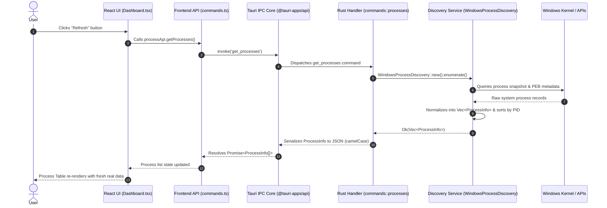

# DevHub Engineering Learning Guide

```
Project:           DevHub — Local Development Control Center
Current Milestone: Milestone 1 (Windows Process Discovery)
Document Purpose:  Comprehensive Engineering Learning and Code-Reading Guide for CS Students & HLD/LLD Interview Preparation
Document Version:  1.0.0
```

---

## Table of Contents
1. [How to Read This Project](#1-how-to-read-this-project)
2. [Computer Science Fundamentals](#2-computer-science-fundamentals)
   - [2.1 Operating System Processes](#21-operating-system-processes)
   - [2.2 Threads vs. Processes](#22-threads-vs-processes)
   - [2.3 OS Process Model and Lifecycle](#23-os-process-model-and-lifecycle)
   - [2.4 File Systems, Paths, and Working Directories](#24-file-systems-paths-and-working-directories)
3. [Windows Systems Programming Concepts](#3-windows-systems-programming-concepts)
   - [3.1 Windows Process Enumeration Mechanisms](#31-windows-process-enumeration-mechanisms)
   - [3.2 Windows Process Handles and Security Descriptors](#32-windows-process-handles-and-security-descriptors)
   - [3.3 Process Environment Block (PEB) and Command Line Extraction](#33-process-environment-block-peb-and-command-line-extraction)
   - [3.4 Why Native APIs Are Superior to Shell Parsing](#34-why-native-apis-are-superior-to-shell-parsing)
4. [Desktop Application Architecture](#4-desktop-application-architecture)
   - [4.1 Tauri 2 Architecture vs. Electron vs. Native](#41-tauri-2-architecture-vs-electron-vs-native)
   - [4.2 Security Boundaries: Core Process vs. WebView Process](#42-security-boundaries-core-process-vs-webview-process)
5. [Inter-Process Communication (IPC)](#5-inter-process-communication-ipc)
   - [5.1 IPC Theory & Desktop Message Passing](#51-ipc-theory--desktop-message-passing)
   - [5.2 Tauri Command Invocation Flow](#52-tauri-command-invocation-flow)
6. [Serialization & Data Marshalling](#6-serialization--data-marshalling)
   - [6.1 The Need for Serialization](#61-the-need-for-serialization)
   - [6.2 Serde Mechanics: `snake_case` to `camelCase` Mapping](#62-serde-mechanics-snake_case-to-camelcase-mapping)
7. [Type Systems & Cross-Language Contracts](#7-type-systems--cross-language-contracts)
   - [7.1 Rust Static Typing vs. TypeScript Static Typing](#71-rust-static-typing-vs-typescript-static-typing)
   - [7.2 Contract Synchronization & Type Mismatches](#72-contract-synchronization--type-mismatches)
8. [Software Architecture & Design Principles](#8-software-architecture--design-principles)
   - [8.1 Layered Architecture Pattern](#81-layered-architecture-pattern)
   - [8.2 SOLID Principles Applied in DevHub](#82-solid-principles-applied-in-devhub)
9. [High-Level Design (HLD)](#9-high-level-design-hld)
   - [9.1 System Boundaries & Component Topology](#91-system-boundaries--component-topology)
   - [9.2 Architectural Strategy for Future Milestones (WSL & Ports)](#92-architectural-strategy-for-future-milestones-wsl--ports)
10. [Low-Level Design (LLD)](#10-low-level-design-lld)
    - [10.1 Domain Models](#101-domain-models)
    - [10.2 Service Pattern and Trait Abstractions](#102-service-pattern-and-trait-abstractions)
    - [10.3 Thin Tauri Command Handlers](#103-thin-tauri-command-handlers)
11. [Error Handling & Resilience](#11-error-handling--resilience)
    - [11.1 Expected vs. Unexpected Errors](#111-expected-vs-unexpected-errors)
    - [11.2 Graceful Degradation for Protected System Processes](#112-graceful-degradation-for-protected-system-processes)
12. [Concurrency & Asynchronous Execution](#12-concurrency--asynchronous-execution)
    - [12.1 Non-Blocking UI Rules for Desktop Apps](#121-non-blocking-ui-rules-for-desktop-apps)
    - [12.2 Sync vs. Async Command Scalability](#122-sync-vs-async-command-scalability)
13. [Frontend Architecture & UI State Management](#13-frontend-architecture--ui-state-management)
    - [13.1 React 19 State, Derived State, and Memoization](#131-react-19-state-derived-state-and-memoization)
    - [13.2 State Machine: Loading, Error, Empty, and Success States](#132-state-machine-loading-error-empty-and-success-states)
14. [Database & Persistence Architecture Preview (Milestone 4+)](#14-database--persistence-architecture-preview-milestone-4)
    - [14.1 Ephemeral vs. Persistent State](#141-ephemeral-vs-persistent-state)
    - [14.2 SQLite Integration Preview](#142-sqlite-integration-preview)
15. [Testing Strategy & Quality Assurance](#15-testing-strategy--quality-assurance)
    - [15.1 Testing Pyramid for Desktop Systems](#151-testing-pyramid-for-desktop-systems)
    - [15.2 Unit, Integration, and Contract Testing](#152-unit-integration-and-contract-testing)
16. [Practical Debugging Methodology](#16-practical-debugging-methodology)
17. [Comprehensive Code-Reading Guide](#17-comprehensive-code-reading-guide)
18. [End-to-End Code Traces](#18-end-to-end-code-traces)
19. [How DevHub Maps to HLD/LLD Interview Concepts](#19-how-devhub-maps-to-hldlld-interview-concepts)
20. [Engineering Glossary](#20-engineering-glossary)

---

## 1. How to Read This Project

To understand DevHub, you must look at it as a multi-tier systems application partitioned across a security and process boundary:

```mermaid
graph TD
    subgraph Presentation Layer (Chromium/WebView2)
        UI[React 19 Components] --> Hooks[React Custom Hooks & State]
        Hooks --> API[Typed Frontend API Layer: commands.ts]
    end

    subgraph IPC Boundary
        API -->|JSON-RPC / WebKit IPC| TauriCore[Tauri 2 IPC Dispatcher]
    end

    subgraph Native Application Layer (Rust)
        TauriCore --> CommandHandlers[Tauri Commands: commands/processes.rs]
        CommandHandlers --> ServiceLayer[Service Layer: discovery/process.rs]
        ServiceLayer --> DomainModels[Domain Models: models/process.rs]
    end

    subgraph OS Integration Layer
        ServiceLayer --> WindowsAPIs[Windows Native APIs / sysinfo crate]
        WindowsAPIs --> OSKernel[Windows Kernel & Process Subsystem]
    end
```

### Why This Separation Exists
1. **Security Isolation**: Web renderers (React running in a WebView) are inherently untrusted compared to kernel-level code. Giving JavaScript direct raw memory access or arbitrary OS process execution would be a critical security flaw.
2. **Platform Abstraction**: The React UI doesn't know (and shouldn't know) whether process discovery was performed via Windows `Toolhelp32Snapshot`, Linux `/proc`, or WSL `wsl.exe`. The Rust layer normalizes disparate OS representations into a single domain model.
3. **Maintainability & Testability**: Business logic and system inspection reside in pure Rust modules with traits (`ProcessDiscovery`), allowing unit testing without running a WebView or mocking browser environments.

---

## 2. Computer Science Fundamentals

### 2.1 Operating System Processes
An **executable** (`.exe` on Windows, ELF on Linux) is a compiled file on disk containing machine instructions, data sections, and headers (PE/COFF format on Windows).

A **process** is an active, executing instance of that program loaded into memory by the OS kernel.

```
+-------------------------------------------------------------+
|                      Process Address Space                  |
|  +-------------------------------------------------------+  |
|  | Code / Text Segment (Read-Only Machine Instructions)   |  |
|  +-------------------------------------------------------+  |
|  | Data / BSS Segment (Initialized & Uninitialized Globals) |
|  +-------------------------------------------------------+  |
|  | Heap (Dynamically Allocated Memory: malloc / Box / Arc)|  |
|  |                      v  (Grows Downward)              |  |
|  |                      ^  (Grows Upward)                |  |
|  | Stack (Call Frames, Local Variables, Return Addresses) |  |
|  +-------------------------------------------------------+  |
+-------------------------------------------------------------+
```

Key Attributes of a Process:
- **PID (Process Identifier)**: A unique integer assigned by the OS kernel when the process is created. PIDs are transient; once a process exits, its PID is reclaimed and may be reused for a completely new process.
- **PPID (Parent Process Identifier)**: The PID of the process that spawned this process. In Windows, this establishes a hierarchical process tree (e.g. `explorer.exe` &rarr; `wt.exe` (Windows Terminal) &rarr; `pwsh.exe` &rarr; `node.exe`).
- **Virtual Address Space**: Each user-mode process receives an isolated, private virtual address space (typically 128 TB on 64-bit Windows). Process A cannot read or write to Process B's memory without explicit OS debugging privileges (`VirtualAllocEx`, `ReadProcessMemory`).

### 2.2 Threads vs. Processes
- **Process**: The unit of **resource allocation** (owns address space, file handles, security token, network sockets).
- **Thread**: The unit of **execution scheduling** (owns an instruction pointer, registers, stack, and scheduling priority).
- A process contains one or more threads running concurrently in the same address space.

```
Process (Address Space, Sockets, Environment, CWD)
   ├── Thread 1 (UI Thread / Event Loop)
   ├── Thread 2 (Background Discovery Worker)
   └── Thread 3 (I/O Listener)
```

**Why DevHub Focuses on Processes Rather Than Threads:**
Development servers (`node.exe`, `python.exe`, `uvicorn`, `vite`) are managed as distinct processes. Port binding, terminal control, and lifecycle termination (`SIGTERM` / `TerminateProcess`) operate on the process boundary. Thread inspection will only be introduced if fine-grained worker pooling analysis becomes necessary.

### 2.3 OS Process Model and Lifecycle
On Windows:
1. **Creation**: A parent calls `CreateProcessW()`. The kernel allocates an `EPROCESS` executive block, creates the initial thread with an `ETHREAD` block, maps the executable into virtual memory, sets up the Process Environment Block (PEB), and returns a handle.
2. **Execution**: The OS scheduler allocates CPU quantum slices to threads within the process.
3. **Termination**: When the last thread exits or `TerminateProcess()` is called, the process enters the terminated state. Kernel structures remain until all open handles to the process are closed.

### 2.4 File Systems, Paths, and Working Directories
- **Executable Path (`exe`)**: The absolute location on disk where the binary resides (e.g., `C:\Program Files\nodejs\node.exe`).
- **Current Working Directory (`cwd`)**: A per-process context property pointing to the directory from which relative file paths are resolved.
- **Command Line (`cmdLine`)**: The exact string arguments passed to the process at launch (e.g., `node "D:\projects\my-app\node_modules\vite\bin\vite.js" --port 3000`).

**Why `cwd` Is Critical for DevHub:**
If five developers run `node.exe`, all five have the exact same executable path. Only the `cwd` and `commandLine` reveal which project repository (e.g. `D:\company\frontend-dashboard`) owns the server!

---

## 3. Windows Systems Programming Concepts

### 3.1 Windows Process Enumeration Mechanisms
On Windows, there are three primary ways to inspect processes:

| Mechanism | Description | Pros | Cons |
| :--- | :--- | :--- | :--- |
| **`CreateToolhelp32Snapshot`** | Standard Win32 snapshot API (`PROCESSENTRY32W`) | Fast, built-in, captures PID, PPID, name | Does not give command-line or CWD directly |
| **`EnumProcesses` (PSAPI)** | Array of all active PIDs (`psapi.dll`) | Simple | Requires secondary `OpenProcess` calls for all details |
| **Native Kernel Query / PEB (`NtQueryInformationProcess`)** | Queries internal process structures | Captures full command line, CWD, environment | Requires handle with query rights; internal structures subject to change |

DevHub leverages the **`sysinfo`** Rust crate, which combines `CreateToolhelp32Snapshot`, `QueryFullProcessImageNameW`, and internal `NtQueryInformationProcess` queries with complete memory safety, proper handle cleanup, and 32/64-bit architecture compatibility.

### 3.2 Windows Process Handles and Security Descriptors
To query a process, Windows requires opening a **Process Handle** via `OpenProcess()` with specific access flags:
- `PROCESS_QUERY_INFORMATION` (0x0400) — Full access to query exit code, priority, token, and PEB.
- `PROCESS_QUERY_LIMITED_INFORMATION` (0x1000) — Allows querying basic metadata (executable path, PID) even across security boundaries.

If a process is running as `SYSTEM` (PID 4, `csrss.exe`, `lsass.exe`) or under an elevated administrator account, standard user applications receive an `ERROR_ACCESS_DENIED` (Win32 Error 5) when requesting `PROCESS_QUERY_INFORMATION`.

### 3.3 Process Environment Block (PEB) and Command Line Extraction
The command line and working directory are stored inside the target process's **RTL_USER_PROCESS_PARAMETERS** structure, referenced by its **PEB** (Process Environment Block). Reading this requires:
1. `NtQueryInformationProcess` to obtain `PBI.PebBaseAddress`.
2. `ReadProcessMemory` across process boundaries to read `RtlUserProcessParameters`.
3. Extracting the `UNICODE_STRING` for `CommandLine` and `CurrentDirectory`.

If access is denied, `sysinfo` safely yields `None` rather than crashing.

### 3.4 Why Native APIs Are Superior to Shell Parsing
*Fragile Approach:*
```powershell
Get-CimInstance Win32_Process | Select-Object ProcessId, Name, CommandLine
```
Why calling PowerShell from code is poor architecture:
1. **Massive Overhead**: Spawning `powershell.exe` consumes 50–100MB of RAM and takes 300–800ms per call.
2. **Brittle String Parsing**: Output formatting changes across PowerShell 5.1 (Windows PowerShell), PowerShell 7 (Core), culture/locale formatting, and truncation settings.
3. **Native Rust Performance**: Calling native Win32 APIs via Rust completes process discovery for 300+ processes in **under 15 milliseconds** with zero process-spawn overhead.

---

## 4. Desktop Application Architecture

### 4.1 Tauri 2 Architecture vs. Electron vs. Native

```
+-------------------------------------------------------------------------+
|                              TAURI 2                                    |
|  Frontend: Web standard (React/HTML/JS) rendered in OS WebView2         |
|  Backend: Native compiled binary in Rust                                |
|  IPC: Zero-copy/Fast WebKit IPC layer with strict capability isolation  |
|  Memory: ~40-60 MB | Binary size: ~5-10 MB                              |
+-------------------------------------------------------------------------+
|                              ELECTRON                                   |
|  Frontend: Chromium Browser bundled inside executable                   |
|  Backend: Node.js runtime bundled inside executable                     |
|  Memory: ~150-300 MB | Binary size: ~120-200 MB                         |
+-------------------------------------------------------------------------+
```

DevHub uses **Tauri 2** because it pairs the rapid UI development of React with the bare-metal performance, memory safety, and native systems APIs of Rust, without the multi-hundred-megabyte overhead of bundling a dedicated browser and Node runtime.

### 4.2 Security Boundaries: Core Process vs. WebView Process
Tauri separates the application into two distinct processes:
1. **WebView Process (Frontend)**: Runs the React UI inside the OS WebView2 engine (Edge/Chromium on Windows). It has no direct access to the filesystem, network sockets, or OS kernel.
2. **Core Process (Rust Host)**: The native executable. It listens for verified IPC messages from the WebView, executes system commands, and responds with typed data.

---

## 5. Inter-Process Communication (IPC)

### 5.1 IPC Theory & Desktop Message Passing
IPC is the mechanism by which distinct processes exchange data. In Tauri, IPC between the WebView and Rust utilizes native platform messaging:
- On Windows: `window.chrome.webview.postMessage`
- Messages are serialized as JSON-RPC payloads containing command name, request ID, and arguments.

### 5.2 Tauri Command Invocation Flow



---

## 6. Serialization & Data Marshalling

### 6.1 The Need for Serialization
Rust stores data in native struct layout (binary memory alignment according to `repr(Rust)` or `repr(C)`). JavaScript operates on dynamic V8/JavaScriptCore heap objects. 

To bridge them across the IPC boundary, data must be **marshalled** (serialized into structured JSON text/binary) and **unmarshalled** (deserialized into JavaScript objects).

### 6.2 Serde Mechanics: `snake_case` to `camelCase` Mapping
In Rust, the idiomatic naming convention is `snake_case`. In JavaScript/TypeScript, it is `camelCase`.

DevHub solves this seamlessly using Serde container attributes in `src-tauri/src/models/process.rs`:

```rust
#[derive(Debug, Clone, Serialize, Deserialize, PartialEq, Eq)]
#[serde(rename_all = "camelCase")]
pub struct ProcessInfo {
    pub pid: u32,
    pub parent_pid: Option<u32>,        // Serializes as "parentPid"
    pub name: String,                    // Serializes as "name"
    pub executable_path: Option<String>, // Serializes as "executablePath"
    pub command_line: Option<String>,    // Serializes as "commandLine"
    pub working_directory: Option<String>, // Serializes as "workingDirectory"
    pub status: ProcessStatus,           // Serializes as "status" ("running" / "accessrestricted")
}
```

---

## 7. Type Systems & Cross-Language Contracts

### 7.1 Rust Static Typing vs. TypeScript Static Typing
Both Rust and TypeScript enforce strong static typing, but at different phases:
- **Rust**: Static types are enforced at **compile time** with zero runtime overhead, verifying memory safety and preventing null pointer exceptions.
- **TypeScript**: Static types are checked at **transpile time** (`tsc`), outputting vanilla JavaScript for runtime execution.

### 7.2 Contract Synchronization & Type Mismatches
If a Rust field is named `parent_pid` and serialized without `rename_all = "camelCase"`, but TypeScript expects `parentPid`, TypeScript will receive `undefined` at runtime with no compile warning.

DevHub enforces cross-language contract consistency:
1. Rust unit tests (`test_process_info_serialization_camel_case`) verify the exact JSON key outputs.
2. The TypeScript interface strictly matches the serialized contract:
```typescript
export interface ProcessInfo {
  pid: number;
  parentPid?: number | null;
  name: string;
  executablePath?: string | null;
  commandLine?: string | null;
  workingDirectory?: string | null;
  status: ProcessStatus;
}
```

---

## 8. Software Architecture & Design Principles

### 8.1 Layered Architecture Pattern
DevHub strictly enforces a four-tier architecture:

```
[ Tier 1: Presentation Layer ]  --> React 19 UI, Tailwind CSS, Lucide icons
              │
[ Tier 2: IPC Contract Layer ]   --> Tauri commands, Serde serialization
              │
[ Tier 3: Domain / Service ]     --> ProcessDiscovery trait, normalized models
              │
[ Tier 4: OS Integration Layer ] --> Windows API bindings / sysinfo crate
```

### 8.2 SOLID Principles Applied in DevHub
- **Single Responsibility Principle (SRP)**:
  - `commands::processes::get_processes`: Only handles IPC parameter routing and error wrapping.
  - `WindowsProcessDiscovery`: Only handles interacting with the OS to discover processes.
  - `ProcessTable`: Only handles presenting and sorting the process list in the UI.
- **Open/Closed Principle (OCP)**:
  - The `ProcessDiscovery` trait is open for extension (e.g. adding `WslProcessDiscovery` or `LinuxProcessDiscovery` in future milestones) without modifying the command handler logic.
- **Dependency Inversion Principle (DIP)**:
  - High-level command handlers depend on domain abstractions (`ProcessInfo`), not on low-level OS Win32 API handles.

---

## 9. High-Level Design (HLD)

### 9.1 System Boundaries & Component Topology

```
+------------------------------------------------------------------------------------+
|                                    DEVHUB HLD                                      |
|                                                                                    |
|  +-------------------+       Tauri IPC       +----------------------------------+  |
|  |  React Frontend   | ────────────────────> |       Rust Backend Core          |  |
|  |                   | <──────────────────── |                                  |  |
|  +-------------------+      JSON Contract    +----------------------------------+  |
|           │                                                    │                   |
|           │ View Layer                                         │ Service Layer     |
|           ▼                                                    ▼                   |
|  +-------------------+                       +----------------------------------+  |
|  |  Dashboard / UI   |                       |   ProcessDiscovery (Windows)     |  |
|  |  - Search & Filter|                       |   - [Future] PortDiscovery (M2)  |  |
|  |  - Sorting        |                       |   - [Future] WSL Discovery (M6)  |  |
|  |  - Details Modal  |                       |   - [Future] SQLite DB (M4)      |  |
|  +-------------------+                       +----------------------------------+  |
|                                                                │                   |
|                                                                ▼ OS Subsystem      |
|                                              +----------------------------------+  |
|                                              |  Windows OS Kernel (x86_64)      |  |
|                                              +----------------------------------+  |
+------------------------------------------------------------------------------------+
```

### 9.2 Architectural Strategy for Future Milestones (WSL & Ports)
- In **Milestone 2 (Port Discovery)**, the backend will introduce a `PortDiscovery` service that queries Windows TCP socket tables and joins them with `ProcessInfo` by matching PIDs.
- In **Milestone 6 (WSL Integration)**, a `WslProcessDiscovery` service will query WSL distributions, mapping Linux PIDs and Linux paths into the same unified `ProcessInfo` / `ServerProcess` model.

---

## 10. Low-Level Design (LLD)

### 10.1 Domain Models
Located in `src-tauri/src/models/process.rs`:
- `ProcessStatus`: Enum representing whether a process is active, inaccessible, or restricted.
- `ProcessInfo`: Main struct holding normalized process metadata.

### 10.2 Service Pattern and Trait Abstractions
Located in `src-tauri/src/discovery/process.rs`:
```rust
pub trait ProcessDiscovery: Send + Sync {
    fn enumerate(&self) -> Result<Vec<ProcessInfo>, String>;
}
```
Using a trait decouples the discovery algorithm from its consumers, allowing deterministic mock implementations in integration test suites.

### 10.3 Thin Tauri Command Handlers
Located in `src-tauri/src/commands/processes.rs`:
The command function contains no business logic or Win32 calls. It instantiates the discovery service, executes `enumerate()`, maps errors into string responses, and returns the result.

---

## 11. Error Handling & Resilience

### 11.1 Expected vs. Unexpected Errors
- **Expected Conditions**: Certain system processes (PID 4, `System`, security services) deny access to user-space inspection. This is not an exceptional failure; it is normal OS security behavior. DevHub represents these with `Option::None` and `ProcessStatus::AccessRestricted`.
- **Unexpected Failures**: If the OS API completely fails to allocate a snapshot buffer, the service returns `Err(String)`, which surfaces as a user-friendly error banner with a "Retry" button on the UI.

### 11.2 Graceful Degradation for Protected System Processes
Instead of panicking or throwing unhandled errors, DevHub sanitizes missing fields:
```rust
let executable_path = process
    .exe()
    .map(|p| p.to_string_lossy().into_owned())
    .filter(|s| !s.is_empty());
```

---

## 12. Concurrency & Asynchronous Execution

### 12.1 Non-Blocking UI Rules for Desktop Apps
Desktop UI frameworks run an event loop on the main thread. If a command blocks the main thread for 100ms+, the UI drops frames, freezes scrolling, and appears sluggish.
- React dispatches requests asynchronously via `Promise` (`async/await`).
- Tauri's IPC queue processes requests without locking the UI rendering pipeline.

### 12.2 Sync vs. Async Command Scalability
Currently, `sysinfo` queries the Windows kernel in under 15ms. As such, a synchronous Rust command handler is lightweight, deterministic, and avoids unnecessary async runtime overhead. In future milestones, when cross-environment discovery (Windows + multiple WSL distributions) is executed concurrently, Rust's `tokio::join!` or thread pools will be leveraged.

---

## 13. Frontend Architecture & UI State Management

### 13.1 React 19 State, Derived State, and Memoization
The frontend maintains minimal, clean state:
- `processes`: Raw list fetched from Rust.
- `searchQuery`: Text entered by the user.
- `sortField` & `sortDirection`: Active sorting parameters.

**Derived State with `useMemo`:**
Filtering and sorting are calculated dynamically using `useMemo`:
```typescript
const filteredProcesses = useMemo(() => {
  if (!searchQuery.trim()) return processes;
  const q = searchQuery.toLowerCase().trim();
  return processes.filter(p => 
    p.pid.toString().includes(q) ||
    p.name.toLowerCase().includes(q) ||
    (p.commandLine && p.commandLine.toLowerCase().includes(q))
  );
}, [processes, searchQuery]);
```
This guarantees that filtering only recomputes when the search query or process list changes, preserving UI responsiveness.

### 13.2 State Machine: Loading, Error, Empty, and Success States
The UI explicitly handles all four fundamental states:
1. **Loading State**: Displays an animated spinner with "Loading Windows processes...".
2. **Error State**: Displays a styled error banner with the reason and a "Retry" action.
3. **Empty State**: Displays "No processes detected" if 0 processes return.
4. **Success State**: Displays metrics summary cards, search toolbar, and the interactive `ProcessTable`.

---

## 14. Database & Persistence Architecture Preview (Milestone 4+)

### 14.1 Ephemeral vs. Persistent State
- **Ephemeral State**: Discovered processes, listening ports, CPU, and memory metrics. These represent dynamic OS state that changes every second and must never be cached as permanent truth.
- **Persistent State**: User-defined Server Profiles, Project groupings, and application settings.

### 14.2 SQLite Integration Preview
In Milestone 4+, an embedded SQLite database (`rusqlite`) will store saved configurations (e.g. "Company Frontend" starting `npm run dev` in `D:\projects\frontend`), enabling one-click launch and monitoring.

---

## 15. Testing Strategy & Quality Assurance

### 15.1 Testing Pyramid for Desktop Systems

```
              / \
             /   \      Manual End-to-End Testing (UI interactions, process verification)
            /     \
           /-------\    Integration Testing (Rust WindowsProcessDiscovery with live OS)
          /         \
         /-----------\  Unit Testing (Serde contracts, optional field normalization, types)
```

### 15.2 Unit, Integration, and Contract Testing
1. **Model Unit Tests (`models/process.rs`)**:
   - Verify `camelCase` serialization keys (`parentPid`, `executablePath`, `commandLine`).
   - Verify `Option::None` field handling for protected processes.
2. **System Integration Tests (`discovery/process.rs`)**:
   - Verify that `WindowsProcessDiscovery::enumerate()` returns real running processes.
   - Verify that standard Windows processes (such as `explorer.exe` or `System`) are detected.
3. **Frontend Contract Checks**:
   - `tsc && vite build` verifies complete type alignment between React components and TypeScript definitions.

---

## 16. Practical Debugging Methodology

When diagnosing an issue in DevHub, follow this four-tier diagnostic ladder:

```
Tier 1: UI Display Issue?
  └─ Open WebView DevTools (F12 or right-click Inspect) -> Check Console & React state.

Tier 2: IPC Communication Issue?
  └─ Check Network / Console for Tauri IPC invoke rejection errors.

Tier 3: Rust Logic Issue?
  └─ Run `cargo test -- --nocapture` to inspect Rust discovery service output.

Tier 4: Windows Permissions / System Issue?
  └─ Open PowerShell and check `Get-Process -Id <PID>` to verify OS process rights.
```

---

## 17. Comprehensive Code-Reading Guide

### Milestone 0 & Milestone 1 File Inventory

#### Backend Files (`src-tauri`)

| File | Purpose | Key Concept | Callers | Callees |
| :--- | :--- | :--- | :--- | :--- |
| [`src-tauri/src/models/process.rs`](file:///d:/ak/project/devhub/DevHub/src-tauri/src/models/process.rs) | Defines `ProcessInfo` and `ProcessStatus` domain structs with Serde annotations | Domain Modeling, Serde Contract | `discovery::process`, `commands::processes` | `serde` crate |
| [`src-tauri/src/discovery/process.rs`](file:///d:/ak/project/devhub/DevHub/src-tauri/src/discovery/process.rs) | Queries Windows system process table and normalizes metadata | Service Pattern, Windows System APIs | `commands::processes` | `sysinfo` crate |
| [`src-tauri/src/commands/processes.rs`](file:///d:/ak/project/devhub/DevHub/src-tauri/src/commands/processes.rs) | Thin IPC command handler routing `get_processes` calls | Thin Controller / Separation of Concerns | Tauri IPC Dispatcher | `WindowsProcessDiscovery` |
| [`src-tauri/src/commands/system.rs`](file:///d:/ak/project/devhub/DevHub/src-tauri/src/commands/system.rs) | Provides basic application and platform metadata | System Health Check | Tauri IPC Dispatcher | `std::env` |
| [`src-tauri/src/lib.rs`](file:///d:/ak/project/devhub/DevHub/src-tauri/src/lib.rs) | Tauri application builder and command handler registry | Application Composition Root | `main.rs` | Tauri runtime |
| [`src-tauri/src/main.rs`](file:///d:/ak/project/devhub/DevHub/src-tauri/src/main.rs) | Desktop binary entry point | Binary Entry Point | OS Process Launcher | `devhub_lib::run()` |

#### Frontend Files (`src`)

| File | Purpose | Key Concept | Callers | Callees |
| :--- | :--- | :--- | :--- | :--- |
| [`src/types/process.ts`](file:///d:/ak/project/devhub/DevHub/src/types/process.ts) | TypeScript interfaces for `ProcessInfo` and `ProcessStatus` | Client-Side Type Safety | `commands.ts`, `Dashboard.tsx`, `ProcessTable.tsx` | - |
| [`src/lib/commands.ts`](file:///d:/ak/project/devhub/DevHub/src/lib/commands.ts) | Centralized API abstraction over Tauri `invoke()` calls | API Gateway / Facade Pattern | `Dashboard.tsx` | `@tauri-apps/api/core` |
| [`src/components/processes/ProcessTable.tsx`](file:///d:/ak/project/devhub/DevHub/src/components/processes/ProcessTable.tsx) | Renders sortable tabular list of discovered processes | Presentation Component, Client-side Sorting | `Dashboard.tsx` | - |
| [`src/components/processes/ProcessDetailsModal.tsx`](file:///d:/ak/project/devhub/DevHub/src/components/processes/ProcessDetailsModal.tsx) | Modal dialog for deep inspection and copying metadata | Modal Dialog, Clipboard API | `Dashboard.tsx` | - |
| [`src/pages/Dashboard.tsx`](file:///d:/ak/project/devhub/DevHub/src/pages/Dashboard.tsx) | Main dashboard view orchestrating search, metrics, and polling | State Orchestration, Memoization | `App.tsx` | `processApi`, `ProcessTable` |

---

## 18. End-to-End Code Traces

### Trace: User Clicks "Refresh" in DevHub

1. **User Action**: The user clicks the "Refresh" button on the Dashboard.
2. **Event Trigger** (`Dashboard.tsx`):
   ```typescript
   onClick={() => fetchProcesses(true)}
   ```
3. **API Invocation** (`lib/commands.ts`):
   ```typescript
   export async function getProcesses(): Promise<ProcessInfo[]> {
     return invoke<ProcessInfo[]>('get_processes');
   }
   ```
4. **IPC Bridge** (`@tauri-apps/api/core`):
   - Tauri serializes the invoke message: `{"cmd": "get_processes", "callback": 12, "error": 13}`.
   - Message is posted to the native Windows WebView2 message port.
5. **Rust Dispatcher** (`lib.rs` &rarr; `commands/processes.rs`):
   - The Tauri macro matches `"get_processes"` and calls `commands::processes::get_processes()`.
6. **Discovery Execution** (`discovery/process.rs`):
   - `WindowsProcessDiscovery::enumerate()` refreshes system processes via `sysinfo`.
   - Iterates all running PIDs, extracting PPID, name, executable path, command line, and CWD.
   - Wraps missing/restricted metadata in `None` or `ProcessStatus::AccessRestricted`.
   - Sorts the resulting vector by PID.
7. **Serialization & Response Transfer**:
   - Serde converts `Vec<ProcessInfo>` into JSON text with `camelCase` keys.
   - Tauri writes the JSON payload back to the WebView callback.
8. **UI State Update** (`Dashboard.tsx`):
   - `fetchProcesses` Promise resolves with the array of `ProcessInfo`.
   - `setProcesses(data)` updates React state.
   - `useMemo` recomputes `filteredProcesses` and `sortedProcesses`.
   - React 19 reconciles the Virtual DOM and updates the table rows.

---

## 19. How DevHub Maps to HLD/LLD Interview Concepts

| Interview Question / Topic | How DevHub Answers It |
| :--- | :--- |
| **Why use a Service Layer instead of putting logic in the Controller/Command?** | Keeps the Tauri command thin, allows the discovery logic to be unit tested independently, and permits swapping discovery strategies (e.g. Linux/WSL/Mock) without modifying IPC handlers. |
| **How do you isolate OS-specific logic in a cross-platform application?** | By defining a high-level Rust trait (`ProcessDiscovery`) and normalizing OS-specific quirks (Win32 paths, Linux paths) into a unified domain model (`ProcessInfo`). |
| **How would this system scale to 10,000+ processes without freezing the UI?** | (1) Move discovery execution to a background worker thread (`tokio::task::spawn_blocking`). (2) Implement windowed virtualized list rendering in React (`react-window` or `@tanstack/react-virtual`). |
| **How do you handle schema evolution across multiple programming languages?** | Use strict serialization contracts (`#[serde(rename_all = "camelCase")]`), unit test serialization outputs in the backend, and maintain matching TypeScript type definitions. |
| **How would you migrate from polling to push-based updates?** | In future milestones, we can use OS process event watchers (`WMI Win32_ProcessStartTrace` on Windows or Linux `eBPF`/`netlink` connectors) and stream change events over Tauri event emitters (`app.emit()`). |

---

## 20. Engineering Glossary

- **Process**: An active instance of a computer program loaded into memory with an allocated address space, security token, and system resources.
- **PID (Process ID)**: An integer assigned by the OS kernel uniquely identifying an active process.
- **PPID (Parent Process ID)**: The PID of the process that spawned the current process.
- **Thread**: The smallest sequence of programmed instructions that can be managed independently by an OS scheduler.
- **Process Tree**: The hierarchical graph of parent-child relationships linking all running processes back to root system initializers.
- **IPC (Inter-Process Communication)**: Mechanisms allowing distinct processes to share data and synchronize actions.
- **Tauri**: A desktop application framework that combines web frontends with native compiled Rust backends.
- **Rust**: A systems programming language that guarantees memory safety and thread safety at compile time without a garbage collector.
- **React 19**: A declarative, component-based JavaScript library for building user interfaces.
- **TypeScript**: A strongly typed superset of JavaScript that adds compile-time type checking.
- **Vite**: A next-generation frontend build tool and development server using native ES modules.
- **Windows API (Win32)**: The core set of application programming interfaces provided by Microsoft Windows operating systems.
- **Executable Path**: The absolute filesystem location of the binary on disk.
- **Current Working Directory (CWD)**: The filesystem path that serves as the base for relative path resolutions inside a process.
- **Command Line**: The complete string of arguments passed to a program when it is executed.
- **Serialization / Marshalling**: The process of translating in-memory data structures into a format (such as JSON) suitable for transmission across process or network boundaries.
- **Process Handle**: A Windows kernel object token that grants an application permission to query or manipulate a process.
- **Access Control List (ACL)**: A list of access control entries that specify permissions granted to users and system processes for a securable object.
- **Domain Model**: An object model that encapsulates both data and behavior representing business or system entities.
- **High-Level Design (HLD)**: Architecture design detailing system boundaries, services, interactions, and data flow topologies.
- **Low-Level Design (LLD)**: Detailed design specifying classes, interfaces, method signatures, data structures, and algorithmic flows.
- **Unit Test**: An automated test verifying the correctness of an isolated software component.
- **Integration Test**: An automated test verifying that multiple modules or OS integrations operate correctly together.
